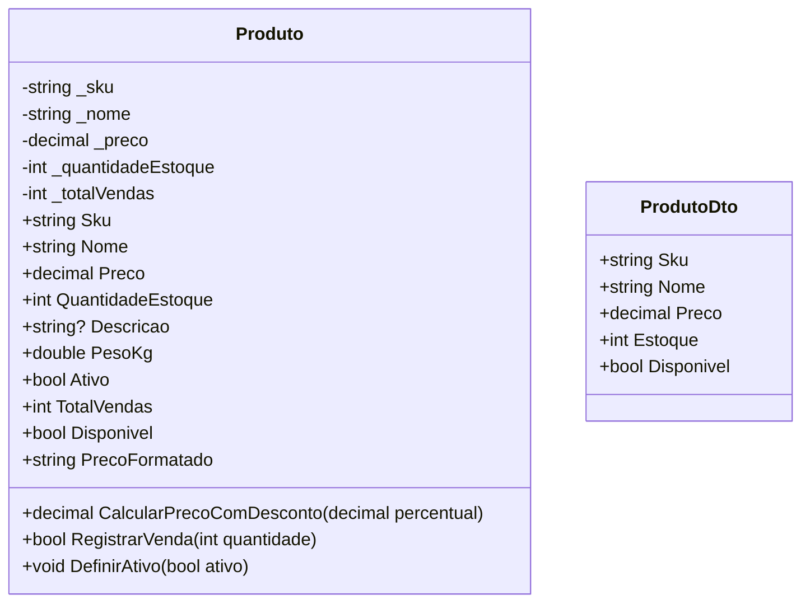
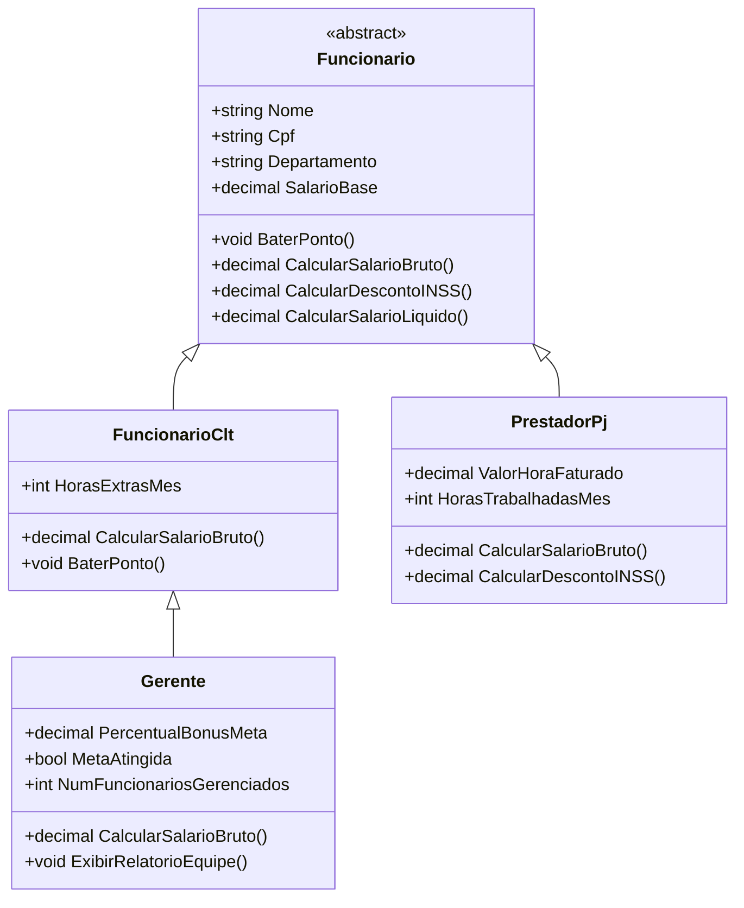
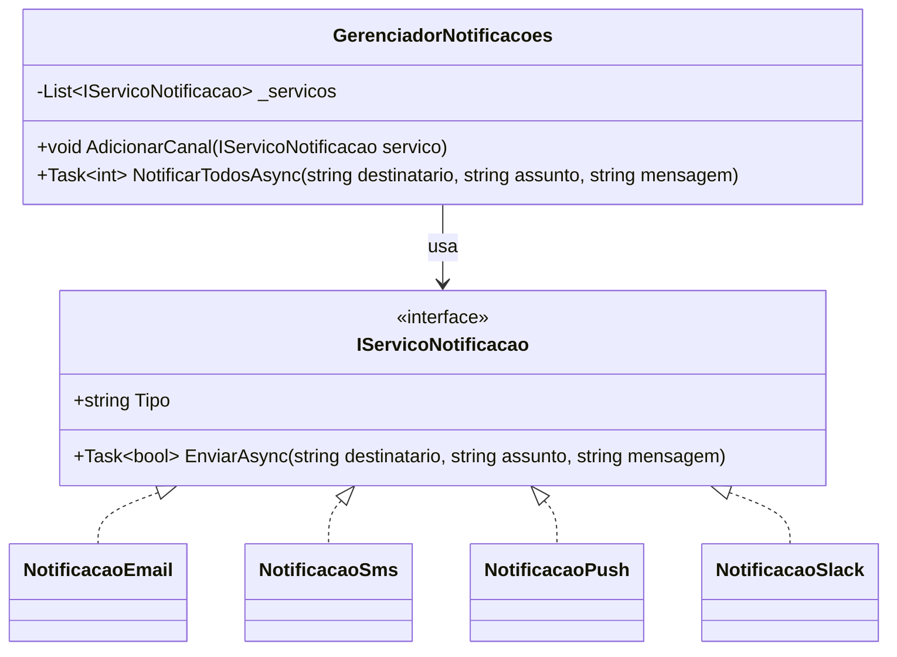
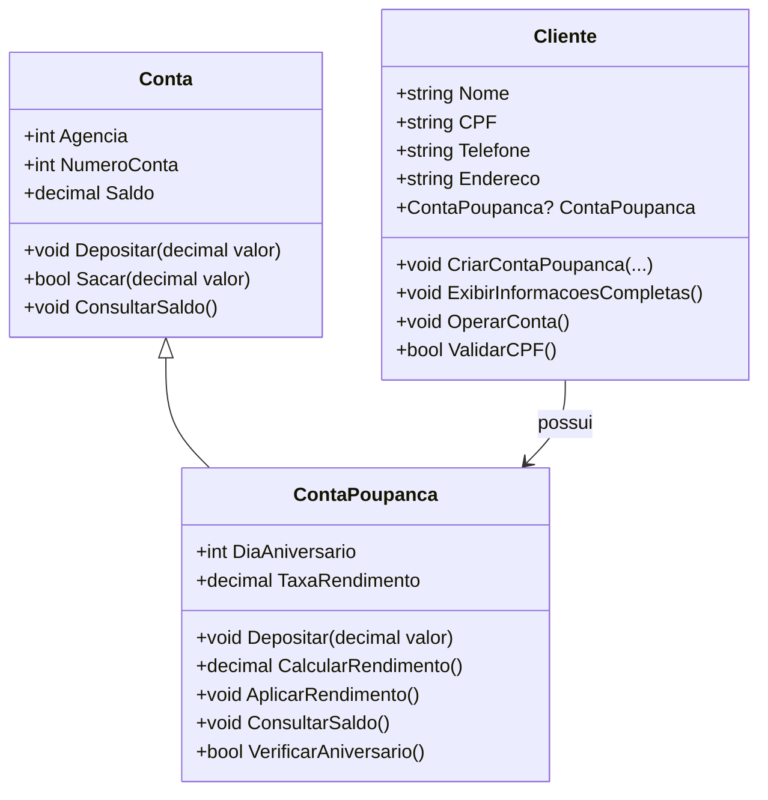

# Guia Didático — Orientação a Objetos em C#

Este material foi reorganizado para ajudar o aluno a seguir esta sequência:

1. **entender o problema;**
2. **identificar classes e responsabilidades;**
3. **visualizar a solução com diagramas;**
4. **só depois ler o código.**

---

## 1. Ideia central de orientação a objetos

Orientação a objetos é uma forma de organizar software em torno de **entidades com estado e comportamento**.

- **Estado**: os dados que a classe guarda.
- **Comportamento**: as ações que a classe executa.
- **Responsabilidade**: o que a classe deve saber e fazer.

O erro mais comum no início é achar que orientação a objetos é apenas:

- criar classe;
- colocar atributos;
- gerar `get` e `set`.

Na prática, o ponto principal é este:

> cada classe deve representar uma responsabilidade clara e proteger as regras do seu próprio domínio.

---

## 2. Como apresentar o conteúdo em sala

Para cada exemplo, siga esta ordem:

1. apresente uma situação real;
2. mostre o que daria errado com uma solução mal modelada;
3. identifique as classes;
4. defina o que cada classe sabe e faz;
5. mostre o diagrama de classes;
6. só então abra o código correspondente.

---

## 3. Exemplo 1 — Encapsulamento com e-commerce

### Problema motivador

Imagine uma loja virtual com produtos.
O sistema precisa controlar:

- nome do produto;
- preço;
- estoque;
- total de vendas;
- disponibilidade para venda.

Agora pense em uma modelagem ruim:

- qualquer parte do sistema pode colocar preço negativo;
- qualquer parte do sistema pode zerar ou aumentar vendas manualmente;
- qualquer parte do sistema pode deixar o estoque inconsistente.

Isso gera um problema clássico:

> o objeto existe, mas não protege suas próprias regras.

### Conceito que o aluno deve concluir

**Encapsulamento** é proteger o estado interno e permitir alterações apenas por caminhos controlados.

### Passo a passo didático

1. Pergunte quais dados do produto podem ser alterados livremente.
2. Mostre que `TotalVendas` não deveria ter alteração externa direta.
3. Discuta por que `Preco` precisa de validação.
4. Mostre que vender um produto deve passar por um método de negócio.
5. Conclua que a classe não guarda só dados: ela guarda **regras**.

### Diagrama de classes

### O que observar no código

Arquivo: [`EncapsulamentoEcommerce/Program.cs`](./EncapsulamentoEcommerce/Program.cs)

Peça que os alunos identifiquem:

- propriedades com validação;
- diferença entre campo privado e propriedade pública;
- propriedade calculada;
- método que altera estado com regra de negócio;
- uso de `record` como DTO.

### Síntese para o aluno

> Encapsulamento não é esconder por esconder; é impedir estados inválidos.

---

## 4. Exemplo 2 — Herança com folha de pagamento

### Problema motivador

Uma empresa possui vários tipos de trabalhadores:

- funcionário CLT;
- gerente;
- prestador PJ.

Todos têm nome e departamento, mas o cálculo do pagamento muda.

Sem uma boa modelagem, o sistema tende a ficar assim:

- uma classe enorme;
- muitos `if/else`;
- regras diferentes misturadas;
- dificuldade para adicionar novos tipos.

### Conceito que o aluno deve concluir

**Herança** é útil quando diferentes classes compartilham uma base comum, mas possuem especializações.

### Passo a passo didático

1. Liste o que todos os funcionários têm em comum.
2. Liste o que muda entre CLT, gerente e PJ.
3. Crie a ideia de uma classe base.
4. Defina o que deve ser obrigatório nas subclasses.
5. Mostre que métodos podem ser herdados, sobrescritos ou obrigatórios.

### Diagrama de classes

### O que observar no código

Arquivo: [`HerancaFuncionarios/Program.cs`](./HerancaFuncionarios/Program.cs)

Peça que os alunos encontrem:

- a classe abstrata;
- o método abstrato;
- o método virtual;
- o uso de `override`;
- o uso de `base`;
- o momento em que o polimorfismo aparece no `foreach`.

### Pergunta importante para a turma

> “Gerente” é um tipo de `FuncionarioClt` ou apenas “tem regras parecidas”?

Essa pergunta ajuda o aluno a entender quando herança faz sentido e quando não faz.

### Síntese para o aluno

> Herança serve para reutilizar uma base comum sem perder a especialização de cada subtipo.

---

## 5. Exemplo 3 — Polimorfismo com notificações

### Problema motivador

Um sistema precisa enviar notificações por:

- e-mail;
- SMS;
- push;
- Slack.

Se a solução depender de `if/else` por tipo de canal, toda vez que surgir um novo canal o sistema principal precisará ser alterado.

### Conceito que o aluno deve concluir

**Polimorfismo** permite tratar objetos diferentes por meio do mesmo contrato.

### Passo a passo didático

1. Pergunte o que todos os canais têm em comum.
2. Leve a turma a responder: “todos enviam uma mensagem”.
3. Defina um contrato comum.
4. Mostre que cada classe implementa esse contrato à sua maneira.
5. Explique que o código principal trabalha com a interface, não com tipos concretos.

### Diagrama de classes

### O que observar no código

Arquivo: [`PolimorfismoNotificacoes/Program.cs`](./PolimorfismoNotificacoes/Program.cs)

Peça que os alunos percebam:

- a interface como contrato;
- várias implementações para o mesmo método;
- o gerenciador trabalhando sem saber o tipo concreto;
- a vantagem de adicionar novos canais sem alterar a lógica principal.

### Comparação didática útil

Uma tomada aceita diferentes aparelhos porque existe um padrão de encaixe.
O sistema aceita diferentes notificadores porque existe um contrato comum.

### Síntese para o aluno

> Polimorfismo reduz acoplamento e facilita extensão do sistema.

---

## 6. Exemplo 4 — Revisão geral com sistema bancário

### Problema motivador

Em um banco simplificado, precisamos representar:

- cliente;
- conta;
- conta poupança;
- operações financeiras.

Aqui o foco é revisar como os conceitos se combinam em um pequeno sistema.

### Conceitos envolvidos

- **encapsulamento**: saldo protegido;
- **herança**: `ContaPoupanca` herda de `Conta`;
- **composição**: `Cliente` tem uma `ContaPoupanca`;
- **polimorfismo**: variáveis do tipo `Conta` apontam para `ContaPoupanca`.

### Passo a passo didático

1. Pergunte se cliente e conta são a mesma coisa.
2. Discuta a relação “tem uma”.
3. Mostre o que muda entre conta comum e poupança.
4. Revise por que o saldo não deve ser alterado livremente.
5. Mostre como uma referência do tipo base pode chamar comportamento sobrescrito.

### Diagrama de classes

### O que observar no código

- [`BancoExemplo/Models/Conta.cs`](./BancoExemplo/Models/Conta.cs)
- [`BancoExemplo/Models/ContaPoupanca.cs`](./BancoExemplo/Models/ContaPoupanca.cs)
- [`BancoExemplo/Models/Cliente.cs`](./BancoExemplo/Models/Cliente.cs)
- [`BancoExemplo/Program.cs`](./BancoExemplo/Program.cs)

Peça que os alunos respondam:

- onde está a composição?
- onde está a herança?
- qual método foi sobrescrito?
- por que `Saldo` não é um campo público?

### Síntese para o aluno

> Em sistemas reais, os conceitos de orientação a objetos aparecem juntos, não isolados.

---

## 7. Mapa rápido de decisão

| Situação | Conceito mais evidente | Pergunta-guia |
|---|---|---|
| Proteger dados e regras internas | Encapsulamento | “Quem pode alterar isso?” |
| Reaproveitar base comum entre tipos | Herança | “Isso é um tipo de quê?” |
| Usar o mesmo contrato com comportamentos diferentes | Polimorfismo | “Posso trocar a implementação sem mudar o uso?” |
| Modelar relação de colaboração entre classes | Composição | “Quem tem quem?” |

---

## 8. Boas práticas para ensinar este conteúdo

- não comece por sintaxe;
- use exemplos do cotidiano ou do mercado;
- compare solução ruim e solução boa;
- peça que os alunos desenhem as classes antes de programar;
- destaque sempre a responsabilidade de cada classe;
- reforce que orientação a objetos não é só estrutura, mas também regra de negócio.

---

## 9. Roteiro de leitura do código

Depois da parte conceitual, siga esta ordem:

1. `EncapsulamentoEcommerce`
2. `HerancaFuncionarios`
3. `PolimorfismoNotificacoes`
4. `BancoExemplo`

Essa ordem ajuda porque o aluno:

- primeiro aprende a proteger estado;
- depois aprende especialização;
- depois entende contratos e extensibilidade;
- por fim vê tudo combinado.

---

## 10. Perguntas finais para discussão

1. Qual classe deste módulo protege melhor suas regras internas?
2. Em qual exemplo a herança ficou mais clara?
3. Onde o polimorfismo evita alteração no fluxo principal?
4. Qual relação é de herança e qual é de composição no exemplo bancário?
5. Se você precisasse criar um novo exemplo, qual problema real escolheria para ensinar orientação a objetos?
