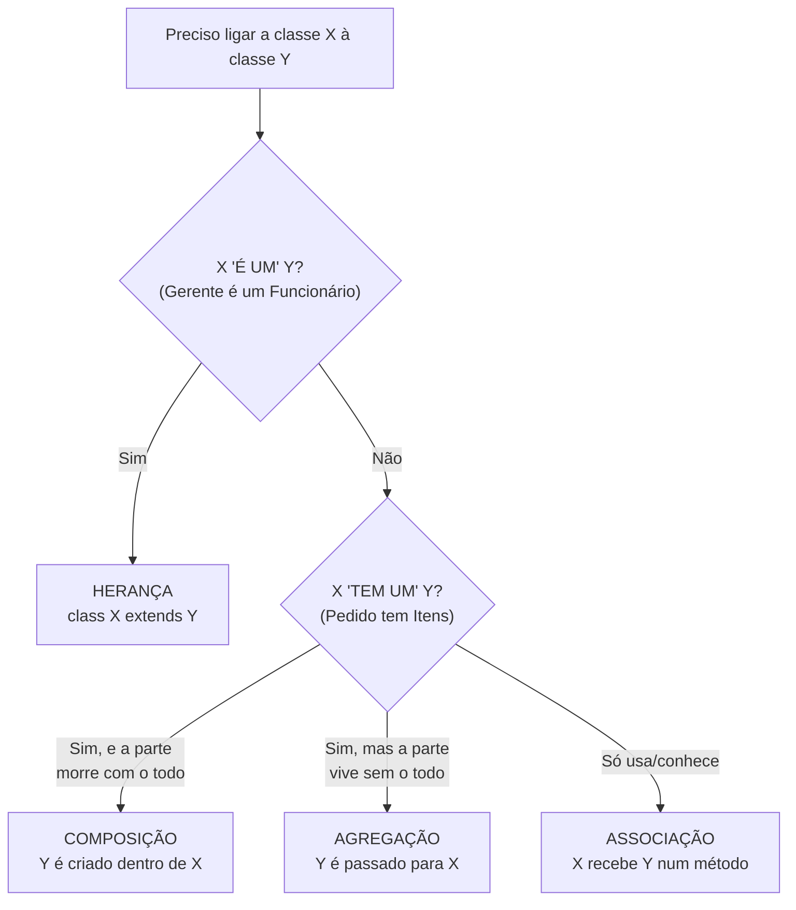
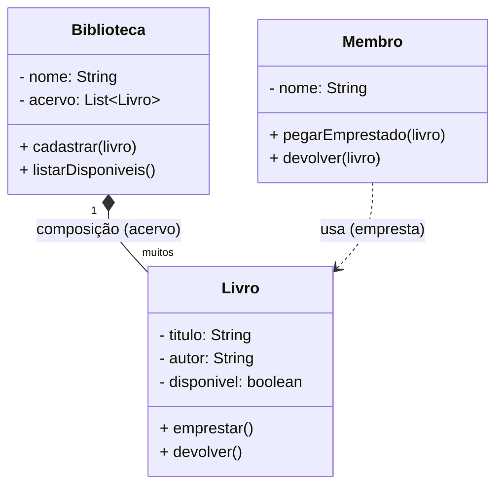
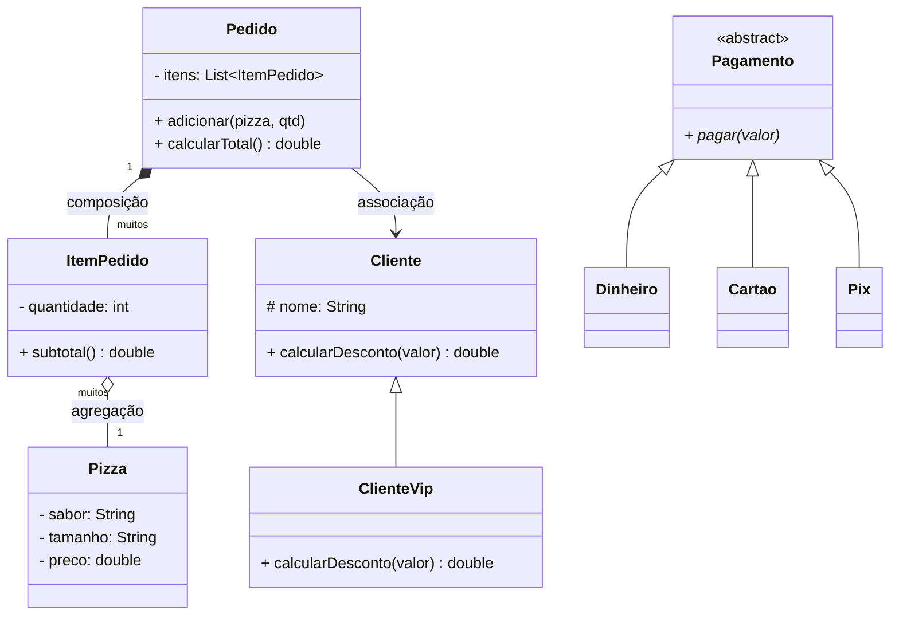

# 01 — Modelagem em POO: do problema real às classes

> **Este é o módulo mais importante do curso.** Saber a *sintaxe* de classe em Java é
> fácil. O difícil — e o que separa um iniciante de um bom programador — é olhar para um
> problema do mundo real e decidir **quais classes criar, o que cada uma guarda, o que
> cada uma faz e como elas se conectam**. Isso se chama **modelagem**.

---

## Índice

1. [O que é modelar?](#1-o-que-é-modelar)
2. [O método prático em 4 passos](#2-o-método-prático-em-4-passos)
3. [Atributo ou objeto? Responsabilidades](#3-atributo-ou-objeto-a-pergunta-que-guia-tudo)
4. [Relacionamentos entre classes](#4-relacionamentos-como-as-classes-se-conectam)
5. [UML: o desenho antes do código](#5-uml-desenhar-antes-de-codar)
6. [🟢 Exemplo simples, guiado passo a passo](#6--exemplo-simples-guiado-uma-biblioteca)
7. [🔴 Exemplo complexo](#7--exemplo-complexo-um-sistema-de-pizzaria)
8. [Erros comuns de modelagem](#8-erros-comuns-de-modelagem-e-como-evitar)
9. [Checklist de boa modelagem](#9-checklist-de-uma-boa-modelagem)
10. [Exercícios](#10-exercícios)

---

## 1. O que é modelar?

**Modelar** é criar uma representação *simplificada* de um pedaço do mundo real dentro do
seu programa, usando classes e objetos.

A palavra-chave é **simplificada**. Um cliente de verdade tem altura, tipo sanguíneo,
time de futebol... mas num sistema de banco você só modela o que **importa para o
problema**: nome, CPF, saldo. Modelar é **decidir o que incluir e o que ignorar**.

> 🎯 **Regra de ouro:** modele apenas o que o sistema precisa *saber* e *fazer*.
> Tudo que não serve ao problema é ruído — deixe de fora.

---

## 2. O método prático em 4 passos

Existe uma técnica clássica e simples para começar: **leia a descrição do problema e
sublinhe as palavras**. A gramática do texto praticamente entrega o modelo.

| No texto do problema... | Vira, no código... | Exemplo |
|-------------------------|--------------------|---------|
| **Substantivo** (coisa) | **Classe** ou **atributo** | *cliente, produto, pedido* |
| **Adjetivo / dado** (característica) | **Atributo** | *nome, preço, quantidade* |
| **Verbo** (ação) | **Método** (responsabilidade) | *calcular, adicionar, cancelar* |

### Os 4 passos

1. **Encontre as ENTIDADES** → substantivos importantes que têm vida própria no sistema
   viram **classes** (`Cliente`, `Produto`, `Pedido`).
2. **Encontre os ATRIBUTOS** → o que cada entidade *tem/sabe* vira **atributo**
   (`Cliente` tem `nome`, `cpf`).
3. **Encontre os COMPORTAMENTOS** → o que cada entidade *faz* vira **método**
   (`Pedido` sabe `calcularTotal()`).
4. **Encontre os RELACIONAMENTOS** → como as entidades se ligam (`Pedido` **tem** vários
   `Produto`s; `Gerente` **é um** `Funcionario`).

> ⚠️ **Cuidado:** nem todo substantivo vira classe! "Nome" é substantivo mas é só um
> atributo (um texto). A pergunta que decide isso está no [item 3](#3-atributo-ou-objeto-a-pergunta-que-guia-tudo).

---

## 3. Atributo ou objeto? A pergunta que guia tudo

Quando você acha um substantivo, decida: **ele é só um dado simples, ou é uma coisa com
comportamento próprio?**

- Se tem **só valor** (um texto, um número) e nenhum comportamento → **atributo**.
- Se tem **dados + comportamento próprio**, ou se vários deles existem no sistema → **classe**.

**Exemplo:** num sistema de escola, o `endereco` do aluno...
- ...pode ser só um `String` (atributo) se você nunca precisa validar CEP nem separar rua/cidade.
- ...vira uma classe `Endereco` (com `rua`, `cidade`, `cep` e `validar()`) se o sistema
  manipula essas partes.

> **A modelagem depende do contexto.** Não existe "certo" absoluto — existe o que serve
> ao seu problema. Comece simples; promova um atributo a classe *quando ele começar a
> ganhar comportamento*.

---

## 4. Relacionamentos: como as classes se conectam

Objetos raramente vivem sozinhos — eles se relacionam. Existem quatro tipos que você
precisa reconhecer. A pergunta mágica para diferenciar é **"é um" ou "tem um"?**

### 4.1 Associação — "usa / conhece"
Um objeto **usa** outro, mas ambos têm vida independente.
> *Um `Professor` leciona para um `Aluno`.* Se o professor sair, o aluno continua existindo.

### 4.2 Agregação — "tem um" (todo/parte fraco)
Um objeto **contém** outros, mas as partes **sobrevivem sem o todo**.
> *Um `Time` tem `Jogador`es.* Se o time acabar, os jogadores continuam existindo e podem
> ir para outro time.

### 4.3 Composição — "é feito de" (todo/parte forte)
O todo é **dono** das partes; se o todo morre, as partes morrem junto.
> *Uma `Casa` é feita de `Comodo`s.* Se você demolir a casa, os cômodos deixam de existir.
> *Um `Pedido` é feito de `ItemPedido`s* — o item só existe dentro daquele pedido.

### 4.4 Herança — "é um" (generalização)
Uma classe **é um tipo especializado** de outra.
> *Um `Gerente` **é um** `Funcionario`.* *Um `Cachorro` **é um** `Animal`.*

### O teste "é-um vs tem-um" (decisão que mais confunde)



> 🧠 **Regra prática que salva vidas:** na dúvida entre herança e composição,
> **prefira composição** ("tem um"). Herança é forte e rígida; use só quando o
> "é um" for realmente verdadeiro. (Veremos isso a fundo no módulo de
> [princípios de design](../../4-principios-desgin-poo/06-composition-over-inheritance/).)

---

## 5. UML: desenhar antes de codar

Antes de escrever Java, vale rascunhar as classes num **diagrama de classes** (UML).
Ele mostra, num relance, os atributos, métodos e relacionamentos. Notação essencial:

```
┌─────────────────────┐
│      Livro          │  ← nome da classe
├─────────────────────┤
│ - titulo: String    │  ← atributos  ( -  private,  +  public )
│ - disponivel: bool  │
├─────────────────────┤
│ + emprestar(): void │  ← métodos
│ + devolver(): void  │
└─────────────────────┘
```

Setas dos relacionamentos:

| Símbolo | Significado |
|---------|-------------|
| `──▷` (triângulo vazio) | Herança ("é um") |
| `◆──` (losango cheio) | Composição ("é feito de") |
| `◇──` (losango vazio) | Agregação ("tem um", parte independente) |
| `──>` (seta simples) | Associação ("usa/conhece") |

> Você não precisa de ferramenta cara. Um papel, um quadro, ou o **Mermaid** (que o
> GitHub renderiza automático, como nos diagramas deste arquivo) já bastam.

---

## 6. 🟢 Exemplo simples, guiado: uma biblioteca

Vamos aplicar o método do zero. **Enunciado:**

> *"Uma **biblioteca** empresta **livros** para **membros**. Cada livro tem título, autor
> e um estado (disponível ou emprestado). Um membro tem nome e pode pegar livros
> emprestados e devolvê-los. A biblioteca sabe cadastrar livros e listar os que estão
> disponíveis."*

### Passo 1 e 2 — sublinhar substantivos e características

- **Substantivos (entidades):** biblioteca, livro, membro → **3 classes**.
- **Características:** livro *tem* título, autor, disponível; membro *tem* nome.

### Passo 3 — verbos (comportamentos)

- livro: `emprestar()`, `devolver()`
- membro: `pegarEmprestado(livro)`, `devolver(livro)`
- biblioteca: `cadastrar(livro)`, `listarDisponiveis()`

### Passo 4 — relacionamentos

- A `Biblioteca` **tem** `Livro`s → os livros pertencem à biblioteca → **composição**.
- Um `Membro` **pega emprestado** `Livro`s → apenas usa → **associação**.

### O diagrama



### O código

O modelo acima virou código executável em
**[`exemplo-simples/`](exemplo-simples/)**. Rode assim:

```bash
cd exemplo-simples
javac *.java
java Principal
```

Repare como **cada classe cuida do seu pedaço**: o `Livro` é quem sabe se está
disponível (o `Membro` não mexe nisso direto), e a `Biblioteca` é a dona do acervo.
Isso é modelagem: **responsabilidades bem distribuídas.**

---

## 7. 🔴 Exemplo complexo: um sistema de pizzaria

Agora um domínio maior, com **os quatro tipos de relacionamento**. **Enunciado:**

> *"Uma pizzaria recebe **pedidos** de **clientes**. Cada pedido contém vários **itens**,
> e cada item é uma **pizza** (com sabor e tamanho) numa certa **quantidade**. O sistema
> calcula o total do pedido. O pagamento pode ser feito de formas diferentes (dinheiro,
> cartão, Pix), cada uma com sua regra. Clientes VIP têm 10% de desconto."*

### Recorte das entidades e relacionamentos

| Relacionamento | Tipo | Por quê |
|----------------|------|---------|
| `Pedido` **é feito de** `ItemPedido`s | **Composição** ◆ | o item só existe dentro do pedido |
| `ItemPedido` **tem uma** `Pizza` | **Agregação** ◇ | a pizza (produto do cardápio) existe fora do item |
| `Pedido` **é de um** `Cliente` | **Associação** → | o pedido conhece seu cliente |
| `ClienteVip` **é um** `Cliente` | **Herança** ▷ | VIP é um tipo especializado de cliente |
| `Pagamento` tem tipos (Dinheiro, Cartão, Pix) | **Herança/abstração** ▷ | mesma operação, regras diferentes → polimorfismo |



Perceba que a modelagem já **prepara o terreno para os 4 pilares**:
- **Encapsulamento**: `preco`, `saldo`, `itens` ficam `private`.
- **Herança**: `ClienteVip extends Cliente`.
- **Polimorfismo**: cada `Pagamento` implementa `pagar()` do seu jeito.
- **Abstração**: `Pagamento` é uma classe abstrata — um contrato.

O código completo e executável está em **[`exemplo-complexo/`](exemplo-complexo/)**:

```bash
cd exemplo-complexo
javac *.java
java Principal
```

---

## 8. Erros comuns de modelagem (e como evitar)

Reconhecer esses "cheiros" (*code smells*) é meio caminho para modelar bem.

### ❌ 8.1 A "God Class" (classe-Deus)
Uma classe que faz tudo: cadastra, calcula, imprime, envia e-mail, acessa banco...
> **Sintoma:** a classe tem 40 métodos e 1000 linhas.
> **Correção:** divida por responsabilidade. Cada classe deve ter **um motivo para
> mudar** (Princípio da Responsabilidade Única — veja [SOLID](../08-solid/)).

### ❌ 8.2 A classe anêmica
Uma classe que só tem atributos e getters/setters, **sem nenhum comportamento** — toda a
lógica está espalhada fora dela.
> **Sintoma:** `if (conta.getSaldo() >= valor) conta.setSaldo(conta.getSaldo() - valor);`
> repetido em vários lugares.
> **Correção:** traga o comportamento para dentro: `conta.sacar(valor)`. Dado e regra
> juntos — a essência da POO.

### ❌ 8.3 Herança forçada ("é um" que não é)
`class Retangulo extends Quadrado`? Ou pior, herdar só para reaproveitar um método.
> **Sintoma:** você precisa "desligar" métodos herdados que não fazem sentido.
> **Correção:** se não passa no teste "**X é um Y**", use **composição** ("tem um").

### ❌ 8.4 Atributo que deveria ser objeto (ou o contrário)
Guardar `String enderecoCompleto` e depois ficar quebrando a string para achar o CEP.
> **Correção:** se você manipula as partes, crie a classe `Endereco`. Se não, deixe simples.

### ❌ 8.5 Excesso de modelagem (over-engineering)
Criar 15 interfaces e 8 camadas para um programa que só soma dois números.
> **Correção:** modele o **problema que existe hoje**, não o que talvez exista um dia
> (princípio [YAGNI](../../4-principios-desgin-poo/02-yagni/)).

---

## 9. Checklist de uma boa modelagem

Antes de dar o modelo por pronto, passe por esta lista:

- [ ] Cada classe representa **uma** coisa clara e tem **um** motivo para existir.
- [ ] Os atributos são só o que o problema **precisa** (nada de campo inútil).
- [ ] O comportamento mora **junto** dos dados que ele usa (nada de classe anêmica).
- [ ] Toda herança passa no teste "**é um**"; o resto é composição/agregação.
- [ ] Nomes são claros e do domínio (`Pedido`, não `Dados1`).
- [ ] Um estranho olha o diagrama e **entende o problema** sem ler o código.

---

## 10. Exercícios

Os exercícios (do guiado ao desafio, com dicas e gabarito comentado) estão em
**[`exercicios/`](exercicios/)**. Comece pelo nível 🟢:

- 🟢 **Estacionamento** — 3 classes, um relacionamento. Aquece o método dos 4 passos.
- 🟡 **Escola** — herança (`Pessoa` → `Aluno`/`Professor`) + associação.
- 🔴 **E-commerce** — projeto integrador com os 4 relacionamentos.

---

## ✅ O que você deve levar deste módulo

- [ ] Modelar é **recortar** o mundo real: incluir o que importa, ignorar o resto.
- [ ] Substantivo→classe/atributo, adjetivo→atributo, verbo→método.
- [ ] Decidir "atributo ou classe?" depende do **comportamento** e do contexto.
- [ ] Reconhecer os 4 relacionamentos e usar o teste **"é um" vs "tem um"**.
- [ ] Desenhar (UML) antes de codar economiza horas.
- [ ] Fugir dos cheiros: God class, classe anêmica, herança forçada.

---

[← 00 - Introdução](../00-introducao/) | [📚 Índice](../README.md) | [02 - Classes e Objetos →](../02-classes-e-objetos/)
