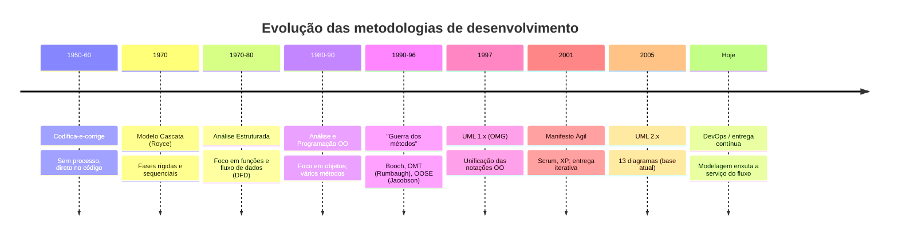

# 01 — Histórico das Metodologias de Desenvolvimento de Sistemas

> Para entender *por que* modelamos com objetos e UML, vale ver como chegamos aqui. A forma
> de construir software evoluiu junto com o tamanho e a complexidade dos sistemas — e cada
> metodologia nasceu para curar a dor da anterior.

---

## 1. Conceito: o que é uma "metodologia de desenvolvimento"?

Uma **metodologia** (ou *processo de software*) é um **conjunto organizado de etapas,
papéis e artefatos** para construir software de forma repetível. Ela responde: *em que ordem
fazer as coisas? o que produzir em cada fase? quem faz o quê?*

> ⚠️ **Não confunda:** **metodologia** (Cascata, Scrum) ≠ **notação** (UML) ≠ **linguagem**
> (Java). A UML é usada *dentro* de qualquer metodologia; é agnóstica.

---

## 2. A linha do tempo

---

## 3. As grandes fases (conceito + prós e contras)

### 3.1 Codifica-e-corrige (*code and fix*)
Programava-se sem planejar. **Vantagem:** rápido para algo minúsculo. **Desvantagem:** vira
caos quando o sistema cresce; sem documentação, ninguém entende o código do colega.

### 3.2 Modelo Cascata (Waterfall, 1970)
Fases **sequenciais**: requisitos → análise → projeto → implementação → testes → manutenção.

- ✅ **Vantagens:** ordem, previsibilidade, documentação forte, bom para requisitos
  **estáveis** (ex.: sistemas embarcados, contratos com escopo fechado).
- ❌ **Desvantagens:** rígido; um erro de requisito descoberto no fim custa caríssimo; o
  cliente só vê o produto no final.
- 🏭 **Hoje:** ainda usado em setores regulados (aviação, saúde, licitações), mas raro em
  produtos digitais.

### 3.3 Análise Estruturada (DeMarco, Yourdon — anos 70/80)
Organiza o sistema por **funções** e **fluxo de dados** (diagramas DFD), **separando** dados
de comportamento.

- ✅ **Vantagem:** ótima para sistemas centrados em processamento de dados (lote, relatórios).
- ❌ **Desvantagem:** dados e funções separados → mudança em uma estrutura de dados
  espalha alterações por muitas funções. É o problema que a OO veio resolver.

### 3.4 Orientação a Objetos (anos 80/90)
Junta **dados + comportamento** na mesma unidade (o objeto). Surgem métodos concorrentes:

| Método | Autor | Forte em |
|--------|-------|----------|
| **Booch** | Grady Booch | projeto e detalhe |
| **OMT** | James Rumbaugh | análise e modelagem de dados |
| **OOSE** | Ivar Jacobson | **casos de uso** |

### 3.5 A unificação — UML (1997)
Os **"três amigos"** (Booch, Rumbaugh, Jacobson) uniram seus métodos numa **notação única**,
padronizada pela **OMG** (*Object Management Group*). A **UML 2.x** (2005) definiu os **13
diagramas** que estudamos. Junto veio o **RUP** (*Rational Unified Process*): iterativo,
guiado por casos de uso e por arquitetura.

### 3.6 Métodos Ágeis (2001→)
O **Manifesto Ágil** priorizou *"software funcionando sobre documentação abrangente"* e
*"responder a mudanças sobre seguir um plano"*. Scrum e XP popularizaram entregas curtas.

- ✅ **Vantagens:** feedback rápido, adapta-se a requisitos incertos (o caso comum em produto).
- ❌ **Desvantagens:** documentação escassa pode virar dívida técnica; exige cliente presente
  e time maduro.
- 🏭 **Hoje:** domina o mercado de produto digital. A UML segue útil, usada **"just enough"**
  (o suficiente para comunicar uma decisão, não para documentar tudo).

---

## 4. Na indústria: como isso aparece no dia a dia

- Ninguém "faz cascata puro" nem "ágil puro": times misturam (ex.: *Water-Scrum-Fall*).
- **Você raramente desenha os 13 diagramas.** O uso real é: um **diagrama de sequência** para
  alinhar uma integração difícil; um **de classes** para combinar o modelo antes de codar; um
  **de implantação** para conversar com o time de infra. Depois, muitas vezes, o diagrama é
  descartado — serviu para **pensar e comunicar**.
- **Onde a UML resiste forte:** *onboarding* de novos devs (um diagrama vale mil linhas
  lidas), design reviews, arquitetura, documentação de sistemas críticos.
- **Onde a UML perde espaço:** substituída por *diagramas informais* (quadro branco, Excalidraw),
  *C4 model* para arquitetura, e código autoexplicativo com testes.

> 💡 **Dica de professor:** aprenda UML pela *capacidade de raciocínio* que ela treina —
> pensar em atores, estados, colaborações. Essa habilidade sobrevive a qualquer moda de
> ferramenta.

---

## 5. Vantagens e desvantagens de modelar (o debate honesto)

| Modelar antes de codar | |
|------------------------|--|
| ✅ Erros de design saem no papel (barato), não em produção (caro) | ❌ Pode virar "paralisia por análise" |
| ✅ Alinha o time e o cliente numa linguagem comum | ❌ Diagrama desatualizado engana mais que ajuda |
| ✅ Facilita manutenção e onboarding | ❌ Excesso de documentação vira burocracia |

**Equilíbrio (a resposta madura):** modele **o suficiente para reduzir o risco da decisão que
você tem agora**. Nem mais, nem menos.

---

## 💼 No dia a dia de uma empresa

Metodologia não é assunto de livro — é a rotina que define se o projeto entrega ou atrasa.
Três cenários reais que você vai encontrar:

**1) A startup de streaming (a própria Melodia, no começo).** Time de 4 devs, requisitos
mudando toda semana porque ninguém sabe ainda o que o usuário quer. Aqui, **cascata seria
suicídio**: passar 3 meses escrevendo especificação para descobrir no lançamento que
ninguém quer "playlists colaborativas". Usa-se **Scrum**: sprints de 2 semanas, entrega o
plano *Free* primeiro, mede, e só então decide construir o *Premium*. A UML aparece em
**rabiscos de quadro branco** — um diagrama de sequência para acertar o fluxo de pagamento,
fotografado e jogado fora depois.

**2) O banco que processa a cobrança das assinaturas.** O sistema que debita a conta **não
pode errar** — errar dinheiro dá processo. Requisitos são estáveis e regulados. Aqui há
muito mais **documentação formal**, revisões de design com diagramas de estados e de
sequência versionados, e um processo mais próximo do **cascata/RUP** (ou "Water-Scrum-Fall":
planeja formal, desenvolve ágil, libera com aprovação). Ninguém descarta o diagrama: ele é
**auditável**.

**3) A migração do sistema legado.** Uma empresa tem um sistema de relatórios dos anos 2000
escrito em estilo **procedural** (funções soltas, dados em structs globais). Toda mudança
quebra três coisas. A equipe está **reescrevendo em OO** justamente para viver o que a
seção 3.4 descreve: juntar dados + comportamento e parar o efeito-cascata. Esse é,
literalmente, o motivo histórico da OO existir — acontecendo hoje, no seu emprego.

> 🗣️ **O que um gerente técnico realmente decide:** não "cascata ou ágil?" no abstrato, e
> sim *"quanto risco e incerteza este projeto tem?"*. Muita incerteza → iterativo e leve.
> Muito custo de erro e requisitos fixos → mais formal e documentado. **O contexto manda.**

---

## 🎯 Desafio para você criar

**Missão:** você é o(a) líder técnico(a) e precisa escolher e justificar o processo de dois
projetos. Entregue **uma página** (pode ser em Markdown) com:

1. **Escolha uma dupla de projetos** (invente o contexto):
   - 🟢 um **app novo e incerto** (ex.: rede social de troca de figurinhas);
   - 🔵 um **sistema crítico e estável** (ex.: emissão de boletos de um banco).
2. Para **cada um**, responda:
   - Qual metodologia você usaria (cascata, Scrum, híbrido) e **por quê** — cite risco,
     incerteza e custo do erro.
   - **Dois riscos** de escolher a metodologia errada ali.
   - **Quais 2 ou 3 diagramas UML** você desenharia (e quais **não** desenharia) — justifique.
3. **Bônus (linha do tempo):** desenhe, em Mermaid `timeline`, a evolução *fictícia* de um
   produto ao longo de 3 anos (MVP → tração → escala), marcando em que fase cada metodologia
   fez sentido.

✅ **Critério de "pronto":** um colega lê sua página e entende **por que** cada escolha,
sem você explicar. Não existe resposta única — existe justificativa boa.

> ☕ **No dia de Java**, o [Desafio 1 do projeto](../projeto-base-java/DESAFIOS.md#desafio-1--do-procedural-ao-oo-o-motivo-histórico-da-oo)
> te faz *sentir na pele* a dor que a OO veio curar: você vai refatorar um trecho
> **procedural** para objetos.

---

## ✅ O que levar desta pasta

- [ ] Saímos de "software é código" para "software é um **modelo de objetos** que gera código".
- [ ] **Metodologia ≠ notação ≠ linguagem.**
- [ ] Cascata dá **ordem**; ágil dá **adaptação**; cada um serve a um contexto.
- [ ] A UML nasceu da **unificação** de Booch + OMT + OOSE (OMG, 1997) e é **agnóstica**.
- [ ] Na indústria, use UML **com parcimônia** — pelo raciocínio que ela treina.

---

[⬅️ 00 - Projeto-base](../00-projeto-base/) | [Índice](../README.md) | [02 - Conceitos de OO ➡️](../02-conceitos-orientacao-objetos/)
