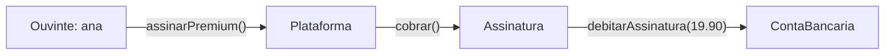

# 02 — Conceitos de Orientação a Objetos

> A OO enxerga o sistema como uma **sociedade de objetos** que **trocam mensagens** para
> realizar tarefas. Antes dos diagramas, fixe o vocabulário — ele é a base de tudo que vem
> depois.

---

## 1. A ideia central

Na programação estruturada, dados e funções vivem separados. Na **orientação a objetos**,
cada **objeto** reúne **dados (estado)** + **comportamento (operações)** e é responsável por
si mesmo. O sistema funciona porque os objetos **colaboram**: um pede algo ao outro por meio
de **mensagens** (chamadas de método).

*No Melodia, "assinar Premium" é uma cadeia de mensagens entre objetos — cada um faz sua parte.*

---

## 2. O vocabulário essencial

| Conceito | O que é | Exemplo no Melodia |
|----------|---------|--------------------|
| **Objeto** | Uma coisa com **estado** + **comportamento** | A conta `0001-1` da Ana, com saldo R$ 30,10 |
| **Classe** | O *molde* que define os objetos de um tipo | `ContaBancaria`, `Musica`, `Assinatura` |
| **Atributo** | Um dado que o objeto guarda | `saldo`, `titulo`, `status` |
| **Operação/Método** | Uma ação que o objeto sabe fazer | `depositar()`, `reproduzir()` |
| **Mensagem** | Um objeto pedindo algo a outro | `assinatura.cobrar(conta)` |
| **Estado** | O conjunto de valores dos atributos num instante | assinatura *ativa*, saldo R$ 30,10 |

---

## 3. Os quatro pilares

| Pilar | Pergunta que responde | No Melodia | Aprofundamento |
|-------|-----------------------|------------|----------------|
| **Abstração** | Como mostro só o essencial? | `Usuario` genérico esconde detalhes | [03-abstracao](../03-abstracao/) |
| **Encapsulamento** | Como protejo os dados? | `saldo` privado, mexido só por métodos | [módulo 03](../../../03-encapsulamento/) |
| **Herança** | Como reaproveito código? | `Ouvinte`/`Artista` **é um** `Usuario` | [módulo 04](../../../04-heranca/) |
| **Polimorfismo** | Como a mesma ação varia? | `tipoDePerfil()` difere por tipo | [módulo 05](../../../05-polimorfismo/) |

---

## 4. Vantagens e desvantagens da OO

| ✅ Vantagens | ❌ Desvantagens / cuidados |
|-------------|---------------------------|
| Modela o mundo real de forma intuitiva | Curva de aprendizado maior que a estruturada |
| Encapsulamento reduz efeito-cascata de mudanças | Excesso de camadas/abstrações vira complexidade tola |
| Herança/polimorfismo favorecem reúso e extensão | Herança mal usada gera acoplamento rígido |
| Facilita testar partes isoladas | Overhead de memória/indireção (relevante em alto desempenho) |

> 🏭 **Na indústria:** a OO domina back-end corporativo (Java, C#), mobile (Kotlin, Swift) e
> muito do front-end. Mas paradigmas **funcionais** (imutabilidade, funções puras) voltaram
> forte e hoje se **misturam** com a OO — Java moderno tem lambdas, `record`, `streams`.
> Bons engenheiros usam **o pilar certo para o problema**, não OO por dogma.

---

## 5. Quando OO **não** é a melhor escolha

- **Processamento de dados massivo/estatístico:** pipelines funcionais/SQL costumam ser mais
  claros que hierarquias de objetos.
- **Scripts pequenos e utilitários:** OO pode ser peso morto (*over-engineering*).
- **Altíssimo desempenho/baixo nível:** indireção de objetos pode custar caro (games de
  motor, sistemas embarcados usam *data-oriented design*).

---

## 💡 Dicas de professor

- Pense **"quem é responsável por isto?"** antes de **"onde ponho esta função?"**. A resposta
  costuma indicar a classe certa.
- Fuja da **classe anêmica** (só dados, sem comportamento) — é OO "de fachada": os dados de um
  objeto e as regras que os manipulam devem morar **juntos**.
- **Composição costuma ser melhor que herança.** Herança é forte e rígida; use só no "é um" real.

---

## 💼 No dia a dia de uma empresa

Os conceitos de OO não são teoria bonita — eles aparecem como **dor** quando faltam. Duas
histórias que se repetem em qualquer empresa:

**1) O bug do saldo negativo (por falta de encapsulamento).** Num sistema financeiro real,
o campo `saldo` era acessível de vários pontos do código. Um desenvolvedor, com pressa,
escreveu `conta.saldo = conta.saldo - valor` numa tela de estorno **sem checar se dava
negativo**. Resultado: contas ficaram com saldo negativo em produção, e o time passou o
fim de semana rodando scripts de correção. A causa-raiz não foi "o dev distraído" — foi o
**dado exposto**. Quando o time trocou `saldo` público por `private` + um método
`debitar(valor)` que valida (exatamente como o `ContaBancaria` do nosso projeto), o bug
**ficou impossível de acontecer**. Encapsulamento não é purismo: é o que impede que o *erro
de uma pessoa* vire *incidente de todo mundo*.

**2) A "classe que faz tudo" (por falta de responsabilidade única).** Em muitos sistemas
antigos existe aquela classe `Sistema` ou `Util` com 4.000 linhas, que cuida de usuário, de
pagamento, de e-mail e de relatório. Toda alteração nela assusta ("será que quebro o quê?").
Quando cada responsabilidade vira **um objeto que cuida de si** (`Ouvinte`, `Assinatura`,
`ContaBancaria`), a mudança fica **local**: mexer na regra de cobrança não toca no catálogo.
Isso é OO trabalhando a seu favor no dia a dia — e é o que torna o *onboarding* de um novo
colega possível (ele lê **uma** classe e entende **uma** coisa).

> 🗣️ **Como isso soa numa reunião:** "esse método não deveria estar aqui, quem é o **dono**
> desse dado?" é uma frase de code review que você vai ouvir e falar. Ela é, no fundo, a
> pergunta central da OO: *cada objeto é responsável pelo próprio estado*.

---

## 🎯 Desafio para você criar

**Missão:** o Melodia vai lançar **podcasts**. Modele (no papel ou em Mermaid, ainda **sem
codar**) a nova entidade e mostre que você domina o vocabulário de OO.

1. Crie a classe **`Podcast`** (e, se quiser, `Episodio`). Para ela, liste:
   - **Atributos** (o que ela *sabe*) — pelo menos 4.
   - **Operações** (o que ela *faz*) — pelo menos 3, como **verbos do domínio**.
2. Marque, para **cada** operação, **qual mensagem** ela troca com outro objeto (ex.:
   `reproduzirEpisodio()` envia `creditarRoyalty()` ao `Artista`).
3. Aponte no seu modelo **um exemplo de cada pilar**:
   - onde há **abstração**, **encapsulamento**, **herança** e **polimorfismo** (dica: um
     `Podcast` e uma `Musica` são ambos "algo reproduzível"…).
4. **Pegadinha proposital:** decida se "categoria do podcast" é um **atributo** (texto) ou
   uma **classe** `Categoria`. Justifique com a pergunta da [aula 04](../04-classe-e-objetos/):
   *tem só valor, ou tem comportamento/aparece muitas vezes?*

✅ **Critério de "pronto":** nenhuma classe sua é **anêmica** (todas têm comportamento, não
só dados) e você consegue explicar **quem é o dono** de cada dado.

> ☕ **No dia de Java**, o [Desafio 2 do projeto](../projeto-base-java/DESAFIOS.md#desafio-2--conceitos-de-oo-em-ação-o-podcast)
> pede para **implementar** esse `Podcast` e conectá-lo à `PlataformaStreaming`.

---

## ✅ O que levar desta pasta

- [ ] Objeto = **estado + comportamento**; o sistema é objetos **colaborando por mensagens**.
- [ ] Domino o vocabulário: objeto, classe, atributo, operação, mensagem, estado.
- [ ] Sei nomear e explicar os **4 pilares** com um exemplo do Melodia cada.
- [ ] Sei que OO tem **limites** e convive com outros paradigmas.

---

[⬅️ 01 - Histórico](../01-historico-metodologias/) | [Índice](../README.md) | [03 - Abstração ➡️](../03-abstracao/)
