# Aplicando os conceitos em Java — do estruturado às classes e relacionamentos

> **Dia de Java.** Na [aula de conceitos](../README.md) vimos *o que são* objeto, classe,
> atributo, operação, mensagem e estado. Agora vamos **escrever isso em Java**, usando o
> **Melodia** (nosso streaming de música) como projeto principal.
>
> A aula é uma **escada de dores e soluções**: cada etapa mostra uma **dor** do jeito anterior
> e como o próximo recurso a **resolve**. Nada de conceito "caído do céu" — cada coisa aparece
> quando faz falta.

> ### 🎯 Escopo desta aula (leia com atenção)
> **Vamos cobrir:** estruturado → classe "crua" → **construtor** → **encapsulamento** (`private`
> + validação) → **relacionamentos: associação, agregação e composição**.
>
> **Ainda NÃO entra aqui:** herança, polimorfismo, interfaces, classes abstratas. Por isso,
> nesta aula `Ouvinte` e `Artista` são **classes separadas** — generalizá-los num `Usuario`
> fica para a próxima aula.

---

## Índice
0. [Antes de começar: o vocabulário mínimo](#0-antes-de-começar-o-vocabulário-mínimo)
1. [Ponto de partida: programação estruturada](#1-ponto-de-partida-programação-estruturada)
2. [Dor nº 1: listas paralelas não escalam](#2-dor-nº-1-listas-paralelas-não-escalam)
3. [Solução: agrupar os dados numa classe (ainda "crua")](#3-solução-agrupar-os-dados-numa-classe-ainda-crua)
4. [Dor nº 2: criar objeto "na mão" é frágil](#4-dor-nº-2-criar-objeto-na-mão-é-frágil)
5. [Solução: o construtor (`new`, `this`)](#5-solução-o-construtor-new-this)
6. [Dor nº 3: campos públicos são corrompidos depois](#6-dor-nº-3-campos-públicos-são-corrompidos-depois)
7. [Solução: encapsulamento (`private` + validação)](#7-solução-encapsulamento-private--validação)
8. [Muitos objetos: coleções (`List`)](#8-muitos-objetos-coleções-list)
9. [Relacionamentos entre objetos](#9-relacionamentos-entre-objetos-o-coração-da-aula)
   - [9.1 Associação](#91-associação-usaconhece)
   - [9.2 Agregação](#92-agregação-tem-um--parte-independente)
   - [9.3 Composição](#93-composição-é-feito-de--parte-morre-com-o-todo)
10. [O modelo completo (diagrama)](#10-o-modelo-completo-desta-aula)
11. [O exemplo executável](#11-o-exemplo-executável)
12. [Erros comuns em Java](#12-erros-comuns-em-java-iniciantes)
13. [Exercícios](#13-exercícios)
14. [O que levar / próxima aula](#-o-que-levar-desta-aula)

---

## 0. Antes de começar: o vocabulário mínimo

> Esta aula é de **primeiro semestre**. Se alguns termos abaixo são novos, tudo bem — cada um
> vai ser explicado **com calma** no momento em que aparecer. Use esta tabela como "cola".

**Pré-requisitos:** saber declarar variáveis, usar `if` e `for`, e ter o Java instalado
(teste com `java -version` no terminal). Só isso — não precisa saber nada de OO ainda.

**Mini-glossário (a intuição primeiro; a definição formal vem em cada seção):**

| Termo | Em uma frase | Analogia |
|-------|--------------|----------|
| **Classe** | um *molde* que descreve como é **cada coisa de um tipo** | a **fôrma** de bolo |
| **Objeto** | uma coisa **concreta**, feita a partir de uma classe | o **bolo** assado |
| **Atributo** (campo) | um **dado** guardado **dentro** de um objeto | o **recheio** do bolo |
| **Método** (operação) | uma **ação** que o objeto sabe fazer | "fatiar", "servir" |
| **`new`** | a palavra que **cria** um objeto a partir da classe | **assar** com a fôrma |
| **`main`** | o método por onde o programa **começa** a rodar | a **porta de entrada** |
| **`List` / `ArrayList`** | uma **lista que cresce** e guarda vários itens | uma **estante** |
| **compilar** | traduzir o `.java` para a máquina executar (comando `javac`) | — |
| **rodar / executar** | pôr o programa já compilado para funcionar (comando `java`) | — |

> 🧠 Guarde a dupla mais importante: **classe = molde (existe uma)** e **objeto = peça feita do
> molde (existem muitas)**. Metade da confusão de quem começa é misturar as duas.

---

## 1. Ponto de partida: programação estruturada

> **O que é "programação estruturada"?** É o estilo que você provavelmente já usou nas
> primeiras aulas: o programa é uma **sequência de comandos** (variáveis, `if`, `for`, funções)
> que manipulam **dados soltos**. Os **dados** ficam de um lado (variáveis, listas) e as
> **ações** de outro (o código dentro do `main`). Ainda **não existe** a ideia de "objeto" —
> por isso é o nosso ponto de partida, antes da orientação a objetos.

Antes de classes, muita gente resolve tudo dentro do `main`, com **listas paralelas** (um
array para cada campo). Vamos cadastrar músicas assim, do jeito "ingênuo":

```java
import java.util.ArrayList;
import java.util.List;

public class MelodiaEstruturado {
    public static void main(String[] args) {
        // Três listas "paralelas": o item i de cada uma pertence à mesma música.
        List<String> titulos   = new ArrayList<>();
        List<String> artistas  = new ArrayList<>();
        List<Integer> duracoes = new ArrayList<>();   // em segundos

        // "cadastrar" = adicionar na mesma posição das três listas
        titulos.add("Cometa");   artistas.add("Banda Nébula"); duracoes.add(187);
        titulos.add("Órbita");   artistas.add("Banda Nébula"); duracoes.add(201);

        // "listar"
        for (int i = 0; i < titulos.size(); i++) {
            int min = duracoes.get(i) / 60, seg = duracoes.get(i) % 60;
            System.out.printf("%s — %s (%d:%02d)%n",
                titulos.get(i), artistas.get(i), min, seg);
        }
    }
}
```

Isso **funciona** e é um começo legítimo. Repare que tudo está no `main`, os dados são
**listas soltas** e não existe a ideia de "uma música" — existe o *índice `i`* que amarra as
três listas.

**📖 Entendendo o código acima (o que importa):**

- `import java.util.List;` / `ArrayList` — trazem a **lista** do Java. `List<String>` é uma
  lista que só guarda textos (`String`); `ArrayList` é a forma mais comum de criá-la.
  `new ArrayList<>()` cria a lista **vazia**.
- `titulos.add("Cometa")` — **adiciona** um item no fim da lista. `titulos.get(i)` — **lê** o
  item da posição `i`. `titulos.size()` — diz **quantos** itens há.
- `public static void main(String[] args)` — é o **ponto de entrada**: ao rodar o programa, o
  Java começa a executar por aqui.
- O `for` percorre as posições `0, 1, 2, …` e imprime uma música por vez.

**O que são "listas paralelas"?** São **três listas separadas** em que a **mesma posição `i`**
guarda pedaços da **mesma** música. A "música 0" é `titulos[0]` **+** `artistas[0]` **+**
`duracoes[0]`:

| posição `i` | `titulos` | `artistas` | `duracoes` |
|:-----------:|-----------|------------|:----------:|
| **0** | "Cometa" | "Banda Nébula" | 187 |
| **1** | "Órbita" | "Banda Nébula" | 201 |

Ou seja: **a música não existe reunida em lugar nenhum** — ela está **espalhada** por três
listas, amarrada só pelo índice `i`. É esse "amarrado por índice" que vai dar dor de cabeça já
na próxima seção.

> 🧪 Estilo procedural: **dados de um lado, funções de outro** — o ponto de partida da
> [aula de conceitos](../README.md#2-motivação-programação-estruturada--orientação-a-objetos).

---

## 2. Dor nº 1: listas paralelas não escalam

O "cliente" pede: *"também quero contar quantas vezes cada música tocou"*. Com listas
paralelas, você adiciona **mais uma lista** (`reproducoes`) e precisa mantê-la
**sincronizada** com as outras três. Some mais um campo e são quatro listas para não
desalinhar.

**As dores concretas:**

- 🔴 **Sincronização frágil:** adicionou um título e esqueceu a duração? Os índices desalinham
  e a música 3 passa a mostrar a duração da música 4. Bug silencioso.
- 🔴 **Nada valida:** dá para inserir duração negativa, título vazio, reproduções `-5`.
- 🔴 **Comportamento espalhado:** a regra "formatar duração como min:seg" fica solta no `main`,
  repetida onde precisar.
- 🔴 **"A música" não existe como coisa:** você manipula *índices*, não objetos.

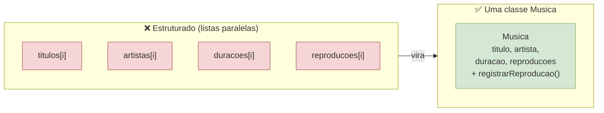

> 💡 **Próximo passo:** juntar esses quatro dados numa **classe `Musica`**, para "uma música"
> passar a existir como uma coisa só.

---

## 3. Solução: agrupar os dados numa classe (ainda "crua")

Vamos dar **um passo de cada vez**. Primeiro, só **agrupamos os dados** numa classe — ainda
**sem construtor** e **sem `private`** (chegaremos lá). Uma classe, por enquanto, é só "uma
ficha" que junta os campos de uma música:

```java
public class Musica {
    String titulo;          // campos "públicos" (padrão de pacote), por enquanto
    String artista;
    int duracaoSegundos;
    int reproducoes;
}
```

> 📖 **O que é uma classe? E um atributo?**
> Uma **classe** é um **molde**: ela dá um **nome** a um tipo de coisa (`Musica`) e lista
> **quais dados** toda coisa desse tipo vai ter. Aqui, dizemos que *toda* música tem um
> `titulo`, um `artista`, uma `duracaoSegundos` e `reproducoes`. Cada um desses dados é um
> **atributo** (também chamado de *campo*). Repare que a classe **não é** uma música — ela é a
> **descrição** de como uma música é. (De novo a **fôrma de bolo**: a fôrma não é o bolo, é o
> molde que define o formato dele.)

Para criar uma música, usamos `new` e **preenchemos campo a campo**:

```java
Musica m = new Musica();          // nasce um objeto "em branco"
m.titulo = "Cometa";
m.artista = "Banda Nébula";
m.duracaoSegundos = 187;
// m.reproducoes fica 0 (padrão do int)
```

> 📖 **O que é um objeto? E o `new`?**
> Um **objeto** é uma coisa **concreta** criada a partir da classe — uma música *de verdade*,
> com valores próprios. A palavra **`new`** é quem **cria** esse objeto na memória (é como
> *assar* o bolo usando a fôrma). Então `Musica m = new Musica();` quer dizer: *crie um objeto
> do tipo `Musica` e guarde-o na variável `m`*. Depois, `m.titulo` acessa o atributo `titulo`
> **daquele** objeto específico. Cada `new` cria um objeto **diferente**, com sua própria
> **identidade** — por isso mexer em um não mexe no outro.

**Diagrama de classe** (o molde — ainda sem `private` nem construtor):

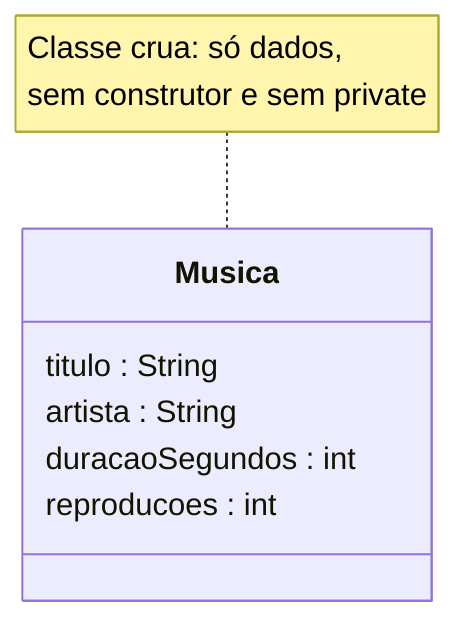

**Diagrama de objetos** (o objeto `m`, depois de preencher os 4 campos na mão):

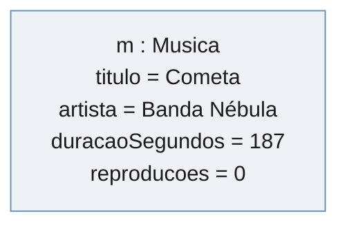

**O que já melhorou em relação à seção 2 (dor nº 1):** agora "uma música" **existe como
coisa** — os quatro dados andam **juntos** dentro de um objeto. Some o índice `i` e some o
risco de desalinhar listas. Uma `List<Musica>` guarda músicas inteiras, não pedaços.

> ✅ **Resolveu a dor nº 1** (dados soltos/desalinhados). Mas criou uma dor nova — veja a seguir.

---

## 4. Dor nº 2: criar objeto "na mão" é frágil

Criar preenchendo campo a campo tem três problemas sérios:

- 🔴 **Objeto nasce pela metade.** Entre o `new` e as atribuições, o objeto está **incompleto**
  (`titulo` é `null`, `duracaoSegundos` é `0`). Se você **esquecer uma linha**, a música fica
  quebrada — e **ninguém avisa**:
  ```java
  Musica m = new Musica();
  m.titulo = "Cometa";
  // esqueci a duração! m.duracaoSegundos continua 0 -> "0:00"
  ```
- 🔴 **Repetição.** São 3–4 linhas **toda vez** que você cria uma música. Espalhado pelo código,
  vira manutenção chata.
- 🔴 **Sem garantia de validade.** Nada impede um valor absurdo:
  ```java
  m.duracaoSegundos = -5;    // duração negativa
  m.titulo = "";             // título vazio
  ```

**Diagrama de objetos da dor** — a música que "nasceu pela metade":

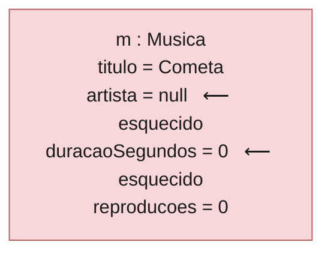

> 💡 **Precisamos de um jeito de garantir que a música nasça COMPLETA e VÁLIDA numa tacada
> só.** É exatamente para isso que existe o **construtor**.

---

## 5. Solução: o construtor (`new`, `this`)

O **construtor** é um "método especial" que roda no `new` e **inicializa** o objeto. Ele
obriga quem cria a fornecer os dados obrigatórios — o objeto **nasce pronto**, numa linha.

```java
public class Musica {
    String titulo;
    String artista;
    int duracaoSegundos;
    int reproducoes;

    // CONSTRUTOR: mesmo nome da classe, sem tipo de retorno.
    public Musica(String titulo, String artista, int duracaoSegundos) {
        this.titulo = titulo;                 // 'this.titulo' = atributo do objeto
        this.artista = artista;               // 'titulo' (sem this) = parâmetro recebido
        this.duracaoSegundos = duracaoSegundos;
        // reproducoes começa em 0
    }
}
```

Agora criar uma música é **uma linha só**, e é **impossível esquecer** um campo (o compilador
exige os três argumentos):

```java
Musica m1 = new Musica("Cometa", "Banda Nébula", 187);   // nasce completo
Musica m2 = new Musica("Órbita", "Banda Nébula", 201);
```

**Diagrama** — a classe (molde) produz objetos **completos** a cada `new`:

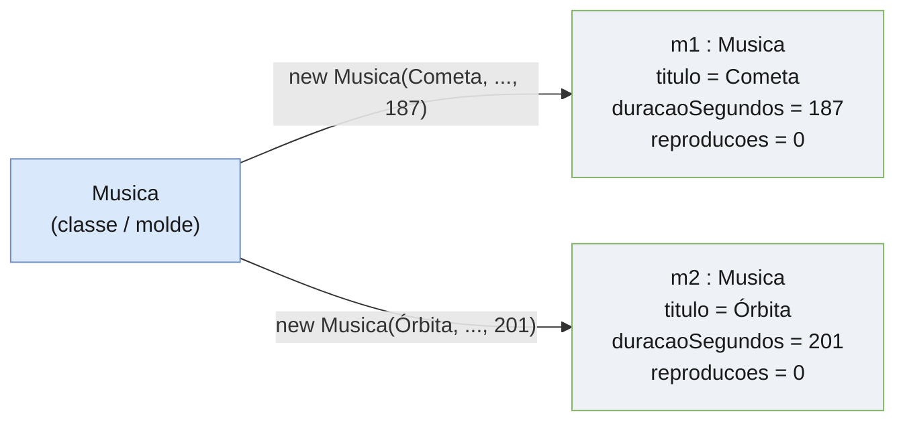

- **`new`** aloca o objeto e chama o construtor.
- **`this`** é a referência ao *próprio objeto*; serve para diferenciar o **atributo**
  (`this.titulo`) do **parâmetro** de mesmo nome (`titulo`).
- `m1` e `m2` são **objetos diferentes**, cada um com sua identidade.

> ✅ **Resolveu a dor nº 2:** sem objeto pela metade (o compilador cobra os dados), sem
> repetição (uma linha) e com **um único lugar** para a lógica de criação.
>
> 🔴 **Mas sobrou uma dor:** os campos ainda são acessíveis de fora. Veja a seção 6.

---

## 6. Dor nº 3: campos públicos são corrompidos depois

O construtor protege o **nascimento** do objeto — mas não a sua **vida**. Como os campos ainda
são acessíveis, nada impede que, **depois** de criado, alguém os corrompa:

```java
Musica m = new Musica("Cometa", "Banda Nébula", 187);   // nasceu válido...
m.reproducoes = 9999;     // ...mas alguém "fabricou" reproduções (fraude no ranking)
m.duracaoSegundos = -5;   // ...e deixou a duração inválida de novo
```

**Diagrama de objetos da dor** — nasceu válido, mas foi **corrompido depois**:

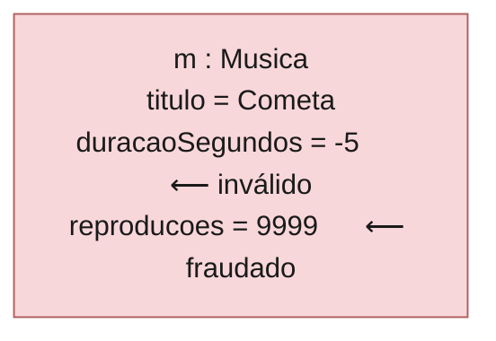

- 🔴 O objeto pode virar **inválido a qualquer momento**.
- 🔴 O atributo `reproducoes` (que alimenta royalties e o Top 50) pode ser **escrito à mão**,
  quando deveria **só aumentar** por reprodução real.

> 💡 **Precisamos fechar a porta:** ninguém deveria mexer no estado interno diretamente — só
> por operações que **validam**. Isso é o **encapsulamento**.

---

## 7. Solução: encapsulamento (`private` + validação)

Tornamos os campos **`private`** (invisíveis de fora) e só damos acesso pelo que faz sentido:
o construtor **valida** na criação, as operações **validam** ao mudar o estado, e os getters
permitem **ler**. Repare que **não existe** `setReproducoes` — reproduções só **aumentam** por
`registrarReproducao()`.

```java
public class Musica {
    private final String titulo;        // private: ninguém mexe de fora
    private final String artista;       // final: não muda depois de criado
    private final int duracaoSegundos;
    private int reproducoes;

    public Musica(String titulo, String artista, int duracaoSegundos) {
        if (titulo == null || titulo.isBlank())
            throw new IllegalArgumentException("título é obrigatório");
        if (duracaoSegundos <= 0)
            throw new IllegalArgumentException("duração deve ser positiva");
        this.titulo = titulo;
        this.artista = artista;
        this.duracaoSegundos = duracaoSegundos;
    }

    public void registrarReproducao() { reproducoes++; }   // única forma de mudar reproducoes

    public String getTitulo()     { return titulo; }       // leitura
    public int getReproducoes()   { return reproducoes; }
    public String duracaoFormatada() {                     // comportamento (antes solto no main)
        return String.format("%d:%02d", duracaoSegundos / 60, duracaoSegundos % 60);
    }
}
```

**Diagrama de classe** — estado **privado (`-`)**, acessível só pelas **operações (`+`)**:

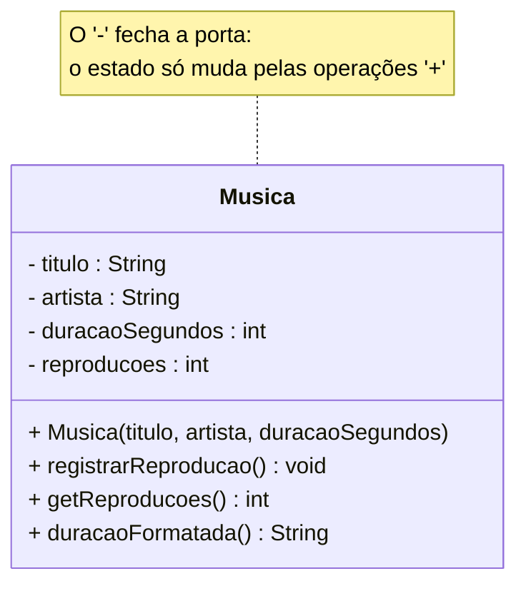

Agora aquele código que corrompia **nem compila**:

```java
m.reproducoes = 9999;      // ❌ erro de compilação: reproducoes é private
m.registrarReproducao();   // ✅ a única porta — e ela só incrementa
```

> ✅ **Resolveu a dor nº 3:** o estado inválido fica **impossível** em qualquer momento, não só
> no nascimento. O objeto **protege a si mesmo** (o invariante "reproduções só aumentam" está
> garantido).
>
> ⚠️ **Escopo:** isto é o encapsulamento *básico* para escrever uma classe decente. O pilar
> **Encapsulamento** a fundo (e os outros pilares) vem nas próximas aulas.

**Resumo da escada até aqui:**

| Etapa | Dor que resolveu | O que ganhou |
|-------|------------------|--------------|
| Classe crua (3) | dados soltos/desalinhados (2) | "a música" existe como objeto |
| Construtor (5) | objeto pela metade / repetição (4) | nasce completo, numa linha |
| Encapsulamento (7) | corrupção depois de criado (6) | estado sempre válido |

---

## 8. Muitos objetos: coleções (`List`)

Um catálogo tem muitas músicas. Guardamos os **objetos** numa **`List`** (uma lista de objetos
completos, em vez das quatro listas paralelas do começo):

```java
import java.util.ArrayList;
import java.util.List;

List<Musica> catalogo = new ArrayList<>();
catalogo.add(new Musica("Cometa", "Banda Nébula", 187));
catalogo.add(new Musica("Órbita", "Banda Nébula", 201));

for (Musica m : catalogo) {                  // 'for-each': percorre os objetos
    System.out.println(m.getTitulo() + " (" + m.duracaoFormatada() + ")");
}
```

**Diagrama de objetos** — uma coleção que aponta para vários objetos `Musica`:

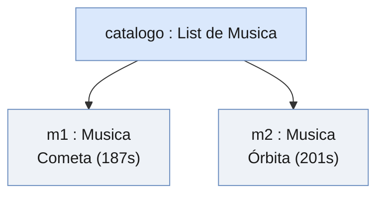

Uma `List<Musica>` substitui as quatro listas paralelas — e **cada elemento já é uma música
completa e válida**, sem risco de desalinhar índices.

---

## 9. Relacionamentos entre objetos (o coração da aula)

> 📖 **O que é um "relacionamento"?** É quando **um objeto guarda uma referência a outro** para
> poder usá-lo. No código, isso quase sempre aparece como **um atributo cujo tipo é outra
> classe** — por exemplo, uma `Playlist` que guarda uma `List<Musica>`, ou um `Ouvinte` que
> guarda os `Artista`s que ele segue. "Relacionar" objetos é o que faz o sistema virar um
> **conjunto de peças que colaboram**, em vez de classes isoladas.

Objetos não vivem sozinhos — eles **se conectam**. Há três formas de conexão que você precisa
saber distinguir. Todas se parecem no código (um objeto guardando outro), mas têm **semânticas
diferentes**:

| Relacionamento | Símbolo UML | Ideia | Pergunta que decide |
|----------------|-------------|-------|---------------------|
| **Associação** | `──▶` | "usa / conhece" | X só **conhece** Y? |
| **Agregação** | `◇──` | "tem um" (parte independente) | X **tem** Y, mas Y **sobrevive** sem X? |
| **Composição** | `◆──` | "é feito de" (parte dependente) | Y **nasce e morre** com X? |

> 🧭 A pergunta-chave: **"a parte sobrevive sem o todo?"** Se sim → associação/agregação; se
> não → composição.

### 9.1 Associação ("usa/conhece")

O relacionamento mais fraco: um objeto apenas **conhece** o outro (guarda uma referência) para
poder mandar mensagens. No Melodia, um **`Ouvinte` segue `Artista`s**.

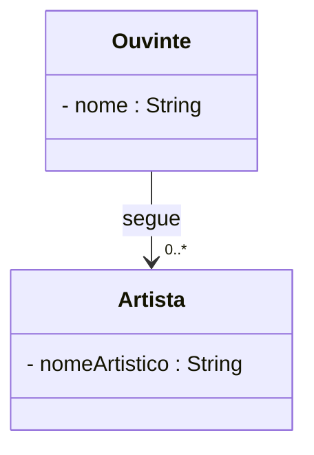

```java
public class Ouvinte {
    private final List<Artista> seguindo = new ArrayList<>();

    public void seguir(Artista a) {           // ASSOCIAÇÃO: passa a conhecer 'a'
        if (a != null && !seguindo.contains(a)) seguindo.add(a);
    }
}
```

O `Artista` existe **por conta própria** — o ouvinte só aponta para ele. Deletar o ouvinte não
apaga o artista, e vice-versa.

### 9.2 Agregação ("tem um" — parte independente)

Um "todo" agrupa "partes" que **existem independentemente** dele. No Melodia, uma **`Playlist`
tem `Musica`s** — mas as músicas já existem no catálogo; a playlist só as **agrupa**.

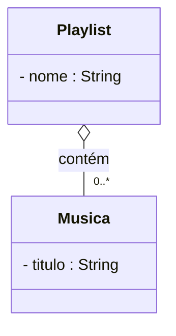

```java
public class Playlist {
    private final List<Musica> musicas = new ArrayList<>();

    public void adicionar(Musica m) {         // AGREGAÇÃO: RECEBE música já existente
        if (!musicas.contains(m)) musicas.add(m);
    }
}
```

Palavra-chave: a playlist **recebe** a `Musica` pronta (`adicionar(Musica m)`). Se a playlist
for apagada, as músicas **continuam** no catálogo.

### 9.3 Composição ("é feito de" — parte morre com o todo)

Um "todo" é **feito de** "partes" que **não existem sem ele**. No Melodia, um **`Album` é feito
de faixas** — as faixas são criadas **dentro** do álbum e não fazem sentido soltas.

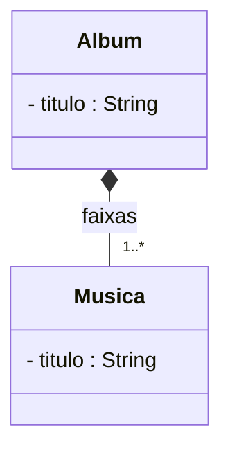

```java
public class Album {
    private final List<Musica> faixas = new ArrayList<>();

    public Musica adicionarFaixa(String titulo, String artista, int dur) {
        Musica m = new Musica(titulo, artista, dur);   // COMPOSIÇÃO: o álbum CRIA a faixa
        faixas.add(m);
        return m;
    }
}
```

Palavra-chave: o álbum **cria** a `Musica` (`new` dentro dele). Se o álbum for apagado, as
faixas somem com ele.

> 🔎 **O par que ensina tudo:** `Album` e `Playlist` apontam ambos para `Musica`. A diferença
> não está no tipo do campo (os dois têm `List<Musica>`), e sim em **quem cria a parte**: o
> `Album` **cria** (composição ◆); a `Playlist` **recebe** (agregação ◇).

---

## 10. O modelo completo desta aula

Juntando as classes e os três relacionamentos (sem herança):

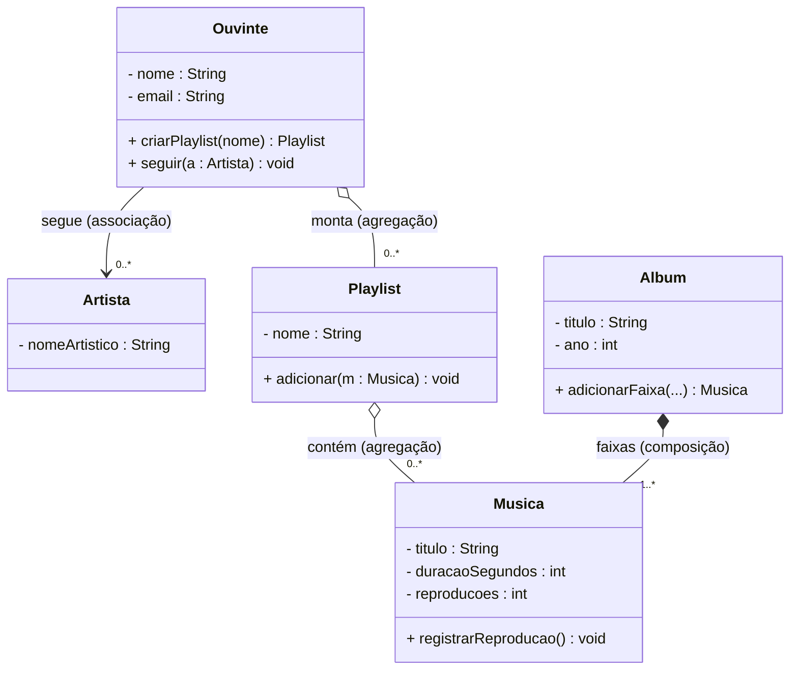

> Este diagrama **é** a estrutura do código no exemplo. Modelo e código contam a mesma história.

**Retrato em objetos** — a diferença composição × agregação fica visível: `m1` e `m3`
**pertencem** ao álbum (linha cheia ◆) e são **apontadas** pela playlist (linha tracejada ◇):

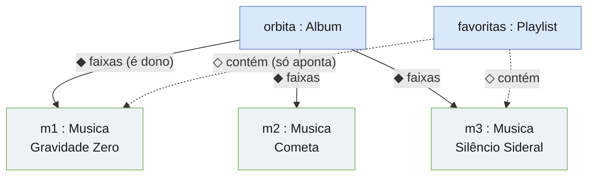

> Se o álbum for apagado, `m1`–`m3` somem (composição). Se a playlist for apagada, `m1` e `m3`
> **continuam** existindo no álbum (agregação).

---

## 11. O exemplo executável

Na pasta **[`exemplo/`](exemplo/)** está tudo isto rodando (classes separadas, **sem
herança**): `Artista`, `Musica`, `Album` (composição), `Playlist` (agregação), `Ouvinte`
(associação + agregação) e um `Principal` com um cenário.

```bash
cd exemplo
javac *.java
java Principal
```

A saída mostra o álbum criando suas faixas, a playlist apontando para músicas existentes, o
ouvinte seguindo o artista e — no fim — a **prova** de que a mesma música está no álbum **e** na
playlist (porque a playlist só aponta; o álbum é dono).

---

## 12. Erros comuns em Java (iniciantes)

- **`NullPointerException`:** chamar método em referência `null` (ex.: `playlist.adicionar(m)`
  com `m` nula). Valide as entradas.
- **Esquecer o construtor / campos não inicializados:** exatamente a dor nº 2. Use construtor
  que exige o obrigatório.
- **Vazar a lista interna:** `return musicas;` deixa qualquer um alterar por fora. Devolva
  `Collections.unmodifiableList(musicas)` (o exemplo faz isso).
- **`==` vs `equals()`:** `==` compara **identidade** (mesmo objeto na memória); `equals()`
  compara **conteúdo**. Duas músicas "Cometa" diferentes dão `==` falso.
- **Confundir composição com agregação:** olhe **quem cria a parte**. Criou dentro (`new`) →
  composição. Recebeu pronto → agregação.

---

## 13. Exercícios

> Faça no domínio do **Melodia**. Gabaritos ao final (clique para abrir).

**1.** Pegue a classe `Musica` "crua" da seção 3 (sem construtor). Escreva o `main` que cria
uma música e **esqueça de propósito** a duração. O que acontece ao chamar `duracaoFormatada()`?
Depois, reescreva usando o **construtor** e explique por que o erro some.

**2.** Na versão final da `Musica`, por que `reproducoes` **não** tem `setReproducoes(int)`?
Qual invariante isso protege?

**3.** Dado o trecho abaixo, diga se cada linha é **composição** ou **agregação** e justifique:
```java
Musica m = orbita.adicionarFaixa("Cometa", "Banda Nébula", 187);
favoritas.adicionar(m);
```

**4.** Escreva a linha de código para o ouvinte `ana` **seguir** o artista `nebula`. Que
relacionamento é esse?

<details>
<summary><b>Gabarito</b></summary>

**1.** Com a classe crua, `duracaoSegundos` fica `0` e `duracaoFormatada()` imprime `"0:00"` —
sem nenhum aviso (a dor nº 2). Com o **construtor** `new Musica("...", "...", 187)`, o
compilador **exige** os três argumentos: fica impossível esquecer a duração.

**2.** Porque reproduções **não devem** ser atribuídas de fora — só **incrementadas** por
`registrarReproducao()`. Invariante: *as reproduções nunca diminuem nem recebem valor
arbitrário* (garante royalties/ranking corretos).

**3.** `adicionarFaixa` é **composição** (o `Album` **cria** a `Musica`); `favoritas.adicionar(m)`
é **agregação** (a `Playlist` **recebe** uma música que já existe). A mesma música participa
das duas relações.

**4.** `ana.seguir(nebula);` — é uma **associação** ("usa/conhece"): o ouvinte passa a conhecer
o artista, que existe independentemente.
</details>

### 🎯 Exercício final — no seu projeto de grupo

No domínio do **seu** projeto em
[`../../../../../projetos-em-grupo/`](../../../../../projetos-em-grupo/) (hotel, loja, farmácia…),
escreva em Java **sem herança**, seguindo a mesma escada:

1. **Uma classe** com atributos `private`, **construtor** que valida e ao menos uma operação de
   negócio (ex.: `Quarto`, `Produto`, `Consulta`).
2. **Uma composição** (um "todo" que **cria** suas partes — ex.: `Pedido` cria `ItemPedido`).
3. **Uma agregação** (um "todo" que **recebe** partes existentes).
4. **Uma associação** (um objeto que só **conhece** outro).

Compile, rode um `Principal` de demonstração e guarde em
`projetos-em-grupo/<seu-projeto>/java/`. Corresponde aos **Encontros 4 e 7** do
`PLANO-DE-EVOLUCAO.md` do grupo.

---

## ✅ O que levar desta aula

- [ ] Cada recurso resolve uma **dor** do anterior: **classe** (dados juntos) → **construtor**
      (nasce completo) → **encapsulamento** (estado sempre válido).
- [ ] Sei escrever uma classe Java: **atributos `private`, construtor com validação, `this`,
      `new`, getters e operações**.
- [ ] Distingo os três relacionamentos pelo critério **"quem cria/possui a parte"**:
      **associação** (conhece), **agregação** (recebe/possui, parte independente),
      **composição** (cria/é feito de, parte dependente).
- [ ] Consigo desenhar o **diagrama de classes** e ver que ele **bate com o código**.

> ▶️ **Próxima aula (Java):** quando surgir um *tipo especial* (ex.: um usuário que também é
> artista, ou um cliente VIP), veremos **herança e polimorfismo** — e aí `Ouvinte` e `Artista`
> poderão compartilhar um `Usuario` em comum.

---

[⬅️ Aula 02 — Conceitos (teoria)](../README.md) · [☕ Projeto Melodia completo](../../projeto-base-java/) · [📚 Índice do curso](../../README.md)
