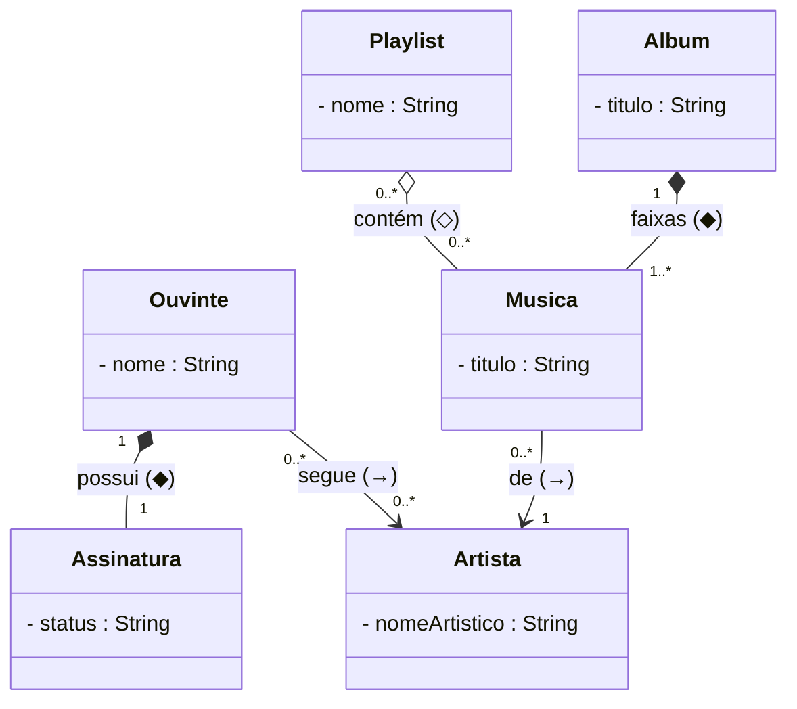
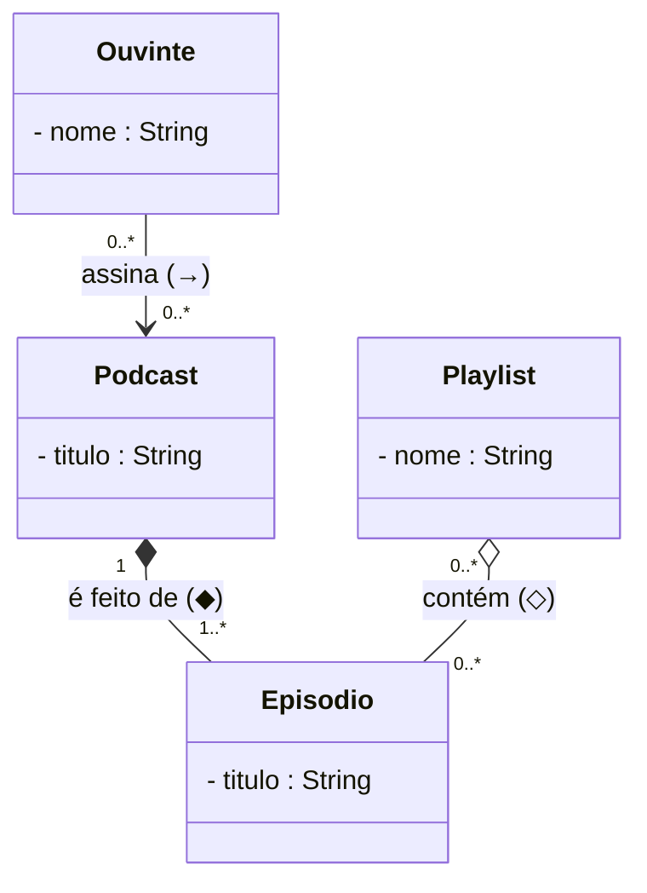
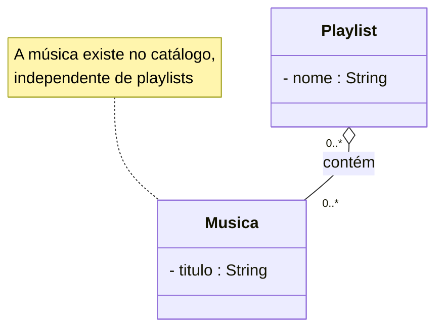

# Gabarito — Associação, Agregação e Composição (modelagem OO)

> Respostas comentadas dos [exercícios](exercicios-relacionamentos-oo.md), com **diagramas de
> classes** em notação UML. Enunciados no domínio da Melodia (streaming de música).
>
> **Convenção usada nos diagramas (Mermaid):** `-->` associação · `o--` agregação (losango
> vazio ◇) · `*--` composição (losango cheio ◆). O losango fica sempre do lado do **todo**.

---

## Exercício 1 — Classificação (resposta)

| # | Ligação | Tipo | Por quê (a parte sobrevive sem o todo?) | Multiplicidade |
|---|---------|------|------------------------------------------|----------------|
| a | Playlist – Musica | **Agregação** ◇ | Sim: a música existe no catálogo e pode estar em várias playlists | `Playlist 0..*` — `Musica 0..*` |
| b | Album – Musica (faixa) | **Composição** ◆ | Não: a faixa nasce e morre com o álbum | `Album 1` — `Musica 1..*` |
| c | Ouvinte – Artista | **Associação** → | O ouvinte só **conhece** o artista (segue) | `Ouvinte 0..*` — `Artista 0..*` |
| d | Ouvinte – Assinatura | **Composição** ◆ | Não: a assinatura só existe enquanto o ouvinte existe | `Ouvinte 1` — `Assinatura 1` |
| e | Musica – Artista (autoria) | **Associação** → | A música apenas **referencia** o artista (que existe por si) | `Musica 0..*` — `Artista 1` |

**Diagrama de classes consolidado do Exercício 1:**

> 🧠 **Ponto-chave:** os itens **a** e **b** usam a **mesma** classe `Musica`, mas com
> relacionamentos **diferentes** — porque a resposta à pergunta "a parte sobrevive sem o todo?"
> é diferente em cada caso. Isso é o coração da distinção agregação × composição.

---

## Exercício 2 — Modelagem do Podcast (resposta)

Decisões, ligação por ligação:

- **Podcast – Episodio:** **composição** ◆ — "cada episódio pertence a um único podcast e só
  existe dentro dele; apagar o podcast apaga os episódios". Multiplicidade: `Podcast 1` —
  `Episodio 1..*`.
- **Ouvinte – Podcast (assinar):** **associação** → — o ouvinte apenas **acompanha** podcasts,
  que existem por conta própria. Multiplicidade: `Ouvinte 0..*` — `Podcast 0..*`.
- **Playlist – Episodio:** **agregação** ◇ — a playlist **agrupa** episódios que já existem
  (dentro de seus podcasts); apagar a playlist não apaga o episódio. Multiplicidade:
  `Playlist 0..*` — `Episodio 0..*`.

> 💡 Note o paralelo com o catálogo de música: **Podcast◆Episodio** é como **Album◆Musica**
> (composição), e **Playlist◇Episodio** é como **Playlist◇Musica** (agregação). O mesmo
> raciocínio se repete em domínios diferentes — é isso que torna a modelagem uma habilidade
> transferível.

---

## Exercício 3 — O erro de modelagem (resposta)

**a) Por que está errado.** Composição (◆) significa **"a parte morre com o todo"**: se a
`Playlist` é dona da `Musica` por composição, então **apagar a playlist apagaria a música do
catálogo**. Isso é absurdo no domínio — a música existe **independentemente** de qualquer
playlist; ela vive no catálogo (e no seu álbum).

**b) Efeito colateral com músicas compartilhadas.** A **mesma música** normalmente está em
**várias playlists**. Na composição, uma parte pertence a **um único** todo. Logo, o modelo
por composição é incoerente: ou a música só poderia estar em uma playlist, ou apagar **uma**
playlist derrubaria uma música que outras playlists (e o álbum) ainda usam. Em resumo:
composição impõe **posse exclusiva e ciclo de vida compartilhado** — exatamente o que **não**
vale aqui.

**c) Correção.** O relacionamento certo é **agregação** ◇ (a playlist **agrupa** músicas que
existem por conta própria), com multiplicidade **muitos-para-muitos**:

**Regra de ouro para lembrar:** use **composição** só quando a parte é **exclusiva** de um
único todo **e** deve ser destruída junto com ele. Se a parte é **compartilhada** ou
**sobrevive** ao todo, é **agregação** (ou associação, se for só "conhecer").

---

[⬅️ Exercícios](exercicios-relacionamentos-oo.md) · [Aula 02 — Conceitos](README.md)
