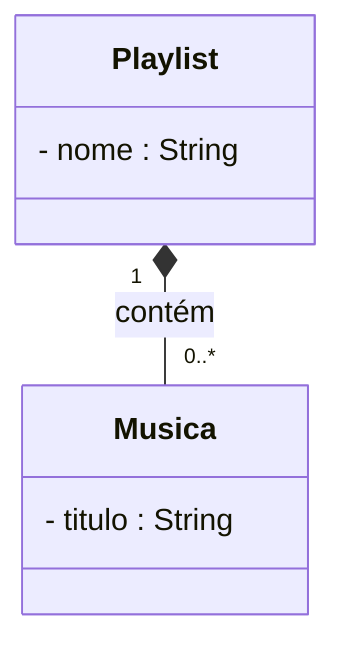

# Exercícios — Associação, Agregação e Composição (modelagem OO)

> **Contexto: plataforma de streaming de música "Melodia".** Estes exercícios são de
> **modelagem** — não é para escrever código Java, e sim para **desenhar e justificar**
> diagramas de classes com a notação correta (linha para associação, losango **vazio ◇** para
> agregação, losango **cheio ◆** para composição), com **multiplicidades**.
>
> As respostas comentadas (com diagrama de classes) estão em
> **[exercicios-relacionamentos-oo-gabarito.md](exercicios-relacionamentos-oo-gabarito.md)** —
> tente resolver antes de olhar.

**Lembrete rápido da notação (UML):**

| Relacionamento | Símbolo | Pergunta que decide |
|----------------|---------|---------------------|
| **Associação** | linha `───` (com seta de navegação) | X só **conhece/usa** Y? |
| **Agregação** | losango **vazio** `◇──` | X **tem** Y, mas Y **sobrevive** sem X? |
| **Composição** | losango **cheio** `◆──` | Y **nasce e morre** com X? |

Multiplicidades: `1` (exatamente um), `0..1` (zero ou um), `*` ou `0..*` (muitos),
`1..*` (um ou mais).

---

## Exercício 1 — Classifique cada relacionamento

No domínio da Melodia, **classifique** cada ligação abaixo como **associação**, **agregação**
ou **composição** e **justifique em uma frase** (use sempre a pergunta "a parte sobrevive sem o
todo?"). Ao final, indique a **multiplicidade** de cada lado.

a) Uma **Playlist** contém **Músicas** — as músicas já existem no catálogo e podem estar em
   várias playlists ao mesmo tempo.

b) Um **Álbum** é formado por **Faixas** (músicas) que só passam a existir quando o álbum é
   publicado e não fazem sentido fora dele.

c) Um **Ouvinte** segue **Artistas**.

d) Um **Ouvinte** possui uma **Assinatura**, que é criada junto com o cadastro do ouvinte e
   deixa de existir se a conta do ouvinte for encerrada.

e) Uma **Música** é de um **Artista** (autoria).

---

## Exercício 2 — Modele um recurso novo (Podcast)

A Melodia vai lançar **podcasts**. Leia o "pedido do cliente" e **desenhe o diagrama de
classes** decidindo o relacionamento certo em cada ligação (com losango quando for o caso) e as
**multiplicidades**:

> *"Um **Podcast** é organizado em **Episódios** — cada episódio pertence a um único podcast e
> só existe dentro dele (se apagarmos o podcast, os episódios vão junto). Um **Ouvinte** pode
> **assinar** vários podcasts para ser avisado de novidades. E o pessoal quer poder colocar
> **Episódios** dentro das **Playlists**, junto com as músicas."*

Entregue:
1. As classes envolvidas (`Podcast`, `Episodio`, `Ouvinte`, `Playlist`).
2. O tipo de cada relacionamento (associação / agregação / composição), com o símbolo correto.
3. As multiplicidades de cada lado.

---

## Exercício 3 — Ache o erro de modelagem (e conserte)

Um colega modelou a relação entre **Playlist** e **Música** assim:

Ou seja, ele usou **composição** (losango cheio ◆) entre `Playlist` e `Musica`.

a) Explique **por que esse modelo está errado** no domínio da Melodia (o que aconteceria, na
   prática, com o catálogo, se a composição fosse levada a sério?).

b) Diga qual seria o efeito colateral considerando que **a mesma música** costuma estar em
   **várias playlists**.

c) **Corrija** o diagrama usando o relacionamento adequado e a multiplicidade correta.
