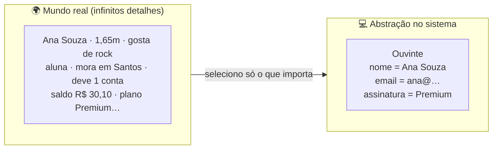

# 03 — Abstração

> **Abstração** é a habilidade mais importante do modelador: **focar no essencial e ignorar
> o resto**, de acordo com o problema. É decidir *o que mostrar* e *o que esconder*.

---

## 1. Conceito

Um ouvinte real da Melodia tem centenas de características (altura, cor dos olhos, comida
favorita…). Para o sistema, **abstraímos** só o que **importa**: nome, e-mail, assinatura e
conta. Tudo o mais é ruído.

---

## 2. Os dois sentidos de "abstração" em OO

| Sentido | O que é | No Melodia |
|---------|---------|------------|
| **Recorte** | Incluir só os atributos/operações relevantes | `Ouvinte` guarda `assinatura`, não "cor dos olhos" |
| **Generalização** | Criar um tipo genérico que representa vários específicos | `Usuario` abstrai `Ouvinte` e `Artista` |

A **generalização** é a base da herança e das **classes/métodos abstratos**. No código:
`Usuario` é `abstract` e declara `tipoDePerfil()` sem implementar — cada subclasse concretiza.

> 🔗 **No Java:** veja `usuario/Usuario.java` no
> [projeto-base-java](../projeto-base-java/) — a classe abstrata e o método abstrato.
> Aprofundamento no [módulo 06 - Abstração](../../../06-abstracao/).

---

## 3. Níveis de abstração

Modelar é escolher o **nível** certo de detalhe para o público:

- **Alto nível** (para o cliente/negócio): "o ouvinte assina e ouve música".
- **Nível de projeto** (para o dev): classes `Ouvinte`, `Assinatura`, `ContaBancaria` e suas
  operações.
- **Baixo nível** (implementação): `double saldo`, laços, estruturas de dados.

Cada **diagrama UML** é uma abstração num nível: casos de uso (alto), classes (projeto),
sequência (detalhe da colaboração).

---

## 4. Vantagens e desvantagens

| ✅ Vantagens | ❌ Riscos / desvantagens |
|-------------|--------------------------|
| Reduz complexidade: lida-se com o essencial | Abstrair **cedo demais** cria camadas inúteis |
| Esconde detalhes → o "como" pode mudar sem afetar quem usa | Abstração **errada** esconde o que importava |
| Facilita reúso (tipos genéricos) | Excesso de generalização vira código difícil de seguir |

> ⚠️ **Cheiro clássico:** a *abstração especulativa* — criar `Usuario`, `UsuarioBase`,
> `AbstractUsuario` "porque um dia pode ter outro tipo". Se hoje só existe um tipo, **não
> abstraia** (princípio [YAGNI](../../../../4-principios-desgin-poo/02-yagni/)).

---

## 5. Na indústria (como sim, como não)

- ✅ **Bom uso:** esconder o acesso a dados atrás de uma interface `RepositorioDeMusicas`, de
  modo que trocar de banco não afete o resto. Isso é abstração pagando dividendos.
- ❌ **Mau uso:** o *AbstractSingletonProxyFactoryBean* da vida — camadas de abstração que
  ninguém entende. Abstração é para **simplificar**; se está complicando, está errada.
- 💡 **Regra prática de sênior:** abstraia **quando a duplicação/variação realmente aparecer**
  (na 2ª ou 3ª vez), não na primeira. "*Duplicação é mais barata que a abstração errada.*"

---

## 6. Exemplo comparado: a mesma coisa, dois recortes

O mesmo `endereco` de um ouvinte pode ser:
- um simples `String` (atributo) — se o sistema nunca separa rua/cidade;
- uma classe `Endereco` com `validar()` — se o sistema manipula CEP, cobrança por região etc.

**A abstração depende do contexto.** Não existe recorte "certo" absoluto — existe o que serve
ao problema.

---

## 💼 No dia a dia de uma empresa

Abstração é a decisão que mais **economiza (ou custa)** dinheiro no longo prazo — e você a
verá dos dois jeitos:

**1) A boa abstração que salvou a troca de gateway.** O Melodia cobra assinaturas por um
gateway de pagamento (digamos, "PagX"). Um belo dia, o PagX aumenta a taxa em 40% e a
empresa decide migrar para o "PagY". Se o código chamasse a API do PagX **diretamente** em
50 lugares, seria um pesadelo de semanas. Mas o time sênior tinha criado uma **abstração**:
uma interface `MeioDePagamento` com `cobrar(valor)`, e o resto do sistema só conhecia essa
interface. Trocar de gateway virou **escrever uma classe nova** (`PagY implements
MeioDePagamento`) e mudar **uma linha** de configuração. Isso é abstração pagando dividendos:
o "como" (qual gateway) mudou sem tocar em quem usa o "o quê" (cobrar). Bônus: nos **testes**,
usa-se um `MeioDePagamentoFalso` que sempre aprova — sem chamar banco de verdade.

**2) A abstração especulativa que virou peso morto.** No mesmo time, um dev animado criou
`AbstractProvedorDeConteudoBaseFactory` "porque um dia pode ter vídeo, texto, podcast…".
Passaram-se dois anos: **só existe música**. A hierarquia de 5 classes abstratas continua lá,
confundindo todo mundo, e ninguém tem coragem de apagar. Custo real, benefício zero. Este é o
outro lado da moeda — o [YAGNI](../../../../4-principios-desgin-poo/02-yagni/) chorando.

> 🗣️ **A regra que sobrevive à prova do tempo:** *"abstraia na terceira vez, não na
> primeira"*. Duplicou uma vez? Copie. Duas? Desconfie. Três? **Agora** você já sabe o que
> varia e o que é fixo — e a abstração sai **certa**. Abstrair antes de entender a variação é
> chutar no escuro.

---

## 🎯 Desafio para você criar

**Missão:** agora que o Melodia tem **música** e **podcast** (da [aula 02](../02-conceitos-orientacao-objetos/)),
os dois são "coisas que se reproduzem". Projete a **abstração** que os unifica — ainda
**modelando**, sem codar.

1. Crie o tipo abstrato **`FonteDeAudio`** (interface ou classe abstrata — decida e
   justifique). O que **todo** áudio reproduzível precisa expor? (dica: `getDuracao()`,
   `getTitulo()`, `reproduzir()`…).
2. Desenhe, em Mermaid `classDiagram`, `Musica` e `Podcast` **implementando/estendendo**
   `FonteDeAudio`, e mostre a `Playlist` guardando `FonteDeAudio` (não mais só `Musica`) —
   assim ela aceita os dois. Isso é **abstração + polimorfismo** trabalhando juntos.
3. Escreva **2 ou 3 linhas** respondendo: *o que essa abstração **esconde** e o que ela
   **revela**?* E: *ela facilita qual mudança futura?*
4. **Pense no limite:** dê **um exemplo** de algo que **NÃO** deveria entrar em `FonteDeAudio`
   (um detalhe específico só de podcast, por exemplo). Abstração boa também é saber o que
   **deixar de fora**.

✅ **Critério de "pronto":** um `Playlist` no seu modelo consegue misturar músicas e podcasts
sem saber a diferença — e você consegue apontar **uma** mudança futura que ficou barata por
causa da abstração (e uma que a abstração **não** deveria tentar prever).

> ☕ **No dia de Java**, o [Desafio 3 do projeto](../projeto-base-java/DESAFIOS.md#desafio-3--abstração-a-fontedeaudio)
> pede para **extrair** a interface `FonteDeAudio` e fazer a `Playlist` e o `reproduzir()`
> funcionarem polimorficamente com música **e** podcast.

---

## ✅ O que levar desta pasta

- [ ] Abstrair é **recortar** o mundo: incluir o essencial, ignorar o resto.
- [ ] Há dois sentidos: **recorte** e **generalização** (base de classe abstrata).
- [ ] Cada diagrama UML é uma abstração num **nível** diferente.
- [ ] **Não abstraia cedo demais** — duplicação é mais barata que a abstração errada.

---

[⬅️ 02 - Conceitos de OO](../02-conceitos-orientacao-objetos/) | [Índice](../README.md) | [04 - Classe e Objetos ➡️](../04-classe-e-objetos/)
