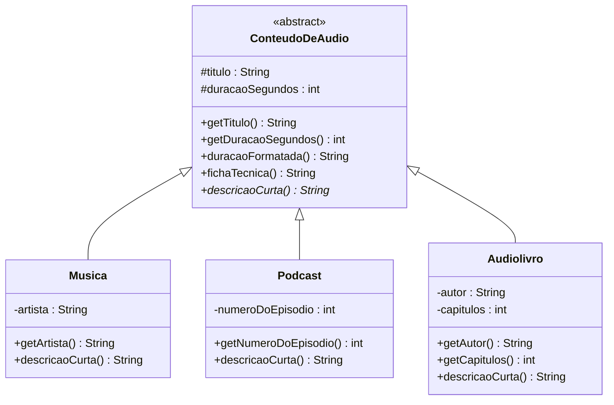

# 1) Abstração — em Java

> **Pilar:** Abstração · **Domínio:** streaming Melodia
> Resposta ao exercício: *"Crie o tipo abstrato `ConteudoDeAudio` que **generaliza** `Musica`,
> `Podcast` e `Audiolivro`. O que **todo** áudio reproduzível precisa expor?"*

## 🎯 O que foi feito

- Criada a **classe abstrata `ConteudoDeAudio`** com o **essencial** que todo áudio compartilha
  (`titulo`, `duracaoSegundos`) e uma operação **abstrata** `descricaoCurta()`.
- Três concretos — `Musica`, `Podcast`, `Audiolivro` — **estendem** a base, herdam o que é
  comum e **concretizam** `descricaoCurta()` cada um à sua maneira.
- Um `DemoAbstracao` mostra a biblioteca sendo tratada pelo **tipo genérico**
  (`List<ConteudoDeAudio>`), sem `if` de tipo.

## 🗺️ Diagrama de classes



*Nome em itálico + `<<abstract>>` = classe abstrata; método com `*` no fim = abstrato;
`<|--` = herança (triângulo vazio).*

## 📄 Explicação de cada classe

| Classe | Papel | Destaques |
|--------|-------|-----------|
| **`ConteudoDeAudio`** | A **abstração** (superclasse abstrata). Não se instancia. | Guarda o essencial (`titulo`, `duracaoSegundos`); implementa `duracaoFormatada()` e `fichaTecnica()` (comuns a todos); declara `descricaoCurta()` como **abstrata**. |
| **`Musica`** | Concreto. Acrescenta `artista`. | Só implementa o que é específico + `descricaoCurta()`. Todo o resto vem "de graça" da base. |
| **`Podcast`** | Concreto. Acrescenta `numeroDoEpisodio`. | Mostra o **limite da abstração**: `numeroDoEpisodio` **não** sobe para a base (uma música não tem episódio). |
| **`Audiolivro`** | Concreto. Acrescenta `autor` e `capitulos`. | Provar que um tipo novo **encaixa** no contrato sem tocar nos outros. |
| **`DemoAbstracao`** | `main` de demonstração. | Trata uma `List<ConteudoDeAudio>` pelo tipo genérico e soma a duração total. |

> **Por que classe abstrata (e não interface)?** Porque há **estado e código comuns** a
> reaproveitar (`titulo`, `duracaoSegundos`, `fichaTecnica()`). Regra prática de Bloch
> (*Effective Java*): classe abstrata quando há estado/comportamento comum; interface quando é
> só contrato.

## 💻 O código, passo a passo

> A ordem abaixo é a **ordem de leitura recomendada**: primeiro a abstração (a base), depois os
> concretos que a estendem e, por fim, o `main` que usa tudo. (Os arquivos `.java` trazem os
> comentários completos; aqui o foco é explicar **cada ponto**.)

### Passo 1 — `ConteudoDeAudio.java` (a classe abstrata)

```java
public abstract class ConteudoDeAudio {
    // estado ESSENCIAL, comum a todo áudio (# = protegido: subclasses enxergam)
    protected final String titulo;
    protected final int duracaoSegundos;

    protected ConteudoDeAudio(String titulo, int duracaoSegundos) {
        if (titulo == null || titulo.isBlank())
            throw new IllegalArgumentException("Título é obrigatório.");
        if (duracaoSegundos <= 0)
            throw new IllegalArgumentException("Duração deve ser positiva.");
        this.titulo = titulo;
        this.duracaoSegundos = duracaoSegundos;
    }

    public String getTitulo() { return titulo; }
    public int getDuracaoSegundos() { return duracaoSegundos; }

    // mm:ss — igual para todos os tipos, por isso mora aqui
    public String duracaoFormatada() {
        return String.format("%02d:%02d", duracaoSegundos / 60, duracaoSegundos % 60);
    }

    // CONTRATO: todo conteúdo sabe se descrever, mas cada tipo faz à sua maneira
    public abstract String descricaoCurta();

    // TEMPLATE: combina o comum (título/duração) com o que varia (descricaoCurta)
    public String fichaTecnica() {
        return "[" + descricaoCurta() + "] " + titulo + " (" + duracaoFormatada() + ")";
    }
}
```

**Explicação, ponto a ponto:**
- `abstract class` → **não pode ser instanciada** (`new ConteudoDeAudio(...)` não compila). É o tipo genérico `«abstract»` do diagrama.
- `protected final` → o **essencial** comum; `protected` (`#`) deixa as subclasses enxergarem; `final` impede troca depois de criado.
- **Validação no construtor** → protege o invariante já na entrada (não existe conteúdo sem título ou com duração ≤ 0).
- `duracaoFormatada()` / `fichaTecnica()` → comportamento **comum**, escrito **uma vez** e herdado por todos.
- `public abstract String descricaoCurta();` → **método abstrato**: sem corpo; **obriga** cada subclasse a implementá-lo (o compilador cobra).
- `fichaTecnica()` chama `descricaoCurta()` → um concreto chamando um abstrato: é o **Template Method** (GoF).

### Passo 2 — `Musica.java`, `Podcast.java`, `Audiolivro.java` (os concretos)

```java
public class Musica extends ConteudoDeAudio {
    private final String artista;               // o que é específico de música

    public Musica(String titulo, int duracaoSegundos, String artista) {
        super(titulo, duracaoSegundos);         // reusa a validação da base
        this.artista = (artista == null || artista.isBlank())
                ? "Artista desconhecido" : artista;
    }

    public String getArtista() { return artista; }

    @Override public String descricaoCurta() {  // concretiza o contrato herdado
        return "Música de " + artista;
    }
}
```

```java
public class Podcast extends ConteudoDeAudio {
    private final int numeroDoEpisodio;         // NÃO sobe para a base (só podcast tem)

    public Podcast(String titulo, int duracaoSegundos, int numeroDoEpisodio) {
        super(titulo, duracaoSegundos);
        this.numeroDoEpisodio = numeroDoEpisodio;
    }

    public int getNumeroDoEpisodio() { return numeroDoEpisodio; }

    @Override public String descricaoCurta() {
        return "Podcast · ep. " + numeroDoEpisodio;
    }
}
```

```java
public class Audiolivro extends ConteudoDeAudio {
    private final String autor;
    private final int capitulos;

    public Audiolivro(String titulo, int duracaoSegundos, String autor, int capitulos) {
        super(titulo, duracaoSegundos);
        this.autor = autor;
        this.capitulos = capitulos;
    }

    public String getAutor() { return autor; }
    public int getCapitulos() { return capitulos; }

    @Override public String descricaoCurta() {
        return "Audiolivro de " + autor + " (" + capitulos + " cap.)";
    }
}
```

**Explicação, ponto a ponto:**
- `extends ConteudoDeAudio` → é a **herança** (`<|--` no diagrama); cada concreto **é um** conteúdo de áudio.
- `super(titulo, duracaoSegundos)` → chama o construtor da base e **reaproveita a validação** — não se repete o código.
- Cada classe adiciona **só o que é seu** (`artista`, `numeroDoEpisodio`, `autor`/`capitulos`).
- `@Override descricaoCurta()` → cada tipo **concretiza** o contrato à sua maneira (semente do polimorfismo).
- **Limite da abstração:** `numeroDoEpisodio` fica só em `Podcast`. Não é essencial a "todo áudio", então **não** sobe para a base.

### Passo 3 — `DemoAbstracao.java` (usando a abstração)

```java
import java.util.List;

public class DemoAbstracao {
    public static void main(String[] args) {
        // guardamos tudo como o tipo GENÉRICO (a abstração)
        List<ConteudoDeAudio> biblioteca = List.of(
                new Musica("Garota de Ipanema", 200, "Tom Jobim"),
                new Podcast("Como funciona a Melodia", 1620, 12),
                new Audiolivro("Dom Casmurro", 34200, "Machado de Assis", 148)
        );

        System.out.println("=== Biblioteca da Melodia (via abstração) ===");
        for (ConteudoDeAudio item : biblioteca) {
            // sem "if de tipo": cada objeto se descreve sozinho
            System.out.println("  " + item.fichaTecnica());
        }

        int total = biblioteca.stream()
                .mapToInt(ConteudoDeAudio::getDuracaoSegundos).sum();
        System.out.println("Duração total do acervo: " + (total / 60) + " min");
    }
}
```

**Explicação, ponto a ponto:**
- `List<ConteudoDeAudio>` → a lista é do **tipo abstrato**; aceita música, podcast e audiolivro juntos.
- O `for` chama `fichaTecnica()`/`descricaoCurta()` **sem saber** o tipo concreto — abstração + polimorfismo juntos.
- Trocar/adicionar um tipo (ex.: outro `ConteudoDeAudio`) **não muda** este laço.

## ▶️ Como rodar (Java 17+)

```bash
javac *.java
java DemoAbstracao
```

Saída esperada:

```
=== Biblioteca da Melodia (via abstração) ===
  [Música de Tom Jobim] Garota de Ipanema (03:20)
  [Podcast · ep. 12] Como funciona a Melodia (27:00)
  [Audiolivro de Machado de Assis (148 cap.)] Dom Casmurro (570:00)
Duração total do acervo: 600 min
```

## 📚 Fundamentação

> *"Uma abstração destaca as características essenciais e ignora o irrelevante para o problema."*
> — **Booch**, *Object-Oriented Analysis and Design with Applications* (1994). O uso de um
> método concreto (`fichaTecnica()`) que chama um abstrato (`descricaoCurta()`) é o padrão
> **Template Method** (GoF, 1994).

---

[⬅️ Voltar](../README.md) · [Encapsulamento ➡️](../02-encapsulamento/README.md)
