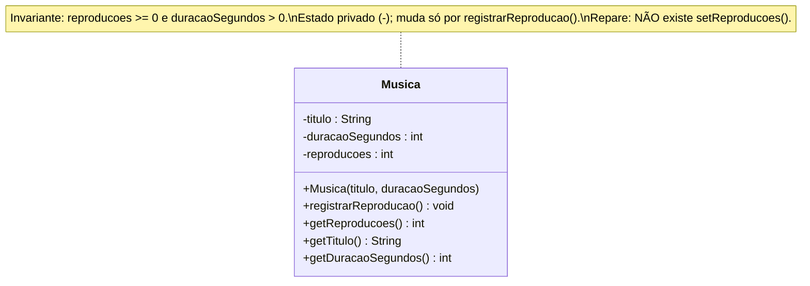

# 2) Encapsulamento — em Java

> **Pilar:** Encapsulamento · **Domínio:** streaming Melodia
> Resposta ao exercício: *"Complete a `Musica` **protegendo o estado**: `reproducoes` deve ser
> privado e só mudar por uma operação que valida. Escreva o **invariante**."*

## 🎯 O que foi feito

- Todos os atributos de `Musica` são **`private`** — inalcançáveis de fora.
- O construtor **valida na entrada** (*fail fast*): título obrigatório e duração positiva; um
  objeto inválido **nem chega a existir**.
- `reproducoes` só muda por **`registrarReproducao()`** (a única "porta"). **Não existe**
  `setReproducoes()` — mudar o contador de fora é impossível.
- Um `DemoEncapsulamento` mostra o uso correto e a tentativa de fraude que **nem compila**.

## 🗺️ Diagrama de classes



*`-` em todo atributo = privado; os `+` são a interface pública controlada.*

## 📄 Explicação de cada classe

| Classe | Papel | Destaques |
|--------|-------|-----------|
| **`Musica`** | O objeto que **protege o próprio estado**. | `titulo`, `duracaoSegundos`, `reproducoes` são `private`. `registrarReproducao()` incrementa de 1 em 1 (única escrita). Getters expõem **leitura**, nunca escrita arbitrária. |
| **`DemoEncapsulamento`** | `main` de demonstração. | Usa a "porta da frente"; mostra (comentada) a linha `m.reproducoes = 1_000_000;` que gera **erro de compilação**; e captura a exceção do objeto inválido. |

> **Invariante (Meyer, 1997):** condição que vale **sempre** para qualquer objeto observável de
> fora — aqui, `reproducoes >= 0` e `duracaoSegundos > 0`. O encapsulamento é o que torna o
> estado inválido **inalcançável**.

## 💻 O código, passo a passo

> Ordem de leitura: primeiro a classe que **protege o estado** (`Musica`), depois o `main` que
> a exercita — inclusive a tentativa de fraude que **não compila**.

### Passo 1 — `Musica.java` (o estado blindado)

```java
public class Musica {
    // ESTADO PRIVADO (-): ninguém mexe direto. É o coração do pilar.
    private final String titulo;
    private final int duracaoSegundos;
    private int reproducoes;             // alimenta ranking e royalties

    public Musica(String titulo, int duracaoSegundos) {
        if (titulo == null || titulo.isBlank())
            throw new IllegalArgumentException("Título é obrigatório.");
        if (duracaoSegundos <= 0)        // fail fast: rejeita na ENTRADA
            throw new IllegalArgumentException(
                "Duração deve ser positiva; veio " + duracaoSegundos);
        this.titulo = titulo;
        this.duracaoSegundos = duracaoSegundos;
        this.reproducoes = 0;            // nasce coerente com o invariante
    }

    // ÚNICA porta para mudar o estado
    public void registrarReproducao() { reproducoes++; }

    // getters expõem LEITURA, não escrita arbitrária
    public String getTitulo() { return titulo; }
    public int getDuracaoSegundos() { return duracaoSegundos; }
    public int getReproducoes() { return reproducoes; }
    // repare: NÃO existe setReproducoes(int)
}
```

**Explicação, ponto a ponto:**
- `private` em **todos** os atributos → são **inalcançáveis de fora**. É o `-` da UML e a essência do encapsulamento.
- **Validação no construtor** (*fail fast*, Meyer) → um objeto inválido **nem chega a existir**; o erro é recusado na entrada, não "depois que corrompeu o ranking".
- `reproducoes = 0` no construtor → o objeto **nasce coerente** com o invariante (`reproducoes >= 0`).
- `registrarReproducao()` → a **única** operação que escreve `reproducoes`, e só faz `++` (sempre para cima).
- **Getters sem setter** → expõem leitura, nunca escrita direta. Ausência proposital de `setReproducoes(int)` — um setter cego destruiria a proteção (a "classe anêmica" de Fowler).

### Passo 2 — `DemoEncapsulamento.java` (o estado protegido na prática)

```java
public class DemoEncapsulamento {
    public static void main(String[] args) {
        Musica m = new Musica("Aquarela do Brasil", 235);

        // uso correto: pela "porta da frente"
        m.registrarReproducao();
        m.registrarReproducao();
        m.registrarReproducao();
        System.out.println(m.getTitulo() + " -> " + m.getReproducoes() + " reproduções");

        // TENTATIVA DE FRAUDE (descomente para ver o compilador RECUSAR):
        //     m.reproducoes = 1_000_000;   // erro: reproducoes has private access

        // objeto inválido: barrado na ENTRADA
        try {
            new Musica("Faixa quebrada", -5);
        } catch (IllegalArgumentException e) {
            System.out.println("Objeto inválido rejeitado: " + e.getMessage());
        }
    }
}
```

**Explicação, ponto a ponto:**
- As três chamadas a `registrarReproducao()` são a **única** forma de o contador crescer.
- A linha comentada `m.reproducoes = 1_000_000;` **não compila** — a proteção é do **compilador**, não da disciplina de quem usa.
- O `try/catch` mostra o **fail fast**: criar `Musica("...", -5)` lança exceção; o estado inválido nunca se forma.

## ▶️ Como rodar (Java 17+)

```bash
javac *.java
java DemoEncapsulamento
```

Saída esperada:

```
Aquarela do Brasil -> 3 reproduções
Objeto inválido rejeitado: Duração deve ser positiva; veio -5
```

> 🧪 **Experimento:** descomente `m.reproducoes = 1_000_000;` em `DemoEncapsulamento.java` e
> tente compilar. O compilador recusa (`reproducoes has private access in Musica`) — é o
> encapsulamento protegendo o invariante.

## 📚 Fundamentação

> *"Cada módulo esconde uma decisão de projeto."* — **Parnas** (1972), sobre **ocultamento de
> informação**. Invariantes de classe em **Meyer** (*Object-Oriented Software Construction*,
> 1997). Evite a **classe anêmica** (só dados, sem regras) — crítica de **Fowler**.

---

[⬅️ Abstração](../01-abstracao/README.md) · [Voltar](../README.md) · [Herança ➡️](../03-heranca/README.md)
