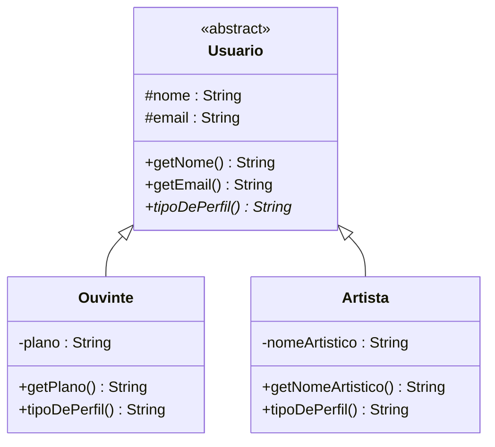

# 3) Herança — em Java

> **Pilar:** Herança · **Domínio:** streaming Melodia
> Resposta ao exercício: *"Modele `Usuario` (abstrata) como **superclasse** de `Ouvinte` e
> `Artista`. Herde `nome`/`email` **uma única vez**; cada subtipo acrescenta o que é seu."*

## 🎯 O que foi feito

- Criada a **superclasse abstrata `Usuario`** com o estado comum (`nome`, `email`) e a
  validação deles **num só lugar**.
- `Ouvinte` e `Artista` **estendem** `Usuario` (o teste **"é-um"** passa), reaproveitam o
  construtor via `super(...)` e concretizam `tipoDePerfil()`.
- Um `DemoHeranca` demonstra a **substituição (LSP)**: um método que recebe `Usuario` funciona
  com qualquer subtipo.

## 🗺️ Diagrama de classes



*`#` = protegido (subclasses enxergam); `<|--` = herança (triângulo vazio) apontando para a
superclasse.*

## 📄 Explicação de cada classe

| Classe | Papel | Destaques |
|--------|-------|-----------|
| **`Usuario`** | Superclasse **abstrata**. | `nome`/`email` são `#` (protegidos) e validados no construtor — escritos **uma vez**. Declara `tipoDePerfil()` abstrato. |
| **`Ouvinte`** | Subtipo: **é um** `Usuario`. | Acrescenta `plano`; chama `super(nome, email)`; concretiza `tipoDePerfil()`. |
| **`Artista`** | Subtipo: **é um** `Usuario`. | Acrescenta `nomeArtistico`; não repete `nome`/`email`. |
| **`DemoHeranca`** | `main` de demonstração. | `exibirCartao(Usuario)` só conhece a base e aceita qualquer subtipo (LSP). |

> **Cuidado (Bloch):** herança é acoplamento forte — só use no **"é-um"** real. Para "tem-um",
> prefira **composição**. Aqui `Ouvinte`/`Artista` **são** `Usuario`, então a herança é legítima.

## 💻 O código, passo a passo

> Ordem de leitura: a **superclasse** primeiro (o que é comum), depois os **subtipos** que a
> especializam e, por fim, o `main` que demonstra a substituição (LSP).

### Passo 1 — `Usuario.java` (a superclasse abstrata)

```java
public abstract class Usuario {
    // estado COMUM, declarado UMA vez (# = protegido: subclasses enxergam)
    protected final String nome;
    protected final String email;

    protected Usuario(String nome, String email) {
        if (nome == null || nome.isBlank())
            throw new IllegalArgumentException("Nome é obrigatório.");
        if (email == null || !email.contains("@"))
            throw new IllegalArgumentException("E-mail inválido: " + email);
        this.nome = nome;
        this.email = email;
    }

    public String getNome()  { return nome; }   // comportamento comum, herdado
    public String getEmail() { return email; }

    // todo usuário TEM um tipo de perfil, mas o valor depende do subtipo
    public abstract String tipoDePerfil();
}
```

**Explicação, ponto a ponto:**
- `abstract class` → `Usuario` **não se instancia**; existe para ser **especializada**.
- `protected final nome/email` → o estado **comum**, escrito **uma única vez** aqui (não se repete nas subclasses).
- **Validação no construtor** → a regra de `nome`/`email` vive **num só lugar**; corrigir aqui conserta para todos os subtipos.
- `getNome()`/`getEmail()` → comportamento comum **herdado** por todos.
- `public abstract String tipoDePerfil();` → contrato que cada subtipo **deve** concretizar.

### Passo 2 — `Ouvinte.java` e `Artista.java` (os subtipos)

```java
public class Ouvinte extends Usuario {          // Ouvinte É-UM Usuario
    private String plano;                        // "Free" ou "Premium"

    public Ouvinte(String nome, String email, String plano) {
        super(nome, email);                      // herda nome/email + validação
        this.plano = plano;
    }

    public String getPlano() { return plano; }

    @Override public String tipoDePerfil() {     // concretiza o contrato herdado
        return "Ouvinte (" + plano + ")";
    }
}
```

```java
public class Artista extends Usuario {          // Artista É-UM Usuario
    private final String nomeArtistico;

    public Artista(String nome, String email, String nomeArtistico) {
        super(nome, email);                      // nome/email NÃO se repetem aqui
        this.nomeArtistico = nomeArtistico;
    }

    public String getNomeArtistico() { return nomeArtistico; }

    @Override public String tipoDePerfil() {
        return "Artista: " + nomeArtistico;
    }
}
```

**Explicação, ponto a ponto:**
- `extends Usuario` → é a **herança** (`<|--`); vale o teste **"é-um"** (Ouvinte/Artista **são** Usuario).
- `super(nome, email)` → reaproveita o construtor e a **validação** da base; o código comum não é copiado.
- Cada subtipo adiciona **só o seu** (`plano`, `nomeArtistico`).
- `@Override tipoDePerfil()` → cada um concretiza o contrato à sua maneira.

### Passo 3 — `DemoHeranca.java` (reúso e substituição/LSP)

```java
public class DemoHeranca {
    public static void main(String[] args) {
        Usuario u1 = new Ouvinte("Ana Souza", "ana@melodia.com", "Premium");
        Usuario u2 = new Artista("João Lima", "joao@melodia.com", "JL Beats");

        System.out.println(u1.getNome() + " -> " + u1.tipoDePerfil());
        System.out.println(u2.getNome() + " -> " + u2.tipoDePerfil());

        exibirCartao(u1);
        exibirCartao(u2);
    }

    // NÃO conhece Ouvinte nem Artista — só o tipo Usuario (LSP)
    static void exibirCartao(Usuario usuario) {
        System.out.println("  [cartão] " + usuario.getNome()
                + " <" + usuario.getEmail() + ">");
    }
}
```

**Explicação, ponto a ponto:**
- As variáveis são do tipo **`Usuario`** (a base), mas apontam para objetos de subtipos.
- `getNome()`/`getEmail()` vêm da **base** (herdados); `tipoDePerfil()` é o do **subtipo**.
- `exibirCartao(Usuario)` aceita **qualquer** subtipo, presente ou futuro — é o **Princípio da Substituição de Liskov (LSP)**.

## ▶️ Como rodar (Java 17+)

```bash
javac *.java
java DemoHeranca
```

Saída esperada:

```
Ana Souza -> Ouvinte (Premium)
João Lima -> Artista: JL Beats
  [cartão] Ana Souza <ana@melodia.com>
  [cartão] João Lima <joao@melodia.com>
```

## 📚 Fundamentação

> *"A subclasse especializa a superclasse."* — **Booch** (1994). A troca segura de um subtipo
> onde se espera a base é o **Princípio da Substituição de Liskov (LSP)** (Liskov, 1994).
> *"Favoreça composição em vez de herança."* — **Bloch**, *Effective Java*.

---

[⬅️ Encapsulamento](../02-encapsulamento/README.md) · [Voltar](../README.md) · [Polimorfismo ➡️](../04-polimorfismo/README.md)
