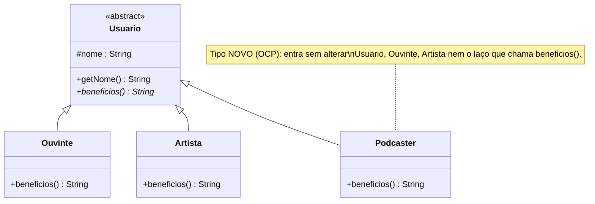

# 4) Polimorfismo — em Java

> **Pilar:** Polimorfismo · **Domínio:** streaming Melodia
> Resposta ao exercício: *"A mesma operação `beneficios()` deve responder diferente por tipo.
> Depois, acrescente um tipo **novo** (`Podcaster`) **sem alterar** o código que já chama
> `beneficios()`."*

## 🎯 O que foi feito

- `Usuario` declara `beneficios()` **abstrata** (um contrato).
- `Ouvinte`, `Artista` e `Podcaster` **redefinem** `beneficios()` — a **mesma mensagem**,
  respostas diferentes (**ligação dinâmica**).
- `Podcaster` é o **tipo novo**: entrou **sem tocar** em nenhuma classe existente (princípio
  **Aberto/Fechado — OCP**).
- Um `DemoPolimorfismo` contrasta o jeito **polimórfico** (bom) com o **`if` de tipo**
  (anti-exemplo) — que erra o tipo novo.

## 🗺️ Diagrama de classes



*A operação `beneficios()` é abstrata na base (o `*`) e **redefinida** em cada subclasse — é
assim que o polimorfismo aparece no diagrama.*

## 📄 Explicação de cada classe

| Classe | Papel | Destaques |
|--------|-------|-----------|
| **`Usuario`** | Base abstrata: **o contrato**. | Declara `beneficios()` sem implementar. |
| **`Ouvinte`** | Implementação do contrato. | `beneficios()` → *"streaming ilimitado e playlists"*. |
| **`Artista`** | Implementação do contrato. | `beneficios()` → *"publicar álbuns e receber royalties"*. |
| **`Podcaster`** | **Tipo novo** (extensão). | `beneficios()` → *"publicar episódios e ver audiência"*. Prova do **OCP**. |
| **`DemoPolimorfismo`** | `main` de demonstração. | `relatorio(...)` (bom, sem `if`) × `relatorioRuim(...)` (com `instanceof`, que esquece o `Podcaster`). |

> **Ligação dinâmica:** a JVM decide, em tempo de execução, qual `beneficios()` chamar olhando
> o **tipo real** do objeto — não o tipo da variável. Quem chama não sabe (nem precisa) o
> concreto.

## 💻 O código, passo a passo

> Ordem de leitura: o **contrato** (base abstrata), as **implementações** por tipo, o **tipo
> novo** que prova o OCP e, por fim, o `main` que contrasta o jeito bom com o anti-exemplo.

### Passo 1 — `Usuario.java` (o contrato)

```java
public abstract class Usuario {
    protected final String nome;

    protected Usuario(String nome) { this.nome = nome; }

    public String getNome() { return nome; }

    // UM contrato, VÁRIAS implementações (uma por subtipo)
    public abstract String beneficios();
}
```

**Explicação, ponto a ponto:**
- `abstract String beneficios();` → declara **o quê** (o contrato), sem dizer **como**.
- Quem chamar `usuario.beneficios()` **não precisa saber** o tipo concreto.

### Passo 2 — `Ouvinte.java`, `Artista.java` (as implementações)

```java
public class Ouvinte extends Usuario {
    public Ouvinte(String nome) { super(nome); }

    @Override public String beneficios() {          // resposta própria do ouvinte
        return "streaming ilimitado e playlists";
    }
}
```

```java
public class Artista extends Usuario {
    public Artista(String nome) { super(nome); }

    @Override public String beneficios() {
        return "publicar álbuns e receber royalties";
    }
}
```

**Explicação, ponto a ponto:**
- Cada subtipo **redefine** (`@Override`) `beneficios()` → a **mesma mensagem**, respostas diferentes.
- No diagrama, é a operação abstrata da base **redefinida** em cada subclasse.

### Passo 3 — `Podcaster.java` (o tipo novo — prova do OCP)

```java
public class Podcaster extends Usuario {           // tipo NOVO
    public Podcaster(String nome) { super(nome); }

    @Override public String beneficios() {
        return "publicar episódios e ver estatísticas de audiência";
    }
}
```

**Explicação, ponto a ponto:**
- Para a Melodia ganhar podcasters, bastou **criar esta classe**.
- **Não** foi preciso tocar em `Usuario`, `Ouvinte`, `Artista` nem no laço que chama `beneficios()` → **Aberto/Fechado (OCP)**: aberto para extensão, fechado para modificação.

### Passo 4 — `DemoPolimorfismo.java` (o bom × o anti-exemplo)

```java
import java.util.List;

public class DemoPolimorfismo {
    public static void main(String[] args) {
        List<Usuario> usuarios = List.of(
                new Ouvinte("Ana"),
                new Artista("João"),
                new Podcaster("Marina")     // o tipo NOVO entra sem quebrar nada
        );

        System.out.println("=== Jeito polimórfico (recomendado) ===");
        relatorio(usuarios);

        System.out.println("\n=== Jeito com 'if de tipo' (anti-exemplo) ===");
        relatorioRuim(usuarios);
    }

    // BOM: sem "if de tipo"; a ligação dinâmica escolhe a implementação certa
    static void relatorio(List<Usuario> usuarios) {
        for (Usuario u : usuarios)
            System.out.println("  " + u.getNome() + " tem direito a: " + u.beneficios());
    }

    // RUIM: a cada tipo novo, alguém precisa voltar aqui e acrescentar um else if
    static void relatorioRuim(List<Usuario> usuarios) {
        for (Usuario u : usuarios) {
            String b;
            if (u instanceof Ouvinte)      b = "streaming ilimitado e playlists";
            else if (u instanceof Artista) b = "publicar álbuns e receber royalties";
            else                           b = "??? (esqueceram de tratar este tipo)";
            System.out.println("  " + u.getNome() + " tem direito a: " + b);
        }
    }
}
```

**Explicação, ponto a ponto:**
- `List<Usuario>` mistura os três tipos; o `for` os trata pelo **tipo genérico**.
- `relatorio(...)` chama `u.beneficios()` → a **JVM decide em execução** qual método rodar (**ligação dinâmica**). Um tipo novo **não** obriga a mudar este método.
- `relatorioRuim(...)` usa `instanceof` → a cada tipo novo é preciso **editar** a cascata; o `Podcaster` cai no `else` e fica sem benefício — exatamente o **bug** que o polimorfismo elimina.

## ▶️ Como rodar (Java 17+)

```bash
javac *.java
java DemoPolimorfismo
```

Saída esperada:

```
=== Jeito polimórfico (recomendado) ===
  Ana tem direito a: streaming ilimitado e playlists
  João tem direito a: publicar álbuns e receber royalties
  Marina tem direito a: publicar episódios e ver estatísticas de audiência

=== Jeito com 'if de tipo' (anti-exemplo) ===
  Ana tem direito a: streaming ilimitado e playlists
  João tem direito a: publicar álbuns e receber royalties
  Marina tem direito a: ??? (esqueceram de tratar este tipo)
```

> Repare: o **mesmo** `Podcaster` funciona no jeito polimórfico e **falha** no `if` de tipo —
> a dor que o polimorfismo elimina.

## 📚 Fundamentação

> *"Uma mesma operação sobre tipos diferentes."* — **Cardelli & Wegner** (1985). Adicionar um
> tipo por **extensão** (classe nova), sem **modificar** o existente, é o **Princípio
> Aberto/Fechado (OCP)** de **R. C. Martin**.

---

[⬅️ Herança](../03-heranca/README.md) · [Voltar](../README.md)
