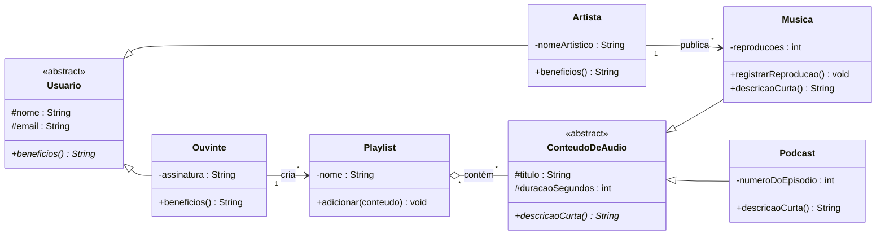
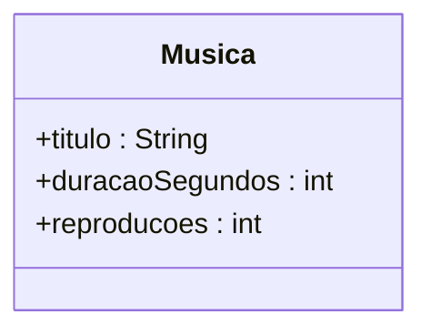
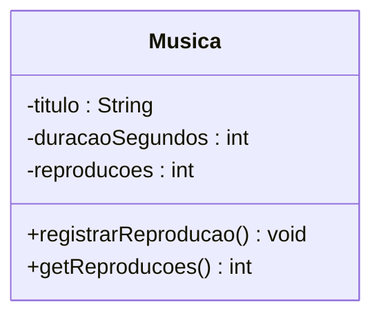
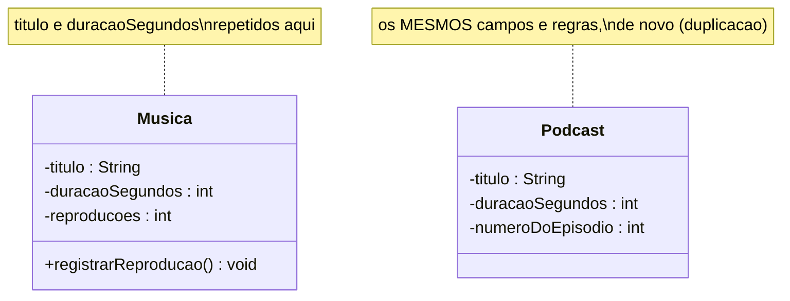
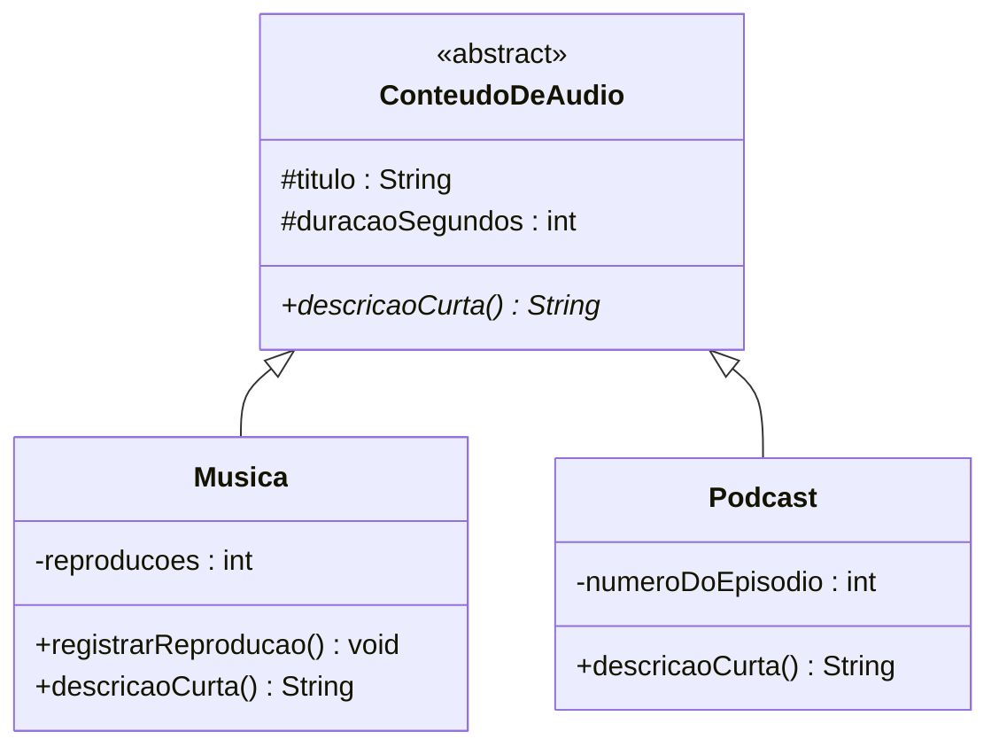
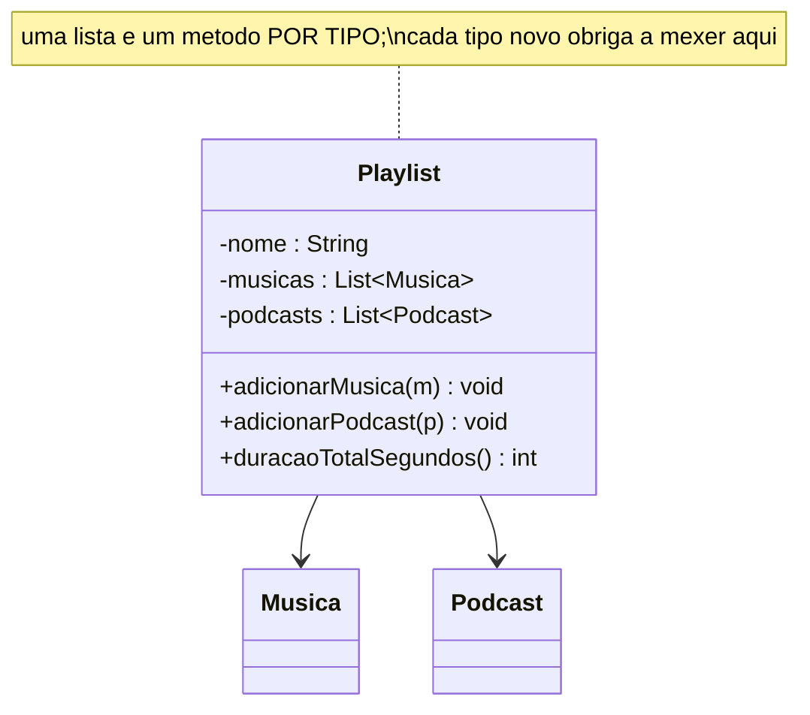
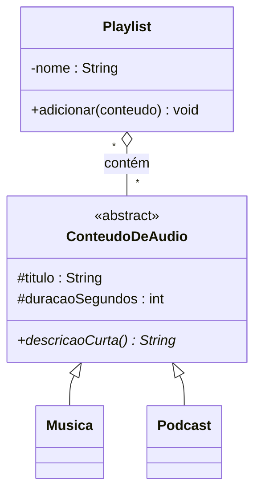
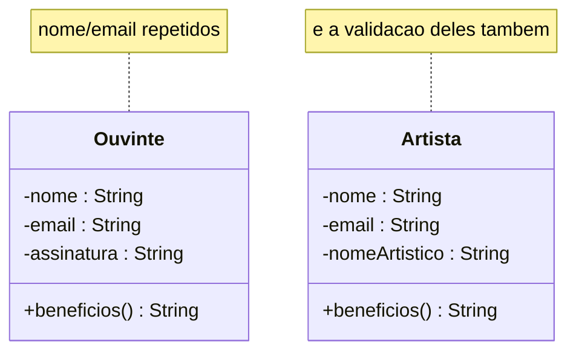

# 🏗️ Construindo o diagrama do Melodia — passo a passo, em Java

> **O que é esta aula.** Vamos **construir o diagrama de classes do Melodia do zero**: começamos
> com **uma única classe** e, a cada passo, aplicamos **um pilar da OO** — mostrando o **código
> Java completo**, **por que** o conceito é necessário e **quais anomalias** aparecem se ele
> **não** for usado. No fim, chegamos exatamente ao diagrama que aparece na apresentação.
>
> 🎞️ **Onde este diagrama está na apresentação:** ele é o diagrama-mapa do
> [`apresentacao-pilares-oo.pptx`](../apresentacao-pilares-oo.pptx) — **slide 3** ("O domínio em
> um diagrama") e **slide 8** ("Lendo o diagrama inteiro"); nos **slides 4–7** ele reaparece com
> **um pilar aceso por vez**. Esta aula é a versão em **código** daquele mapa.

## 🎯 Onde queremos chegar (o diagrama final)



> Não vamos desenhar tudo de uma vez. Cada passo abaixo **acrescenta uma peça** — e explica o
> **problema real** que a peça resolve.

---

## Passo 1 — Uma classe crua (o ponto de partida)

Começamos do jeito mais ingênuo possível: uma `Musica` com **campos públicos**.

```java
public class Musica {
    public String titulo;
    public int duracaoSegundos;
    public int reproducoes;
}
```



### ⚠️ A dor (anomalia se ficarmos assim)
Qualquer parte do sistema pode escrever qualquer coisa nesses campos:

```java
Musica m = new Musica();
m.duracaoSegundos = -5;         // duração negativa: passou batido
m.reproducoes = 1_000_000;      // alguém "turbinou" o ranking na mão
```

- **Estado inválido** (duração negativa) entra no sistema sem ninguém barrar.
- O contador de `reproducoes` — que vira **royalties e ranking** — pode ser adulterado de
  qualquer tela. O *bug de uma pessoa vira incidente de todos*.

Isso pede o primeiro pilar.

---

## Passo 2 — Encapsulamento: proteger o estado

**Conceito:** tornar os atributos **privados** e só permitir mudanças por **operações que
validam**. A regra que deve valer sempre é o **invariante** (`reproducoes >= 0`,
`duracaoSegundos > 0`).

```java
public class Musica {
    private final String titulo;
    private final int duracaoSegundos;
    private int reproducoes;

    public Musica(String titulo, int duracaoSegundos) {
        if (titulo == null || titulo.isBlank())
            throw new IllegalArgumentException("Título é obrigatório.");
        if (duracaoSegundos <= 0)                 // fail fast: rejeita na ENTRADA
            throw new IllegalArgumentException("Duração deve ser positiva.");
        this.titulo = titulo;
        this.duracaoSegundos = duracaoSegundos;
        this.reproducoes = 0;                     // nasce coerente
    }

    public void registrarReproducao() { reproducoes++; }   // única porta de escrita
    public int getReproducoes() { return reproducoes; }
    public String getTitulo() { return titulo; }
    public int getDuracaoSegundos() { return duracaoSegundos; }
    // repare: NÃO existe setReproducoes(int)
}
```



### ✅ Por que precisa
- O estado inválido fica **impossível**: `m.reproducoes = 999` **não compila** (campo privado).
- A validação mora **num lugar só** (o construtor); ninguém "esquece" de validar.

### ⚠️ Anomalias se não aplicar
- Saldos/contadores corrompidos em produção; ranking e royalties errados.
- Cada tela reimplementa (ou esquece) a validação → regras divergentes.
- A **classe anêmica** (só dados, sem comportamento) empurra a regra para fora, espalhando-a.

### 🎞️ Onde aparece na apresentação (modelagem)
- Walkthrough: **slide 5 — "Pilar 2 no mapa — Encapsulamento"** (a `Musica` acesa).
- Texto: [`pilares-oo-modelagem.md` → §2 Encapsulamento](../pilares-oo-modelagem.md#2-encapsulamento).
- Notação: `-` privado, `+` público, `#` protegido. Detalhe em [`02-encapsulamento/`](02-encapsulamento/README.md).

---

## Passo 3 — Abstração + Herança: chega o Podcast

O Melodia agora tem **podcasts**. A tentação é criar uma classe `Podcast` separada… que
**repete** `titulo` e `duracaoSegundos` (e as regras deles).

### ❌ Antes — a tentativa ingênua (sem abstração)

A saída mais rápida é criar `Podcast` como uma classe **separada**, copiando o que já existe em
`Musica`:

```java
public class Musica {
    private final String titulo;              // <-- igual ao Podcast
    private final int duracaoSegundos;        // <-- igual ao Podcast
    private int reproducoes;
    public Musica(String titulo, int duracaoSegundos) {
        if (titulo == null || titulo.isBlank())       // <-- validação repetida
            throw new IllegalArgumentException("Título é obrigatório.");
        if (duracaoSegundos <= 0)                      // <-- validação repetida
            throw new IllegalArgumentException("Duração deve ser positiva.");
        this.titulo = titulo; this.duracaoSegundos = duracaoSegundos; this.reproducoes = 0;
    }
    /* ... */
}

public class Podcast {
    private final String titulo;              // <-- MESMO campo, de novo
    private final int duracaoSegundos;        // <-- MESMO campo, de novo
    private final int numeroDoEpisodio;
    public Podcast(String titulo, int duracaoSegundos, int numeroDoEpisodio) {
        if (titulo == null || titulo.isBlank())       // <-- MESMA validação, copiada
            throw new IllegalArgumentException("Título é obrigatório.");
        if (duracaoSegundos <= 0)                      // <-- MESMA validação, copiada
            throw new IllegalArgumentException("Duração deve ser positiva.");
        this.titulo = titulo; this.duracaoSegundos = duracaoSegundos;
        this.numeroDoEpisodio = numeroDoEpisodio;
    }
    /* ... */
}
```



### ⚠️ A dor (por que essa versão é ruim)
`Musica` e `Podcast` têm os **mesmos atributos e a mesma validação**, copiados. Se a regra de
`duracaoSegundos` mudar (por exemplo, passar a exigir no mínimo 5 segundos), você precisa
**lembrar de alterar em todos os lugares** — e um dia vai esquecer um. Cada tipo novo
(audiolivro, rádio…) repete tudo outra vez. É a **duplicação** que os pilares eliminam.

**Conceito — Abstração (generalização):** extrair o **essencial comum** para uma **classe
abstrata** `ConteudoDeAudio`. **Conceito — Herança:** `Musica` e `Podcast` **são** conteúdos de
áudio (`extends`), herdam o comum e acrescentam só o que é seu.

### ✅ Depois — com abstração + herança

```java
public abstract class ConteudoDeAudio {
    protected final String titulo;            // # protegido: subclasses enxergam
    protected final int duracaoSegundos;

    protected ConteudoDeAudio(String titulo, int duracaoSegundos) {
        if (titulo == null || titulo.isBlank())
            throw new IllegalArgumentException("Título é obrigatório.");
        if (duracaoSegundos <= 0)
            throw new IllegalArgumentException("Duração deve ser positiva.");
        this.titulo = titulo;
        this.duracaoSegundos = duracaoSegundos;
    }

    public String getTitulo() { return titulo; }
    public int getDuracaoSegundos() { return duracaoSegundos; }
    public String duracaoFormatada() {
        return String.format("%02d:%02d", duracaoSegundos / 60, duracaoSegundos % 60);
    }

    public abstract String descricaoCurta();  // contrato: cada tipo se descreve
}
```

```java
public class Musica extends ConteudoDeAudio {
    private int reproducoes;

    public Musica(String titulo, int duracaoSegundos) {
        super(titulo, duracaoSegundos);       // reusa a validação da base
        this.reproducoes = 0;
    }
    public void registrarReproducao() { reproducoes++; }
    public int getReproducoes() { return reproducoes; }

    @Override public String descricaoCurta() { return "Música"; }
}
```

```java
public class Podcast extends ConteudoDeAudio {
    private final int numeroDoEpisodio;       // específico do podcast

    public Podcast(String titulo, int duracaoSegundos, int numeroDoEpisodio) {
        super(titulo, duracaoSegundos);
        this.numeroDoEpisodio = numeroDoEpisodio;
    }
    public int getNumeroDoEpisodio() { return numeroDoEpisodio; }

    @Override public String descricaoCurta() { return "Podcast · ep. " + numeroDoEpisodio; }
}
```



### ✅ Por que precisa
- **Abstração:** o comum é escrito **uma vez**; o `numeroDoEpisodio` (só do podcast) fica **de
  fora** da base — abstrair também é saber o que **não** incluir.
- **Herança:** `extends` reaproveita atributos e validação; corrigir a base corrige todos.

### ⚠️ Anomalias se não aplicar
- **Sem abstração/herança:** duplicação de código e de regras; correções feitas pela metade.
- **Herança errada (forçada):** herdar só para "reaproveitar" quando o *"é um"* não é verdade
  engessa o modelo. Regra: **só herde no "é um" real** (senão, use composição).

### 🎞️ Onde aparece na apresentação (modelagem)
- Walkthrough: **slide 4 — "Pilar 1 no mapa — Abstração"** e **slide 6 — "Pilar 3 no mapa —
  Herança"** (o triângulo vazio ──▷).
- Texto: [§1 Abstração](../pilares-oo-modelagem.md#1-abstração) e [§3 Herança](../pilares-oo-modelagem.md#3-herança).
- Detalhe: [`01-abstracao/`](01-abstracao/README.md) e [`03-heranca/`](03-heranca/README.md).

---

## Passo 4 — Polimorfismo: uma Playlist que aceita tudo

Agora queremos uma **Playlist** que guarde **músicas e podcasts juntos**.

### ❌ Antes — a Playlist ingênua (uma lista por tipo)

Sem usar o tipo abstrato, a saída é ter **uma lista e um método para cada tipo**:

```java
import java.util.ArrayList;
import java.util.List;

public class Playlist {
    private final String nome;
    private final List<Musica> musicas = new ArrayList<>();
    private final List<Podcast> podcasts = new ArrayList<>();

    public Playlist(String nome) { this.nome = nome; }

    public void adicionarMusica(Musica m)   { musicas.add(m); }   // um método...
    public void adicionarPodcast(Podcast p) { podcasts.add(p); }  // ...por tipo

    public int duracaoTotalSegundos() {
        int total = 0;
        for (Musica m : musicas)   total += m.getDuracaoSegundos();   // varre uma lista...
        for (Podcast p : podcasts) total += p.getDuracaoSegundos();   // ...e a outra
        return total;
    }
}
```



### ⚠️ A dor (por que essa versão é ruim)
Cada **tipo novo** de conteúdo (audiolivro, rádio…) obriga a criar **mais uma lista**, **mais
um** `adicionarXxx()` e **mais um laço** em `duracaoTotalSegundos()`. A classe cresce,
fica **repetitiva** e é fácil esquecer de atualizar um dos pontos — a `Playlist` precisa
"conhecer" todos os tipos concretos.

**Conceito — Polimorfismo:** como `Musica` e `Podcast` **são** `ConteudoDeAudio`, a `Playlist`
guarda o **tipo abstrato** e trata todos pela mesma interface. A operação `descricaoCurta()`,
abstrata na base, é **redefinida** em cada tipo — a **mesma chamada**, respostas diferentes.

### ✅ Depois — uma lista só, do tipo abstrato

```java
import java.util.ArrayList;
import java.util.List;

public class Playlist {
    private final String nome;
    private final List<ConteudoDeAudio> itens = new ArrayList<>();  // o TIPO ABSTRATO

    public Playlist(String nome) { this.nome = nome; }

    public void adicionar(ConteudoDeAudio conteudo) { itens.add(conteudo); } // aceita os dois

    public String getNome() { return nome; }
    public List<ConteudoDeAudio> getItens() { return List.copyOf(itens); }

    public int duracaoTotalSegundos() {
        int total = 0;
        for (ConteudoDeAudio c : itens) total += c.getDuracaoSegundos();
        return total;
    }
}
```

Uso (repare: **nenhum `if` de tipo**):

```java
Playlist favoritas = new Playlist("Favoritas");
favoritas.adicionar(new Musica("Garota de Ipanema", 200));
favoritas.adicionar(new Podcast("Ep. da Melodia", 1620, 12));

for (ConteudoDeAudio c : favoritas.getItens())
    System.out.println(c.descricaoCurta());   // "Música" ou "Podcast · ep. 12"
```



> O losango **vazio ◇** ("contém") é **agregação**: os conteúdos **existem sozinhos** (no
> catálogo) e podem estar em **várias** playlists. Não é composição (losango cheio), senão apagar
> a playlist apagaria a música do catálogo.

### ✅ Por que precisa
- Um **tipo novo** de conteúdo (ex.: `Audiolivro`) entra na playlist **sem alterar** a
  `Playlist` nem o laço — isso é o princípio **Aberto/Fechado**.

### ⚠️ Anomalias se não aplicar
- Sem polimorfismo, a `Playlist` teria listas separadas e o código encheria de
  `if (é musica) … else if (é podcast) …`, repetido e frágil; **cada tipo novo** obrigaria a
  editar todos esses `if`s (e esquecer um vira bug).

### 🎞️ Onde aparece na apresentação (modelagem)
- Walkthrough: **slide 7 — "Pilar 4 no mapa — Polimorfismo"**.
- Texto: [§4 Polimorfismo](../pilares-oo-modelagem.md#4-polimorfismo). Agregação/associação:
  [aula 02 — relacionamentos](../../02-conceitos-orientacao-objetos/exercicios-relacionamentos-oo.md).
- Detalhe: [`04-polimorfismo/`](04-polimorfismo/README.md).

---

## Passo 5 — A segunda hierarquia: Usuario, Ouvinte, Artista

Faltam as pessoas. `Ouvinte` e `Artista` compartilham `nome`/`email`.

### ❌ Antes — Ouvinte e Artista como classes soltas

Sem generalizar, cada um repete `nome`/`email` **e** a validação deles:

```java
public class Ouvinte {
    private final String nome;                 // <-- repetido no Artista
    private final String email;                // <-- repetido no Artista
    private final String assinatura;
    public Ouvinte(String nome, String email, String assinatura) {
        if (nome == null || nome.isBlank())            // <-- validação repetida
            throw new IllegalArgumentException("Nome é obrigatório.");
        if (email == null || !email.contains("@"))     // <-- validação repetida
            throw new IllegalArgumentException("E-mail inválido: " + email);
        this.nome = nome; this.email = email; this.assinatura = assinatura;
    }
    public String beneficios() { return "streaming ilimitado e playlists"; }
}

public class Artista {
    private final String nome;                 // <-- MESMO campo, de novo
    private final String email;                // <-- MESMO campo, de novo
    private final String nomeArtistico;
    public Artista(String nome, String email, String nomeArtistico) {
        if (nome == null || nome.isBlank())            // <-- MESMA validação, copiada
            throw new IllegalArgumentException("Nome é obrigatório.");
        if (email == null || !email.contains("@"))     // <-- MESMA validação, copiada
            throw new IllegalArgumentException("E-mail inválido: " + email);
        this.nome = nome; this.email = email; this.nomeArtistico = nomeArtistico;
    }
    public String beneficios() { return "publicar álbuns e receber royalties"; }
}
```



### ⚠️ A dor (por que essa versão é ruim)
`nome`/`email` e sua validação estão **duplicados**. Além disso, para tratar "um usuário
qualquer" (ex.: uma lista com ouvintes **e** artistas), não há um **tipo comum** — o código
acabaria com `if (é ouvinte) … else if (é artista) …`. Os **mesmos pilares** resolvem: **abstração**
(`Usuario` abstrata), **herança** (`extends`), **encapsulamento** (atributos privados) e
**polimorfismo** (`beneficios()`). E surgem as **associações**: o ouvinte **cria** playlists; o
artista **publica** músicas.

### ✅ Depois — com a superclasse abstrata Usuario

```java
public abstract class Usuario {
    protected final String nome;
    protected final String email;

    protected Usuario(String nome, String email) {
        if (nome == null || nome.isBlank())
            throw new IllegalArgumentException("Nome é obrigatório.");
        if (email == null || !email.contains("@"))
            throw new IllegalArgumentException("E-mail inválido: " + email);
        this.nome = nome;
        this.email = email;
    }
    public String getNome() { return nome; }
    public String getEmail() { return email; }

    public abstract String beneficios();       // polimórfico
}
```

```java
import java.util.ArrayList;
import java.util.List;

public class Ouvinte extends Usuario {
    private final String assinatura;
    private final List<Playlist> playlists = new ArrayList<>();

    public Ouvinte(String nome, String email, String assinatura) {
        super(nome, email);
        this.assinatura = assinatura;
    }
    public Playlist criarPlaylist(String nome) {   // associação Ouvinte --> Playlist
        Playlist p = new Playlist(nome);
        playlists.add(p);
        return p;
    }
    public List<Playlist> getPlaylists() { return List.copyOf(playlists); }

    @Override public String beneficios() { return "streaming ilimitado e playlists"; }
}
```

```java
import java.util.ArrayList;
import java.util.List;

public class Artista extends Usuario {
    private final String nomeArtistico;
    private final List<Musica> publicadas = new ArrayList<>();

    public Artista(String nome, String email, String nomeArtistico) {
        super(nome, email);
        this.nomeArtistico = nomeArtistico;
    }
    public Musica publicar(String titulo, int duracaoSegundos) {  // associação Artista --> Musica
        Musica m = new Musica(titulo, duracaoSegundos);
        publicadas.add(m);
        return m;
    }
    public List<Musica> getPublicadas() { return List.copyOf(publicadas); }

    @Override public String beneficios() { return "publicar álbuns e receber royalties"; }
}
```

### ✅ Por que precisa
- Os **mesmos quatro pilares** organizam também as pessoas: um contrato (`beneficios()`), várias
  respostas; `nome`/`email` escritos uma vez; estado protegido.

### ⚠️ Anomalias se não aplicar
- Duplicar `nome`/`email` em `Ouvinte` e `Artista`; tratar tipos de usuário com `if` espalhado;
  regras de validação divergentes entre as duas classes.

### 🎞️ Onde aparece na apresentação (modelagem)
- Os **slides 4–7** (walkthrough) usam exatamente `Usuario → Ouvinte/Artista` como exemplo.
- Texto: [`pilares-oo-modelagem.md`](../pilares-oo-modelagem.md) (as quatro seções).

---

## Passo 6 — O diagrama completo

Juntando tudo, chegamos ao diagrama do começo desta aula (o mesmo dos slides 3 e 8):


### 🧭 Onde cada pilar está neste diagrama (resumo)

| Pilar | No diagrama | No código |
|-------|-------------|-----------|
| **Abstração** | `Usuario` e `ConteudoDeAudio` em «abstract» (itálico) | `abstract class`, método `abstract` |
| **Encapsulamento** | atributos `-` (ex.: `-reproducoes`); acesso por `+` | `private` + validação + operação, sem setter cego |
| **Herança** | linhas `──▷` (Ouvinte/Artista → Usuario; Musica/Podcast → ConteudoDeAudio) | `extends`, `super(...)`, `protected` |
| **Polimorfismo** | `beneficios()*` e `descricaoCurta()*` redefinidos por subtipo | `@Override` + ligação dinâmica |
| *(relacionamento)* | `-->` associação (publica/cria); `◇` agregação (contém) | listas de referências (`List<...>`) |

## ▶️ Rodar o código completo

O diagrama final está implementado e **compila/roda** em [`05-diagrama-completo/`](05-diagrama-completo/):

```bash
cd 05-diagrama-completo
javac *.java
java DemoMelodia
```

Saída esperada:

```
Playlist 'Favoritas' (30 min):
  - [Música] Garota de Ipanema (03:20)
  - [Podcast · ep. 12] Como funciona a Melodia (27:00)

Benefícios por tipo de usuário (polimorfismo):
  Ana Souza: streaming ilimitado e playlists
  Tom Jobim: publicar álbuns e receber royalties

Garota de Ipanema -> 2 reproduções
```

## 📚 Referências (autores citados)

- **Booch (1994)** — abstração e herança (generalização/especialização).
- **Parnas (1972)** — ocultamento de informação (encapsulamento).
- **Meyer (1997)** — invariantes de classe; *fail fast*.
- **Liskov (1994)** — Princípio da Substituição (LSP).
- **Cardelli & Wegner (1985)** — polimorfismo.
- **R. C. Martin** — Princípio Aberto/Fechado (OCP).
- **Bloch**, *Effective Java* — classe abstrata × interface; composição × herança.

---

[⬅️ Voltar para os exemplos](README.md) · [🎞️ Apresentação dos pilares](../apresentacao-pilares-oo.pptx) · [📐 Pilares em modelagem](../pilares-oo-modelagem.md)
