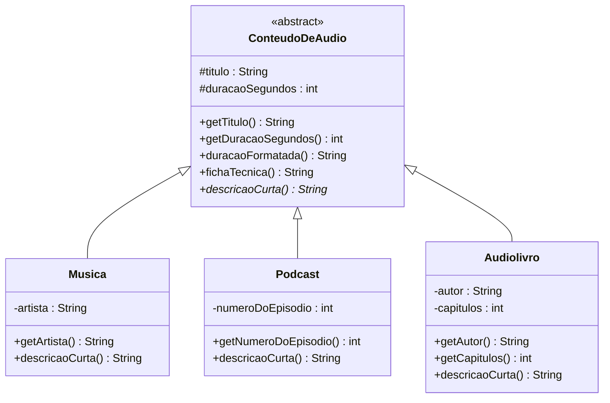
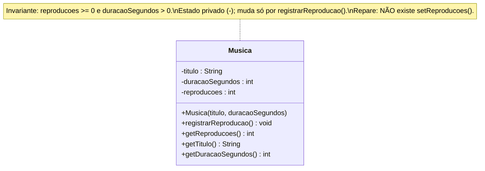
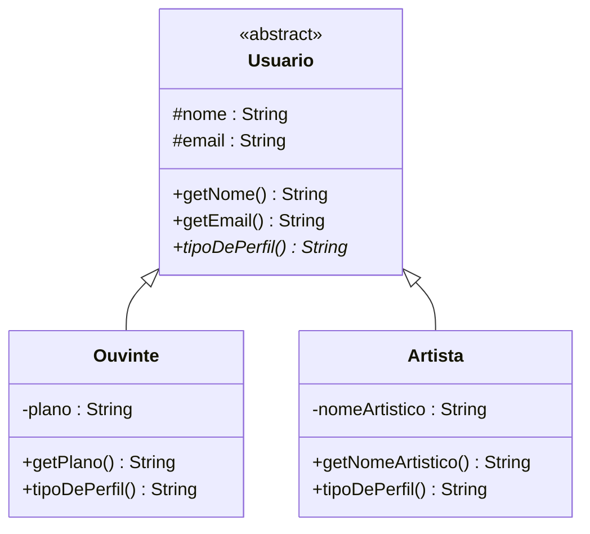
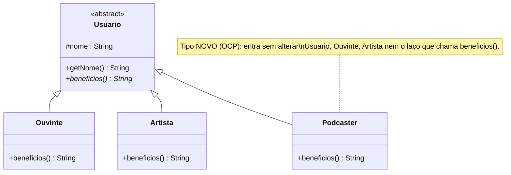

# 🧪 Os quatro pilares da OO — versão prática em Java

> Estes são os arquivos Java que **respondem os exercícios** da apresentação
> [`apresentacao-pilares-oo.pptx`](../apresentacao-pilares-oo.pptx). Cada pasta é a
> **implementação de um pilar**, no mesmo domínio do streaming **Melodia**. O código é
> **muito comentado de propósito** — os comentários são a "aula" (com citações de autores).
>
> 💡 **Como usar em sala:** tente resolver o exercício **na modelagem** (draw.io / no papel)
> primeiro; depois **compare** com o código daqui. Não é para decorar — é para entender
> *por que* cada construção do Java corresponde a um conceito de OO.

## 🏗️ Aula guiada: construindo o diagrama do zero

> 📖 **[AULA-construindo-o-diagrama.md](AULA-construindo-o-diagrama.md)** — a aula que **evolui o
> diagrama do Melodia passo a passo**, de **uma classe** até o **diagrama completo** (o mesmo dos
> slides 3 e 8 da apresentação). A cada passo: um pilar, o **código Java completo**, **por que**
> precisa, **quais anomalias** surgem se não usar e **onde o conceito aparece na apresentação**.
> O código final e executável está em [`05-diagrama-completo/`](05-diagrama-completo/).
>
> 🎯 **[exercicio/](exercicio/)** — o caminho **inverso**: o aluno recebe um **diagrama pronto**
> (outra parte do sistema: **Assinaturas e Planos**) e **escreve o código Java**. O
> [gabarito comentado e executável](exercicio/gabarito/) fica na subpasta (para o professor).
>
> 🎤 **[entrevista-modelagem-melodia.md](entrevista-modelagem-melodia.md)** — uma **entrevista com
> o cliente** (linguagem simples) para o aluno **ler e desenhar o diagrama no draw.io**, cobrindo
> os **4 pilares** e os **3 relacionamentos** (associação, agregação e composição). Traz dicas de
> leitura, critério de "pronto" e **gabarito** recolhível (para o professor).
>
> 🎧 **[entrevista-solucao/](entrevista-solucao/)** — a **resolução** da entrevista: o documento
> [EXPLICANDO-O-DIAGRAMA.md](entrevista-solucao/EXPLICANDO-O-DIAGRAMA.md) monta o diagrama **parte
> por parte** (por que cada classe/herança/relação, e **onde isso aparece na entrevista**), mais a
> **aplicação Java completa** (`AppMelodia`) que o implementa e roda.

## 📁 O que tem em cada pasta

**Cada pasta tem seu próprio `README.md`** com o diagrama de classes, a explicação de cada
classe, o que foi feito, como rodar e as citações. Comece por eles:

| Pasta | Pilar | Ideia central | Construções do Java |
|-------|-------|---------------|---------------------|
| [`01-abstracao`](01-abstracao/README.md) | **Abstração** | `ConteudoDeAudio` generaliza `Musica`/`Podcast`/`Audiolivro` | `abstract class`, método `abstract`, `extends` |
| [`02-encapsulamento`](02-encapsulamento/README.md) | **Encapsulamento** | `Musica` protege `reproducoes` (invariante) | `private`, validação no construtor, getters sem setter |
| [`03-heranca`](03-heranca/README.md) | **Herança** | `Usuario` (abstrata) → `Ouvinte`/`Artista` | `extends`, `super(...)`, `@Override`, `protected` |
| [`04-polimorfismo`](04-polimorfismo/README.md) | **Polimorfismo** | `beneficios()` varia por tipo; `Podcaster` novo (OCP) | ligação dinâmica, `@Override`, anti-exemplo com `instanceof` |
| [`05-diagrama-completo`](05-diagrama-completo/) | **Os 4 juntos** | o diagrama inteiro do Melodia (Usuario/Conteudo/Playlist) | tudo acima + associações (`List<...>`) |

## 🗺️ Os diagramas de classes (visão geral)

Abaixo, os quatro diagramas juntos para uma visão de conjunto — **o detalhamento de cada um
está no README da respectiva pasta** (links na tabela acima). Como ler: nome em *itálico* +
`<<abstract>>` = classe abstrata; operação com `*` no fim = método abstrato; `-` privado, `+`
público, `#` protegido; a linha com **triângulo vazio** `<|--` é a herança (generalização).

### 1) Abstração — `01-abstracao`



> `descricaoCurta()` é abstrata na base (o `*`) e concretizada por cada subtipo.
> `fichaTecnica()` é concreta e chama `descricaoCurta()` — é o *Template Method* em miniatura.

### 2) Encapsulamento — `02-encapsulamento`



> Todos os atributos são `-` (privados). Não há setter para `reproducoes`: a única porta de
> escrita é `registrarReproducao()`, que preserva o invariante.

### 3) Herança — `03-heranca`



> `nome`/`email` (e a validação deles) vivem **uma vez** em `Usuario`. As subclasses só
> acrescentam o que é seu e concretizam `tipoDePerfil()`.

### 4) Polimorfismo — `04-polimorfismo`



> Uma operação (`beneficios()`, abstrata na base), **quatro** implementações. Adicionar
> `Podcaster` não obrigou a mexer no código que chama `beneficios()`.

---

## ▶️ Como compilar e rodar (Java 17+)

Cada pasta é **independente**. Entre em uma delas e rode:

```bash
cd 01-abstracao
javac *.java
java DemoAbstracao
```

Troque o nome do `Demo...` conforme a pasta:

| Pasta | Comando |
|-------|---------|
| `01-abstracao` | `javac *.java && java DemoAbstracao` |
| `02-encapsulamento` | `javac *.java && java DemoEncapsulamento` |
| `03-heranca` | `javac *.java && java DemoHeranca` |
| `04-polimorfismo` | `javac *.java && java DemoPolimorfismo` |
| `05-diagrama-completo` | `javac *.java && java DemoMelodia` |

## 🔍 Experimentos sugeridos (mão na massa)

1. **Encapsulamento:** em `02-encapsulamento/DemoEncapsulamento.java`, **descomente** a linha
   `m.reproducoes = 1_000_000;` e tente compilar. Veja o compilador **recusar** — é o
   encapsulamento protegendo o invariante.
2. **Polimorfismo/OCP:** em `04-polimorfismo`, crie você um tipo novo (ex.: `Curador`),
   estenda `Usuario` e rode de novo `DemoPolimorfismo`. Repare que o método `relatorio(...)`
   **não precisa mudar** — mas o `relatorioRuim(...)` erra o novo tipo. Essa é a diferença.
3. **Abstração — o limite:** tente subir `numeroDoEpisodio` (só do `Podcast`) para
   `ConteudoDeAudio`. Discuta: isso faz sentido para uma `Musica`? (Não — é o que a abstração
   deve **deixar de fora**.)

## 📚 Autores citados no código

- **Booch (1994)** — *Object-Oriented Analysis and Design with Applications* (abstração, herança).
- **Parnas (1972)** — *On the Criteria To Be Used in Decomposing Systems into Modules* (ocultamento de informação).
- **Meyer (1997)** — *Object-Oriented Software Construction* (invariantes, *fail fast*).
- **Cardelli & Wegner (1985)** — *On Understanding Types, Data Abstraction, and Polymorphism*.
- **Liskov (1994)** — Princípio da Substituição (LSP).
- **R. C. Martin** — Princípio Aberto/Fechado (OCP).
- **Bloch** — *Effective Java* (classe abstrata × interface; composição × herança).
- **Fowler** — crítica à *classe anêmica*.
- **GoF (1994)** — *Design Patterns* (Template Method).

---

[⬅️ Voltar para a aula 03 - Abstração](../README.md) · [🎞️ Apresentação dos pilares](../apresentacao-pilares-oo.pptx)
