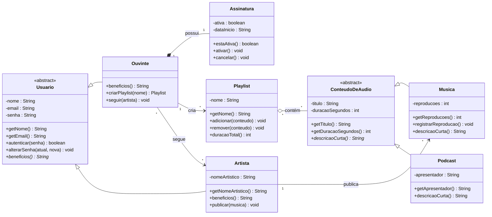

# 🎤 Entrevista para modelar — a MelodIA (desenhe no draw.io)

> **Como funciona este exercício.** Abaixo está uma **conversa** transcrita entre a equipe e o cliente da
> MelodIA (um serviço de streaming de música, tipo Spotify).
> 
> **Leia com atenção** e, a partir do
> que as pessoas dizem, **desenhe um diagrama de classes** no [draw.io](https://app.diagrams.net)
> (ou app.diagrams.net). Não é para programar, mas sim **modelar**.
>
> **Seu diagrama precisa mostrar os quatro pilares da OO e os três tipos de relacionamento**
> (associação, agregação e composição). No fim da página há a **lista do que entregar** e um
> **lembrete da notação**.

---

## 🗣️ Transcrição da entrevista

**Gerente:** Pessoal, vamos organizar o sistema da MelodIA. Vou trazer o cliente pra ele
explicar, do jeito dele, o que o sistema precisa ter. Anotem tudo e depois a gente transforma em
diagrama.

**Cliente:** Então… na MelodIA existem **pessoas** usando o sistema. Mas tem dois tipos bem
diferentes: o **ouvinte**, que é quem escuta, e o **artista**, que é quem publica música. Só que,
no fundo, os dois são **usuários** da plataforma e todo mundo tem **nome**, **e-mail** e **senha**,
e todo mundo faz login do mesmo jeito.

**Dev sênior:** Entendi. Então tem uma parte que é **igual pra todos os usuários** e uma parte que
é **específica** de cada tipo. Guardem isso.

**Cliente:** Isso. E cada tipo tem **vantagens diferentes**. Se eu perguntar pro sistema "quais são
os benefícios desse usuário?", a resposta muda: pro **ouvinte** é "ouvir sem limite e montar
playlists"; pro **artista** é "publicar músicas e receber pelos toques". A **pergunta é a mesma**,
mas **a resposta depende do tipo**.

**Analista de qualidade:** Um ponto sério: a **senha**. Ninguém pode **mexer na senha por fora**,
sair lendo ou trocando de qualquer lugar. Tem que ter um jeito **controlado** de trocar a senha, e
só. O mesmo vale pra qualquer dado sensível. O o objeto tem que **proteger o que é dele**.

**Cliente:** Agora o conteúdo. Na MelodIA toca **música** e também toca **podcast**. São coisas
diferentes, mas têm um monte de coisa em comum: os dois têm **título** e **duração**, e os dois
**sabem se descrever** numa lista. A **música** guarda quantas **reproduções** ela já teve
(isso conta pro ranking e pro pagamento do artista, então é importante e **não pode ser
adulterado** na mão!). Já o **podcast** tem um **apresentador**.

**Dev sênior:** De novo aquele padrão: uma **base comum** ("conteúdo de áudio") e dois tipos que
**aproveitam** essa base e acrescentam o que é só deles. E o "sabe se descrever" muda de um pro
outro e a música se descreve de um jeito, o podcast de outro.

**Cliente:** Exato. Aí tem a **playlist**. O ouvinte **cria** playlists e coloca **músicas e
podcasts juntos** na mesma playlist. Uma coisa importante: as músicas e os podcasts **existem no
catálogo por conta própria**. Se o ouvinte **apagar a playlist**, as músicas **continuam lá** no
catálogo, tocando pra todo mundo. A playlist só **junta** conteúdos que já existem.

**Analista:** Ou seja: a playlist **usa** os conteúdos, mas **não é dona** deles e eles
sobrevivem sem ela.

**Cliente:** Certo. Bem diferente da **assinatura**. Quando um ouvinte se cadastra, ele **ganha
uma assinatura** e ela **nasce junto** com o cadastro do ouvinte e **pertence só a ele**. Se a
conta do ouvinte for **encerrada**, a assinatura dele **deixa de existir** também; não faz sentido
uma assinatura "solta", sem dono. A assinatura guarda se está **ativa** e a **data de início**.

**Dev sênior:** Reparem na diferença: a **playlist** junta coisas que vivem por conta própria
(catálogo), mas a **assinatura** **nasce e morre junto** com o ouvinte. São **ligações
diferentes** cuidado pra não desenhar as duas do mesmo jeito.

**Cliente:** Pra terminar: o **artista publica** as músicas dele (um artista tem várias músicas
publicadas). E o **ouvinte pode seguir** artistas e um ouvinte segue vários artistas, e um artista
é seguido por vários ouvintes. É só um "**acompanha**", pra receber novidades.

**Gerente:** Fechou. Com isso dá pra desenhar o modelo. Vou passar para o time especilizado para montar o diagrama de classes.

---

## 🧭 Dicas de leitura (pistas escondidas na conversa)

Sem entregar a resposta, veja como certas **falas** viram **decisões de modelagem**:

| O que apareceu na conversa | Onde isso te leva |
|----------------------------|-------------------|
| "os dois **são usuários**… têm nome/e-mail/senha" | um tipo **geral** (base) e tipos **específicos** |
| "a **mesma pergunta**, resposta diferente por tipo" | uma operação que **cada tipo responde do seu jeito** |
| "ninguém mexe na **senha** por fora… jeito controlado" | **esconder** o dado e expor **operações** |
| "música e podcast têm **título e duração** em comum" | outra **base comum** com dois tipos |
| "reproduções **não pode ser adulterado**" | dado **protegido**, muda só por uma operação |
| "playlist **junta** conteúdos que **existem sozinhos**" | um tipo de ligação (o todo **não é dono** da parte) |
| "assinatura **nasce e morre junto** com o ouvinte" | **outro** tipo de ligação (o todo **é dono** da parte) |
| "artista **publica** músicas; ouvinte **segue** artistas" | ligações mais simples, com **quantidades** (1, muitos) |

---

## 📋 O que você deve entregar (no draw.io)

Um **diagrama de classes** que contenha, de forma clara:

1. **Abstração** — pelo menos **duas classes gerais** que não são criadas diretamente (as bases).
2. **Herança** — os tipos específicos ligados às suas bases (triângulo vazio `──▷`).
3. **Encapsulamento** — atributos sensíveis como **privados** (`-`) e as **operações públicas**
   (`+`) que os controlam (ex.: proteger senha e reproduções).
4. **Polimorfismo** — a **mesma operação** declarada na base e **redefinida** em cada tipo (a que
   dá "benefícios" do usuário e a que "descreve" o conteúdo).
5. **Os três relacionamentos**, cada um com sua **multiplicidade**:
   - **Associação** (linha/seta simples) — ex.: artista **publica** músicas; ouvinte **segue** artistas.
   - **Agregação** (losango **vazio** `◇`) — ex.: playlist **contém** conteúdos que vivem sozinhos.
   - **Composição** (losango **cheio** `◆`) — ex.: ouvinte **possui** uma assinatura que nasce e morre com ele.

## 🖊️ Lembrete de notação (UML)

| Elemento | Como desenhar |
|----------|---------------|
| Classe abstrata | nome em *itálico* + `«abstract»` (não se cria direto) |
| Operação abstrata | em *itálico* (cada subtipo redefine) |
| Visibilidade | `-` privado · `+` público · `#` protegido |
| Herança / generalização | linha com **triângulo vazio** `──▷` apontando para a base |
| Associação | linha (com seta de navegação), com **multiplicidade** nas pontas |
| Agregação | losango **vazio** `◇` no lado do "todo" |
| Composição | losango **cheio** `◆` no lado do "todo" |

Multiplicidades: `1` (exatamente um), `0..1` (zero ou um), `*` (muitos), `1..*` (um ou mais).

## ✅ Critério de "pronto"

- [ ] Tem **duas** classes abstratas (as bases) e os tipos específicos herdando delas.
- [ ] Nenhum atributo sensível está público; a **senha** e as **reproduções** são privados.
- [ ] Há **uma operação** que aparece na base e é **redefinida** em cada tipo (polimorfismo).
- [ ] Aparecem os **três** relacionamentos: **associação**, **agregação** (`◇`) e **composição** (`◆`).
- [ ] Você consegue **explicar** por que a playlist é agregação e a assinatura é composição.
- [ ] Todas as ligações têm **multiplicidade**.

---

👩‍🏫 <b>Gabarito (para o professor — não abra antes de tentar!)</b>

Um modelo possível que atende a todos os critérios (com as **operações** de cada classe):

### Como ler os símbolos deste diagrama
- **`*` no fim da operação** (ex.: `beneficios() String*`, `descricaoCurta() String*`) = **método
  abstrato**: é só o **contrato**, declarado na base, **sem corpo** — cada subclasse é obrigada a
  **redefinir**. No draw.io, desenhe o nome da operação em *itálico*.
- **`<<abstract>>`** na classe = classe abstrata (não se cria objeto dela diretamente).
- **`+` público / `-` privado**. Os atributos são todos `-`; a interação é pelas operações `+`.
- **`getX()`** = operação de **leitura** de um atributo privado (o "get").

### 🔑 E os *getters* e *setters*? (a pergunta certa!)
- **Getters (`getNome`, `getReproducoes`, …):** entram **quando alguém de fora precisa ler** o
  dado. Por isso eles aparecem no diagrama.
- **Setters "cegos" (`setSenha`, `setReproducoes`):** **NÃO** foram colocados **de propósito** —
  e isso é o **encapsulamento** em ação. Se existisse `setReproducoes(int)`, qualquer tela poderia
  fraudar o ranking; se existisse `setSenha(String)`, qualquer código trocaria a senha sem
  controle. No lugar deles, usamos **operações que protegem a regra**:
  - `registrarReproducao()` em vez de `setReproducoes(...)` — só incrementa, nunca aceita valor arbitrário;
  - `alterarSenha(atual, nova)` + `autenticar(senha)` em vez de `getSenha`/`setSenha` — a senha
    **nunca é exposta nem trocada sem conferir a atual**;
  - `ativar()` / `cancelar()` em vez de `setAtiva(boolean)`.
- **Regra prática:** *get* para o que é seguro ler; **nunca** um *set* que fure um invariante —
  troque-o por um **verbo do domínio** que valida.

### 📖 O que cada classe faz (atributos e operações)

**`Usuario`** «abstract» — a base de todas as pessoas do sistema; **não se instancia**.
- `-nome`, `-email`, `-senha` : dados comuns a todo usuário (a senha é sensível → privada).
- `+getNome()`, `+getEmail()` : leitura dos dados públicos de identificação.
- `+autenticar(senha) boolean` : confere se a senha informada bate — **sem** expor a senha guardada.
- `+alterarSenha(atual, nova)` : troca controlada (exige a senha atual).
- `+beneficios() String` **(abstrato)** : contrato "quais são os benefícios deste usuário?" — a
  **resposta depende do tipo**, por isso é abstrato aqui e redefinido nas subclasses (**polimorfismo**).

**`Ouvinte`** — um tipo de `Usuario` (herda tudo acima).
- `+beneficios()` : redefine → "ouvir sem limite e montar playlists".
- `+criarPlaylist(nome) Playlist` : cria uma nova playlist do ouvinte.
- `+seguir(artista)` : passa a acompanhar um artista.

**`Artista`** — outro tipo de `Usuario`.
- `-nomeArtistico` + `+getNomeArtistico()` : o nome de palco.
- `+beneficios()` : redefine → "publicar músicas e receber pelos toques".
- `+publicar(musica)` : disponibiliza uma música no catálogo.

**`ConteudoDeAudio`** «abstract» — a base de tudo que toca; **não se instancia**.
- `-titulo`, `-duracaoSegundos` : dados comuns a música e podcast.
- `+getTitulo()`, `+getDuracaoSegundos()` : leitura.
- `+descricaoCurta() String` **(abstrato)** : contrato "descreva-se em uma linha" — cada tipo
  responde do seu jeito (**polimorfismo**).

**`Musica`** — um `ConteudoDeAudio`.
- `-reproducoes` + `+getReproducoes()` : quantas vezes tocou (vira ranking/pagamento).
- `+registrarReproducao()` : **única** forma de aumentar as reproduções (protege o dado).
- `+descricaoCurta()` : redefine para "música".

**`Podcast`** — um `ConteudoDeAudio`.
- `-apresentador` + `+getApresentador()` : quem apresenta.
- `+descricaoCurta()` : redefine para "podcast".

**`Playlist`** — coleção montada pelo ouvinte.
- `-nome` + `+getNome()`.
- `+adicionar(conteudo)` / `+remover(conteudo)` : entra/sai um `ConteudoDeAudio` (aceita música **e**
  podcast, pois guarda o **tipo base**).
- `+duracaoTotal() int` : soma a duração dos itens.

**`Assinatura`** — vínculo do ouvinte com o serviço.
- `-ativa`, `-dataInicio` + `+estaAtiva()` : situação e início.
- `+ativar()` / `+cancelar()` : mudam o estado de forma controlada (sem `setAtiva`).

### 🧭 Onde está cada pilar e cada relacionamento
- **Abstração:** `Usuario` e `ConteudoDeAudio` são abstratas (só existem para generalizar).
- **Herança:** `Ouvinte`/`Artista` `──▷` `Usuario`; `Musica`/`Podcast` `──▷` `ConteudoDeAudio`.
- **Encapsulamento:** `senha`, `reproducoes`, `ativa` são `-` e mudam **só** por operações (`alterarSenha`, `registrarReproducao`, `ativar`/`cancelar`) — sem setters cegos.
- **Polimorfismo:** `beneficios()` e `descricaoCurta()` são abstratas na base e **redefinidas** em cada subtipo.
- **Composição** `◆`: `Ouvinte *-- Assinatura` (nasce e morre com o ouvinte).
- **Agregação** `◇`: `Playlist o-- ConteudoDeAudio` (conteúdos vivem no catálogo, sobrevivem à playlist).
- **Associação** `-->`: `Artista publica Musica`, `Ouvinte cria Playlist`, `Ouvinte segue Artista`.

> Variações são aceitáveis (ex.: outros atributos em `Podcast`, mais operações em `Playlist`, ou
> `#` protegido em vez de `-` nos dados herdados). O essencial: **os quatro pilares + os três
> relacionamentos com multiplicidade**, e **nenhum setter que fure um invariante**.

---

[⬅️ Voltar para os exemplos](README.md) · [📖 Aula guiada (do código ao diagrama)](AULA-construindo-o-diagrama.md) · [🎞️ Apresentação dos pilares](../apresentacao-pilares-oo.pptx)
