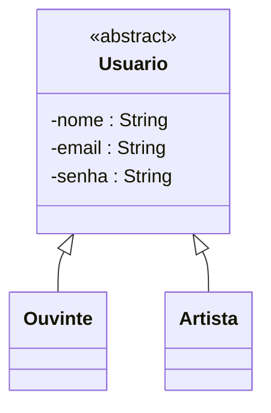
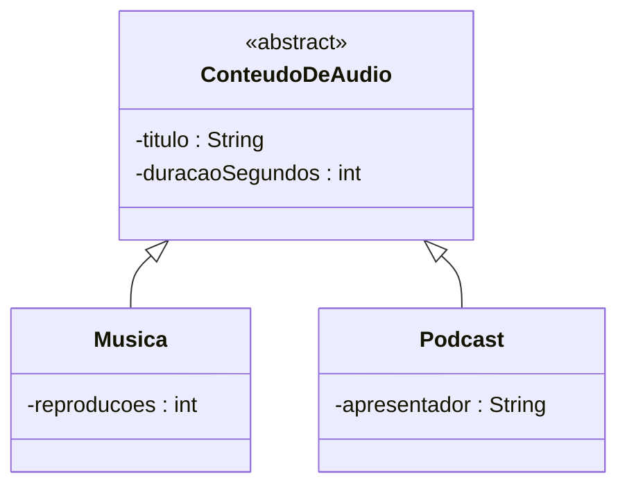
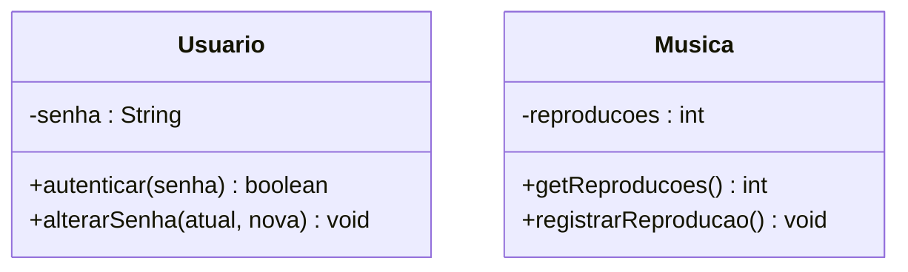
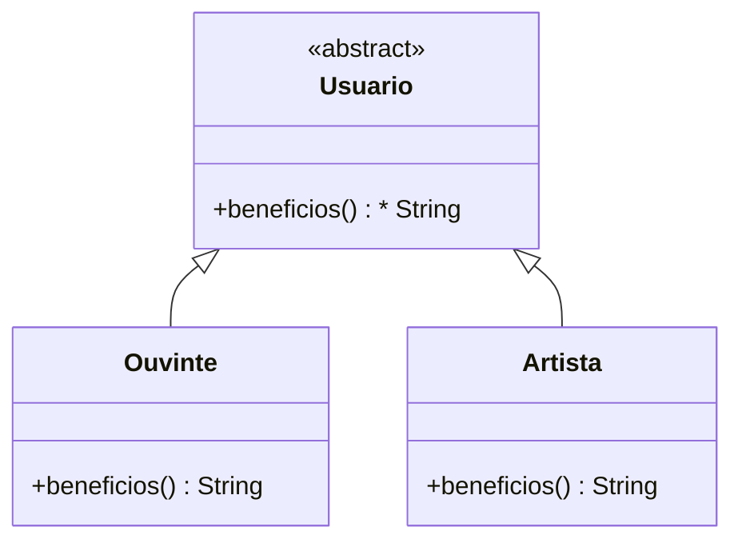
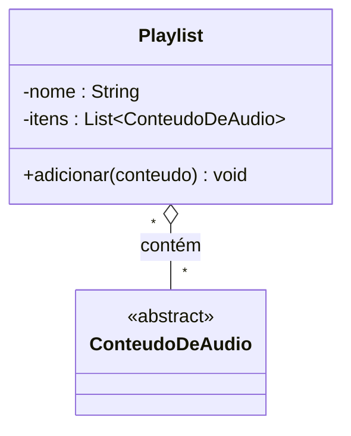
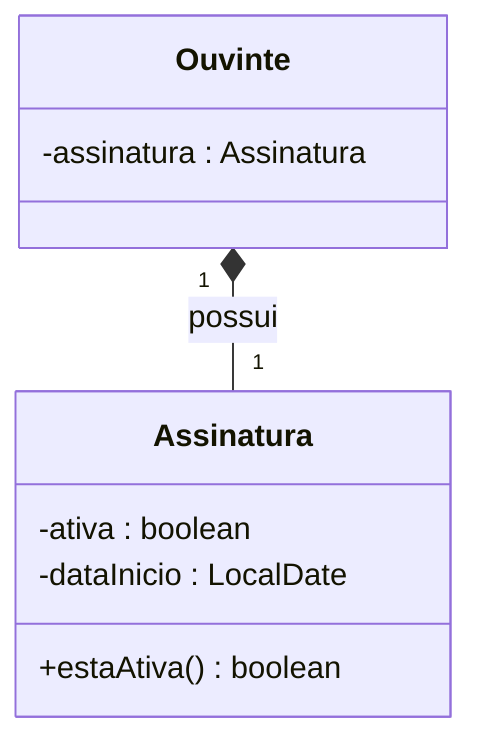
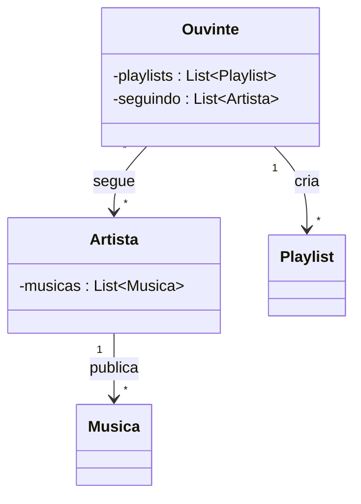
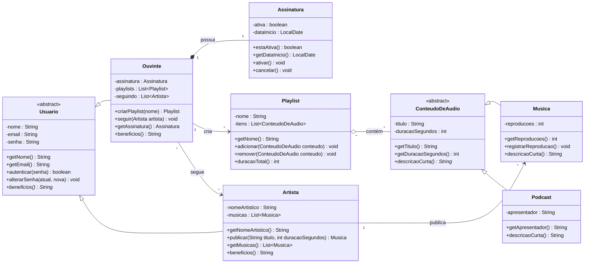

# explicação do diagrama da MelodIA parte por parte

> Este documento é a **aula de correção** da [entrevista](../entrevista-modelagem-melodia.md).
> Vamos montar o diagrama **em pedaços**, e para **cada pedaço** responder as perguntas que todo
> aluno faz: *por que essa classe? por que herança aqui? onde isso aparece na entrevista? como eu
> deveria ter percebido?* No fim, o diagrama completo e o **código Java** que o implementa (na
> pasta [`entrevista-solucao/`](.)).

## Dicas: como uma entrevista vira um diagrama

Antes de tudo, o "truque" que usamos o tempo todo:

| No texto aparece… | No diagrama vira… |
|-------------------|-------------------|
| um **substantivo** importante (usuário, música, playlist) | uma **classe** |
| um **dado** que a coisa guarda (nome, duração) | um **atributo** |
| um **verbo** / ação (publicar, seguir, criar) | uma **operação** ou uma **associação** |
| "**é um** tipo de…" | **herança** (triângulo `──▷`) |
| "**tem**/**junta**" coisas que **vivem sozinhas** | **agregação** (losango vazio `◇`) |
| "**nasce e morre junto**" com o dono | **composição** (losango cheio `◆`) |
| "não pode mexer direto / de qualquer lugar" | **encapsulamento** (atributo `-` privado) |
| "a **mesma** pergunta, resposta **depende do tipo**" | **polimorfismo** |

---

## Parte 1 — Quais são as classes? (e por quê)

**Como eu descubro as classes?** Grifando os **substantivos** que o cliente repete e que **têm
dados e comportamento próprios**. Na entrevista aparecem:

> *"existem **pessoas**… o **ouvinte**… o **artista**… os dois são **usuários**"* → `Usuario`,
> `Ouvinte`, `Artista`.
> *"toca **música** e também **podcast**"*, *"**conteúdo de áudio**"* → `ConteudoDeAudio`,
> `Musica`, `Podcast`.
> *"tem a **playlist**"* → `Playlist`.
> *"ele ganha uma **assinatura**"* → `Assinatura`.

**Dúvida comum:** *"'toques', 'login', 'catálogo' também não seriam classes?"*
Nem todo substantivo vira classe. **Login** é uma **ação** (vira operação). **Toques** é só a
contagem de reproduções (um **atributo** dentro de `Musica`). **Catálogo** é "o conjunto de todas
as músicas" não precisa de classe própria neste recorte. Regra: **só vira classe o que tem
dados E comportamento próprios** e aparece de forma relevante.

---

## Parte 2 — Herança nº 1: Usuario → Ouvinte / Artista



**Onde está na entrevista?**
> *"tem dois tipos bem diferentes: o **ouvinte**… e o **artista**… **no fundo, os dois são
> usuários** da plataforma e **todo mundo tem nome, e-mail e senha**, e todo mundo **faz login do
> mesmo jeito**."*

**Por que herança (e não três classes soltas)?** Porque passa no **teste do "é um"**: *"Ouvinte
**é um** Usuario?"* Sim. *"Artista **é um** Usuario?"* Sim. E existe **parte igual pra todos**
(nome, e-mail, senha, login). Colocamos essa parte comum **uma vez** em `Usuario` e cada tipo
**herda**. A frase *"todo mundo tem…"* é a pista: o que é de **todo mundo** sobe para a base.

**Por que `Usuario` é abstrata?** Porque **não existe** "um usuário genérico" se cadastrando —
todo cadastro é de um **ouvinte** ou de um **artista**. `Usuario` só existe para **generalizar**,
então marcamos `«abstract»` (não se cria objeto dela diretamente).

**No código:**
```java
public abstract class Usuario {              // «abstract»
    private String nome, email, senha;       // o que é de "todo mundo"
    protected Usuario(String nome, String email, String senha) { /* valida e guarda */ }
    public abstract String beneficios();     // (ver Parte 5)
}
public class Ouvinte extends Usuario { /* ... */ }   // "é um" Usuario
public class Artista extends Usuario { /* ... */ }
```

**Dúvida comum:** *"Se eu não usar herança, o que acontece?"* Você copia `nome`, `email`, `senha`
(e as validações) dentro de `Ouvinte` **e** dentro de `Artista`. No dia em que a regra do e-mail
mudar, você conserta em dois lugares e esquece um. A herança evita essa duplicação.

---

## Parte 3 — Herança nº 2: ConteudoDeAudio → Musica / Podcast



**Onde está na entrevista?**
> *"toca **música** e também **podcast**. São coisas diferentes, mas têm um monte de coisa em
> comum: **os dois têm título e duração**… A **música** guarda quantas **reproduções**… o
> **podcast** tem um **apresentador**."*

**Como interpretar?** É o **mesmo padrão da Parte 2**: uma **base comum** (`ConteudoDeAudio`, com
`título` e `duração`) e dois tipos que **herdam** e acrescentam o que é só deles (`reproducoes` na
`Musica`, `apresentador` no `Podcast`). O próprio dev diz na entrevista: *"uma **base comum**
(conteúdo de áudio) e dois tipos que **aproveitam** essa base"*.

**No código:**
```java
public abstract class ConteudoDeAudio {
    private final String titulo;
    private final int duracaoSegundos;       // o que é comum aos dois
    public abstract String descricaoCurta();
}
public class Musica  extends ConteudoDeAudio { private int reproducoes; /* ... */ }
public class Podcast extends ConteudoDeAudio { private final String apresentador; /* ... */ }
```

**Dúvida comum:** *"Por que `reproducoes` não fica na base `ConteudoDeAudio`?"* Porque **só a
música** tem reproduções relevantes no texto; o podcast tem **apresentador**. Cada coisa que é de
**um tipo só** fica **na subclasse**. Só sobe para a base o que é **comum aos dois**.

---

## Parte 4 — Encapsulamento: protegendo senha e reproduções



**Onde está na entrevista?**
> *"Ninguém pode **mexer na senha por fora**… tem que ter um jeito **controlado** de trocar a
> senha… o objeto tem que **proteger o que é dele**."*
> *"a música guarda quantas reproduções… **não pode ser adulterado na mão**."*

**Como interpretar?** As frases *"não pode mexer por fora"* e *"não pode ser adulterado"* gritam
**encapsulamento**: o dado fica **privado** (`-`) e só muda por **operações que validam**.

**Por que não tem `setSenha` nem `setReproducoes`?** Essa é **a** pergunta. Um `set` "cego"
deixaria qualquer um furar a regra (zerar reproduções, trocar senha sem conferir). Então:
- em vez de `setReproducoes(int)` → **`registrarReproducao()`** (só soma 1, nunca aceita um número qualquer);
- em vez de `getSenha`/`setSenha` → **`autenticar(senha)`** e **`alterarSenha(atual, nova)`** (a senha nunca é lida nem trocada sem conferir a atual).

**No código:**
```java
private int reproducoes;
public void registrarReproducao() { reproducoes++; }   // única porta de escrita
public int  getReproducoes()      { return reproducoes; }
// não existe setReproducoes(int)  <-- isso é encapsulamento

public boolean autenticar(String senha) { return this.senha.equals(senha); }
public void alterarSenha(String atual, String nova) {
    if (!autenticar(atual)) throw new IllegalArgumentException("Senha atual incorreta.");
    this.senha = nova;                                  // troca controlada
}
```

**Dúvida comum:** *"Então todo atributo privado precisa de get e set?"* **Não.** *Get* entra
**quando alguém de fora precisa ler** (ex.: mostrar as reproduções). *Set* você **evita** sempre
que ele furaria uma regra troque por um **verbo do domínio** que valida.

---

## Parte 5 — Polimorfismo: a mesma pergunta, respostas diferentes



**Onde está na entrevista?**
> *"Se eu perguntar pro sistema 'quais são os **benefícios** desse usuário?', a resposta muda: pro
> ouvinte é 'ouvir sem limite…'; pro artista é 'publicar músicas…'. A **pergunta é a mesma**, mas
> **a resposta depende do tipo**."*

**Como interpretar?** *"Mesma pergunta, resposta depende do tipo"* é a **definição** de
polimorfismo. Declaramos a operação **`beneficios()`** na base `Usuario` como **abstrata** (só o
contrato, sem resposta) e **cada subtipo redefine**.

**O que significa o `*` no diagrama?** `beneficios() String*` o **asterisco marca método
abstrato**: existe o **nome**, mas **não a implementação** na base. No draw.io, escreva em
*itálico*. Nas subclasses o método aparece **sem** `*`, porque ali ele **é implementado**.

**No código:**
```java
public abstract class Usuario {
    public abstract String beneficios();     // contrato (abstrato)
}
public class Ouvinte extends Usuario {
    @Override public String beneficios() { return "ouvir sem limite e montar playlists"; }
}
public class Artista extends Usuario {
    @Override public String beneficios() { return "publicar músicas e receber pelos toques"; }
}
```
O mesmo vale para **`descricaoCurta()`** em `ConteudoDeAudio` (música e podcast se descrevem
diferente).

**Dúvida comum:** *"Por que não resolver com `if (é ouvinte) … else if (é artista) …`?"* Porque a
cada tipo novo você teria que caçar e alterar todos esses `if`. Com polimorfismo, cada objeto
**responde por si**, e um tipo novo só **implementa** o método.

---

## Parte 6 — Agregação: a Playlist "junta" conteúdos



> 👀 **Repare no `-itens : List~ConteudoDeAudio~`.** A seta `◇` "contém" **é** essa propriedade:
> como o lado é `*` (muitos), no código ela vira uma **lista**. Seta no desenho = campo na classe.

**Onde está na entrevista?**
> *"a playlist só **junta** conteúdos que já existem… **existem no catálogo por conta própria**.
> Se o ouvinte **apagar a playlist**, as músicas **continuam lá** no catálogo."*

**Como interpretar?** A parte (**conteúdo**) **sobrevive** sem o todo (**playlist**). Isso é
**agregação** losango **vazio** `◇` do lado do "todo" (a playlist). E como o mesmo conteúdo pode
estar em **várias** playlists, a multiplicidade é `*` dos dois lados.

**Por que a Playlist guarda `ConteudoDeAudio` (e não `Musica`)?** Porque o cliente disse *"músicas
**e** podcasts juntos"*. Guardando o **tipo base**, a mesma playlist aceita os dois (é abstração +
polimorfismo trabalhando juntos).

**No código:**
```java
public class Playlist {
    private final List<ConteudoDeAudio> itens = new ArrayList<>();   // o tipo BASE
    public void adicionar(ConteudoDeAudio conteudo) { itens.add(conteudo); }
    // a Playlist NÃO cria os conteúdos só recebe referências que já existem
}
```

**Dúvida comum:** *"Como sei que é agregação e não composição?"* Pergunte: *"se eu apagar o todo, a
parte some?"* Aqui **não** (a música continua no catálogo) → **agregação**.

---

## Parte 7 — Composição: a Assinatura é parte do Ouvinte



> 👀 **Repare no `-assinatura : Assinatura`.** A seta `◆` "possui" é essa propriedade. Como o lado
> é `1` (uma só), no código ela vira **uma referência** (não uma lista): `private Assinatura assinatura;`.

**Onde está na entrevista?**
> *"ele **ganha uma assinatura** e ela **nasce junto** com o cadastro… **pertence só a ele**. Se a
> conta do ouvinte for **encerrada**, a assinatura **deixa de existir** também; não faz sentido uma
> assinatura 'solta', sem dono."*

**Como interpretar?** A parte (**assinatura**) **nasce e morre junto** com o todo (**ouvinte**) e
não existe sozinha. Isso é **composição** losango **cheio** `◆` do lado do ouvinte.

**A diferença que a entrevista faz questão de marcar:** o próprio dev avisa *"a playlist junta
coisas que vivem por conta própria, mas a assinatura **nasce e morre junto** com o ouvinte são
**ligações diferentes**"*. É o contraste **agregação × composição**.

**No código** (o "nasce e morre junto" vira: o Ouvinte **cria** a assinatura dentro dele):
```java
public class Ouvinte extends Usuario {
    private final Assinatura assinatura;
    public Ouvinte(String nome, String email, String senha) {
        super(nome, email, senha);
        this.assinatura = new Assinatura();   // nasce junto com o ouvinte (composição)
    }
}
```

**Dúvida comum:** *"Composição e agregação não são a mesma seta?"* Não o **losango** muda:
**vazio `◇`** (agregação, a parte sobrevive) × **cheio `◆`** (composição, a parte morre junto).

---

## Parte 8 — Associações simples: publicar, criar, seguir



> 👀 Cada seta `-->` com `*` virou uma **lista** dentro da classe da "ponta de origem":
> `musicas` no `Artista`, `playlists` e `seguindo` no `Ouvinte`.

**Onde está na entrevista?**
> *"o **artista publica** as músicas dele (um artista tem **várias** músicas)"* → `1 --> *`.
> *"o ouvinte **cria** playlists"* → `1 --> *`.
> *"o ouvinte **pode seguir** artistas um ouvinte segue **vários** artistas, e um artista é
> seguido por **vários** ouvintes"* → `* --> *`.

**Como interpretar?** São **verbos** (publica, cria, segue) ligando duas classes que **existem por
conta própria** nem parte-todo, nem "é um". Isso é **associação simples** (linha/seta), e os
números das falas ("um…", "vários…") viram a **multiplicidade** nas pontas.

**No código** cada associação é **uma propriedade** (uma **lista**, porque o lado é `*`), e o verbo
é a operação que mexe nessa lista:
```java
// dentro de Artista:
private final List<Musica> musicas = new ArrayList<>();       // <- a associação "publica"
public Musica publicar(String titulo, int seg) { Musica m = new Musica(titulo, seg); musicas.add(m); return m; }

// dentro de Ouvinte:
private final List<Playlist> playlists = new ArrayList<>();   // <- a associação "cria"
private final List<Artista>  seguindo  = new ArrayList<>();   // <- a associação "segue"
public Playlist criarPlaylist(String nome) { Playlist p = new Playlist(nome); playlists.add(p); return p; }
public void seguir(Artista a)              { seguindo.add(a); }
```

**Dúvida comum:** *"Publicar não seria composição? A música 'nasce' do artista."* Cuidado: a música
**continua existindo** no catálogo mesmo que o artista saia ela não "morre junto". Então é
**associação**, não composição.

---

## Parte 9 — O diagrama completo

Juntando as partes, chega-se ao modelo final (com as operações de cada classe):



### 🔗 Cada relação do diagrama vira uma propriedade no código

> A **seta** no diagrama e o **campo** na classe são a **mesma ligação** vista de dois jeitos: no
> desenho é uma linha; no código é uma **propriedade**. A **multiplicidade** decide o tipo do campo:
> **`1`** → uma **referência** (`Tipo`); **`*`** (muitos) → uma **lista** (`List<Tipo>`).

| Relação no diagrama | Multiplicidade | Propriedade no código | Fica na classe |
|---------------------|:--------------:|-----------------------|----------------|
| `Ouvinte ◆ Assinatura` (possui) | `1` | `private Assinatura assinatura;` | `Ouvinte` |
| `Ouvinte → Playlist` (cria) | `*` | `private List<Playlist> playlists;` | `Ouvinte` |
| `Ouvinte → Artista` (segue) | `*` | `private List<Artista> seguindo;` | `Ouvinte` |
| `Artista → Musica` (publica) | `*` | `private List<Musica> musicas;` | `Artista` |
| `Playlist ◇ ConteudoDeAudio` (contém) | `*` | `private List<ConteudoDeAudio> itens;` | `Playlist` |

> ⚠️ **Herança é diferente:** o triângulo `──▷` **não** vira propriedade — vira `extends`. Só
> **associação, agregação e composição** viram campos (referência ou lista).

### Onde ficou cada pilar e cada relação (mapa rápido)
| Conceito | No diagrama | Frase da entrevista que originou |
|----------|-------------|----------------------------------|
| Abstração | `Usuario`, `ConteudoDeAudio` «abstract» | "os dois **são** usuários"; "**base comum**" |
| Herança | `──▷` (2 hierarquias) | "é um ouvinte/artista"; "música e podcast" |
| Encapsulamento | `-senha`, `-reproducoes` + operações | "não mexer por fora"; "não pode ser adulterado" |
| Polimorfismo | `beneficios()*`, `descricaoCurta()*` | "mesma pergunta, resposta depende do tipo" |
| Composição `◆` | `Ouvinte ◆ Assinatura` | "nasce junto… deixa de existir" |
| Agregação `◇` | `Playlist ◇ ConteudoDeAudio` | "junta conteúdos que existem sozinhos" |
| Associação `-->` | publica / cria / segue | "publica"; "cria"; "segue" |

---

## ▶️ Rodar a aplicação completa

Todo o diagrama está implementado nesta pasta e **compila/roda** (Java 17+):

```bash
javac *.java
java AppMelodia
```

Saída:

```
Autentica com senha errada? false
Autentica com a nova senha?  true

Benefícios por tipo de usuário:
  Ana Souza -> ouvir sem limite e montar playlists
  Tom Jobim -> publicar músicas e receber pelos toques

Playlist 'Favoritas' (30 min):
  - [Música] Garota de Ipanema
  - [Podcast com Ana Host] Bastidores da Melodia

Assinatura da Ana ativa? true (início: 2026-09-18)
Garota de Ipanema -> 2 reproduções
```

---

[⬅️ Enunciado da entrevista](../entrevista-modelagem-melodia.md) · [📂 Voltar para os exemplos](../README.md)
