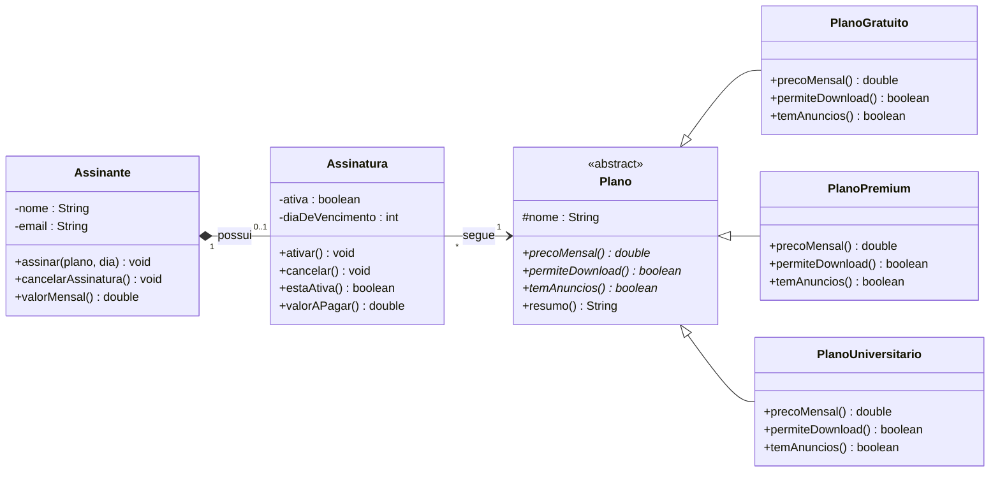

# 🎯 Exercício — Implemente o diagrama em Java (Assinaturas e Planos da Melodia)

> **Outra parte do sistema Melodia:** os **planos de assinatura**. Aqui **o diagrama já está
> pronto** — sua tarefa é **escrever o código Java** que corresponde exatamente a ele, aplicando
> os quatro pilares. É o caminho inverso da [aula guiada](../AULA-construindo-o-diagrama.md): lá
> partimos do código; aqui você parte do **diagrama**.

## 🗺️ O diagrama completo (implemente isto)

### Como ler a notação (relembrando)
- Nome em *itálico* + `<<abstract>>` = **classe abstrata**; operação com `*` = **método abstrato**.
- `-` privado · `+` público · `#` protegido.
- Triângulo vazio `<|--` = **herança**; losango **cheio** `*--` = **composição**; seta `-->` = **associação** (com multiplicidade).

## 📋 Especificação (o que cada parte deve fazer)

**Planos (polimorfismo):** cada plano responde diferente:

| Plano | `precoMensal()` | `permiteDownload()` | `temAnuncios()` |
|-------|-----------------|---------------------|-----------------|
| **PlanoGratuito** | `0.0` | `false` | `true` |
| **PlanoPremium** | `19.90` | `true` | `false` |
| **PlanoUniversitario** | `11.90` | `true` | `false` |

- `Plano` é **abstrata** (não se instancia) e guarda `nome` (protegido). `resumo()` é **concreto**
  e monta um texto usando os três métodos abstratos (ex.: `"Premium — R$ 19,90/mês · sem anúncios · download offline"`).

**Assinatura (encapsulamento):**
- Atributos **privados**: `ativa` (boolean) e `diaDeVencimento` (int).
- **Invariante:** `diaDeVencimento` deve estar entre **1 e 28** (senão, rejeite no construtor).
- Guarda uma referência a **um `Plano`** (associação). Nasce **ativa**.
- `ativar()` / `cancelar()` mudam o estado; `estaAtiva()` consulta.
- `valorAPagar()` devolve `plano.precoMensal()` se ativa, ou `0.0` se cancelada.

**Assinante (composição):**
- Atributos **privados**: `nome`, `email` (valide: nome não vazio; email contém `@`).
- Tem **0..1** `Assinatura`. `assinar(plano, dia)` **cria** a assinatura dentro do assinante.
- `cancelarAssinatura()` cancela a assinatura (se existir).
- `valorMensal()` devolve o valor a pagar da assinatura (ou `0.0` se não houver).

## 🧪 O que entregar
1. As **6 classes** em Java (`Plano`, `PlanoGratuito`, `PlanoPremium`, `PlanoUniversitario`,
   `Assinatura`, `Assinante`), respeitando a visibilidade do diagrama.
2. Uma classe `DemoAssinaturas` com `main` que: lista os planos com `resumo()`, cria um
   assinante, assina o Premium, imprime o valor mensal, cancela e imprime de novo.
3. Deve **compilar e rodar** com `javac *.java && java DemoAssinaturas`.

## ✅ Critério de "pronto"
- [ ] `Plano` é abstrata e os 3 planos concretizam os 3 métodos com os valores da tabela.
- [ ] `resumo()` está **só** em `Plano` (não repetido nas subclasses).
- [ ] `Assinatura` recusa `diaDeVencimento` fora de 1..28 e some `valorAPagar()` zera ao cancelar.
- [ ] Nenhum atributo é público; toda mudança de estado passa por uma operação.
- [ ] Você consegue **apontar no seu código onde está cada pilar** (abstração, encapsulamento,
      herança, polimorfismo) e os relacionamentos (composição e associação).

## 💡 Dicas (notação → Java)
- `<<abstract>>` → `public abstract class Plano` e `public abstract double precoMensal();`
- `<|--` → `class PlanoPremium extends Plano` + `@Override`.
- `*--` (composição) → o `Assinante` faz `new Assinatura(...)` **dentro** de `assinar(...)`.
- `-->` (associação) → a `Assinatura` **recebe** um `Plano` já existente pelo construtor.

---

> 👩‍🏫 **Professor:** a resolução comentada e executável está em
> [`gabarito/`](gabarito/) (não espie antes de tentar!). Para conferir a lógica esperada, veja a
> saída em [gabarito/README.md](gabarito/README.md).

[⬅️ Voltar para os exemplos](../README.md) · [📖 Aula guiada (o inverso: do código ao diagrama)](../AULA-construindo-o-diagrama.md)
