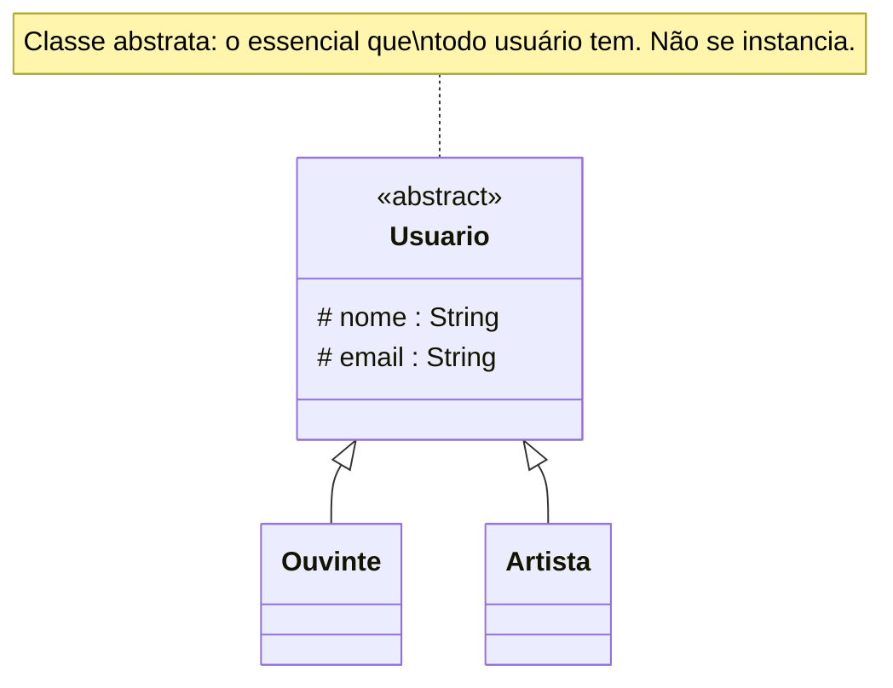
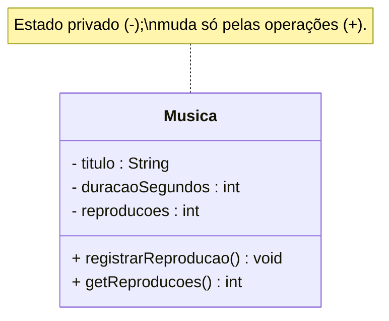
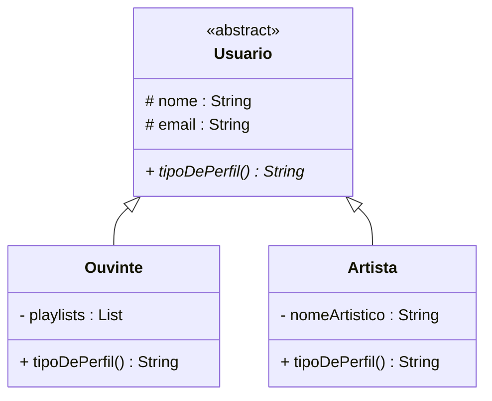
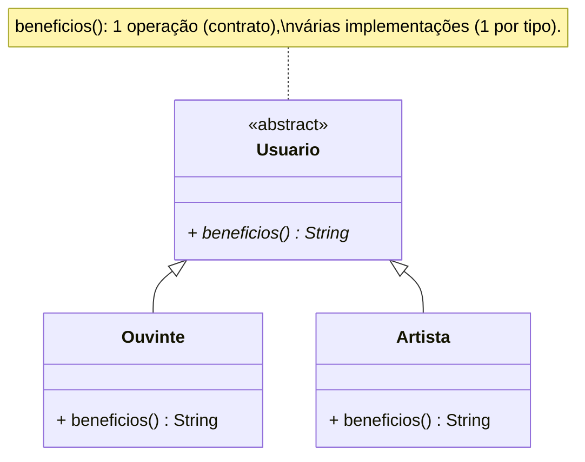
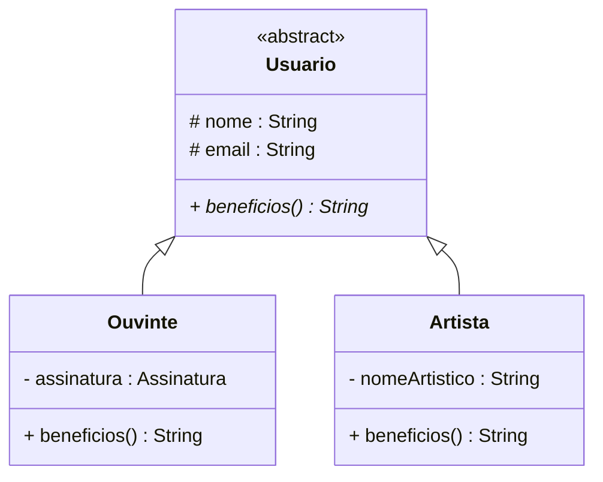

# Os quatro pilares da OO — em modelagem

> Texto de apoio da apresentação
> [`apresentacao-pilares-oo.pptx`](apresentacao-pilares-oo.pptx). Explica, **em nível de
> modelagem (UML)**, os quatro pilares — **abstração, encapsulamento, herança e
> polimorfismo** — com **definições formais**, **autores**, **diagramas de classes** e o que
> acontece **se cada um não for usado**. Todos os exemplos usam o streaming de música
> **Melodia**.

> **Como um pilar aparece no diagrama de classes (resumo da notação UML):**
>
> | Pilar | Notação no diagrama de classes |
> |-------|--------------------------------|
> | **Abstração** | classe com nome em *itálico* e estereótipo `«abstract»`; operação abstrata em *itálico* |
> | **Encapsulamento** | visibilidade nos membros: `-` privado, `+` público, `#` protegido |
> | **Herança** | linha com **triângulo vazio** `──▷` apontando para a superclasse |
> | **Polimorfismo** | a mesma operação (abstrata na base) **redefinida** em cada subclasse |

---

## Índice
1. [Abstração](#1-abstração)
2. [Encapsulamento](#2-encapsulamento)
3. [Herança](#3-herança)
4. [Polimorfismo](#4-polimorfismo)
5. [Os quatro juntos](#5-os-quatro-pilares-num-só-diagrama)

---

## 1. Abstração

**Definição formal (Booch).** Uma **abstração** destaca as **características essenciais** de uma
entidade — as que a distinguem de todas as outras — e **ignora o que é irrelevante** para o
problema.

**Na modelagem.** Abstrair é decidir **o que entra no diagrama e o que fica de fora**. Tem dois
sentidos:

1. **Recorte:** guardar só os atributos/operações que o problema precisa.
2. **Generalização:** criar um tipo genérico (uma **classe abstrata**) que representa vários
   específicos. Na UML, a classe abstrata tem o **nome em itálico** e o estereótipo
   `«abstract»`, e **não pode ser instanciada**.

**Exemplo no Melodia.** Um ouvinte real tem altura, cidade, time de futebol… O sistema recorta
só o essencial. E `Ouvinte` e `Artista` compartilham uma abstração comum, `Usuario`:

**O que acontece se não usar.** Sem abstração, o diagrama vira **ruído**: dezenas de atributos
irrelevantes, ou a mesma informação repetida em `Ouvinte` e `Artista` sem um tipo comum. O
extremo oposto também é ruim — a **abstração especulativa** (criar `UsuarioBase`,
`AbstractUsuarioFactory` "porque um dia pode ter outro tipo") **infla** o modelo sem
necessidade. Regra: abstraia o essencial **do problema atual**, nem menos, nem mais.

---

## 2. Encapsulamento

**Definição formal (Parnas, 1972; Meyer, 1997).** Encapsular é **esconder o estado interno** de
um objeto, expondo-o apenas por **operações controladas**. Parnas chamou isso de *ocultamento
de informação*: cada módulo esconde uma decisão de projeto, para que mudanças internas não
vazem para o resto do sistema.

**Na modelagem.** Encapsulamento aparece no diagrama de classes pela **visibilidade** de cada
membro:

| Símbolo | Visibilidade | Quem enxerga |
|---------|--------------|--------------|
| `-` | privado | só a própria classe |
| `+` | público | qualquer um |
| `#` | protegido | a classe e suas subclasses |

A regra de modelagem: **atributos `-` (privados)**; o acesso vem por **operações `+`
(públicas)** que **validam** e protegem os **invariantes** (regras que valem sempre).

**Exemplo no Melodia.** As reproduções de uma música alimentam royalties e o ranking; por isso
`reproducoes` é **privado** e só muda por uma operação:

**O que acontece se não usar.** Com atributos **públicos**, qualquer parte do sistema altera o
estado sem passar por validação — e um erro de uma pessoa vira incidente de todos (ex.:
`reproducoes` zeradas por engano corrompem o ranking e os royalties). Encapsulamento não é
purismo: é o que torna o **estado inválido impossível**.

---

## 3. Herança

**Definição formal (Booch).** Herança permite que uma **subclasse** **especialize** uma
**superclasse**, **reaproveitando** seus atributos e operações. Vale o teste **"é um"**.

**Na modelagem.** Na UML, herança (generalização) é uma **linha com um triângulo vazio ──▷**
apontando para a **superclasse**. A subclasse herda tudo da base e **acrescenta ou redefine**
só o que muda. Só modele herança quando **"Subclasse é uma Superclasse"** for verdadeiro.

**Exemplo no Melodia.** `Ouvinte` e `Artista` **são** `Usuario`s — herdam `nome`/`email` e
cada um acrescenta o que é seu:

**O que acontece se não usar (ou usar errado).** Sem herança, você **duplica** `nome`/`email`
(e as regras deles) em `Ouvinte` e `Artista` — e qualquer mudança precisa ser feita em dois
lugares. Por outro lado, herança **forçada** (onde o "é um" não vale, ex.: `Playlist extends
ArrayList` só para reusar `add`) engessa o modelo. Na dúvida entre herança e composição,
**prefira composição** ("tem um").

---

## 4. Polimorfismo

**Definição formal (Cardelli & Wegner, 1985).** Polimorfismo é a capacidade de uma **mesma
mensagem** produzir **comportamentos diferentes** conforme o **tipo real** do objeto que a
recebe (**ligação dinâmica**).

**Na modelagem.** No diagrama, o polimorfismo aparece quando uma **operação declarada na
superclasse** (muitas vezes **abstrata**, em itálico) é **redefinida** em cada subclasse. Quem
usa a superclasse chama a operação **sem saber** qual é o tipo concreto.

**Exemplo no Melodia.** Todo `Usuario` tem `beneficios()`, mas o resultado difere por tipo — o
ouvinte vê "streaming e playlists"; o artista, "publicar e receber royalties":

Assim, `usuario.beneficios()` responde diferente conforme o objeto — **a mesma linha, respostas
diferentes**.

**O que acontece se não usar.** Sem polimorfismo, o comportamento por tipo vira uma cascata de
`if (é ouvinte) … else if (é artista) …` espalhada pelo sistema. Cada **novo tipo** obriga a
caçar e alterar todos esses `if`s — frágil e propenso a erro. Com polimorfismo, um tipo novo
(ex.: `Podcaster`) só **implementa** a operação, e o código que a chama **não muda** (é a base
do princípio **Aberto/Fechado**).

---

## 5. Os quatro pilares num só diagrama

Um único diagrama de classes costuma exibir os quatro pilares ao mesmo tempo:

- **Abstração:** `Usuario` é abstrata (o essencial, generalizado).
- **Encapsulamento:** atributos com visibilidade (`#`/`-`); acesso por operações.
- **Herança:** `Ouvinte`/`Artista` `──▷` `Usuario` (o triângulo vazio).
- **Polimorfismo:** `beneficios()` é abstrata na base e **redefinida** em cada subclasse.

> 🧭 **Regra de ouro dos pilares:** abstraia o essencial; proteja o estado (encapsulamento);
> herde só no "é um"; e deixe cada objeto responder por si (polimorfismo) em vez de `if` de
> tipo.

---

## Referências

- BOOCH, G. *Object-Oriented Analysis and Design with Applications*. 2. ed. 1994.
- PARNAS, D. L. *On the Criteria To Be Used in Decomposing Systems into Modules*. CACM, 1972.
- MEYER, B. *Object-Oriented Software Construction*. 2. ed. 1997.
- CARDELLI, L.; WEGNER, P. *On Understanding Types, Data Abstraction, and Polymorphism*. ACM
  Computing Surveys, 1985.
- BOOCH, G.; RUMBAUGH, J.; JACOBSON, I. *The Unified Modeling Language User Guide*. 1999.

---

[⬅️ 03 - Abstração (aula)](README.md) · [🎞️ Apresentação (.pptx)](apresentacao-pilares-oo.pptx) · [📚 Índice do curso](../README.md)
