# Os 4 Pilares da Programação Orientada a Objetos em Java

## 📚 Introdução

Neste documento, exploraremos os **quatro pilares fundamentais da POO** usando um exemplo prático e real: um **sistema de streaming de música** como o Spotify ou Apple Music.

Imagine que você está construindo um aplicativo que:
- Permite reproduzir diferentes tipos de áudio (música, podcast, audiolivro)
- Controla a reprodução (play, pause, skip)
- Gerencia permissões de acesso
- Oferece diferentes tipos de reprodução

Vamos ver como os pilares da POO nos ajudam a organizar esse código.

---

## 1️⃣ ABSTRAÇÃO

### O que é?

**Abstração** é o processo de **esconder a complexidade** e mostrar apenas o essencial. É como usar um control remoto da TV - você não precisa saber como funciona internamente, apenas usar os botões.

### Visão Geral

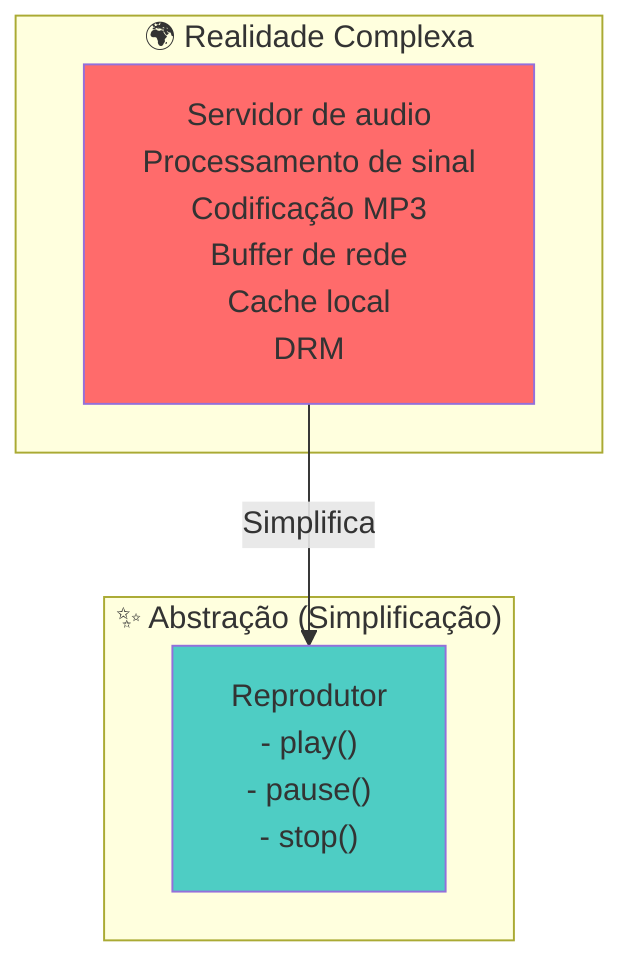

### Exemplo Prático em Java

```java
// ABSTRATO - interface que esconde a complexidade
public interface Reprodutor {
    void play();
    void pause();
    void stop();
    void proxima();
    void anterior();
}

// CONCRETO - implementação real (escondida do usuário)
public class ReprodutorMúsica implements Reprodutor {
    
    private String arquivoAtual;
    private boolean emReproducao;
    private List<String> fila = new ArrayList<>();
    
    @Override
    public void play() {
        // Código complexo aqui:
        // - Decodificar arquivo MP3
        // - Buffering de rede
        // - Inicializar sistema de áudio
        // - Configurar DRM
        emReproducao = true;
        System.out.println("🎵 Reproduzindo: " + arquivoAtual);
    }
    
    @Override
    public void pause() {
        emReproducao = false;
        System.out.println("⏸️  Música pausada");
    }
    
    @Override
    public void stop() {
        emReproducao = false;
        arquivoAtual = null;
        System.out.println("⏹️  Música parada");
    }
    
    @Override
    public void proxima() {
        System.out.println("⏭️  Próxima música");
    }
    
    @Override
    public void anterior() {
        System.out.println("⏮️  Música anterior");
    }
}

// USO - o usuário não precisa saber de detalhes
public class Usuario {
    public static void main(String[] args) {
        Reprodutor player = new ReprodutorMúsica();
        player.play();      // ✨ Simples!
        player.pause();     // ✨ Simples!
        player.proxima();   // ✨ Simples!
    }
}
```

### Diagrama da Abstração

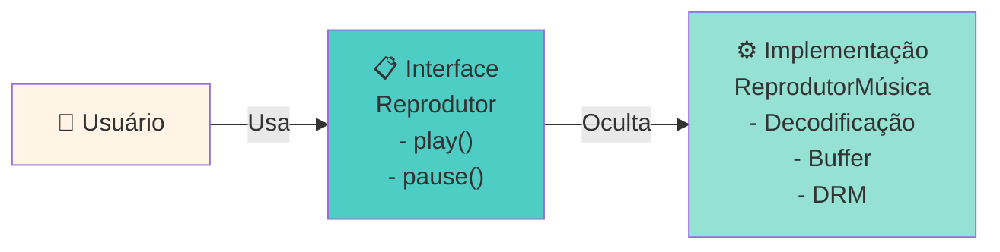

### ❓ Perguntas Comuns dos Alunos

**P1: Por que usar abstração se posso usar uma classe direto?**
> R: Porque se mudar a implementação (ex: trocar de MP3 para FLAC), o código do usuário não precisa mudar. A interface permanece a mesma.

**P2: Qual é a diferença entre interface e classe abstrata?**
> R: Interface define O QUE fazer (contrato), classe abstrata define O QUE E COMO fazer (pode ter implementação parcial).

**P3: Posso ter múltiplas abstrações?**
> R: Sim! Você pode ter `Reprodutor`, `Gravador`, `Misturador`, etc. Cada uma abstrai uma responsabilidade.

---

## 2️⃣ ENCAPSULAMENTO

### O que é?

**Encapsulamento** é **agrupar dados e métodos** em uma classe, e **controlar o acesso** a eles usando modificadores (`private`, `public`, `protected`).

É como uma pílula: o medicamento (dados) está protegido dentro da cápsula, você não mexe no medicamento diretamente.

### Visão Geral

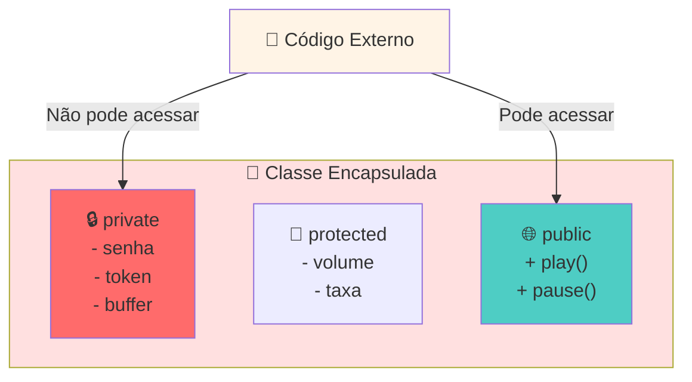

### Exemplo Prático em Java

```java
public class ContaMúsica {
    // 🔒 PRIVADO - não pode ser acessado de fora
    private String senha;
    private String token;
    private double saldoMemória;
    private List<String> histórico;
    
    // 🔐 PROTEGIDO - apenas subclasses acessam
    protected int volumeAtual;
    protected String playlistAtual;
    
    // 🌐 PÚBLICO - qualquer um pode acessar
    public String nomeUsuário;
    public String email;
    
    // Construtor
    public ContaMúsica(String nomeUsuário, String email, String senha) {
        this.nomeUsuário = nomeUsuário;
        this.email = email;
        this.senha = senha;
        this.volumeAtual = 50;
        this.saldoMemória = 1000;
        this.histórico = new ArrayList<>();
    }
    
    // Método PÚBLICO para fazer login (controla acesso à senha)
    public boolean fazerLogin(String senhaDigitada) {
        if (senhaDigitada.equals(this.senha)) {
            this.token = gerarToken();
            System.out.println("✅ Login bem-sucedido!");
            return true;
        } else {
            System.out.println("❌ Senha incorreta!");
            return false;
        }
    }
    
    // Método PÚBLICO para mudar volume (com validação)
    public void setVolume(int novoVolume) {
        if (novoVolume >= 0 && novoVolume <= 100) {
            this.volumeAtual = novoVolume;
            System.out.println("🔊 Volume ajustado para: " + novoVolume);
        } else {
            System.out.println("⚠️ Volume deve estar entre 0 e 100!");
        }
    }
    
    // Método PÚBLICO para obter volume
    public int getVolume() {
        return this.volumeAtual;
    }
    
    // Método PÚBLICO para adicionar música ao histórico (lógica interna)
    public void adicionarAoHistórico(String música) {
        histórico.add(música);
        System.out.println("📝 Música adicionada ao histórico");
    }
    
    // Método PRIVADO - apenas a classe usa
    private String gerarToken() {
        return UUID.randomUUID().toString();
    }
    
    // Método PRIVADO - apenas a classe usa
    private void atualizarMemória(double bytes) {
        this.saldoMemória -= bytes;
        System.out.println("💾 Memória restante: " + saldoMemória + " MB");
    }
}

// USO
public class TesteConta {
    public static void main(String[] args) {
        ContaMúsica conta = new ContaMúsica("João", "joao@email.com", "123456");
        
        // ✅ Funciona - é público
        conta.fazerLogin("123456");
        conta.setVolume(80);
        System.out.println("Volume atual: " + conta.getVolume());
        
        // ❌ Erro de compilação - é privado!
        // conta.senha = "nova_senha";  // ERRO!
        // conta.gerarToken();            // ERRO!
        
        // ✅ Funciona - é público
        conta.adicionarAoHistórico("Bohemian Rhapsody");
    }
}
```

### Diagrama do Encapsulamento

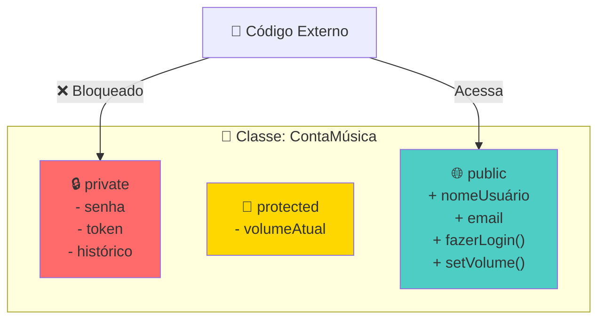

### Benefícios Visuais

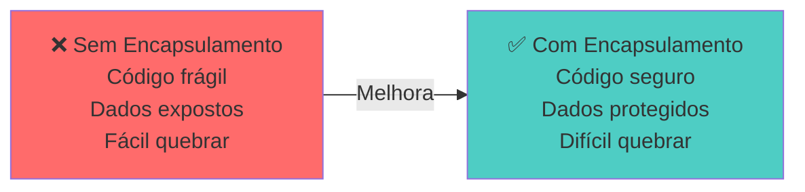

### ❓ Perguntas Comuns dos Alunos

**P1: Por que não fazer tudo `public`?**
> R: Porque alguém pode colocar um volume negativo, ou deletar o histórico. `private` protege contra erros e usos indevidos.

**P2: Qual a diferença entre `protected` e `public`?**
> R: `protected` só pode ser acessado por subclasses. `public` é acessível por qualquer código.

**P3: O que significa "getter" e "setter"?**
> R: `getVolume()` e `setVolume()` são métodos que controlam o acesso. No setter, você pode adicionar validação.

---

## 3️⃣ HERANÇA

### O que é?

**Herança** é quando uma classe **herda características** de outra. É como a herança genética: você herda dos seus pais.

Se todas as plataformas de streaming (Spotify, Apple Music, YouTube Music) têm `play()`, podemos criar uma classe pai que já tem esse método.

### Visão Geral

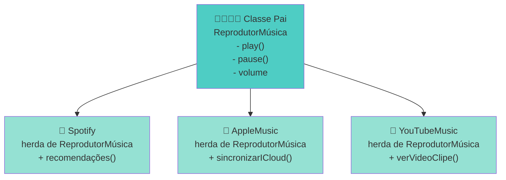

### Exemplo Prático em Java

```java
// ===== CLASSE PAI (Superclasse) =====
public abstract class ReprodutorMúsica {
    // Atributos comuns
    protected String nomeAplicativo;
    protected int volumeAtual = 50;
    protected boolean emReproducao = false;
    protected String músicaAtual;
    
    // Construtor
    public ReprodutorMúsica(String nomeAplicativo) {
        this.nomeAplicativo = nomeAplicativo;
    }
    
    // Métodos comuns (implementados)
    public void play() {
        emReproducao = true;
        System.out.println("▶️ " + nomeAplicativo + " - Reproduzindo: " + músicaAtual);
    }
    
    public void pause() {
        emReproducao = false;
        System.out.println("⏸️ " + nomeAplicativo + " - Pausado");
    }
    
    public void setVolume(int volume) {
        if (volume >= 0 && volume <= 100) {
            this.volumeAtual = volume;
            System.out.println("🔊 Volume: " + volume + "%");
        }
    }
    
    public int getVolume() {
        return volumeAtual;
    }
    
    // Método abstrato - OBRIGA as subclasses a implementar
    public abstract void sincronizar();
    public abstract void mostrarRecomendações();
}

// ===== CLASSE FILHA 1 =====
public class Spotify extends ReprodutorMúsica {
    private List<String> recomendações;
    private boolean recomendacõesAtivadas;
    
    public Spotify() {
        super("🎵 Spotify");
        this.recomendações = new ArrayList<>();
        this.recomendacõesAtivadas = true;
    }
    
    // Implementa o método abstrato da classe pai
    @Override
    public void sincronizar() {
        System.out.println("🔄 Spotify sincronizando com a nuvem...");
        System.out.println("✅ Histórico, playlists e preferências sincronizadas");
    }
    
    @Override
    public void mostrarRecomendações() {
        if (recomendacõesAtivadas) {
            System.out.println("💡 Recomendações Spotify:");
            System.out.println("  1. Based on Drake");
            System.out.println("  2. Daily Mix");
            System.out.println("  3. Release Radar");
        }
    }
    
    // Método específico do Spotify
    public void ativarModoOffline() {
        System.out.println("📱 Modo offline ativado");
    }
}

// ===== CLASSE FILHA 2 =====
public class AppleMusic extends ReprodutorMúsica {
    private boolean sincronizadoICloud;
    
    public AppleMusic() {
        super("🎵 Apple Music");
        this.sincronizadoICloud = true;
    }
    
    @Override
    public void sincronizar() {
        System.out.println("☁️ Apple Music sincronizando com iCloud...");
        System.out.println("✅ Dados sincronizados com todos os seus dispositivos Apple");
    }
    
    @Override
    public void mostrarRecomendações() {
        System.out.println("💡 Recomendações do Apple Music:");
        System.out.println("  1. Friends Mix");
        System.out.println("  2. New Music Daily");
        System.out.println("  3. A-List Pop");
    }
    
    // Método específico do Apple Music
    public void sincronizarComDispositivos() {
        System.out.println("📱 Sincronizando com iPhone, iPad, Mac...");
    }
}

// ===== CLASSE FILHA 3 =====
public class YouTubeMusic extends ReprodutorMúsica {
    private boolean verClipeDisponível;
    
    public YouTubeMusic() {
        super("🎵 YouTube Music");
        this.verClipeDisponível = true;
    }
    
    @Override
    public void sincronizar() {
        System.out.println("🔄 YouTube Music sincronizando com sua conta Google...");
        System.out.println("✅ Histórico do YouTube e recomendações integrados");
    }
    
    @Override
    public void mostrarRecomendações() {
        System.out.println("💡 Recomendações do YouTube Music:");
        System.out.println("  1. Similar to Artists You Love");
        System.out.println("  2. Trending Now");
        System.out.println("  3. Recommended for You");
    }
    
    // Método específico do YouTube Music
    public void verVideoClipe() {
        System.out.println("📹 Abrindo vídeo clipe da música...");
    }
}

// ===== TESTE PRÁTICO =====
public class TesteHerança {
    public static void main(String[] args) {
        // Criando instâncias das diferentes plataformas
        ReprodutorMúsica spotify = new Spotify();
        ReprodutorMúsica appleMusic = new AppleMusic();
        ReprodutorMúsica youtubeMusic = new YouTubeMusic();
        
        System.out.println("========= USANDO HERANÇA =========\n");
        
        // Todos herdam play(), pause(), setVolume()
        spotify.músicaAtual = "Shape of You";
        spotify.play();
        spotify.setVolume(80);
        spotify.sincronizar();
        spotify.mostrarRecomendações();
        
        System.out.println("\n");
        
        appleMusic.músicaAtual = "Blinding Lights";
        appleMusic.play();
        appleMusic.setVolume(75);
        appleMusic.sincronizar();
        
        System.out.println("\n");
        
        youtubeMusic.músicaAtual = "Perfect";
        youtubeMusic.play();
        youtubeMusic.mostrarRecomendações();
        if (youtubeMusic instanceof YouTubeMusic) {
            ((YouTubeMusic) youtubeMusic).verVideoClipe();
        }
    }
}
```

### Diagrama Hierárquico

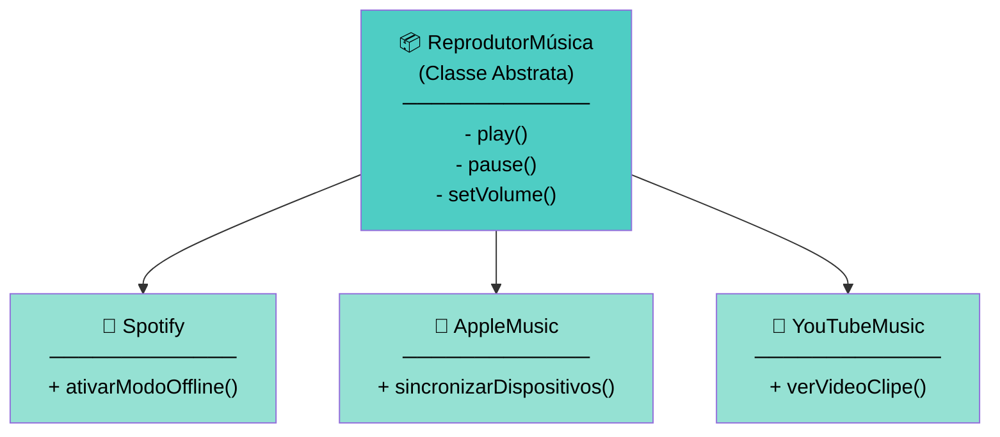

### ❓ Perguntas Comuns dos Alunos

**P1: Qual é a diferença entre classe abstrata e interface?**
> R: Classe abstrata pode ter código implementado; interface é um contrato puro. Uma classe herda de uma abstrata, mas implementa várias interfaces.

**P2: Posso herdar de múltiplas classes?**
> R: Em Java, NÃO. Mas você pode implementar várias interfaces. Isso é chamado "herança múltipla de interface".

**P3: Por que usar `abstract` se não posso instanciar?**
> R: Para garantir que as subclasses implementem certos métodos. É uma forma de contrato.

---

## 4️⃣ POLIMORFISMO

### O que é?

**Polimorfismo** significa "muitas formas". É quando um objeto de tipo pai pode se comportar como seus filhos.

É como um "control remoto universal": funciona com TV, ar-condicionado, videogame - tudo responde aos mesmos botões de forma diferente.

### Visão Geral

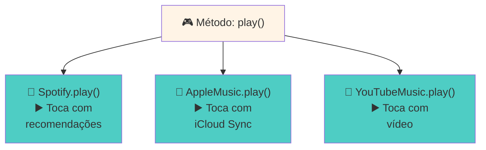

### Exemplo Prático em Java

```java
// ===== POLIMORFISMO EM AÇÃO =====

public class CentroMúsica {
    
    // Método que aceita a CLASSE PAI
    // Mas pode trabalhar com qualquer CLASSE FILHA
    public static void reproduzirEmTodosSistemas(
        List<ReprodutorMúsica> reprodutores,
        String nomeMusica
    ) {
        System.out.println("🎵 Reproduzindo: " + nomeMusica + "\n");
        
        // Polimorfismo aqui! O mesmo método play() faz coisas diferentes
        for (ReprodutorMúsica reprodutor : reprodutores) {
            reprodutor.músicaAtual = nomeMusica;
            reprodutor.play();  // ⭐ POLIMORFISMO: comportamentos diferentes!
        }
    }
    
    // Outro exemplo: sincronizar com diferentes plataformas
    public static void sincronizarTudo(List<ReprodutorMúsica> reprodutores) {
        System.out.println("\n🔄 Sincronizando todas as plataformas...\n");
        
        for (ReprodutorMúsica reprodutor : reprodutores) {
            reprodutor.sincronizar();  // ⭐ POLIMORFISMO: cada um sincroniza diferente!
        }
    }
    
    // Ajustar volume em todos
    public static void ajustarVolumeGlobal(
        List<ReprodutorMúsica> reprodutores,
        int volume
    ) {
        System.out.println("\n📢 Ajustando volume global para: " + volume + "\n");
        
        for (ReprodutorMúsica reprodutor : reprodutores) {
            reprodutor.setVolume(volume);  // Mesmo método, mesmo comportamento
        }
    }
}

// ===== TESTE COMPLETO =====
public class TestePolimorfismo {
    public static void main(String[] args) {
        // Criando uma lista de REPRODUTORES (tipo pai)
        // Mas adicionando SUBCLASSES (tipos filhos)
        List<ReprodutorMúsica> minhasPlataformas = new ArrayList<>();
        minhasPlataformas.add(new Spotify());
        minhasPlataformas.add(new AppleMusic());
        minhasPlataformas.add(new YouTubeMusic());
        
        // POLIMORFISMO: A mesma chamada, comportamentos diferentes!
        CentroMúsica.reproduzirEmTodosSistemas(
            minhasPlataformas,
            "Shape of You - Ed Sheeran"
        );
        
        CentroMúsica.sincronizarTudo(minhasPlataformas);
        CentroMúsica.ajustarVolumeGlobal(minhasPlataformas, 70);
        
        System.out.println("\n========== POLIMORFISMO EM AÇÃO ==========\n");
        System.out.println("✅ Com POLIMORFISMO:");
        System.out.println("   - Mesmo código funciona com Spotify, Apple Music, YouTube Music");
        System.out.println("   - Cada plataforma responde à sua forma");
        System.out.println("   - Fácil adicionar novas plataformas!");
    }
}

// ===== EXEMPLO: POLIMORFISMO COM INSTANCEOF =====
public class ReproductorAvançado {
    public static void mostrarRecursoEspecial(ReprodutorMúsica reprodutor) {
        System.out.println("\n🎬 Recursos especiais de " + reprodutor.nomeAplicativo + ":\n");
        
        // Verificar tipo e usar recurso específico
        if (reprodutor instanceof Spotify) {
            Spotify spotify = (Spotify) reprodutor;
            spotify.ativarModoOffline();
        }
        else if (reprodutor instanceof AppleMusic) {
            AppleMusic apple = (AppleMusic) reprodutor;
            apple.sincronizarComDispositivos();
        }
        else if (reprodutor instanceof YouTubeMusic) {
            YouTubeMusic youtube = (YouTubeMusic) reprodutor;
            youtube.verVideoClipe();
        }
    }
    
    public static void main(String[] args) {
        List<ReprodutorMúsica> plataformas = new ArrayList<>();
        plataformas.add(new Spotify());
        plataformas.add(new AppleMusic());
        plataformas.add(new YouTubeMusic());
        
        for (ReprodutorMúsica plataforma : plataformas) {
            mostrarRecursoEspecial(plataforma);
        }
    }
}
```

### Diagrama do Polimorfismo

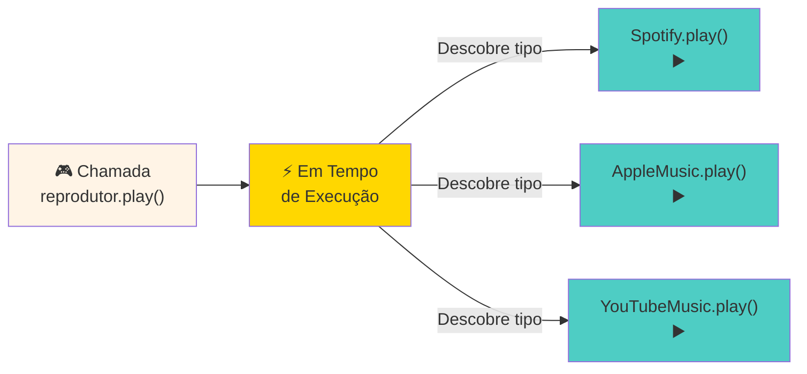

### Visão Geral: Sem vs Com Polimorfismo

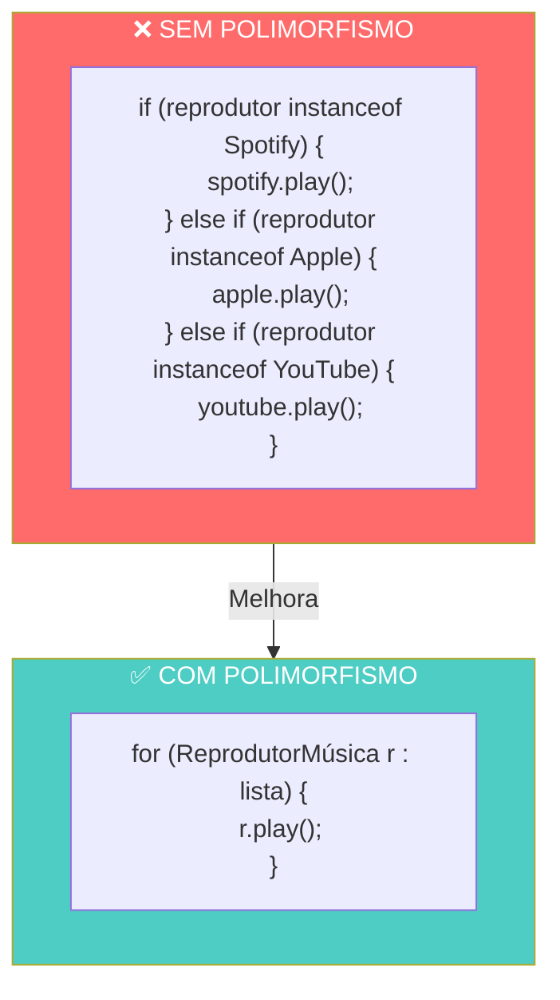

### ❓ Perguntas Comuns dos Alunos

**P1: Como o Java sabe qual método chamar?**
> R: Em tempo de execução (runtime), o Java verifica o tipo real do objeto e chama o método apropriado. Isso se chama "dynamic dispatch".

**P2: Qual é a diferença entre `@Override` e sobrescrita normal?**
> R: `@Override` é uma anotação que ajuda o compilador a verificar erros. Sem ela, pode haver problemas silenciosos.

**P3: Posso usar polimorfismo com interfaces também?**
> R: Sim! Interfaces definem contratos que múltiplas classes podem implementar. É polimorfismo puro.

---

## 📊 Resumo Comparativo dos 4 Pilares

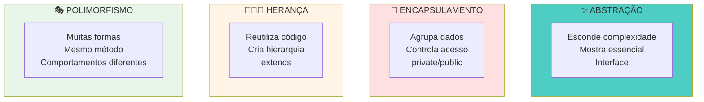

| Pilar | O Quê | Por Quê | Exemplo |
|-------|-------|---------|---------|
| **Abstração** | Esconde a implementação | Simplificar | Interface `Reprodutor` |
| **Encapsulamento** | Protege dados | Segurança | `private String senha` |
| **Herança** | Reutiliza código | Eficiência | `Spotify extends ReprodutorMúsica` |
| **Polimorfismo** | Mesma chamada, comportamentos diferentes | Flexibilidade | `reprodutor.play()` |

---

## 🎬 Exemplo Completo: Sistema de Streaming Integrado

```java
// Estrutura completa
public class SistemaStreaming {
    public static void main(String[] args) {
        System.out.println("═══════════════════════════════════════════");
        System.out.println("     🎵 SISTEMA DE STREAMING DE MÚSICA 🎵    ");
        System.out.println("═══════════════════════════════════════════\n");
        
        // Criando usuários e plataformas
        ContaMúsica usuario1 = new ContaMúsica("João Silva", "joao@email.com", "senha123");
        
        List<ReprodutorMúsica> plataformas = new ArrayList<>();
        plataformas.add(new Spotify());
        plataformas.add(new AppleMusic());
        plataformas.add(new YouTubeMusic());
        
        // Fazendo login (ENCAPSULAMENTO)
        usuario1.fazerLogin("senha123");
        
        // Reproduzindo em todas as plataformas (POLIMORFISMO)
        CentroMúsica.reproduzirEmTodosSistemas(
            plataformas,
            "Blinding Lights - The Weeknd"
        );
        
        // Ajustando volume (ENCAPSULAMENTO + POLIMORFISMO)
        CentroMúsica.ajustarVolumeGlobal(plataformas, 85);
        
        // Sincronizando (POLIMORFISMO)
        CentroMúsica.sincronizarTudo(plataformas);
        
        // Mostrando recursos especiais
        System.out.println("\n🎁 Recursos Especiais:\n");
        for (ReprodutorMúsica p : plataformas) {
            ReproductorAvançado.mostrarRecursoEspecial(p);
        }
        
        System.out.println("\n═══════════════════════════════════════════");
        System.out.println("✅ Sistema funcionando com todos os 4 pilares!");
        System.out.println("═══════════════════════════════════════════");
    }
}
```

---

## 🎓 Checklist de Aprendizado

Após estudar este material, você deve entender:

- [ ] O que é **Abstração** e quando usá-la
- [ ] Como **Encapsulamento** protege dados
- [ ] Como **Herança** reutiliza código
- [ ] Como **Polimorfismo** aumenta flexibilidade
- [ ] A diferença entre classe abstrata e interface
- [ ] O modificador `@Override`
- [ ] Como usar `instanceof` para verificar tipos
- [ ] Como aplicar tudo junto em um projeto real

---

## 📚 Referências

- **Oracle Java Documentation**: https://docs.oracle.com/javase/tutorial/java/concepts/
- **Inheritance**: https://docs.oracle.com/javase/tutorial/java/IandI/subclasses.html
- **Polymorphism**: https://docs.oracle.com/javase/tutorial/java/IandI/polymorphism.html
- **Encapsulation**: https://docs.oracle.com/javase/tutorial/java/javaOO/accesscontrol.html

---

## 🤔 Exercícios Propostos

**Exercício 1**: Crie uma classe `PodcastPlayer` que estenda `ReprodutorMúsica`

**Exercício 2**: Implemente um sistema de usuários com diferentes níveis de acesso (Gratuito, Premium)

**Exercício 3**: Adicione uma interface `Gravador` e implemente em cada plataforma

**Exercício 4**: Crie um método que ajuste diferentes equalizadores para cada plataforma

---

**Autor**: Luis Caparroz  
**Data**: 2026-09-11  
**Versão**: 1.0
