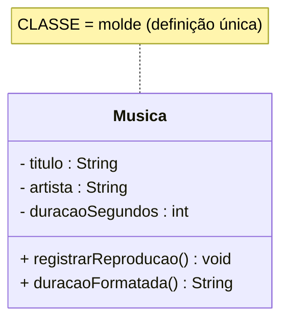

# 04 — Classe e Objetos

> Este par é o coração da OO. Confundir os dois é o erro nº 1 de quem começa. **Classe é o
> molde; objeto é o produto do molde.**

---

## 1. Conceito

- **Classe** = o **molde**, o *tipo*, a *fôrma de bolo*. Existe **uma vez**, em tempo de
  projeto. Define **quais** atributos e operações os objetos terão.
- **Objeto** = uma **instância** concreta feita a partir do molde, o *bolo assado*. Existem
  **muitos**, em tempo de execução, cada um com **seus próprios valores**.



A partir dessa classe, o sistema cria vários **objetos** em memória:

```
  m1 : Musica                      m2 : Musica                    m3 : Musica
 ┌────────────────────────┐       ┌────────────────────────┐    ┌────────────────────────┐
 │ titulo="Gravidade Zero" │       │ titulo="Cometa"         │    │ titulo="Silêncio Sid."  │
 │ artista="Banda Nébula"  │       │ artista="Banda Nébula"  │    │ artista="Banda Nébula"  │
 │ duracaoSegundos=213     │       │ duracaoSegundos=187     │    │ duracaoSegundos=245     │
 └────────────────────────┘       └────────────────────────┘    └────────────────────────┘
```

> 🎯 **Metáfora:** a **classe** é a *planta da casa*; os **objetos** são as *casas
> construídas* — todas seguem a planta, mas cada uma tem seus moradores.

---

## 2. Como reconhecer uma classe (do enunciado ao modelo)

Volte ao [enunciado do Melodia](../00-projeto-base/): **substantivos importantes com vida
própria** viram classes. Mas cuidado — nem todo substantivo é classe:

| Substantivo | Vira… | Por quê |
|-------------|-------|---------|
| ouvinte, música, conta | **classe** | tem dados **e** comportamento próprio |
| título, saldo | **atributo** | é só um valor, sem comportamento |
| "reprodução" | **classe** *ou* **evento**, conforme o contexto | depende se precisa guardar dados/histórico |

> 💡 **A pergunta que decide:** *"isto tem só valor, ou tem valor **e** comportamento (ou
> aparece muitas vezes no sistema)?"* Se só valor → atributo. Se comportamento → classe.

---

## 3. Objeto: identidade, estado e comportamento

Todo objeto tem três coisas:

- **Identidade:** ele é ele mesmo, distinto dos demais (duas contas com o mesmo saldo ainda
  são contas **diferentes**).
- **Estado:** os valores atuais dos atributos (saldo = R$ 30,10).
- **Comportamento:** o que responde às mensagens (`depositar`, `sacar`).

> 🔗 **No Java:** a classe é o `class ContaBancaria { … }`; o objeto nasce com `new
> ContaBancaria("0001-1", "Ana", 50.0)`. Veja `Principal.java` no
> [projeto-base-java](../projeto-base-java/): cada `new` cria um objeto distinto.

---

## 4. Vantagens e desvantagens de pensar em classes/objetos

| ✅ Vantagens | ❌ Cuidados |
|-------------|------------|
| Organiza o sistema em unidades coesas e testáveis | Criar classes demais (uma para cada coisinha) fragmenta o código |
| Reúso: uma classe, milhares de objetos | Classe "faz-tudo" (God class) vira um monstro |
| Espelha o domínio → fácil conversar com o negócio | Confundir classe com objeto gera modelos errados |

---

## 5. Na indústria

- **Classe com uma responsabilidade só** (SRP, do [SOLID](../../../08-solid/)) é a marca de
  código de qualidade. Se você usa "e" para descrever a classe (`GerenciaContaEEnviaEmail`),
  provavelmente são **duas** classes.
- **Objetos como registros de dados:** em sistemas modernos, muitos "objetos" são apenas
  transportadores de dados (DTOs, `record` em Java). Está tudo bem — nem todo objeto precisa
  de comportamento rico, desde que a regra de negócio more em **alguma** classe (não espalhada).
- **Nomes importam:** classe é substantivo do domínio (`Assinatura`), não `Manager1` nem
  `Dados`. Nome ruim é dívida técnica silenciosa.

---

## ✅ O que levar desta pasta

- [ ] **Classe = molde (um); objeto = instância (muitos).**
- [ ] Todo objeto tem **identidade, estado e comportamento**.
- [ ] Nem todo substantivo é classe — decida por **comportamento/repetição**.
- [ ] Uma classe, **uma** responsabilidade; nome do **domínio**.

---

[⬅️ 03 - Abstração](../03-abstracao/) | [Índice](../README.md) | [05 - Associação ➡️](../05-associacao/)
