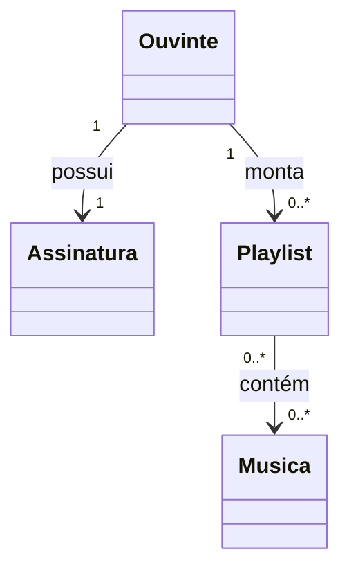
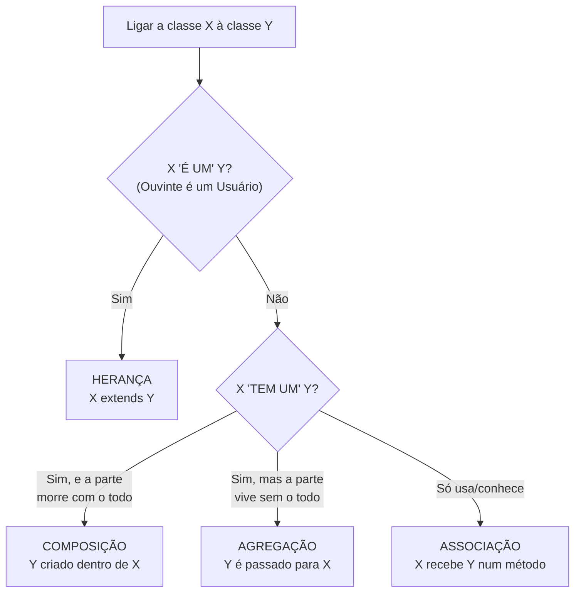

# 05 — Associação (e agregação, composição, herança)

> Objetos não vivem sozinhos: eles **se conectam**. Uma **associação** é um relacionamento
> estrutural entre classes cujos objetos **se conhecem** e **trocam mensagens**.

---

## 1. Conceito e elementos

No Melodia: um `Ouvinte` **tem uma** `Assinatura`; uma `Playlist` **tem** `Musica`s; um
`Album` **é feito de** faixas. Cada ligação é uma associação, descrita por:

- **Nome/verbo:** o que a ligação significa (*tem, refere-se a, publica*).
- **Multiplicidade:** *quantos* objetos participam de cada lado.
- **Navegabilidade:** de que lado se enxerga o outro (seta).
- **Papel (role):** o "cargo" de cada ponta.

### Multiplicidades mais comuns
| Notação | Significado |
|---------|-------------|
| `1` | exatamente um |
| `0..1` | zero ou um (opcional) |
| `*` ou `0..*` | zero ou muitos |
| `1..*` | um ou muitos |
| `2..5` | entre 2 e 5 |

*Leia: um ouvinte possui exatamente uma assinatura e monta de zero a muitas playlists; uma
playlist contém de zero a muitas músicas, e uma música pode estar em muitas playlists.*

---

## 2. Os quatro sabores de relacionamento

| Tipo | Símbolo UML | Semântica | Exemplo no Melodia |
|------|-------------|-----------|--------------------|
| **Associação** simples | linha `───` | "usa/conhece" | `Playlist` — `Musica` |
| **Agregação** | losango vazio `◇──` | "tem um", parte **independente** do todo | `Playlist` ◇── `Musica` |
| **Composição** | losango cheio `◆──` | "é feito de", parte **morre** com o todo | `Album` ◆── `Musica`; `ContaBancaria` ◆── `Transacao` |
| **Herança** (generalização) | triângulo `──▷` | "é um" | `Ouvinte` ──▷ `Usuario` |

### O par que ensina tudo: Album × Playlist
As duas apontam para `Musica`, mas:
- **`Album` (composição):** as faixas são **criadas dentro** do álbum e não fazem sentido
  soltas. Se o álbum some, as faixas somem.
- **`Playlist` (agregação):** apenas **aponta** para músicas que já existem no catálogo. Se a
  playlist some, as músicas **continuam** lá.

> 🔗 **No Java:** compare `catalogo/Album.java` (cria a faixa: `adicionarFaixa(...)`) com
> `catalogo/Playlist.java` (recebe uma música existente: `adicionar(Musica m)`) no
> [projeto-base-java](../projeto-base-java/). É a composição vs. agregação **no código**.

---

## 3. O teste "é-um vs tem-um"

> 🧠 **Regra que salva vidas:** na dúvida entre herança e composição, **prefira composição**.
> Herança é forte e rígida; use só quando o "é um" for realmente verdadeiro.

---

## 4. Vantagens, desvantagens e o perigo do acoplamento

| ✅ Vantagens de modelar bem os relacionamentos | ❌ Riscos |
|-----------------------------------------------|----------|
| A multiplicidade documenta regras (1 conta por ouvinte) | Associações demais = **alto acoplamento** (tudo depende de tudo) |
| Composição comunica *ciclo de vida* (parte morre com o todo) | Herança forçada engessa o design |
| Navegabilidade evita dependências desnecessárias | Associações bidirecionais exigem manter os dois lados em sincronia |

> ⚠️ **Cheiro:** setas para todo lado num diagrama de classes = *acoplamento alto*. Bons
> modelos têm **poucas** dependências, bem direcionadas.

---

## 5. Na indústria

- **Multiplicidade vira constraint no banco:** `1 --> 0..*` normalmente vira uma *foreign key*
  e um índice. Modelar a multiplicidade certa evita dados inconsistentes.
- **"Composição sobre herança"** é um mantra de código profissional (Effective Java, GoF). A
  maioria dos frameworks modernos favorece compor objetos pequenos a herdar hierarquias
  profundas.
- **Associação bidirecional é cara:** em ORMs (JPA/Hibernate) ela é fonte comum de bugs de
  sincronização e *lazy loading*. Regra prática: **só navegue nos dois sentidos se o negócio
  realmente exigir**.

---

## ✅ O que levar desta pasta

- [ ] Associação = objetos que se **conhecem**; descrita por **multiplicidade** e **papéis**.
- [ ] **Composição** (parte morre com o todo) × **agregação** (parte sobrevive).
- [ ] Herança é o "é um"; o resto é "tem um" → **prefira composição**.
- [ ] Menos setas = menos acoplamento = sistema mais fácil de mudar.

---

[⬅️ 04 - Classe e Objetos](../04-classe-e-objetos/) | [Índice](../README.md) | [06 - Atributos ➡️](../06-atributos/)
