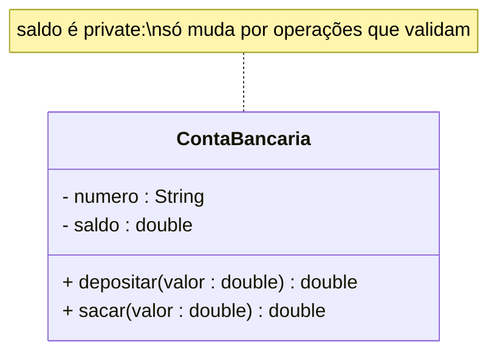

# 06 — Atributos

> Um **atributo** é uma **propriedade nomeada** de uma classe — um dado que todo objeto dela
> guarda. Se a operação é o *verbo*, o atributo é o *substantivo/adjetivo* do objeto.

---

## 1. Sintaxe UML completa

```
[visibilidade] nome [multiplicidade] : tipo [= valorPadrão] [{propriedades}]
```

Exemplos lidos da esquerda para a direita (domínio Melodia):

```
- saldo : double = 0.0
- titulo : String
- duracaoSegundos : int {>= 0}
- status : StatusAssinatura = ATIVA
+ ROYALTY_POR_REPRODUCAO : double = 0.004   {readOnly}   ← sublinhado = estático (de classe)
```

---

## 2. Visibilidade (quem pode acessar)

| Símbolo | Nome | Quem enxerga |
|---------|------|--------------|
| `-` | private | só a própria classe |
| `+` | public | qualquer um |
| `#` | protected | a classe e suas subclasses |
| `~` | package | classes do mesmo pacote |

> 🎯 **Regra de ouro:** atributos quase sempre `-` (**private**). O acesso vem por
> **operações** (getters/setters com validação). Isso é **encapsulamento**.

### Por que private? O exemplo do saldo
No [projeto-base-java](../projeto-base-java/), `ContaBancaria.saldo` é `private`. Se fosse
`public`, qualquer código poderia fazer `conta.saldo = -999` e **quebrar a regra R1** ("saldo
nunca negativo"). Sendo private, a única forma de mexer é via `depositar()`/`sacar()`, que
**validam**. O atributo privado é o que torna o **invariante** possível.



---

## 3. Tipos de atributos

- **Atributo de instância:** cada objeto tem o seu (`saldo` — cada conta o seu).
- **Atributo de classe (estático):** um só para todos, **sublinhado** na UML
  (`ROYALTY_POR_REPRODUCAO`).
- **Atributo derivado (`/`):** calculado, não armazenado. Ex.: `/ duracaoTotal` de uma
  playlist é a soma das faixas — não guardamos, calculamos quando pedem
  (`duracaoTotalSegundos()`).

---

## 4. Vantagens e desvantagens

| ✅ Boas práticas | ❌ Cheiros a evitar |
|-----------------|---------------------|
| Private + validação = dados sempre consistentes | Atributos públicos (qualquer um corrompe o estado) |
| Derivar em vez de duplicar dados que já dá pra calcular | Guardar dado derivado e esquecer de atualizá-lo (inconsistência) |
| Tipos ricos (`StatusAssinatura` enum) em vez de `int`/`String` mágicos | "String tipada": guardar status como texto livre |
| Poucos atributos, todos usados | Classe com 30 campos → provavelmente são várias classes |

---

## 5. Na indústria (como sim, como não)

- ✅ **Encapsular de verdade:** private + getter com regra. Ex.: não expor `List` interna;
  retornar cópia read-only (como `getExtrato()` faz). Vazar a lista mutável é um bug comum.
- ⚠️ **Getters/setters automáticos para tudo** (o "*anemic model*"): gerar `get/set` de todos
  os campos e deixar a regra fora da classe **destrói** o encapsulamento — vira struct com
  cerimônia. Só exponha o que o negócio precisa.
- 💰 **Dinheiro nunca é `double` em produção:** use `BigDecimal` (ou centavos em `long`).
  `double` acumula erro de arredondamento — no Melodia usamos `double` **só por didática**.
- **Tipos ricos > primitivos:** modelar `status` como enum, `cpf`/`email` como *value objects*
  evita a praga do "*primitive obsession*".

---

## ✅ O que levar desta pasta

- [ ] Atributo = **propriedade nomeada**; sintaxe UML tem visibilidade, tipo, padrão.
- [ ] **Private por padrão** — é o que sustenta os invariantes (ex.: saldo ≥ 0).
- [ ] Conheça **instância × classe (estático) × derivado (`/`)**.
- [ ] Fuja do modelo anêmico e do dinheiro em `double` (use `BigDecimal`).

---

[⬅️ 05 - Associação](../05-associacao/) | [Índice](../README.md) | [07 - Operações ➡️](../07-operacoes/)
