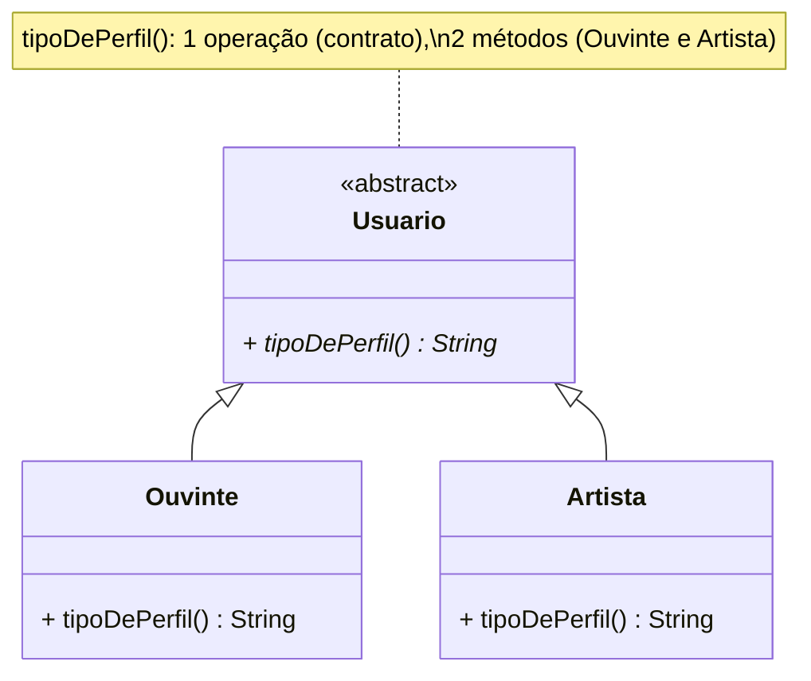

# 07 — Operações

> Uma **operação** (implementada como **método**) é um **serviço** que a classe oferece — o
> que os objetos dela sabem **fazer**. É onde mora o comportamento; sem operações, uma classe
> é só um saco de dados (o cheiro da *classe anêmica*).

---

## 1. Sintaxe UML

```
[visibilidade] nome([parâmetros]) : tipoDeRetorno [{propriedades}]
```

Cada parâmetro: `[direção] nome : tipo [= padrão]`, com direção `in` (entra, padrão),
`out` (sai) ou `inout`.

Exemplos (Melodia):

```
+ depositar(valor : double) : double
+ cobrar(conta : ContaBancaria) : boolean
+ reproduzir(ouvinte : Ouvinte, musica : Musica) : String
- exigirSaldoSuficiente(valor : double) : void        ← privada (uso interno)
+ ROYALTY_POR_REPRODUCAO() : double   {static}         ← sublinhado = de classe
```

---

## 2. Operação × Método (a distinção que cai em prova)

- **Operação** = a **declaração**, o *contrato*: nome + parâmetros + retorno (a **assinatura**).
  É o *o quê*.
- **Método** = a **implementação** concreta: o corpo, o código. É o *como*.

Em **polimorfismo**, uma operação pode ter **vários métodos** (um por subclasse):



> 🔗 **No Java:** `Usuario.tipoDePerfil()` é `abstract` (operação); `Ouvinte` retorna
> `"Ouvinte"` e `Artista` retorna `"Artista"` (dois métodos). Rode `Principal.java` e veja a
> **ligação dinâmica** escolher o método certo pelo objeto real.

---

## 3. Boas operações contam uma história de negócio

Compare no `ContaBancaria`:
- `debitarAssinatura(valor, descricao)` diz **a intenção** (pagamento de assinatura).
- `sacar(valor)` diz outra intenção (saque comum).

Ambos mexem no saldo, mas o **nome e o tipo de transação** comunicam o *porquê* — ouro para
auditoria e relatórios. Operações bem nomeadas são **documentação executável**.

---

## 4. Vantagens e desvantagens

| ✅ Boas práticas | ❌ Cheiros a evitar |
|-----------------|---------------------|
| Nome = verbo do domínio (`cobrar`, `reproduzir`) | Nomes vagos (`processar`, `fazer`, `handle`) |
| Uma operação faz **uma** coisa (coesa) | Método gigante que faz dez coisas |
| Comportamento mora junto dos dados que usa | Regra fora da classe (modelo anêmico) |
| Operações privadas escondem passos internos | Tudo público = interface poluída e acoplamento |

---

## 5. Na indústria (como sim, como não)

- ✅ **Comando vs. consulta (CQS):** um método ou **muda estado** (comando, ex.: `depositar`)
  **ou** **responde uma pergunta** (consulta, ex.: `getSaldo`), evitando o pior dos mundos —
  um método que muda estado *e* retorna, escondendo efeitos colaterais.
- ✅ **Contratos claros:** documente o que a operação exige (pré-condição) e garante
  (pós-condição). No código, isso vira validações e exceções (`IllegalStateException` quando o
  saldo é insuficiente).
- ⚠️ **Métodos com muitos parâmetros** (4+) são sinal de que falta um objeto agrupando-os
  (*parameter object*). Ex.: em vez de `reproduzir(id, qualidade, dispositivo, regiao, ...)`,
  passe um `ContextoDeReproducao`.
- ⚠️ **Efeitos colaterais escondidos** são a fonte nº 1 de bugs difíceis; nomes honestos
  (`cobrarESuspenderSeFalhar`) ou métodos separados evitam surpresas.

---

## ✅ O que levar desta pasta

- [ ] Operação = **serviço/comportamento**; sua **assinatura** é o contrato.
- [ ] **Operação (contrato) × método (implementação)** — polimorfismo usa 1 operação, N métodos.
- [ ] Nome de operação = **verbo do domínio**, uma responsabilidade só.
- [ ] Separe **comando** (muda estado) de **consulta** (retorna dado).

---

[⬅️ 06 - Atributos](../06-atributos/) | [Índice](../README.md) | [08 - Diagrama de Casos de Uso ➡️](../08-diagrama-casos-de-uso/)
