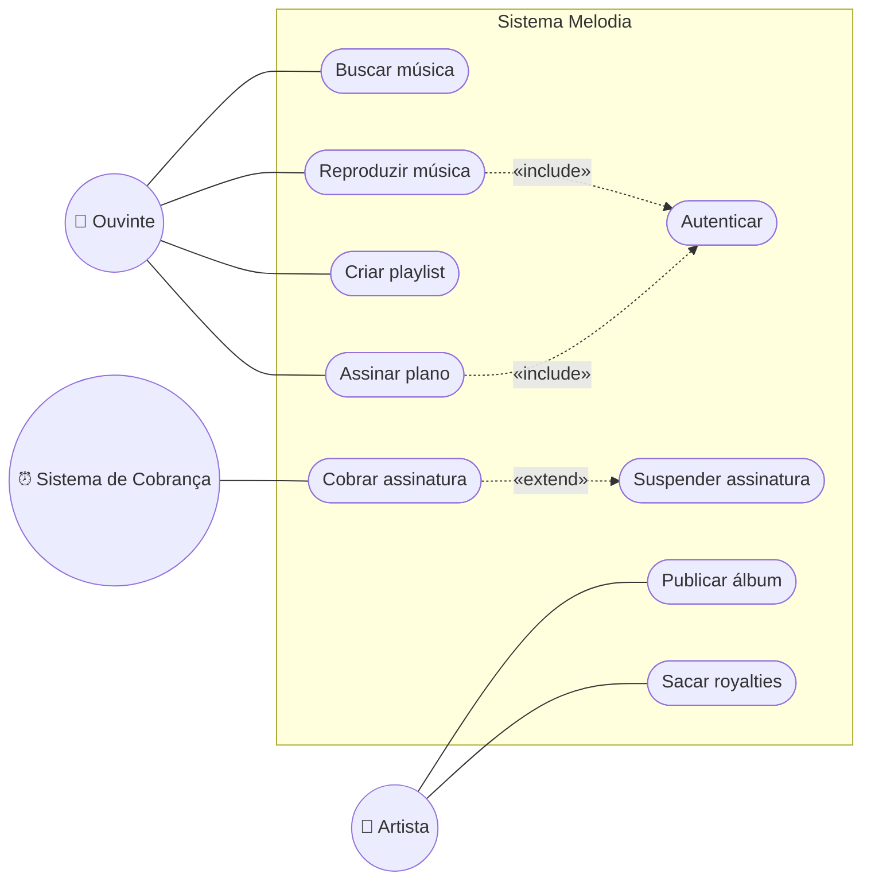

# 08 — Diagrama de Casos de Uso

**📌 Família:** comportamental · **Responde:** *o que o sistema faz e para quem?*

---

## 1. Conceito

O diagrama de **casos de uso** mostra as **funcionalidades** do sistema (casos de uso) do
ponto de vista de quem as usa (**atores**). É a visão mais *externa* e de mais alto nível —
perfeita para conversar com o cliente e **delimitar o escopo**. Ele diz **o quê**, nunca *como*.

---

## 2. Notação

- **Ator** (boneco palito): quem interage com o sistema — pessoa, cargo ou **outro sistema**.
  Fica **fora** da fronteira.
- **Caso de uso** (elipse): uma funcionalidade completa que **entrega valor**. Sempre
  **verbo + objeto** (*"Assinar plano"*).
- **Fronteira do sistema** (retângulo): separa o sistema do mundo externo.
- **Relacionamentos:**
  - **Associação** (linha ator—caso): o ator participa do caso.
  - **`«include»`**: um caso **sempre** usa outro (obrigatório). *Assinar* **inclui** *Autenticar*.
  - **`«extend»`**: um caso **às vezes** estende outro (opcional/condicional). *Aplicar multa
    por atraso* **estende** *Cobrar assinatura*.
  - **Generalização de ator** (triângulo): um ator é um tipo de outro.

---

## 3. Aplicação e exemplo (Melodia)

> 🧠 **Leitura:** reproduzir e assinar **sempre** exigem autenticar (`include`); a cobrança
> mensal **pode** disparar uma suspensão se faltar saldo (`extend`, condicional). O "Sistema
> de Cobrança" é um **ator de tempo** (dispara sozinho, por agendamento).

### Descrição de caso de uso (o texto por trás da elipse)
O diagrama é a capa; o valor está na **descrição textual** de cada caso:

| Campo | "Assinar plano" |
|-------|-----------------|
| **Ator** | Ouvinte |
| **Pré-condição** | Ouvinte autenticado, plano escolhido |
| **Fluxo principal** | 1. Escolhe plano → 2. Sistema cobra a conta → 3. Ativa assinatura |
| **Fluxo alternativo** | 2a. Saldo insuficiente → assinatura fica *suspensa* |
| **Pós-condição** | Assinatura ativa e transação registrada |

---

## 4. Vantagens e desvantagens

| ✅ Vantagens | ❌ Desvantagens |
|-------------|-----------------|
| Linguagem que o **cliente entende** (sem jargão técnico) | Diz *o quê*, não *como* — não substitui o projeto |
| Delimita **escopo** e ajuda a priorizar | Fácil cair no exagero de `include`/`extend` |
| Base para planejar **testes de aceitação** | Não mostra ordem, dados nem regras detalhadas |

> ⚠️ **Erro clássico:** transformar cada **clique de tela** em caso de uso ("Clicar botão
> login"). Caso de uso é um **objetivo do usuário** ("Autenticar"), não um passo de interface.

---

## 5. Na indústria (como sim, como não)

- ✅ **Muito usado no início de projeto** e em licitações/contratos para fechar escopo.
- 🔄 **No ágil**, casos de uso frequentemente dão lugar a **user stories** (*"Como ouvinte,
  quero assinar Premium para ouvir sem anúncios"*) — mesma ideia, formato mais leve.
- ❌ **Não** use casos de uso para descrever lógica interna ou fluxo de dados — para isso há
  os diagramas de **atividades** e **sequência**.
- 💡 O maior valor costuma estar na **descrição textual** e nos **fluxos alternativos**, não no
  desenho em si.

---

## 🔗 Ligação com o Java

Os casos de uso viram **métodos da fachada** `PlataformaStreaming` (`assinarPremium`,
`reproduzir`) e disparam o resto do sistema. Veja o
[projeto-base-java](../projeto-base-java/).

---

## ✅ O que levar desta pasta

- [ ] Casos de uso = **funcionalidades × atores**; dizem *o quê*, não *como*.
- [ ] Domino **`«include»`** (sempre) vs **`«extend»`** (condicional).
- [ ] O valor real está na **descrição textual** (fluxos principal e alternativos).
- [ ] No ágil, viram **user stories**.

---

[⬅️ 07 - Operações](../07-operacoes/) | [Índice](../README.md) | [09 - Diagrama de Classes ➡️](../09-diagrama-de-classes/)
