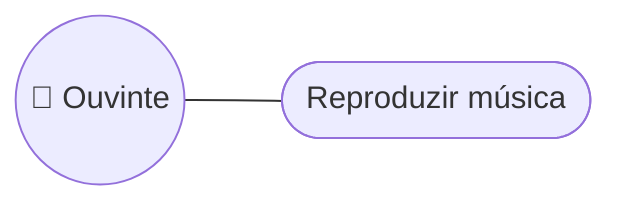
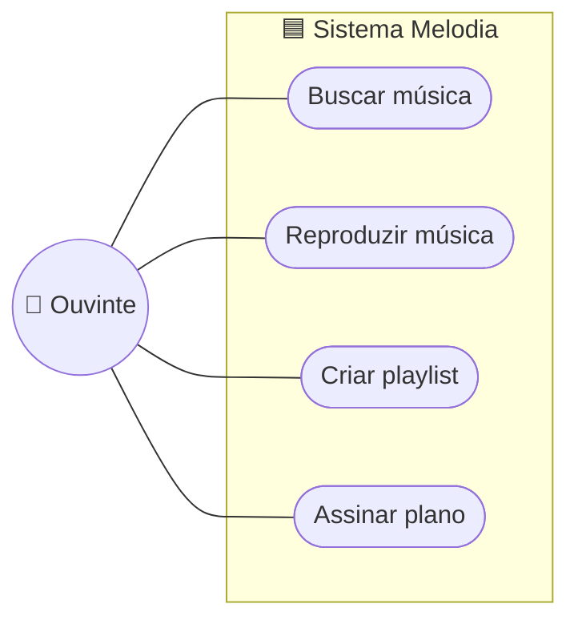
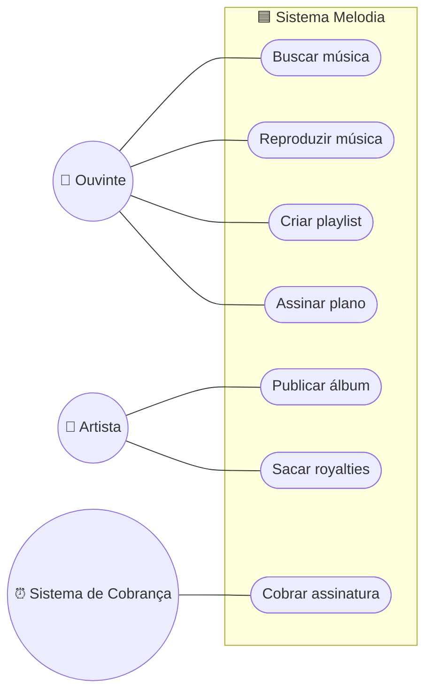
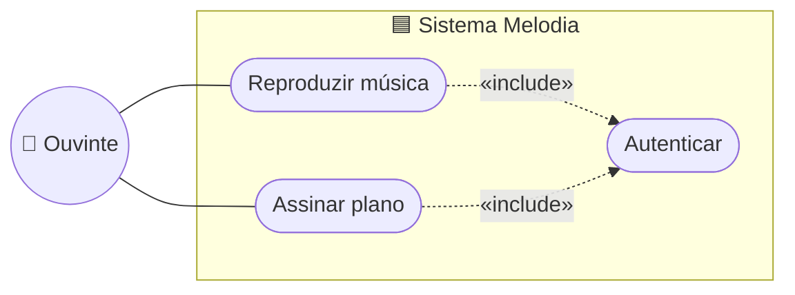
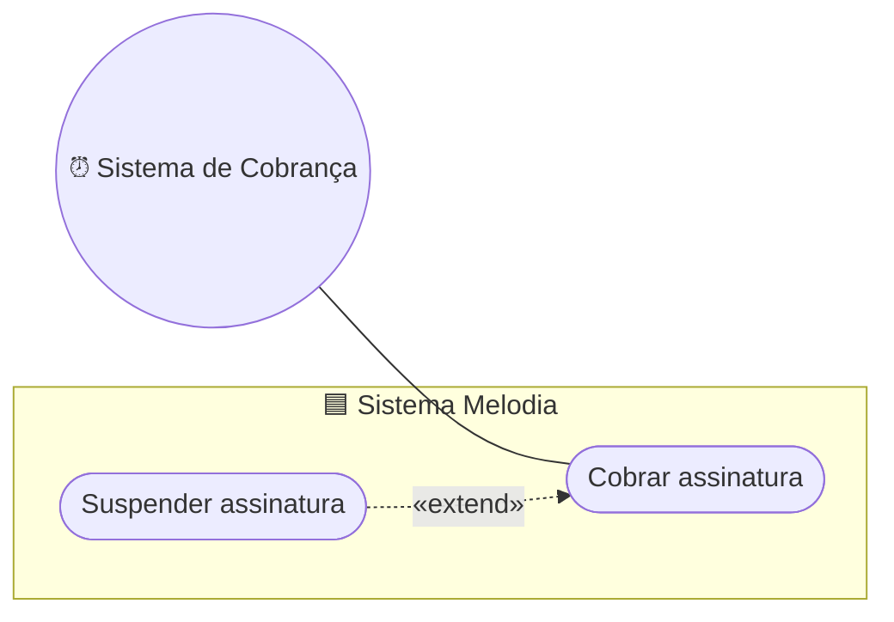
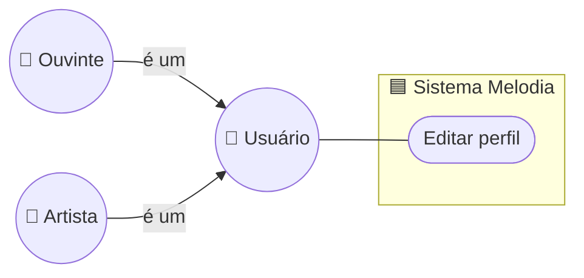
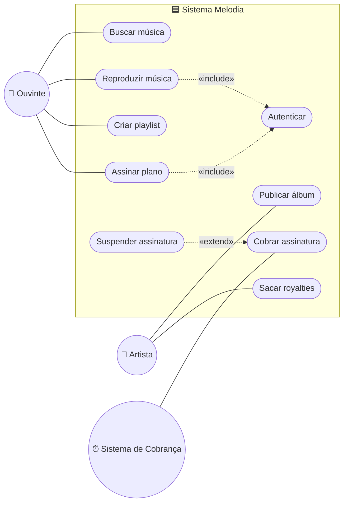

# 08 — Diagrama de Casos de Uso

**📌 Família:** comportamental · **Responde:** *o que o sistema faz e para quem?*

> 🎯 **Meta desta aula:** ao final você vai **ler** e **desenhar** um diagrama de casos de uso,
> saber explicar **cada símbolo** e, principalmente, saber **quando** usar `«include»` e
> `«extend»` sem errar. Vamos construir o diagrama do **Melodia** (nosso "Spotify") do zero,
> um pedaço de cada vez, sempre dizendo **por que** cada elemento entrou.

---

## 1. Conceito — a "capa" do sistema

O diagrama de **casos de uso** mostra as **funcionalidades** do sistema (os *casos de uso*) do
ponto de vista de **quem as usa** (os *atores*). É a visão mais **externa** e de mais **alto
nível** da UML — a que você desenha **primeiro**, ainda conversando com o cliente, para
**delimitar o escopo**: o que entra e o que fica de fora do sistema.

A regra de ouro: ele diz **o QUÊ**, nunca o **COMO**.

| O diagrama de casos de uso **responde** | O diagrama de casos de uso **NÃO responde** |
|------------------------------------------|---------------------------------------------|
| Quais funcionalidades existem? | Em que ordem as coisas acontecem? (→ [sequência](../11-diagrama-de-sequencia/)) |
| Quem usa cada funcionalidade? | Quais classes/atributos existem? (→ [classes](../09-diagrama-de-classes/)) |
| Onde está a fronteira do sistema? | Qual a lógica interna de cada passo? (→ [atividades](../15-diagrama-de-atividades/)) |

> 🧭 **Analogia:** é o **cardápio** de um restaurante. Ele lista **o que você pode pedir**
> (pratos = casos de uso) e **quem pede o quê** (cliente, garçom, cozinha = atores). O cardápio
> **não** ensina a *cozinhar* o prato — isso é a receita (os outros diagramas).

---

## 2. Notação — cada símbolo, um por um

Antes de desenhar, vamos entender **cada peça** e **por que ela existe**.

| Símbolo | Nome | O que representa | Regra prática |
|---------|------|------------------|----------------|
| 👤 (boneco palito) | **Ator** | Quem interage com o sistema: uma pessoa, um **cargo/papel** ou **outro sistema**. | Fica **FORA** da fronteira. É um *papel*, não uma pessoa específica ("Ouvinte", não "a Ana"). |
| ⬭ (elipse) | **Caso de uso** | Uma funcionalidade **completa** que **entrega valor** ao ator. | Nome sempre **verbo + objeto**: *"Assinar plano"*, *"Reproduzir música"*. |
| ▭ (retângulo) | **Fronteira do sistema** | A "caixa" que separa o sistema do mundo. | Casos de uso ficam **dentro**; atores ficam **fora**. |
| — (linha) | **Associação** | Liga um ator ao caso de uso que ele usa. | Uma linha simples, sem seta. Significa "este ator participa deste caso". |
| ·····▷ `«include»` | **Inclusão** | Um caso **SEMPRE** usa outro (obrigatório). | A seta aponta para o caso **incluído** (o reaproveitado). |
| ·····▷ `«extend»` | **Extensão** | Um caso **ÀS VEZES** estende outro (opcional/condicional). | A seta aponta para o caso **base** (o que é estendido). |
| △ (triângulo) | **Generalização de ator** | Um ator é um **tipo de** outro ator. | Mesma ideia da herança: o filho herda as associações do pai. |

### 🔁 O par que mais confunde: `«include»` × `«extend»`

Decore com uma frase:

- **`«include»` = "para fazer A, SEMPRE tenho que fazer B"** — obrigatório, sempre acontece.
  Ex.: para *Reproduzir música*, **sempre** é preciso *Autenticar*.
- **`«extend»` = "ao fazer A, TALVEZ aconteça B"** — condicional, só em certos casos.
  Ex.: ao *Cobrar assinatura*, **talvez** ocorra *Suspender assinatura* (se faltar saldo).

| | `«include»` | `«extend»` |
|---|-------------|------------|
| Quando acontece? | **Sempre** | **Às vezes** (tem uma condição) |
| Direção da seta | Base ·····▷ **incluído** | Extensão ·····▷ **base** |
| Pergunta-teste | "Sem isso o caso funciona?" → **Não** | "Sem isso o caso funciona?" → **Sim** |
| Por que existir? | **Evitar repetição** (vários casos reaproveitam um) | Isolar um **comportamento excepcional** sem poluir o fluxo principal |

> ⚠️ Na dúvida entre os dois, **prefira `«include»`** (ou nem use nenhum). `«extend»` é o que
> mais gera diagramas confusos. Ninguém nunca foi demitido por desenhar um diagrama de casos de
> uso *simples demais*.

---

## 3. Construindo o diagrama do Melodia — passo a passo

Vamos montar o diagrama por **camadas**. Comece lendo cada diagrama e, só depois, a explicação
do que foi adicionado e **por quê**.

### Passo 1 — Um ator, um caso de uso (o átomo)

Toda modelagem de casos de uso começa com a pergunta: *quem quer fazer o quê?* No Melodia, a
resposta mais óbvia é: **um ouvinte quer ouvir música.**

```mermaid
flowchart LR
    ouvinte(("👤 Ouvinte")) --- uc(["Reproduzir música"])
```

**O que temos aqui?** Um **ator** (`Ouvinte`, um papel) ligado por uma **associação** (a linha)
a um **caso de uso** (`Reproduzir música`, verbo + objeto). Isto já é um diagrama de casos de
uso **válido**. Repare: dizemos *o quê* (reproduzir), não *como* (apertar play, carregar o
buffer…).

### Passo 2 — A fronteira e mais funcionalidades do mesmo ator

Um ouvinte faz mais do que ouvir. Vamos listar o que ele quer **realizar** (objetivos, não
cliques) e colocar tudo **dentro da fronteira do sistema**.

```mermaid
flowchart LR
    ouvinte(("👤 Ouvinte"))

    subgraph SB["🟦 Sistema Melodia"]
        uc1(["Buscar música"])
        uc2(["Reproduzir música"])
        uc3(["Criar playlist"])
        uc4(["Assinar plano"])
    end

    ouvinte --- uc1
    ouvinte --- uc2
    ouvinte --- uc3
    ouvinte --- uc4
```

**Por que a fronteira (`subgraph`)?** Ela torna explícito o **escopo**: tudo que está na caixa é
responsabilidade do *nosso* sistema. O ator fica **fora** porque ele não é parte do software —
ele o **usa**. Esse recorte é exatamente a **abstração** da [aula 03](../03-abstracao/): escolher
o que entra e o que fica de fora.

### Passo 3 — Mais atores (inclusive um que não é gente)

Um sistema real tem **vários papéis**. No Melodia também há o **Artista** (publica músicas,
saca royalties) e um ator muito especial: o **Sistema de Cobrança**, que **não é uma pessoa** —
é um **ator de tempo** (um agendador que dispara a cobrança mensal sozinho).

```mermaid
flowchart LR
    ouvinte(("👤 Ouvinte"))
    artista(("👤 Artista"))
    cobranca(("⏰ Sistema de Cobrança"))

    subgraph SB["🟦 Sistema Melodia"]
        uc1(["Buscar música"])
        uc2(["Reproduzir música"])
        uc3(["Criar playlist"])
        uc4(["Assinar plano"])
        uc6(["Publicar álbum"])
        uc7(["Sacar royalties"])
        uc8(["Cobrar assinatura"])
    end

    ouvinte --- uc1
    ouvinte --- uc2
    ouvinte --- uc3
    ouvinte --- uc4
    artista --- uc6
    artista --- uc7
    cobranca --- uc8
```

**Por quê?** Dois aprendizados importantes aqui:
1. **Ator não precisa ser humano.** Outro sistema, um sensor ou um **agendador** (tempo) também
   é ator. O relógio ⏰ do `Sistema de Cobrança` é a dica visual de "ator de tempo".
2. **Cada ator se liga só aos casos que lhe dizem respeito.** O ouvinte não *publica álbum*; o
   artista não *cria playlist* (neste recorte). Isso já documenta **permissões/escopo** de cada
   papel.

### Passo 4 — Reúso obrigatório com `«include»`

Olhe para *Reproduzir música* e *Assinar plano*: **antes das duas**, o usuário precisa estar
logado. Em vez de desenhar "Autenticar" grudado em cada uma (repetição!), criamos **um** caso de
uso *Autenticar* e dizemos que os outros o **incluem**.

```mermaid
flowchart LR
    ouvinte(("👤 Ouvinte"))

    subgraph SB["🟦 Sistema Melodia"]
        uc2(["Reproduzir música"])
        uc4(["Assinar plano"])
        uc5(["Autenticar"])
    end

    ouvinte --- uc2
    ouvinte --- uc4

    uc2 -.->|"«include»"| uc5
    uc4 -.->|"«include»"| uc5
```

**Leitura:** "*Reproduzir música* **inclui** *Autenticar*" e "*Assinar plano* **inclui**
*Autenticar*". Como a seta sai dos dois para o **mesmo** caso incluído, deixamos claro que
*Autenticar* é um **comportamento comum reaproveitado**. Esse é o propósito nº 1 do `«include»`:
**eliminar duplicação**.

> ✅ **Teste do `«include»`:** "Dá para *Reproduzir música* **sem** *Autenticar*?" → **Não**.
> Logo, é `include` (obrigatório), não `extend`.

### Passo 5 — Comportamento condicional com `«extend»`

A cobrança mensal normalmente dá certo. Mas **se faltar saldo**, acontece algo extra: a
assinatura é **suspensa**. Isso não faz parte do fluxo normal — é uma **exceção condicional**.
Esse é o caso de uso do `«extend»`.

```mermaid
flowchart LR
    cobranca(("⏰ Sistema de Cobrança"))

    subgraph SB["🟦 Sistema Melodia"]
        uc8(["Cobrar assinatura"])
        uc9(["Suspender assinatura"])
    end

    cobranca --- uc8
    uc9 -.->|"«extend»"| uc8
```

**Leitura:** "*Suspender assinatura* **estende** *Cobrar assinatura*" — ou seja, **ao cobrar**,
*talvez* ocorra a suspensão (condição: saldo insuficiente). Note a **direção**: a seta de
`extend` aponta da extensão **para o caso base**, o contrário da intuição. O fluxo principal
(*Cobrar*) continua legível; a exceção fica isolada e não polui.

> ✅ **Teste do `«extend»`:** "Dá para *Cobrar assinatura* **sem** *Suspender*?" → **Sim**
> (quando há saldo). Logo, é `extend` (condicional), não `include`.

### Passo 6 — Generalização de ator (opcional, avançado)

No [diagrama de classes](../09-diagrama-de-classes/), `Ouvinte` e `Artista` herdam de `Usuario`.
Nos casos de uso existe algo parecido: a **generalização de ator**. Ambos são *usuários
autenticados*, então ambos podem *Editar perfil*. Em vez de ligar os dois ao mesmo caso,
criamos um ator-pai.

```mermaid
flowchart LR
    usuario(("👤 Usuário"))
    ouvinte(("👤 Ouvinte"))
    artista(("👤 Artista"))

    subgraph SB["🟦 Sistema Melodia"]
        ucp(["Editar perfil"])
    end

    ouvinte -->|"é um"| usuario
    artista -->|"é um"| usuario
    usuario --- ucp
```

**Por quê?** O `Ouvinte` e o `Artista` **herdam** a associação do pai: ambos podem *Editar
perfil* sem precisar de duas linhas. É o mesmo raciocínio da herança — fatorar o que é **comum**.
Use com parcimônia: só vale quando há mesmo **vários casos compartilhados**.

### 🏁 Diagrama completo do Melodia

Juntando todas as camadas, chegamos ao diagrama que você apresentaria ao cliente:

```mermaid
flowchart LR
    ouvinte(("👤 Ouvinte"))
    artista(("👤 Artista"))
    cobranca(("⏰ Sistema de Cobrança"))

    subgraph SB["🟦 Sistema Melodia"]
        uc1(["Buscar música"])
        uc2(["Reproduzir música"])
        uc3(["Criar playlist"])
        uc4(["Assinar plano"])
        uc5(["Autenticar"])
        uc6(["Publicar álbum"])
        uc7(["Sacar royalties"])
        uc8(["Cobrar assinatura"])
        uc9(["Suspender assinatura"])
    end

    ouvinte --- uc1
    ouvinte --- uc2
    ouvinte --- uc3
    ouvinte --- uc4
    artista --- uc6
    artista --- uc7
    cobranca --- uc8

    uc2 -.->|"«include»"| uc5
    uc4 -.->|"«include»"| uc5
    uc9 -.->|"«extend»"| uc8
```

> 🧠 **Leitura final:** *Reproduzir* e *Assinar* **sempre** exigem *Autenticar* (`include`); a
> cobrança mensal **pode** disparar uma *Suspensão* se faltar saldo (`extend`, condicional). O
> `Sistema de Cobrança` é um **ator de tempo** (dispara sozinho, por agendamento). Compare: cada
> caso de uso aqui vira um **método da fachada** `PlataformaStreaming` no
> [projeto-base-java](../projeto-base-java/).

---

## 4. O texto por trás da elipse (onde está o valor de verdade)

O desenho é só a **capa**. O conteúdo que o time realmente usa para programar e testar está na
**descrição textual** de cada caso de uso. Modele o desenho em 10 minutos; invista o tempo
**aqui**.

| Campo | "Assinar plano" (exemplo) |
|-------|---------------------------|
| **Nome** | Assinar plano Premium |
| **Ator principal** | Ouvinte |
| **Pré-condição** | Ouvinte autenticado; um plano escolhido |
| **Fluxo principal** | 1. Ouvinte escolhe o plano → 2. Sistema cobra a conta → 3. Sistema ativa a assinatura → 4. Confirma ao ouvinte |
| **Fluxo alternativo** | 2a. **Saldo insuficiente** → a assinatura fica *suspensa* e o ouvinte é avisado |
| **Pós-condição** | Assinatura ativa e transação registrada no extrato |

> 🔎 Repare que o **fluxo alternativo 2a** é exatamente o `«extend»` *Suspender assinatura* do
> desenho — e vai virar o ramo `else` do [diagrama de sequência](../11-diagrama-de-sequencia/) e
> o `if (!pago) suspender()` da classe `Assinatura` no projeto Java. **O mesmo cenário atravessa
> todos os artefatos.**

---

## 5. Vantagens e desvantagens

| ✅ Vantagens | ❌ Desvantagens |
|-------------|-----------------|
| Linguagem que o **cliente entende** (sem jargão técnico) | Diz *o quê*, não *como* — não substitui o projeto |
| Delimita **escopo** e ajuda a priorizar | Fácil cair no exagero de `include`/`extend` |
| Base para planejar **testes de aceitação** | Não mostra ordem, dados nem regras detalhadas |

> ⚠️ **Erro clássico (nº 1):** transformar cada **clique de tela** em caso de uso ("Clicar
> botão login", "Abrir menu"). Caso de uso é um **objetivo do usuário** (*"Autenticar"*), não um
> passo de interface. Pergunte: *"se eu contasse isso ao cliente, ele veria valor?"* Se não, não
> é um caso de uso.

> ⚠️ **Erro clássico (nº 2):** encher o diagrama de `«include»`/`«extend»` "para ficar
> completo". Um diagrama com 15 setas pontilhadas é ilegível. Use-os só quando **realmente**
> houver reúso (`include`) ou exceção (`extend`).

---

## 6. Na indústria (como sim, como não)

- ✅ **Muito usado no início de projeto** e em licitações/contratos para **fechar escopo** — é o
  artefato que o cliente assina embaixo.
- 🔄 **No ágil**, casos de uso frequentemente dão lugar a **user stories**:
  *"Como ouvinte, quero assinar o Premium para ouvir sem anúncios."* Mesma ideia (ator +
  objetivo + valor), formato mais leve. O diagrama vira um **mapa de histórias**.
- ❌ **Não** use casos de uso para descrever lógica interna ou fluxo de dados — para isso há os
  diagramas de **atividades** e **sequência**.
- 💡 O maior valor costuma estar na **descrição textual** e nos **fluxos alternativos**, não no
  desenho em si.

---

## 🔗 Ligação com o Java

Cada caso de uso vira um **método da fachada** `PlataformaStreaming`, que orquestra o resto do
sistema:

| Caso de uso | Método no Java |
|-------------|----------------|
| Assinar plano | `plataforma.assinarPremium(ouvinte)` |
| Reproduzir música | `plataforma.reproduzir(ouvinte, musica, artistas)` |
| Cobrar assinatura (+ `extend` Suspender) | `assinatura.cobrar(conta)` → `suspender()` se falhar |
| Sacar royalties | `artista.sacarRoyalties(contaDaPlataforma)` |

Veja o [projeto-base-java](../projeto-base-java/) — o caso de uso descreve *o quê*; o método
Java entrega *o como*.

---

## 🎯 Desafio para você criar

A Melodia vai lançar **podcasts**. Modele (sem codar):

1. Um novo ator **Locutor** (quem publica episódios). Decida: ele é um ator **novo** ou uma
   **generalização** com o `Artista` (ambos "Criadores de conteúdo")? **Justifique.**
2. Os casos *Publicar episódio* e *Reproduzir episódio*. Algum deles **inclui** *Autenticar*?
3. Um comportamento **condicional** no *Reproduzir episódio* (ex.: *"Exibir anúncio"* só quando o
   plano é FREE). É `«include»` ou `«extend»`? Aplique o **teste** da seção 2.
4. Escreva a **descrição textual** de *Reproduzir episódio* com pelo menos **um fluxo
   alternativo**.

✅ **Critério de "pronto":** seu diagrama distingue corretamente `include` (sempre) de `extend`
(condicional), e você consegue explicar **em uma frase** por que escolheu cada um.

---

## ✅ O que levar desta pasta

- [ ] Casos de uso = **funcionalidades × atores**; dizem *o quê*, não *como*.
- [ ] Ator é um **papel** (pode ser pessoa, sistema ou **tempo**) e fica **fora** da fronteira.
- [ ] Domino **`«include»`** (sempre/reúso) vs **`«extend»`** (condicional/exceção) e sei aplicar
      o teste "funciona sem isso?".
- [ ] O valor real está na **descrição textual** (fluxos principal e alternativos).
- [ ] No ágil, viram **user stories**.

---

[⬅️ 07 - Operações](../07-operacoes/) | [Índice](../README.md) | [09 - Diagrama de Classes ➡️](../09-diagrama-de-classes/)
