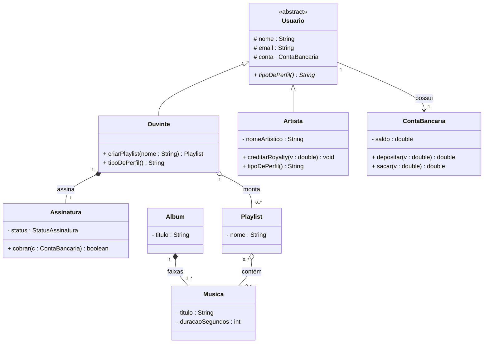

# 09 — Diagrama de Classes

**📌 Família:** estrutural · **Responde:** *quais classes existem e como se relacionam?*

---

## 1. Conceito

É o diagrama **mais importante e mais usado** da UML. Mostra as **classes** do sistema, seus
**atributos**, **operações** e os **relacionamentos** entre elas. É a "planta baixa" que se
traduz quase **1-para-1 em código** orientado a objetos.

---

## 2. Notação

Cada classe é um retângulo de **três compartimentos**:

```
┌─────────────────────────┐
│      NomeDaClasse        │  ← nome (itálico = classe abstrata)
├─────────────────────────┤
│ - atributo : Tipo        │  ← atributos
├─────────────────────────┤
│ + operacao() : Retorno   │  ← operações
└─────────────────────────┘
```

Relacionamentos: herança `──▷`, composição `◆──`, agregação `◇──`, associação `───`,
dependência `- - ->`, com **multiplicidades** nas pontas (ver [05-associacao](../05-associacao/)).

---

## 3. Aplicação e exemplo (Melodia)



> 🔎 **Todos os conceitos num só desenho:** `Usuario` **abstrata** (itálico/`<<abstract>>`)
> com `tipoDePerfil()` **abstrata** (`*`), sobrescrita nas filhas (**herança + polimorfismo**);
> `*--` de `Album` para `Musica` é **composição**; `o--` de `Playlist`/`Ouvinte` é
> **agregação**; `-->` é **associação** direcionada.

---

## 4. Do diagrama ao código (o mapeamento direto)

| No diagrama | No Java |
|-------------|---------|
| Retângulo `Ouvinte` | `class Ouvinte { … }` |
| Seta de herança `Usuario ◁── Ouvinte` | `class Ouvinte extends Usuario` |
| `- saldo : double` | `private double saldo;` |
| `+ depositar(v) double` | `public double depositar(double v) { … }` |
| `Ouvinte "1" *-- "1" Assinatura` | `private Assinatura assinatura;` (criada dentro) |

> 🔗 Compare este diagrama **linha a linha** com as classes em
> [projeto-base-java/src/com/melodia](../projeto-base-java/). Modelo e código são o mesmo sistema.

---

## 5. Vantagens e desvantagens

| ✅ Vantagens | ❌ Desvantagens |
|-------------|-----------------|
| Tradução quase direta para código e para o banco | Fica enorme e ilegível se você desenhar **tudo** |
| Melhor ferramenta para **discutir design** antes de codar | Só mostra a estrutura **estática** (não o comportamento) |
| Ótimo para onboarding e documentação de arquitetura | Desatualiza rápido se não for mantido junto do código |

---

## 6. Na indústria (como sim, como não)

- ✅ **O diagrama mais usado de verdade.** Um "diagrama de classes de bolso" (5–8 classes
  centrais) alinha o time antes de implementar uma feature.
- ⚠️ **Não modele o sistema inteiro** num único diagrama de classes — foque no **subdomínio**
  em discussão. Diagramas gigantes ninguém lê.
- 🔧 **Engenharia de ida e volta:** ferramentas geram código a partir do diagrama e vice-versa,
  mas na prática a maioria dos times mantém o diagrama **só das partes que importam** e deixa o
  código ser a fonte de verdade.
- 💡 Mostre **tipos e relacionamentos**; esconda getters/setters triviais — eles poluem sem
  informar.

---

## ✅ O que levar desta pasta

- [ ] É o diagrama **central** da UML; traduz quase 1-para-1 em classes Java.
- [ ] Três compartimentos: **nome / atributos / operações**.
- [ ] Reúne **herança, composição, agregação, associação** com multiplicidades.
- [ ] Modele o **subdomínio**, não o universo — e mantenha coerente com o código.

---

[⬅️ 08 - Casos de Uso](../08-diagrama-casos-de-uso/) | [Índice](../README.md) | [10 - Diagrama de Objetos ➡️](../10-diagrama-de-objetos/)
