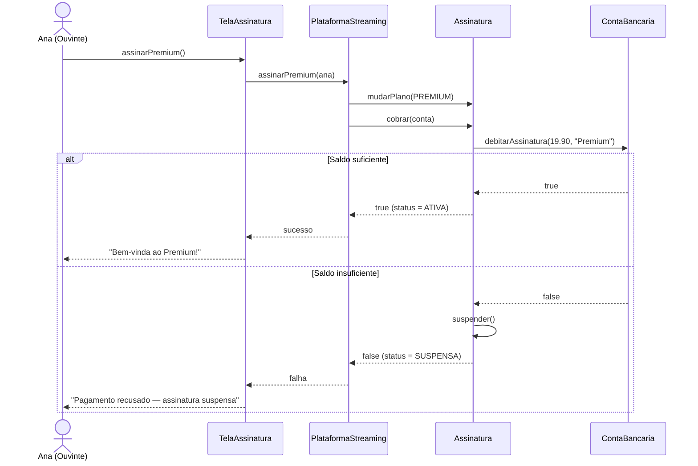

# 11 — Diagrama de Sequência

**📌 Família:** comportamental (interação) · **Responde:** *em que ordem os objetos trocam
mensagens ao longo do tempo?*

---

## 1. Conceito

O diagrama de **sequência** mostra a **colaboração entre objetos ordenada no tempo**. O tempo
corre de **cima para baixo**; os participantes ficam lado a lado no topo. É perfeito para
detalhar *como* um caso de uso acontece **por dentro**, mensagem a mensagem.

---

## 2. Notação

- **Linha de vida (*lifeline*):** cada participante com uma linha tracejada descendo.
- **Barra de ativação:** retângulo fino na linha de vida = o objeto está **executando** algo.
- **Mensagem síncrona:** seta cheia `──▶` (chama e **espera** a resposta).
- **Mensagem de retorno:** seta tracejada `- - ▷`.
- **Mensagem assíncrona:** seta aberta `──▷` (não espera).
- **Fragmentos combinados:** `alt` (if-else), `opt` (opcional), `loop` (repetição),
  `par` (paralelo).

---

## 3. Aplicação e exemplo (Melodia — "Assinar Premium")

> 🔎 **Leia de cima para baixo** = a linha do tempo. O fragmento `alt` mostra os dois caminhos
> (o de Ana: saldo ok; o de Lucas: saldo insuficiente → `suspender()`). As setas tracejadas
> são **retornos**. Isto é *exatamente* o que `PlataformaStreaming.assinarPremium()` faz no
> [projeto-base-java](../projeto-base-java/).

---

## 4. Vantagens e desvantagens

| ✅ Vantagens | ❌ Desvantagens |
|-------------|-----------------|
| Deixa **cristalina** a ordem das chamadas | Explode em tamanho se o fluxo for longo |
| Ótimo para projetar/revisar **uma** interação difícil | Ruim para dar visão geral (é só um cenário) |
| Revela acoplamento (quem chama quem) | Manter sincronizado com o código dá trabalho |

> ⚠️ **Erro comum:** tentar colocar **todos** os fluxos alternativos num único diagrama.
> Prefira um diagrama por **cenário principal** e use `alt`/`opt` só para variações curtas.

---

## 5. Na indústria (como sim, como não)

- ✅ **Um dos diagramas mais úteis no dia a dia**, especialmente para **integrações** entre
  sistemas/microsserviços e para desenhar chamadas assíncronas (filas, webhooks). Ferramentas
  como PlantUML/Mermaid tornam isso barato de manter.
- ✅ Excelente em **design review**: "mostra a sequência de chamadas do login". Frequentemente
  desenhado no quadro branco durante a discussão.
- ⚠️ **Não** o use como documentação de tudo — foque nos fluxos **críticos ou não óbvios**.
- 💡 Em sistemas distribuídos, a sequência real aparece em ferramentas de **tracing**
  (OpenTelemetry, Jaeger) — que são, na prática, diagramas de sequência gerados em produção.

---

## 🔗 Sequência × Comunicação

O [Diagrama de Comunicação](../13-diagrama-de-comunicacao/) mostra a **mesma** interação,
mas focando em *quem se conecta a quem* em vez da linha do tempo. São **equivalentes**.

---

## ✅ O que levar desta pasta

- [ ] Sequência = **mensagens ordenadas no tempo** (cima → baixo).
- [ ] Domino **lifeline, ativação, síncrona/assíncrona/retorno** e fragmentos `alt/opt/loop`.
- [ ] Um diagrama por **cenário**; variações curtas em `alt`.
- [ ] É o diagrama de eleição para **integrações** e revisões de design.

---

[⬅️ 10 - Diagrama de Objetos](../10-diagrama-de-objetos/) | [Índice](../README.md) | [12 - Diagrama de Estrutura Composta ➡️](../12-diagrama-de-estrutura-composta/)
