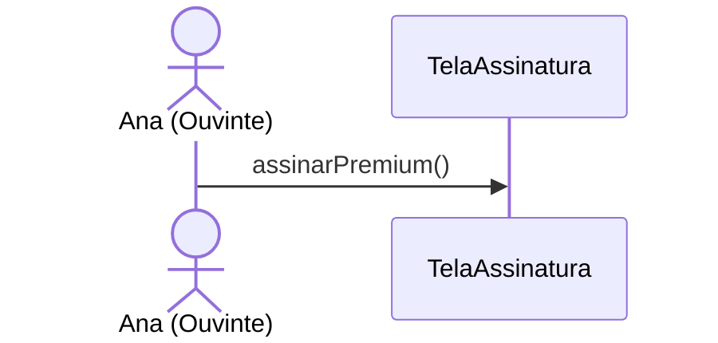
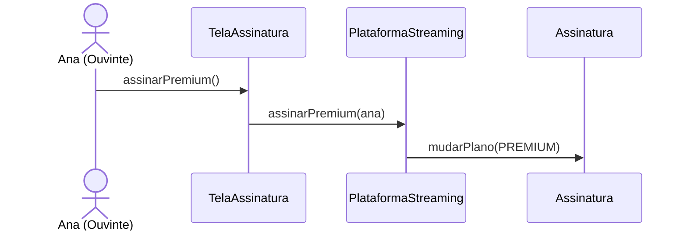
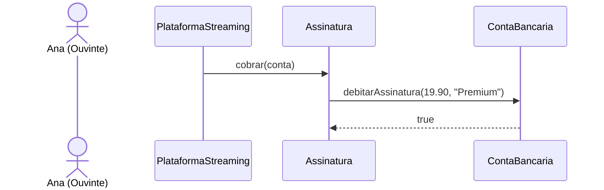
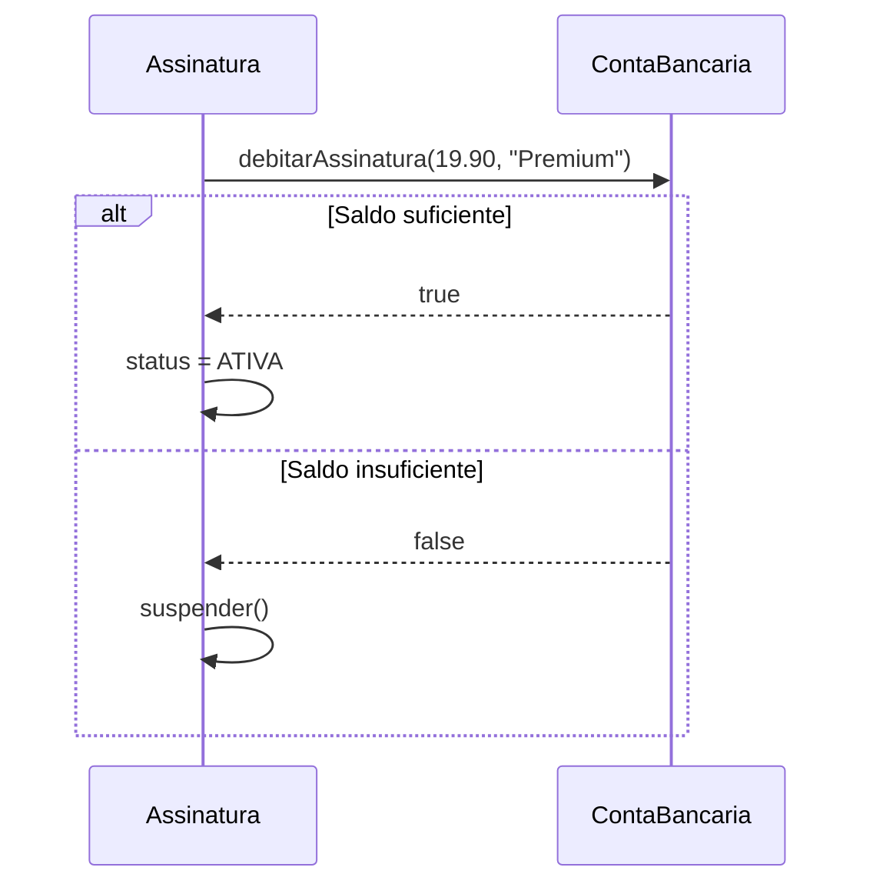
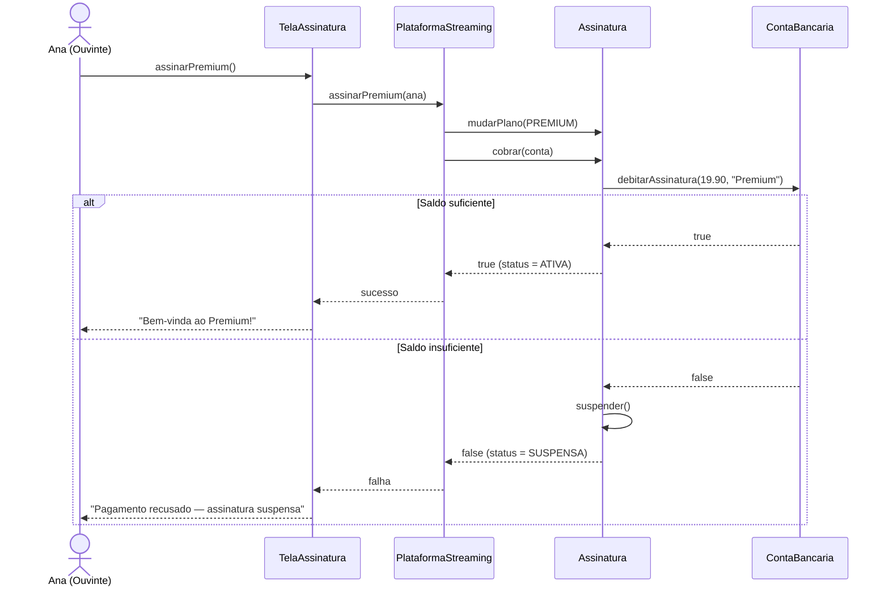
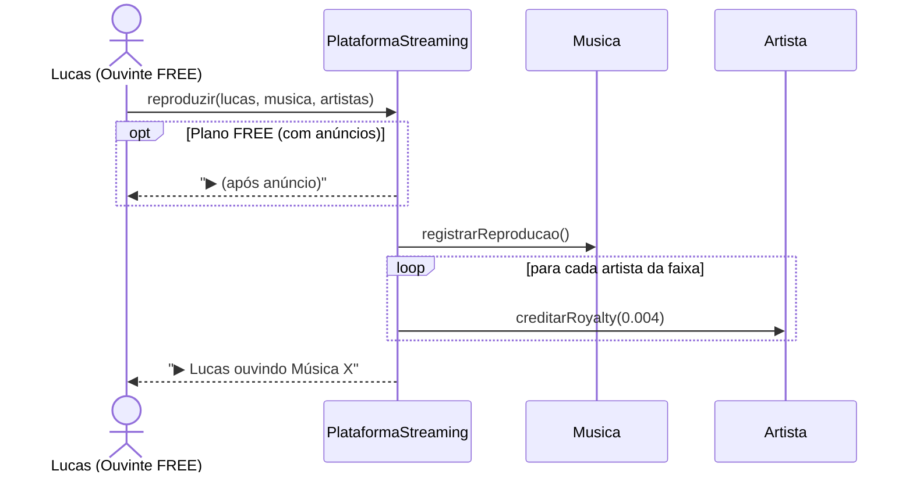

# 11 — Diagrama de Sequência

**📌 Família:** comportamental (interação) · **Responde:** *em que ordem os objetos trocam
mensagens ao longo do tempo?*

> 🎯 **Meta desta aula:** ao final você vai **ler** o tempo correndo de cima para baixo,
> reconhecer **cada tipo de seta**, usar os fragmentos `alt`/`opt`/`loop` e desenhar o fluxo
> "*Assinar Premium*" do **Melodia** mensagem a mensagem — exatamente como ele roda no código
> Java. Vamos construir o diagrama em camadas, explicando **por que** cada elemento entra.

---

## 1. Conceito — a "linha do tempo" de uma interação

Enquanto o [diagrama de classes](../09-diagrama-de-classes/) mostra a **estrutura** (quem existe)
e o [de casos de uso](../08-diagrama-casos-de-uso/) mostra **o quê** o sistema faz, o diagrama de
**sequência** mostra o **COMO por dentro**: a **colaboração entre objetos ordenada no tempo**.

Duas direções, dois significados:

- **↓ Vertical = TEMPO.** O tempo corre de **cima para baixo**. O que está mais acima acontece
  **antes**.
- **→ Horizontal = PARTICIPANTES.** Cada objeto/ator fica numa coluna, lado a lado.

É o diagrama perfeito para detalhar **um** cenário de um caso de uso — a "receita" de como
aquela funcionalidade realmente acontece, chamada por chamada.

> 🧭 **Analogia:** é a transcrição de uma **conversa de WhatsApp em grupo**. Cada pessoa é uma
> coluna; cada mensagem é uma seta de quem fala para quem; e você lê **de cima para baixo** para
> saber a ordem exata do papo.

---

## 2. Notação — cada elemento, um por um

| Elemento | Como aparece | O que significa |
|----------|--------------|-----------------|
| **Participante** | Caixa no topo + linha descendo | Um objeto/ator que participa da interação. Ator (👤) para quem é externo. |
| **Linha de vida** (*lifeline*) | Linha **tracejada** vertical | O "tempo de vida" daquele participante durante a interação. |
| **Barra de ativação** | Retângulo fino sobre a lifeline | O objeto está **executando** algo naquele intervalo (o foco de controle). |
| **Mensagem síncrona** | Seta **cheia** `──▶` | Uma chamada que **espera** a resposta (como chamar um método e aguardar o `return`). |
| **Mensagem de retorno** | Seta **tracejada** `◁- -` | O **valor devolvido** da chamada. Opcional, mas ajuda muito a ler. |
| **Mensagem assíncrona** | Seta **aberta** `──▷` | "Dispara e segue": **não espera** resposta (filas, eventos, webhooks). |
| **Auto-mensagem** | Seta que **volta pra si mesmo** | O objeto chama um **método próprio** (ex.: `this.suspender()`). |
| **Fragmento combinado** | Caixa rotulada ao redor de mensagens | Controle de fluxo: `alt`, `opt`, `loop`, `par`. |

### Os fragmentos combinados (o "if/for" do diagrama)

| Fragmento | Equivale a… | Quando usar |
|-----------|-------------|-------------|
| `alt` | **if / else** | Dois (ou mais) caminhos **mutuamente exclusivos** (ex.: saldo ok **ou** insuficiente). |
| `opt` | **if** (sem else) | Um trecho que **só às vezes** acontece (ex.: enviar e-mail de boas-vindas). |
| `loop` | **for / while** | Repetição (ex.: creditar royalty **para cada** artista). |
| `par` | threads paralelas | Coisas que acontecem **ao mesmo tempo**. |

> 💡 **Síncrona vs. assíncrona em uma frase:** na **síncrona**, quem chamou **para e espera** (a
> maioria das chamadas de método em Java). Na **assíncrona**, quem chamou **continua** sem
> esperar (mandar uma mensagem pra uma fila, disparar um evento).

---

## 3. Construindo o diagrama "Assinar Premium" — passo a passo

Vamos montar o cenário **"a Ana assina o Premium"** por camadas.

### Passo 1 — Duas colunas, uma mensagem

Toda interação começa com alguém pedindo algo a alguém. A Ana (ouvinte) toca no botão de
assinar na tela.

```mermaid
sequenceDiagram
    actor Ana as Ana (Ouvinte)
    participant UI as TelaAssinatura
    Ana->>UI: assinarPremium()
```

**O que temos?** Um **ator** (`Ana`, externo, com `actor`), um **participante** (`TelaAssinatura`)
e uma **mensagem síncrona** (`->>`, seta cheia). Lê-se: "Ana chama `assinarPremium()` na tela".
O tempo já corre de cima para baixo.

### Passo 2 — A chamada atravessa as camadas (delegação)

A tela não sabe cobrar ninguém — ela **delega** para a fachada `PlataformaStreaming`, que delega
para a `Assinatura`. Isso revela o **acoplamento**: quem chama quem.

```mermaid
sequenceDiagram
    actor Ana as Ana (Ouvinte)
    participant UI as TelaAssinatura
    participant P as PlataformaStreaming
    participant A as Assinatura

    Ana->>UI: assinarPremium()
    UI->>P: assinarPremium(ana)
    P->>A: mudarPlano(PREMIUM)
```

**Por quê?** Cada seta é uma **chamada de método real** do projeto Java: `UI` →
`PlataformaStreaming.assinarPremium(ouvinte)` → `Assinatura.mudarPlano(Plano.PREMIUM)`. O
diagrama começa a documentar a **arquitetura em camadas** (tela → fachada → domínio).

### Passo 3 — A cobrança chega ao banco + retorno

Trocar o plano não basta: é preciso **cobrar**. A `Assinatura` pede à `ContaBancaria` que debite
o valor — e a conta **responde** se deu certo (a seta **tracejada** é o retorno).

```mermaid
sequenceDiagram
    actor Ana as Ana (Ouvinte)
    participant P as PlataformaStreaming
    participant A as Assinatura
    participant C as ContaBancaria

    P->>A: cobrar(conta)
    A->>C: debitarAssinatura(19.90, "Premium")
    C-->>A: true
```

**Por quê?** Agora aparece o **retorno** (`-->>`, tracejada): `debitarAssinatura` devolve um
`boolean`. Tornar o retorno explícito deixa claro **o que** a chamada produziu — essencial
quando a próxima decisão depende desse valor (é o que vem no passo 4).

### Passo 4 — Os dois caminhos com `alt` (o coração do cenário)

A cobrança pode **dar certo** ou **falhar por saldo**. São dois caminhos mutuamente exclusivos →
fragmento **`alt`**. No caminho de falha, a `Assinatura` chama a si mesma: `suspender()`
(**auto-mensagem**).

```mermaid
sequenceDiagram
    participant A as Assinatura
    participant C as ContaBancaria

    A->>C: debitarAssinatura(19.90, "Premium")
    alt Saldo suficiente
        C-->>A: true
        A->>A: status = ATIVA
    else Saldo insuficiente
        C-->>A: false
        A->>A: suspender()
    end
```

**Por quê?** O `alt` mostra os **dois cenários no mesmo desenho**, sem precisar de dois
diagramas. A **auto-mensagem** `A->>A: suspender()` representa exatamente o
`if (!pago) suspender();` que existe dentro da classe `Assinatura` — o objeto agindo sobre si
mesmo. Este ramo `else` é o **fluxo alternativo 2a** descrito na
[aula de casos de uso](../08-diagrama-casos-de-uso/) e o `«extend»` *Suspender assinatura*. O
**mesmo cenário** atravessa os três artefatos.

### 🏁 Diagrama completo "Assinar Premium"

Juntando tudo — da Ana até a resposta na tela, com os dois caminhos:

```mermaid
sequenceDiagram
    actor Ana as Ana (Ouvinte)
    participant UI as TelaAssinatura
    participant P as PlataformaStreaming
    participant A as Assinatura
    participant C as ContaBancaria

    Ana->>UI: assinarPremium()
    UI->>P: assinarPremium(ana)
    P->>A: mudarPlano(PREMIUM)
    P->>A: cobrar(conta)
    A->>C: debitarAssinatura(19.90, "Premium")
    alt Saldo suficiente
        C-->>A: true
        A-->>P: true (status = ATIVA)
        P-->>UI: sucesso
        UI-->>Ana: "Bem-vinda ao Premium!"
    else Saldo insuficiente
        C-->>A: false
        A->>A: suspender()
        A-->>P: false (status = SUSPENSA)
        P-->>UI: falha
        UI-->>Ana: "Pagamento recusado — assinatura suspensa"
    end
```

> 🔎 **Leia de cima para baixo** = a linha do tempo. O fragmento `alt` mostra os dois caminhos
> (o da Ana: saldo ok; o do Lucas: saldo insuficiente → `suspender()`). As setas tracejadas são
> **retornos** que sobem de volta pelas camadas. Isto é *exatamente* o que
> `PlataformaStreaming.assinarPremium()` faz no [projeto-base-java](../projeto-base-java/).

---

## 4. Segundo cenário: "Reproduzir música" (agora com `loop` e `opt`)

Um diagrama = **um** cenário. Vamos a outro caso de uso para ver os fragmentos `opt` e `loop` na
prática. Ao reproduzir, a plataforma: (1) confere o catálogo, (2) talvez toque um anúncio
(**`opt`**, só no plano FREE) e (3) credita royalty **para cada** artista da faixa (**`loop`**).

```mermaid
sequenceDiagram
    actor Lucas as Lucas (Ouvinte FREE)
    participant P as PlataformaStreaming
    participant M as Musica
    participant Art as Artista

    Lucas->>P: reproduzir(lucas, musica, artistas)
    opt Plano FREE (com anúncios)
        P-->>Lucas: "▶ (após anúncio)"
    end
    P->>M: registrarReproducao()
    loop para cada artista da faixa
        P->>Art: creditarRoyalty(0.004)
    end
    P-->>Lucas: "▶ Lucas ouvindo Música X"
```

**Por quê cada fragmento?**
- **`opt`** (anúncio): só acontece **sob condição** (plano FREE) — um `if` sem `else`. Se o Lucas
  fosse Premium, esse bloco simplesmente não roda.
- **`loop`** (royalties): a mesma mensagem se repete **para cada** artista — é o `for (Artista a :
  artistas)` do método `reproduzir(...)`. Desenhar o laço evita ter que repetir a seta N vezes.

> 🧠 Compare os **dois cenários**: "Assinar" usa `alt` (dois caminhos exclusivos); "Reproduzir"
> usa `opt` (talvez) + `loop` (repete). Escolher o fragmento certo é escolher a **estrutura de
> controle** certa.

---

## 5. Do diagrama ao código (o mapeamento direto)

| No diagrama de sequência | No Java (`projeto-base-java`) |
|--------------------------|-------------------------------|
| Seta síncrona `UI->>P: assinarPremium(ana)` | `plataforma.assinarPremium(ana);` |
| Retorno `C-->>A: true` | `return true;` em `debitarAssinatura(...)` |
| Fragmento `alt` saldo ok/insuficiente | `if (pago) { … } else { … }` |
| Auto-mensagem `A->>A: suspender()` | `this.suspender();` dentro de `Assinatura.cobrar()` |
| Fragmento `loop` para cada artista | `for (Artista a : artistas) { … }` em `reproduzir(...)` |

> 🔗 Abra `plataforma/PlataformaStreaming.java` e `assinatura/Assinatura.java` no
> [projeto-base-java](../projeto-base-java/) e leia o método **enquanto** olha o diagrama. São o
> mesmo fluxo em duas linguagens.

---

## 6. Vantagens e desvantagens

| ✅ Vantagens | ❌ Desvantagens |
|-------------|-----------------|
| Deixa **cristalina** a ordem das chamadas | Explode em tamanho se o fluxo for longo |
| Ótimo para projetar/revisar **uma** interação difícil | Ruim para dar visão geral (é só um cenário) |
| Revela **acoplamento** (quem chama quem) | Manter sincronizado com o código dá trabalho |

> ⚠️ **Erro comum:** tentar colocar **todos** os fluxos alternativos num único diagrama.
> Prefira **um diagrama por cenário principal** e use `alt`/`opt` só para variações **curtas**.
> Se o diagrama não cabe na tela, ele parou de ajudar.

---

## 7. Na indústria (como sim, como não)

- ✅ **Um dos diagramas mais úteis no dia a dia**, especialmente para **integrações** entre
  sistemas/microsserviços e para desenhar chamadas assíncronas (filas, webhooks). Ferramentas
  como PlantUML/Mermaid tornam isso barato de manter.
- ✅ Excelente em **design review**: "mostra a sequência de chamadas do login". Frequentemente
  desenhado no **quadro branco** durante a discussão.
- ⚠️ **Não** o use como documentação de tudo — foque nos fluxos **críticos ou não óbvios**.
- 💡 Em sistemas distribuídos, a sequência real aparece em ferramentas de **tracing**
  (OpenTelemetry, Jaeger) — que são, na prática, diagramas de sequência **gerados em produção**.

---

## 🔗 Sequência × Comunicação

O [Diagrama de Comunicação](../13-diagrama-de-comunicacao/) mostra a **mesma** interação, mas
focando em *quem se conecta a quem* em vez da linha do tempo. São **equivalentes** — escolha a
sequência quando a **ordem no tempo** é o que importa.

---

## 🎯 Desafio para você criar

Desenhe o diagrama de sequência do caso de uso **"Sacar royalties"** (método
`Artista.sacarRoyalties(contaDaPlataforma)`):

1. Participantes: `Artista`, `ContaBancaria` da plataforma, `ContaBancaria` do artista.
2. Use um fragmento **`alt`** para o caso de **ter** royalties acumulados × **não ter** (saldo
   zero → nada a sacar).
3. Mostre o **retorno** (o valor sacado) subindo de volta ao artista.
4. Escreva **uma frase** explicando por que você usou `alt` (e não `opt`) — ou vice-versa.

✅ **Critério de "pronto":** lê-se o diagrama de cima para baixo e entende-se a ordem; os
fragmentos refletem as estruturas de controle que existiriam no método Java.

---

## ✅ O que levar desta pasta

- [ ] Sequência = **mensagens ordenadas no tempo** (cima → baixo), participantes lado a lado.
- [ ] Domino **lifeline, ativação, síncrona (`->>`) / retorno (`-->>`) / assíncrona / auto-
      mensagem** e os fragmentos **`alt` / `opt` / `loop` / `par`**.
- [ ] **Um diagrama por cenário**; variações curtas em `alt`/`opt`.
- [ ] Cada seta é uma **chamada de método** real — o diagrama mapeia 1-para-1 no código.
- [ ] É o diagrama de eleição para **integrações** e **revisões de design**.

---

[⬅️ 10 - Diagrama de Objetos](../10-diagrama-de-objetos/) | [Índice](../README.md) | [12 - Diagrama de Estrutura Composta ➡️](../12-diagrama-de-estrutura-composta/)
