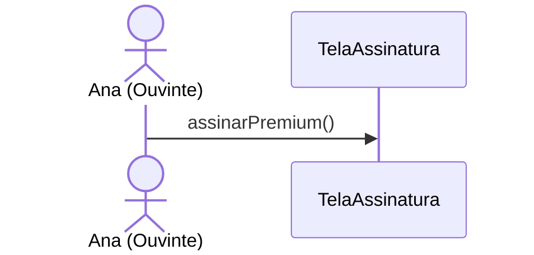
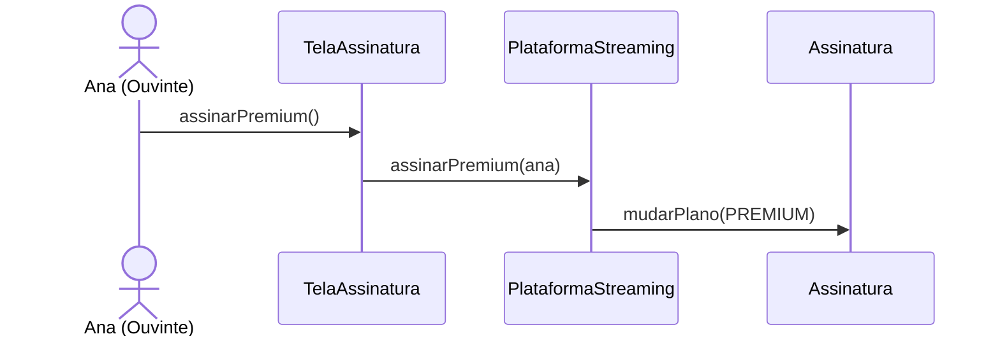
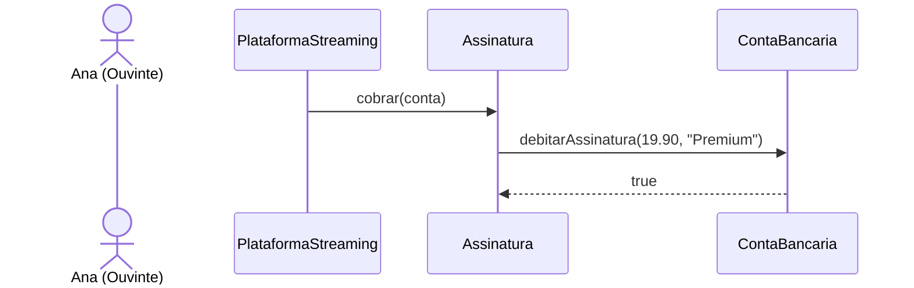
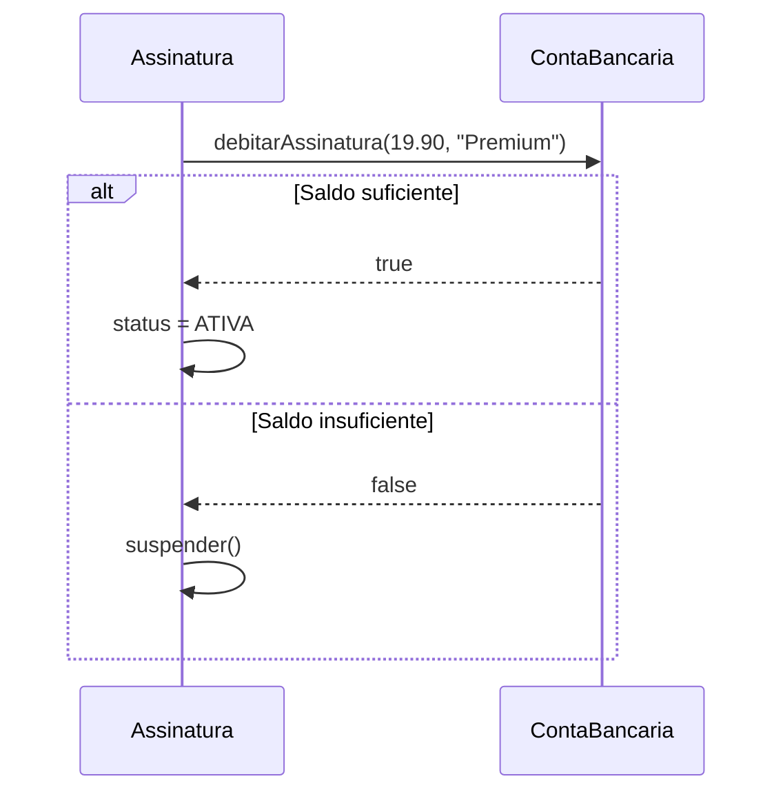
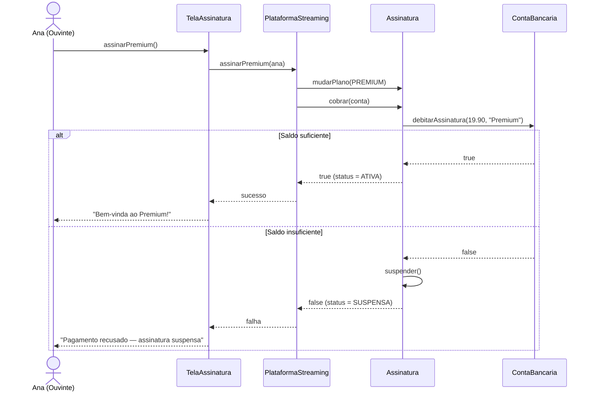
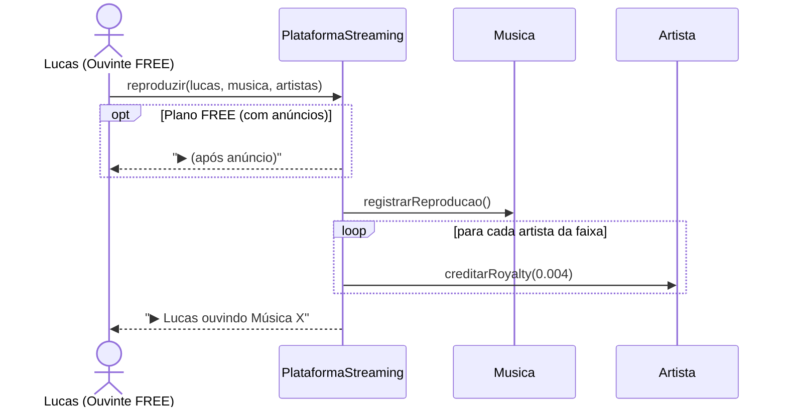
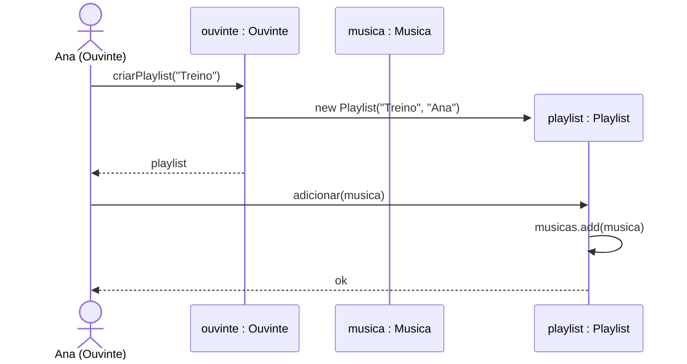
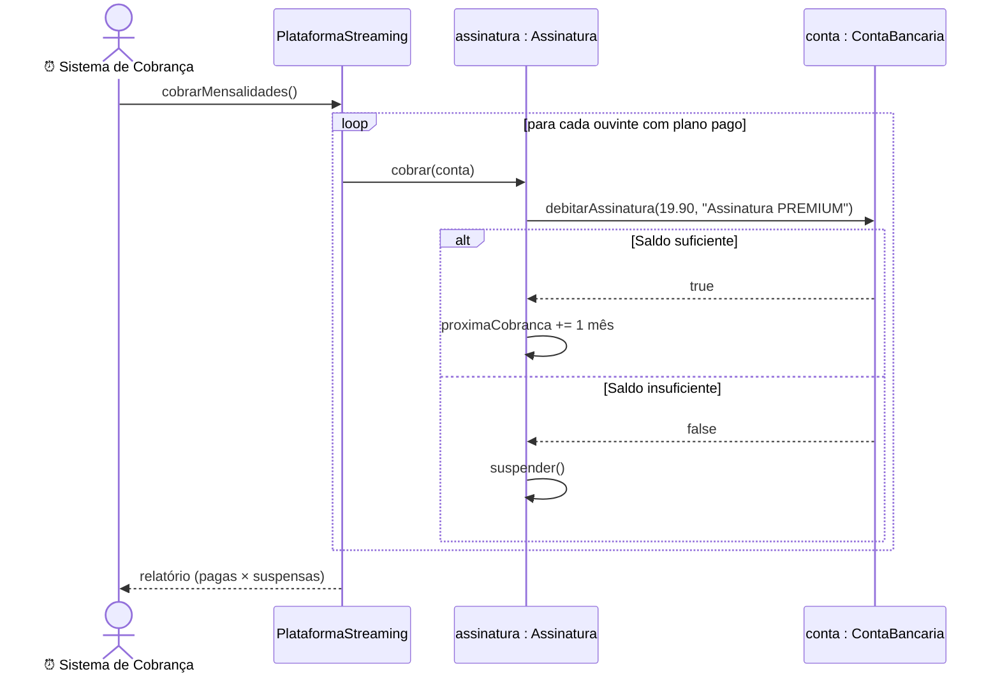
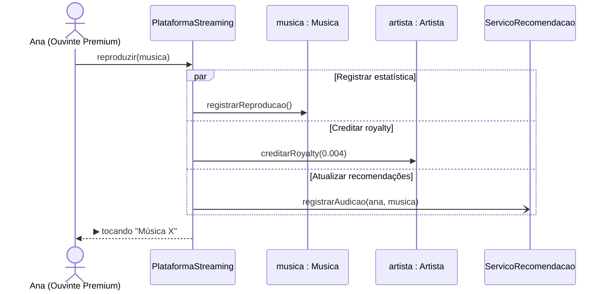
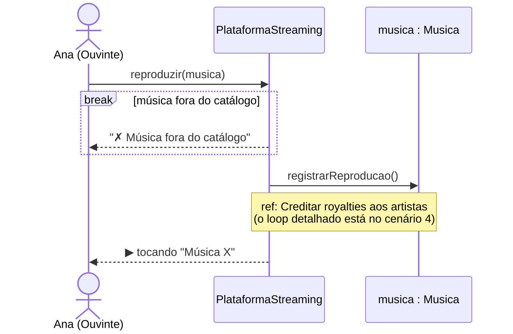

# 11 — Diagrama de Sequência

**📌 Família:** comportamental (interação) · **Responde:** *em que ordem os objetos trocam
mensagens ao longo do tempo?*

> 🎯 **Meta desta aula:** ao final você vai **ler** o tempo correndo de cima para baixo,
> reconhecer **cada tipo de seta**, usar os fragmentos `alt`/`opt`/`loop` e desenhar o fluxo
> "*Assinar Premium*" do **Melodia** mensagem a mensagem — exatamente como ele roda no código
> Java. Vamos construir o diagrama em camadas, explicando **por que** cada elemento entra.

---

## 1. Conceito — a "linha do tempo" de uma interação

Enquanto o [diagrama de classes](../09-diagrama-de-classes/) mostra a **estrutura** (quem existe)
e o [de casos de uso](../08-diagrama-casos-de-uso/) mostra **o quê** o sistema faz, o diagrama de
**sequência** mostra o **COMO por dentro**: a **colaboração entre objetos ordenada no tempo**.

Duas direções, dois significados:

- **↓ Vertical = TEMPO.** O tempo corre de **cima para baixo**. O que está mais acima acontece
  **antes**.
- **→ Horizontal = PARTICIPANTES.** Cada objeto/ator fica numa coluna, lado a lado.

É o diagrama perfeito para detalhar **um** cenário de um caso de uso — a "receita" de como
aquela funcionalidade realmente acontece, chamada por chamada.

> 🧭 **Analogia:** é a transcrição de uma **conversa de WhatsApp em grupo**. Cada pessoa é uma
> coluna; cada mensagem é uma seta de quem fala para quem; e você lê **de cima para baixo** para
> saber a ordem exata do papo.

---

## 2. Notação — cada elemento, um por um

| Elemento | Como aparece | O que significa |
|----------|--------------|-----------------|
| **Participante** | Caixa no topo + linha descendo | Um objeto/ator que participa da interação. Ator (👤) para quem é externo. |
| **Linha de vida** (*lifeline*) | Linha **tracejada** vertical | O "tempo de vida" daquele participante durante a interação. |
| **Barra de ativação** | Retângulo fino sobre a lifeline | O objeto está **executando** algo naquele intervalo (o foco de controle). |
| **Mensagem síncrona** | Seta **cheia** `──▶` | Uma chamada que **espera** a resposta (como chamar um método e aguardar o `return`). |
| **Mensagem de retorno** | Seta **tracejada** `◁- -` | O **valor devolvido** da chamada. Opcional, mas ajuda muito a ler. |
| **Mensagem assíncrona** | Seta **aberta** `──▷` | "Dispara e segue": **não espera** resposta (filas, eventos, webhooks). |
| **Auto-mensagem** | Seta que **volta pra si mesmo** | O objeto chama um **método próprio** (ex.: `this.suspender()`). |
| **Fragmento combinado** | Caixa rotulada ao redor de mensagens | Controle de fluxo: `alt`, `opt`, `loop`, `par`. |

### Os fragmentos combinados (o "if/for" do diagrama)

| Fragmento | Equivale a… | Quando usar |
|-----------|-------------|-------------|
| `alt` | **if / else** | Dois (ou mais) caminhos **mutuamente exclusivos** (ex.: saldo ok **ou** insuficiente). |
| `opt` | **if** (sem else) | Um trecho que **só às vezes** acontece (ex.: enviar e-mail de boas-vindas). |
| `loop` | **for / while** | Repetição (ex.: creditar royalty **para cada** artista). |
| `par` | threads paralelas | Coisas que acontecem **ao mesmo tempo**. |
| `break` | **return / throw** antecipado | **Interrompe** o cenário quando uma condição ocorre e sai (ex.: música fora do catálogo → encerra). |
| `ref` | **chamar outro diagrama** | **Aponta** para uma interação já desenhada em outro diagrama, para **não repetir** (reúso). |

> 🧩 **`break` × `alt`:** no `alt` o fluxo **continua** depois do fragmento (os dois ramos
> convergem). No `break`, quando a condição bate, o cenário **para ali** — é a "saída de
> emergência", como um `return`/`throw` logo no começo de um método.

> 🔁 **Por que existe o `ref`?** Diagramas de sequência repetem sub-fluxos (autenticar, cobrar,
> creditar royalties…). Em vez de **redesenhar** o mesmo trecho em cada diagrama, você o desenha
> **uma vez** num diagrama próprio e, nos outros, só coloca uma moldura **`ref`** apontando para
> ele. É o mesmo espírito do `«include»` dos [casos de uso](../08-diagrama-casos-de-uso/).

> 💡 **Síncrona vs. assíncrona em uma frase:** na **síncrona**, quem chamou **para e espera** (a
> maioria das chamadas de método em Java). Na **assíncrona**, quem chamou **continua** sem
> esperar (mandar uma mensagem pra uma fila, disparar um evento).

### A colinha da sintaxe no Mermaid

Todos os diagramas desta aula usam **Mermaid** (`sequenceDiagram`). Guarde este de-para entre o
que você **quer dizer** e o que você **escreve** — é a sintaxe inteira que você vai precisar:

| Você quer… | Escreve no Mermaid | Como aparece |
|------------|--------------------|--------------|
| Declarar um ator externo | `actor Ana as Ana (Ouvinte)` | boneco palito 👤 |
| Declarar um participante | `participant P as PlataformaStreaming` | caixa + lifeline |
| Mensagem **síncrona** (chama e espera) | `A->>B: metodo()` | seta **cheia** |
| **Retorno** de uma chamada | `B-->>A: valor` | seta **tracejada** |
| Mensagem **assíncrona** (dispara e segue) | `A-)B: evento` | seta **aberta** |
| **Auto-mensagem** (chama a si mesmo) | `A->>A: valida()` | setinha que volta |
| **Criar** um objeto no meio do fluxo | `create participant X` + a mensagem | nova lifeline nasce ali |
| Condição (if/else) | `alt ... else ... end` | caixa `alt` |
| Opcional (if) | `opt ... end` | caixa `opt` |
| Repetição (for/while) | `loop ... end` | caixa `loop` |
| Paralelo (ao mesmo tempo) | `par ... and ... end` | caixa `par` |
| Interrupção (return antecipado) | `break <condição> ... end` | caixa `break` |
| Referência a outro diagrama | *(o Mermaid não tem `ref` nativo)* → `note over A,B: ref: Nome` | moldura `ref` (aproximada) |

> ⚠️ **Sobre o `ref`:** na UML "de verdade" ele é uma moldura escrita **`ref`** dentro do
> diagrama. O **Mermaid não tem** esse fragmento, então nesta aula o representamos com uma
> **nota** `note over A,B: ref: NomeDoSubfluxo`. Em ferramentas como PlantUML/draw.io o `ref`
> existe nativamente.

> ✍️ Experimente colar qualquer bloco ` ```mermaid ` desta aula no
> [mermaid.live](https://mermaid.live) e editar — é a forma mais rápida de aprender a sintaxe.

---

## 3. Construindo o diagrama "Assinar Premium" — passo a passo

Vamos montar o cenário **"a Ana assina o Premium"** por camadas.

### Passo 1 — Duas colunas, uma mensagem

Toda interação começa com alguém pedindo algo a alguém. A Ana (ouvinte) toca no botão de
assinar na tela.


```mermaid
sequenceDiagram
    actor Ana as Ana (Ouvinte)
    participant UI as TelaAssinatura
    Ana->>UI: assinarPremium()
```

**O que temos?** Um **ator** (`Ana`, externo, com `actor`), um **participante** (`TelaAssinatura`)
e uma **mensagem síncrona** (`->>`, seta cheia). Lê-se: "Ana chama `assinarPremium()` na tela".
O tempo já corre de cima para baixo.

### Passo 2 — A chamada atravessa as camadas (delegação)

A tela não sabe cobrar ninguém — ela **delega** para a fachada `PlataformaStreaming`, que delega
para a `Assinatura`. Isso revela o **acoplamento**: quem chama quem.


```mermaid
sequenceDiagram
    actor Ana as Ana (Ouvinte)
    participant UI as TelaAssinatura
    participant P as PlataformaStreaming
    participant A as Assinatura

    Ana->>UI: assinarPremium()
    UI->>P: assinarPremium(ana)
    P->>A: mudarPlano(PREMIUM)
```

**Por quê?** Cada seta é uma **chamada de método real** do projeto Java: `UI` →
`PlataformaStreaming.assinarPremium(ouvinte)` → `Assinatura.mudarPlano(Plano.PREMIUM)`. O
diagrama começa a documentar a **arquitetura em camadas** (tela → fachada → domínio).

### Passo 3 — A cobrança chega ao banco + retorno

Trocar o plano não basta: é preciso **cobrar**. A `Assinatura` pede à `ContaBancaria` que debite
o valor — e a conta **responde** se deu certo (a seta **tracejada** é o retorno).


```mermaid
sequenceDiagram
    actor Ana as Ana (Ouvinte)
    participant P as PlataformaStreaming
    participant A as Assinatura
    participant C as ContaBancaria

    P->>A: cobrar(conta)
    A->>C: debitarAssinatura(19.90, "Premium")
    C-->>A: true
```

**Por quê?** Agora aparece o **retorno** (`-->>`, tracejada): `debitarAssinatura` devolve um
`boolean`. Tornar o retorno explícito deixa claro **o que** a chamada produziu — essencial
quando a próxima decisão depende desse valor (é o que vem no passo 4).

### Passo 4 — Os dois caminhos com `alt` (o coração do cenário)

A cobrança pode **dar certo** ou **falhar por saldo**. São dois caminhos mutuamente exclusivos →
fragmento **`alt`**. No caminho de falha, a `Assinatura` chama a si mesma: `suspender()`
(**auto-mensagem**).


```mermaid
sequenceDiagram
    participant A as Assinatura
    participant C as ContaBancaria

    A->>C: debitarAssinatura(19.90, "Premium")
    alt Saldo suficiente
        C-->>A: true
        A->>A: status = ATIVA
    else Saldo insuficiente
        C-->>A: false
        A->>A: suspender()
    end
```

**Por quê?** O `alt` mostra os **dois cenários no mesmo desenho**, sem precisar de dois
diagramas. A **auto-mensagem** `A->>A: suspender()` representa exatamente o
`if (!pago) suspender();` que existe dentro da classe `Assinatura` — o objeto agindo sobre si
mesmo. Este ramo `else` é o **fluxo alternativo 2a** descrito na
[aula de casos de uso](../08-diagrama-casos-de-uso/) e o `«extend»` *Suspender assinatura*. O
**mesmo cenário** atravessa os três artefatos.

### 🏁 Diagrama completo "Assinar Premium"

Juntando tudo — da Ana até a resposta na tela, com os dois caminhos:


```mermaid
sequenceDiagram
    actor Ana as Ana (Ouvinte)
    participant UI as TelaAssinatura
    participant P as PlataformaStreaming
    participant A as Assinatura
    participant C as ContaBancaria

    Ana->>UI: assinarPremium()
    UI->>P: assinarPremium(ana)
    P->>A: mudarPlano(PREMIUM)
    P->>A: cobrar(conta)
    A->>C: debitarAssinatura(19.90, "Premium")
    alt Saldo suficiente
        C-->>A: true
        A-->>P: true (status = ATIVA)
        P-->>UI: sucesso
        UI-->>Ana: "Bem-vinda ao Premium!"
    else Saldo insuficiente
        C-->>A: false
        A->>A: suspender()
        A-->>P: false (status = SUSPENSA)
        P-->>UI: falha
        UI-->>Ana: "Pagamento recusado — assinatura suspensa"
    end
```

> 🔎 **Leia de cima para baixo** = a linha do tempo. O fragmento `alt` mostra os dois caminhos
> (o da Ana: saldo ok; o do Lucas: saldo insuficiente → `suspender()`). As setas tracejadas são
> **retornos** que sobem de volta pelas camadas. Isto é *exatamente* o que
> `PlataformaStreaming.assinarPremium()` faz no [projeto-base-java](../projeto-base-java/).

---

## 4. Segundo cenário: "Reproduzir música" (agora com `loop` e `opt`)

Um diagrama = **um** cenário. Vamos a outro caso de uso para ver os fragmentos `opt` e `loop` na
prática. Ao reproduzir, a plataforma: (1) confere o catálogo, (2) talvez toque um anúncio
(**`opt`**, só no plano FREE) e (3) credita royalty **para cada** artista da faixa (**`loop`**).


```mermaid
sequenceDiagram
    actor Lucas as Lucas (Ouvinte FREE)
    participant P as PlataformaStreaming
    participant M as Musica
    participant Art as Artista

    Lucas->>P: reproduzir(lucas, musica, artistas)
    opt Plano FREE (com anúncios)
        P-->>Lucas: "▶ (após anúncio)"
    end
    P->>M: registrarReproducao()
    loop para cada artista da faixa
        P->>Art: creditarRoyalty(0.004)
    end
    P-->>Lucas: "▶ Lucas ouvindo Música X"
```

**Por quê cada fragmento?**
- **`opt`** (anúncio): só acontece **sob condição** (plano FREE) — um `if` sem `else`. Se o Lucas
  fosse Premium, esse bloco simplesmente não roda.
- **`loop`** (royalties): a mesma mensagem se repete **para cada** artista — é o `for (Artista a :
  artistas)` do método `reproduzir(...)`. Desenhar o laço evita ter que repetir a seta N vezes.

> 🧠 Compare os **dois cenários**: "Assinar" usa `alt` (dois caminhos exclusivos); "Reproduzir"
> usa `opt` (talvez) + `loop` (repete). Escolher o fragmento certo é escolher a **estrutura de
> controle** certa.

---

## 5. Mais cenários do Melodia (ampliando o repertório)

Quanto mais cenários você lê, mais rápido desenha os seus. Aqui vão **três** fluxos novos do
Melodia, cada um exercitando um recurso diferente.

### 5.1 — "Criar playlist e adicionar música" (criação de objeto)

Até agora todos os participantes já existiam no topo. Mas muitas interações **criam objetos no
meio do caminho**. Quando a Ana cria uma playlist, um objeto `Playlist` **nasce** ali — é o
`new Playlist(...)` do método `Ouvinte.criarPlaylist(nome)`.


```mermaid
sequenceDiagram
    actor Ana as Ana (Ouvinte)
    participant O as ouvinte : Ouvinte
    participant M as musica : Musica

    Ana->>O: criarPlaylist("Treino")
    create participant PL as playlist : Playlist
    O->>PL: new Playlist("Treino", "Ana")
    O-->>Ana: playlist
    Ana->>PL: adicionar(musica)
    PL->>PL: musicas.add(musica)
    PL-->>Ana: ok
```

**O que há de novo?** A palavra-chave `create` faz a **lifeline da `Playlist` começar mais
abaixo**, no instante em que ela é criada — e não lá no topo. Isso comunica visualmente o
**tempo de vida** do objeto. Note também a **auto-mensagem** `PL->>PL: musicas.add(musica)`: a
playlist guarda a música na própria lista interna.

> 🔎 Repare na convenção **`nome : Classe`** (ex.: `ouvinte : Ouvinte`): no diagrama de
> sequência os participantes costumam ser **objetos** (instâncias), não classes. É o mesmo
> `ana` do [diagrama de objetos](../10-diagrama-de-objetos/) entrando em ação.

### 5.2 — "Cobrança mensal recorrente" (ator de tempo + `loop`)

Lembra o **ator de tempo** `Sistema de Cobrança` do [diagrama de casos de uso](../08-diagrama-casos-de-uso/)?
Aqui ele aparece em ação: todo mês ele dispara a cobrança **de todos os ouvintes pagantes**.
É o mesmo fluxo do "Assinar Premium", agora **dentro de um `loop`**.


```mermaid
sequenceDiagram
    actor Rel as ⏰ Sistema de Cobrança
    participant P as PlataformaStreaming
    participant A as assinatura : Assinatura
    participant C as conta : ContaBancaria

    Rel->>P: cobrarMensalidades()
    loop para cada ouvinte com plano pago
        P->>A: cobrar(conta)
        A->>C: debitarAssinatura(19.90, "Assinatura PREMIUM")
        alt Saldo suficiente
            C-->>A: true
            A->>A: proximaCobranca += 1 mês
        else Saldo insuficiente
            C-->>A: false
            A->>A: suspender()
        end
    end
    P-->>Rel: relatório (pagas × suspensas)
```

**O que há de novo?** Um **fragmento dentro do outro**: o `alt` (saldo ok/insuficiente) vive
**dentro** do `loop` (cada ouvinte). Isso é comuníssimo — fragmentos se **aninham** como `for` e
`if` se aninham no código. E o ator aqui não é gente: é o **relógio** ⏰ que dispara sozinho.

### 5.3 — "Reproduzir com processamento paralelo" (`par` + mensagem assíncrona)

Num streaming real, apertar *play* dispara **várias coisas ao mesmo tempo**: registra a
estatística, credita o royalty e avisa o motor de recomendações — sem que uma espere a outra.
Isso é o fragmento **`par`** e a **mensagem assíncrona** (`-)`).


```mermaid
sequenceDiagram
    actor Ana as Ana (Ouvinte Premium)
    participant P as PlataformaStreaming
    participant M as musica : Musica
    participant Art as artista : Artista
    participant Rec as ServicoRecomendacao

    Ana->>P: reproduzir(musica)
    par Registrar estatística
        P->>M: registrarReproducao()
    and Creditar royalty
        P->>Art: creditarRoyalty(0.004)
    and Atualizar recomendações
        P-)Rec: registrarAudicao(ana, musica)
    end
    P-->>Ana: ▶ tocando "Música X"
```

**O que há de novo?** O `par` divide o tempo em **faixas paralelas** (separadas por `and`): as
três ações acontecem **concorrentemente**. E a seta `P-)Rec` é **assíncrona** (ponta aberta): a
plataforma **não espera** o serviço de recomendação responder — "dispara e segue". Compare com as
outras setas `->>`, que **esperam** o retorno.

> ⚠️ Este 5.3 é um **cenário de projeto** (como o sistema *poderia* evoluir), um passo além do
> `reproduzir(...)` sequencial do [projeto-base-java](../projeto-base-java/). Diagramas de
> sequência servem tanto para **documentar o que existe** quanto para **projetar o que virá**.

### 5.4 — "Reproduzir música — versão robusta" (`break` + `ref`)

O método real `reproduzir(...)` tem uma **saída antecipada**: se a música não está no catálogo,
ele devolve `"✗ Música fora do catálogo"` **na hora**, sem tocar nem creditar nada. Isso é o
fragmento **`break`**. E, em vez de **redesenhar** todo o laço de royalties (que já vimos no
cenário 4), referenciamos aquele sub-fluxo com um **`ref`**.


```mermaid
sequenceDiagram
    actor Ana as Ana (Ouvinte)
    participant P as PlataformaStreaming
    participant M as musica : Musica

    Ana->>P: reproduzir(musica)
    break música fora do catálogo
        P-->>Ana: "✗ Música fora do catálogo"
    end
    P->>M: registrarReproducao()
    note over P,M: ref: Creditar royalties aos artistas<br/>(o loop detalhado está no cenário 4)
    P-->>Ana: ▶ tocando "Música X"
```

**O que há de novo?**
- O **`break`** é a **saída de emergência**: *se* a música está fora do catálogo, a plataforma
  responde o erro e o cenário **termina ali** — nada abaixo do `break` roda. É o
  `if (!catalogo.contains(musica)) return "✗ Música fora do catálogo";` do método real.
- O **`ref`** (aqui desenhado como uma **nota**, pois o Mermaid não tem o fragmento nativo) diz
  *"neste ponto, acontece o sub-fluxo **Creditar royalties**, já detalhado em outro diagrama"*.
  Isso **evita repetição** e mantém este diagrama enxuto, focado no caminho principal.

> 🧠 **Regra de ouro:** use `break` para **erros/validações que encerram** o fluxo cedo, e `ref`
> para **não copiar** um sub-fluxo complexo que já existe. Juntos, eles mantêm cada diagrama
> **curto e legível** — o oposto do "diagrama que não cabe na tela".

---

## 6. Do diagrama ao código (o mapeamento direto)

| No diagrama de sequência | No Java (`projeto-base-java`) |
|--------------------------|-------------------------------|
| Seta síncrona `UI->>P: assinarPremium(ana)` | `plataforma.assinarPremium(ana);` |
| Retorno `C-->>A: true` | `return true;` em `debitarAssinatura(...)` |
| Fragmento `alt` saldo ok/insuficiente | `if (pago) { … } else { … }` |
| Auto-mensagem `A->>A: suspender()` | `this.suspender();` dentro de `Assinatura.cobrar()` |
| Fragmento `loop` para cada artista | `for (Artista a : artistas) { … }` em `reproduzir(...)` |
| `create participant PL` + `new Playlist(...)` | `new Playlist(nome, dono)` em `criarPlaylist(...)` |
| `loop` por ouvinte com `alt` dentro | `for (Ouvinte o : ouvintes) { if (pago) … else … }` |
| Mensagem assíncrona `P-)Rec` | `executor.submit(() -> rec.registrarAudicao(...))` (dispara e segue) |
| Fragmento `break` (saída antecipada) | `if (!catalogo.contains(musica)) return "...";` em `reproduzir(...)` |
| Moldura `ref` (sub-fluxo reusado) | extrair um **método**: `creditarRoyalty(musica, artistas)` chamado aqui |

> 🔗 Abra `plataforma/PlataformaStreaming.java` e `assinatura/Assinatura.java` no
> [projeto-base-java](../projeto-base-java/) e leia o método **enquanto** olha o diagrama. São o
> mesmo fluxo em duas linguagens.

---

## 7. Vantagens e desvantagens

| ✅ Vantagens | ❌ Desvantagens |
|-------------|-----------------|
| Deixa **cristalina** a ordem das chamadas | Explode em tamanho se o fluxo for longo |
| Ótimo para projetar/revisar **uma** interação difícil | Ruim para dar visão geral (é só um cenário) |
| Revela **acoplamento** (quem chama quem) | Manter sincronizado com o código dá trabalho |

> ⚠️ **Erro comum:** tentar colocar **todos** os fluxos alternativos num único diagrama.
> Prefira **um diagrama por cenário principal** e use `alt`/`opt` só para variações **curtas**.
> Se o diagrama não cabe na tela, ele parou de ajudar.

---

## 8. Na indústria (como sim, como não)

- ✅ **Um dos diagramas mais úteis no dia a dia**, especialmente para **integrações** entre
  sistemas/microsserviços e para desenhar chamadas assíncronas (filas, webhooks). Ferramentas
  como PlantUML/Mermaid tornam isso barato de manter.
- ✅ Excelente em **design review**: "mostra a sequência de chamadas do login". Frequentemente
  desenhado no **quadro branco** durante a discussão.
- ⚠️ **Não** o use como documentação de tudo — foque nos fluxos **críticos ou não óbvios**.
- 💡 Em sistemas distribuídos, a sequência real aparece em ferramentas de **tracing**
  (OpenTelemetry, Jaeger) — que são, na prática, diagramas de sequência **gerados em produção**.

---

## 🔗 Sequência × Comunicação

O [Diagrama de Comunicação](../13-diagrama-de-comunicacao/) mostra a **mesma** interação, mas
focando em *quem se conecta a quem* em vez da linha do tempo. São **equivalentes** — escolha a
sequência quando a **ordem no tempo** é o que importa.

---

## 🎯 Exercícios para você fazer

Faça no [mermaid.live](https://mermaid.live) (ou no [draw.io](https://app.diagrams.net)) e
confira sempre com o [projeto-base-java](../projeto-base-java/). Os exercícios vão do mais simples
ao mais completo — faça **em ordem**.

### Exercício 1 — Sacar royalties 🟢 *(aquecimento: `alt` + retorno)*

Desenhe a sequência de **`Artista.sacarRoyalties(contaDaPlataforma)`**.

1. Participantes: `Artista`, `ContaBancaria` da plataforma e `ContaBancaria` do artista.
2. Use um **`alt`**: **tem** royalties acumulados (> 0) → transfere; **não tem** (zero) → nada a
   sacar.
3. Mostre o **retorno** (o valor sacado) subindo até o artista.
4. Escreva **uma frase**: por que `alt` e não `opt` aqui?

### Exercício 2 — Reativar assinatura suspensa 🟢 *(auto-mensagem + regra de estado)*

A assinatura da Ana foi **suspensa** por falta de saldo. Agora ela deposita e reativa.

1. Fluxo: `Ana → ContaBancaria.depositar(valor)` e depois `Ana → Assinatura.reativar()`.
2. Dentro de `reativar()`, mostre a **auto-mensagem** que valida o estado atual (só reativa se
   estiver `SUSPENSA` — veja `Assinatura.reativar()` no projeto).
3. Use um **`alt`** para o caso de o estado **não** permitir (ex.: assinatura `CANCELADA` →
   erro).

### Exercício 3 — Publicar álbum 🟡 *(criação de objeto + `loop`)*

O artista publica um álbum com várias faixas (`PlataformaStreaming.publicarTodas(musicas)`).

1. Use **`create participant`** para o objeto `Album` nascer no meio do fluxo.
2. Use um **`loop`** para adicionar **cada** música ao catálogo da plataforma.
3. Mostre o **retorno** final confirmando quantas faixas foram publicadas.

### Exercício 4 — Buscar e reproduzir 🟡 *(encadeando dois casos de uso)*

A Ana busca por um termo e toca o primeiro resultado.

1. `Ana → PlataformaStreaming.buscar("rock")` devolve uma lista.
2. Use um **`alt`**: lista **vazia** (avisa "nada encontrado") × **com resultados** (toca o
   primeiro, reaproveitando o fluxo do **cenário 4** desta aula).
3. Inclua o **`opt`** do anúncio (plano FREE) dentro do ramo de sucesso.

### Exercício 5 — Cobrança com fila de notificação 🔴 *(desafio: `par` + assíncrona)*

Estenda o **cenário 5.2** (cobrança mensal). Quando uma assinatura é **suspensa**, o sistema deve,
**em paralelo**: (a) registrar no log de inadimplência e (b) **enviar** uma notificação ao ouvinte.

1. Use **`par`** para as duas ações paralelas.
2. A notificação deve ser uma **mensagem assíncrona** (`-)`) para um `ServicoNotificacao` — o
   sistema não espera a notificação ser entregue para seguir cobrando os próximos.
3. Explique em **uma frase** por que a notificação é assíncrona e a cobrança é síncrona.

> ✅ **Critério de "pronto" (vale para todos):** o diagrama se lê de **cima para baixo** sem
> ambiguidade; cada seta é uma **chamada de método plausível** (confira os nomes no projeto); e
> os fragmentos (`alt`/`opt`/`loop`/`par`) correspondem às estruturas de controle que existiriam
> no código Java. Bônus: aponte **qual método** do `projeto-base-java` cada seta representaria.

---

## ✅ O que levar desta pasta

- [ ] Sequência = **mensagens ordenadas no tempo** (cima → baixo), participantes lado a lado.
- [ ] Domino **lifeline, ativação, síncrona (`->>`) / retorno (`-->>`) / assíncrona (`-)`) /
      auto-mensagem** e sei **criar objeto** no meio do fluxo (`create`).
- [ ] Domino os fragmentos **`alt` / `opt` / `loop` / `par` / `break` / `ref`** e sei
      **aninhá-los** (um `alt` dentro de um `loop`, como na cobrança mensal).
- [ ] Uso **`break`** para saídas antecipadas (validação/erro) e **`ref`** para reusar um
      sub-fluxo sem redesenhá-lo.
- [ ] **Um diagrama por cenário**; variações curtas em `alt`/`opt`.
- [ ] Cada seta é uma **chamada de método** real — o diagrama mapeia 1-para-1 no código.
- [ ] É o diagrama de eleição para **integrações** e **revisões de design**.

---

[⬅️ 10 - Diagrama de Objetos](../10-diagrama-de-objetos/) | [Índice](../README.md) | [12 - Diagrama de Estrutura Composta ➡️](../12-diagrama-de-estrutura-composta/)
