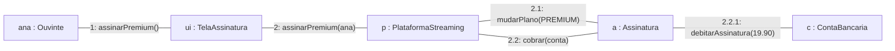

# 13 — Diagrama de Comunicação

**📌 Família:** comportamental (interação) · **Responde:** *quem fala com quem — e em que
ordem?*

---

## 1. Conceito

O diagrama de **comunicação** (chamado *diagrama de colaboração* na UML 1.x) mostra a mesma
interação do diagrama de sequência, mas com foco em **quem se conecta a quem** (a topologia da
colaboração), e não na linha do tempo. A ordem das mensagens é indicada por **números**
(1, 2, 2.1, 2.2…).

> 🔁 **Sequência × Comunicação:** carregam a **mesma informação**. Use **sequência** quando a
> *ordem no tempo* é o que importa; use **comunicação** quando as *conexões entre objetos*
> (acoplamento, topologia) são o foco.

---

## 2. Notação

- **Objetos:** retângulos (como no diagrama de objetos), ligados por **linhas** (links).
- **Mensagens:** setas rotuladas *sobre* os links, **numeradas** na ordem de execução.
  Números decimais (2.1, 2.2) indicam **aninhamento** (sub-chamadas disparadas dentro da
  mensagem 2).

---

## 3. Aplicação e exemplo (Melodia — "Assinar Premium")

Mesma interação da [seção 11](../11-diagrama-de-sequencia/), agora pela ótica da topologia:

> 🧠 Enxergamos a **rede de colaboração**: a `PlataformaStreaming` é o **centro** que fala com
> a `Assinatura`, que por sua vez fala com a `ContaBancaria`. A numeração `2.2.1` diz que o
> débito é um sub-passo disparado dentro de `cobrar`. Se um objeto tem setas para muitos
> outros, isso é um sinal visual de **alto acoplamento**.

---

## 4. Vantagens e desvantagens

| ✅ Vantagens | ❌ Desvantagens |
|-------------|-----------------|
| Destaca **topologia** e acoplamento entre objetos | A ordem (via números) é menos legível que na sequência |
| Mais compacto para poucas mensagens | Fica confuso com muitas mensagens/aninhamento |
| Bom para discutir **dependências** | Redundante com a sequência (escolha um) |

---

## 5. Na indústria (como sim, como não)

- ⚠️ **Muito menos usado que o de sequência.** Na prática, quase todo mundo prefere o diagrama
  de sequência para interações — a linha do tempo é mais intuitiva.
- ✅ **Onde ainda ajuda:** quando o ponto é discutir **acoplamento/dependências** ("olha quantas
  coisas este objeto conhece"), o layout em rede comunica melhor que a sequência.
- 💡 **Dica de professor:** saiba que existe e que é **equivalente** à sequência (isso cai em
  prova). No trabalho, provavelmente você desenhará a **sequência**.

---

## ✅ O que levar desta pasta

- [ ] Comunicação = mesma interação da sequência, focada em **quem se liga a quem**.
- [ ] Ordem vem de **números** (2.1, 2.2 = aninhamento).
- [ ] **Equivalente** à sequência — escolha um; a sequência costuma vencer.
- [ ] Bom para enxergar **acoplamento**.

---

[⬅️ 12 - Estrutura Composta](../12-diagrama-de-estrutura-composta/) | [Índice](../README.md) | [14 - Máquina de Estados ➡️](../14-diagrama-de-maquina-de-estados/)
