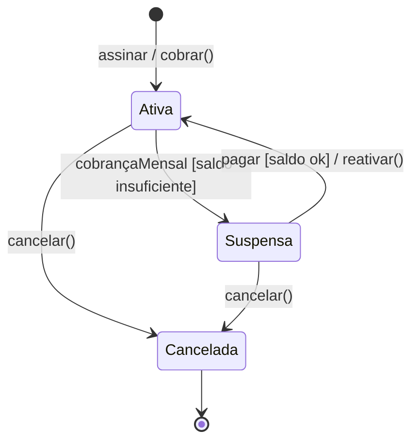

# 14 — Diagrama de Máquina de Estados

**📌 Família:** comportamental · **Responde:** *por quais estados um objeto passa ao longo da
vida?*

---

## 1. Conceito

O diagrama de **máquina de estados** (ou *diagrama de estados*) descreve o **ciclo de vida de
um único objeto**: os **estados** que ele pode assumir e as **transições** entre eles,
disparadas por **eventos**. Ideal para objetos cujo comportamento **muda conforme a situação**.

---

## 2. Notação

- **Estado inicial:** círculo cheio ● .
- **Estado:** retângulo arredondado com o nome (ex.: *Ativa*).
- **Transição:** seta com rótulo `evento [guarda] / ação`.
- **Estado final:** círculo com anel ◉ .
- **Guarda** `[condição]`: a transição só ocorre se for verdadeira.

---

## 3. Aplicação e exemplo (Melodia — ciclo de vida da `Assinatura`)

> 🔎 O guarda `[saldo insuficiente]` e a ação `/ reativar()` colocam **regras de negócio** (R2,
> R3, R4 do [projeto-base](../00-projeto-base/)) direto na transição. **Cancelada** é estado
> **final**: dela não se sai — a tentativa de cobrar uma assinatura cancelada lança exceção.

### Do diagrama ao código (correspondência exata)
Este diagrama é **implementado 1-para-1** em `assinatura/Assinatura.java`:

| Transição no diagrama | Método no Java |
|-----------------------|----------------|
| `Ativa → Suspensa` | `cobrar()` chama `suspender()` quando o débito falha |
| `Suspensa → Ativa` | `reativar()` (só permitido se estava suspensa) |
| `* → Cancelada` | `cancelar()` |
| tentar cobrar `Cancelada` | lança `IllegalStateException` |

> 🔗 Rode o `Principal.java`: Lucas vai de **Ativa → Suspensa** (sem saldo) e volta a
> **Ativa** após repor o saldo e reativar. É a máquina de estados **em execução**.

---

## 4. Vantagens e desvantagens

| ✅ Vantagens | ❌ Desvantagens |
|-------------|-----------------|
| Torna **impossíveis** estados/transições inválidos explícitos | Só faz sentido para objetos com "modos" claros |
| Documenta regras de negócio de forma visual e precisa | Explode com muitos estados (usar estados aninhados/hierárquicos) |
| Gera código de controlador quase direto | Overkill para objetos simples (a maioria) |

---

## 5. Na indústria (como sim, como não)

- ✅ **Extremamente útil** para entidades com ciclo de vida: **pedido** (criado→pago→enviado→
  entregue), **pagamento**, **assinatura**, **ticket de suporte**, **documento** (rascunho→
  publicado). Modelar isso evita a praga do `if (status == "X" && !cancelado && ...)` espalhado.
- ✅ Vira **máquinas de estado no código** (bibliotecas de *state machine*, *workflow engines*
  como Camunda/Temporal) em sistemas sérios.
- ❌ **Não** desenhe máquina de estados para objetos sem modos (um `Musica` simples não precisa).
- 💡 **Regra de professor:** se você percebe muitos `boolean` de status numa classe
  (`ativo`, `cancelado`, `suspenso`), provavelmente há **uma máquina de estados escondida** —
  modele-a explicitamente com um enum de `Status` (como `StatusAssinatura`).

---

## ✅ O que levar desta pasta

- [ ] Máquina de estados = **ciclo de vida** de **um** objeto (estados + transições + eventos).
- [ ] **Guarda** `[cond]` e **ação** `/ fazer()` carregam regras de negócio.
- [ ] Modele para entidades com **modos** (pedido, pagamento, assinatura).
- [ ] Vários `boolean` de status = máquina de estados **implícita** pedindo para nascer.

---

[⬅️ 13 - Comunicação](../13-diagrama-de-comunicacao/) | [Índice](../README.md) | [15 - Diagrama de Atividades ➡️](../15-diagrama-de-atividades/)
