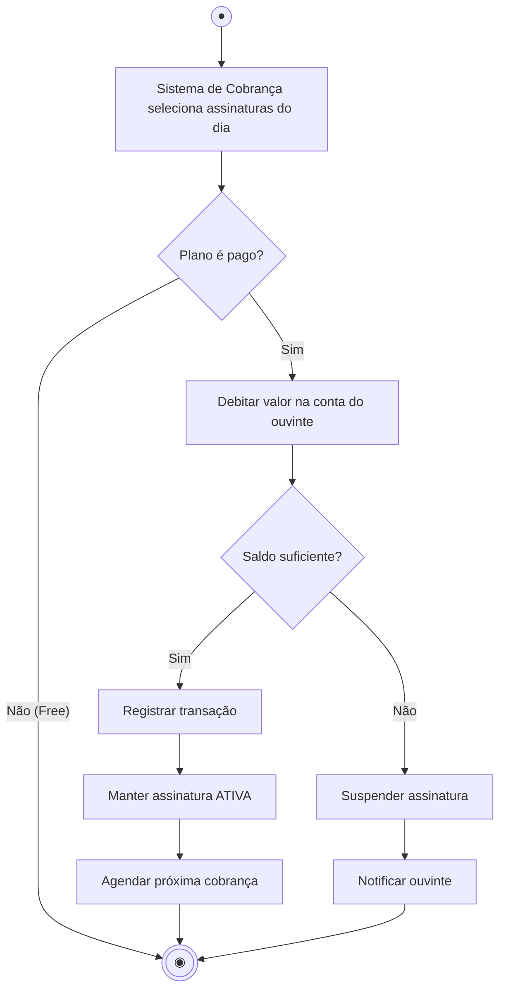

# 15 — Diagrama de Atividades

**📌 Família:** comportamental · **Responde:** *qual é o passo a passo de um processo?*

---

## 1. Conceito

O diagrama de **atividades** modela um **fluxo de trabalho** (workflow) ou a lógica de um
processo/algoritmo: a sequência de **ações**, com **decisões**, **paralelismo** e
**repetições**. É o "fluxograma" da UML — ótimo para descrever regras de negócio e o interior
de um caso de uso, **sem** falar de objetos ou classes.

---

## 2. Notação

- **Início:** círculo cheio ● ; **Fim:** círculo com anel ◉ .
- **Ação/atividade:** retângulo arredondado.
- **Decisão/merge:** losango (bifurca com `[guardas]`).
- **Fork/join (paralelismo):** barra grossa — divide em fluxos paralelos e depois junta.
- **Raias (*swimlanes*):** colunas que dizem **quem** faz cada ação (ator/setor).

---

## 3. Aplicação e exemplo (Melodia — cobrança mensal da assinatura)

> 🧠 O losango é a **decisão** (`[saldo suficiente?]`) com guardas *Sim/Não*. Um mesmo diagrama
> serve para **conversar com o cliente** (é legível por qualquer pessoa) **e** guiar a
> implementação da rotina de cobrança.

### Com raias (quem faz o quê)
Se quiséssemos mostrar responsabilidades, poríamos três colunas — **Ouvinte** | **Plataforma**
| **Banco** — e cada ação na raia de quem a executa. Raias transformam o fluxo num mapa de
**processos e papéis** (muito usado em modelagem de negócio / BPMN).

---

## 4. Atividades × Sequência × Estados (não confunda)

| Diagrama | Foco |
|----------|------|
| **Atividades** | o **fluxo do processo** (passos, decisões) — *sem* objetos |
| **Sequência** | as **mensagens entre objetos** ordenadas no tempo |
| **Máquina de estados** | os **estados de um objeto** e transições |

---

## 5. Vantagens e desvantagens

| ✅ Vantagens | ❌ Desvantagens |
|-------------|-----------------|
| Legível por **qualquer pessoa** (inclusive não-técnicos) | Não mostra quais objetos/classes executam |
| Excelente para **regras de negócio** e algoritmos | Fluxos enormes viram "espaguete" |
| Raias mapeiam responsabilidades entre setores | Pode duplicar o que já está no código |

---

## 6. Na indústria (como sim, como não)

- ✅ **Muito usado para processos de negócio** — frequentemente na forma de **BPMN** (notação
  prima, padrão em ferramentas de *workflow*/RPA e áreas de negócio).
- ✅ Ótimo para **documentar decisões e regras** de um processo antes de automatizá-lo.
- ⚠️ **Não** o use para detalhar interação técnica entre objetos (isso é sequência) nem para
  desenhar *toda* a lógica de código — vira fluxograma gigante que ninguém mantém.
- 💡 **Dica:** para algoritmos, um bom código com nomes claros muitas vezes dispensa o
  fluxograma. Reserve o diagrama para o processo **de negócio** ou o algoritmo **não óbvio**.

---

## ✅ O que levar desta pasta

- [ ] Atividades = **fluxograma** do processo: ações, decisões, paralelismo, repetição.
- [ ] **Raias** mostram **quem** faz cada passo.
- [ ] Difere de sequência (objetos) e de estados (modos de um objeto).
- [ ] Na indústria, aparece muito como **BPMN** para processos de negócio.

---

[⬅️ 14 - Máquina de Estados](../14-diagrama-de-maquina-de-estados/) | [Índice](../README.md) | [16 - Interação Geral ➡️](../16-diagrama-de-interacao-geral/)
