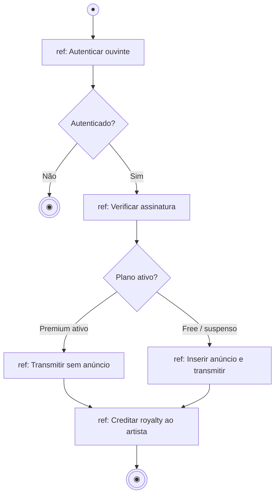

# 16 — Diagrama de Interação Geral (Visão Geral da Interação)

**📌 Família:** comportamental (interação) · **Responde:** *como vários cenários de interação
se encadeiam num fluxo maior?*

---

## 1. Conceito

O diagrama de **interação geral** (*interaction overview*) é um **híbrido**: tem a estrutura
de um diagrama de **atividades**, mas cada "nó" é uma **interação inteira** (um mini-diagrama
de sequência) — referenciada (`ref`) ou embutida (`sd`). Ele mostra o **fluxo de controle
entre cenários**, como um "mapa" que costura vários diagramas de sequência.

> Pense nele como o **índice** das suas sequências: em vez de mensagens, os nós são
> "sub-histórias" completas, ligadas por decisões e desvios.

---

## 2. Notação

- Mesmos controles do diagrama de **atividades**: início ●, fim ◉, decisão (losango),
  fork/join.
- **Nós de interação:** quadros rotulados `ref NomeDaSequencia` (referência a um diagrama de
  sequência existente) ou `sd` com a interação embutida ali mesmo.

---

## 3. Aplicação e exemplo (Melodia — "Atender pedido de reprodução")

> 🧠 Cada caixa `ref:` é **um diagrama de sequência inteiro** resumido em um nó. Este diagrama
> **não** detalha mensagens — ele **organiza** quais interações acontecem e em que
> ordem/condição. É a "visão de cima" de um caso de uso com muitos caminhos.

---

## 4. Vantagens e desvantagens

| ✅ Vantagens | ❌ Desvantagens |
|-------------|-----------------|
| Dá a **visão macro** de um fluxo com vários cenários | Diagrama **raro** e pouco conhecido — muita gente não lê |
| **Reaproveita** sequências já feitas (via `ref`) | Exige já ter as sequências desenhadas |
| Bom para casos de uso complexos e ramificados | Ferramentas o suportam mal; fácil confundir com atividades |

---

## 5. Na indústria (como sim, como não)

- ⚠️ **Um dos diagramas menos usados da UML.** Na prática, o mesmo objetivo costuma ser
  atingido com um **diagrama de atividades** de alto nível, ou simplesmente listando os
  cenários e linkando os diagramas de sequência num documento.
- ✅ **Onde faz sentido:** documentar um caso de uso realmente grande, com muitos sub-fluxos que
  você **já** modelou em sequência e quer "costurar" numa visão só.
- 💡 **Dica de professor:** entenda o conceito (atividades + sequências combinados), mas não se
  cobre dominá-lo — priorize **sequência** e **atividades** separadamente.

---

## ✅ O que levar desta pasta

- [ ] Interação geral = **atividades cujos nós são interações** (sequências).
- [ ] Usa `ref` para **reaproveitar** diagramas de sequência.
- [ ] É a **visão de cima** de um caso de uso ramificado.
- [ ] **Raro** na prática — conheça, mas priorize sequência/atividades.

---

[⬅️ 15 - Atividades](../15-diagrama-de-atividades/) | [Índice](../README.md) | [17 - Diagrama de Componentes ➡️](../17-diagrama-de-componentes/)
