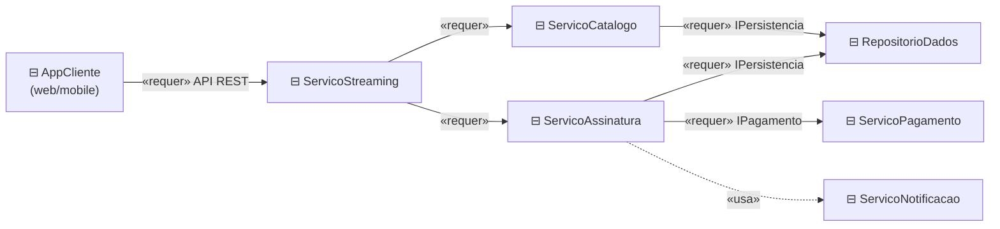

# 17 — Diagrama de Componentes

**📌 Família:** estrutural · **Responde:** *em quais peças de software o sistema se divide e
como elas se conectam?*

---

## 1. Conceito

O diagrama de **componentes** mostra a organização do sistema em **componentes** — unidades de
software **substituíveis** e de alto nível (um módulo, uma biblioteca, um serviço, um
subsistema) — e as **interfaces** por onde eles se conectam. É a **visão de arquitetura de
software**: as "peças de Lego" do sistema.

---

## 2. Notação

- **Componente:** retângulo com o ícone ⊟ (ou o estereótipo `«component»`).
- **Interface fornecida:** "pirulito" `─○` (o componente *oferece* esse serviço).
- **Interface requerida:** "soquete" `─(` (o componente *precisa* desse serviço).
- **Dependência:** seta tracejada `- - ->`.
- **Encaixe** pirulito-no-soquete = um componente **usa** a interface do outro.

---

## 3. Aplicação e exemplo (Melodia — arquitetura)

> 🧠 Cada `⊟` é um **componente substituível**: dá para trocar `RepositorioDados` de MySQL para
> PostgreSQL sem afetar quem usa a interface `IPersistencia`; ou trocar `ServicoPagamento` de um
> gateway por outro, desde que respeite `IPagamento`. Componentes falam por **interfaces
> (contratos)**, não por implementação — é isso que produz **baixo acoplamento**.

### Ligação com o código
No [projeto-base-java](../projeto-base-java/), a classe `PlataformaStreaming` corresponde ao
`ServicoStreaming`; o pacote `banco` embute o que aqui seria `ServicoPagamento`. Num sistema
real, cada componente viraria um módulo/serviço separado com sua própria interface.

---

## 4. Componentes × Pacotes × Implantação

| Diagrama | Mostra |
|----------|--------|
| **Componentes** | as **peças lógicas** de software e suas **interfaces** |
| **Pacotes** | o agrupamento do **código-fonte** em namespaces/módulos |
| **Implantação** | em qual **hardware** cada componente/artefato roda |

---

## 5. Vantagens e desvantagens

| ✅ Vantagens | ❌ Desvantagens |
|-------------|-----------------|
| Comunica **arquitetura** e limites de módulos | Pouco detalhe interno (é visão macro, de propósito) |
| Contratos por **interface** favorecem substituição | Notação de pirulito/soquete confunde iniciantes |
| Base para dividir trabalho entre times | Pode virar "caixas e setas" vago se mal feito |

---

## 6. Na indústria (como sim, como não)

- ✅ **Muito relevante na era de microsserviços**: cada serviço é um componente com uma API
  (interface). Definir esses contratos é decisão de arquitetura de peso.
- 🔄 **Concorrência moderna:** o **C4 model** (Context, Container, Component, Code) virou o
  padrão *de facto* para desenhar arquitetura, muitas vezes no lugar do diagrama de componentes
  UML clássico — mas a ideia é a mesma (peças + interfaces + dependências).
- ⚠️ **Cuidado com o "diagrama de caixas e setas"** sem interfaces definidas: sem contratos
  claros, o desenho é bonito e inútil. O valor está em **explicitar as interfaces**.
- 💡 Bons times mantêm **um** diagrama de arquitetura atualizado — é o mapa que todo novo dev lê
  no primeiro dia.

---

## ✅ O que levar desta pasta

- [ ] Componente = **peça de software substituível** que fala por **interfaces**.
- [ ] **Pirulito** fornece, **soquete** requer; encaixe = dependência via contrato.
- [ ] Interfaces bem definidas = **baixo acoplamento** (troca sem quebrar o resto).
- [ ] Na indústria, dialoga com **microsserviços** e o **C4 model**.

---

[⬅️ 16 - Interação Geral](../16-diagrama-de-interacao-geral/) | [Índice](../README.md) | [18 - Diagrama de Pacotes ➡️](../18-diagrama-de-pacotes/)
