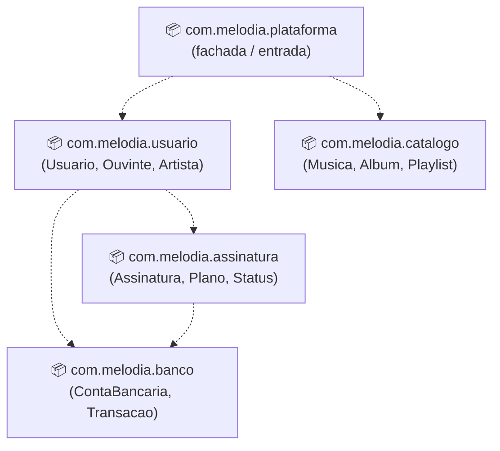

# 18 — Diagrama de Pacotes

**📌 Família:** estrutural · **Responde:** *como o sistema está organizado em
módulos/namespaces?*

---

## 1. Conceito

O diagrama de **pacotes** agrupa elementos relacionados (classes, componentes) em **pacotes** —
os *namespaces* / *packages* do código — e mostra as **dependências** entre esses grupos. É a
visão de mais alto nível da **organização do código**; ajuda a manter a arquitetura em camadas
limpa e sem ciclos.

---

## 2. Notação

- **Pacote:** ícone de "pasta" (retângulo com aba).
- **Dependência:** seta tracejada `- - ->` (o pacote de origem **usa/importa** o de destino).
- **Aninhamento:** pacotes dentro de pacotes.

---

## 3. Aplicação e exemplo (Melodia — camadas)

Este diagrama corresponde **exatamente** à estrutura de pacotes do
[projeto-base-java](../projeto-base-java/):

> 🧠 As setas mostram a direção das dependências. Repare que `banco` **não depende de ninguém**
> — é um módulo de base, estável. Já `plataforma` (a fachada) depende de vários. **Módulos
> estáveis embaixo, módulos que mudam muito em cima**: essa é a regra de uma boa arquitetura em
> camadas.

### O pecado capital: dependência cíclica
Se `banco` passasse a depender de `assinatura` (que já depende de `banco`), teríamos um
**ciclo** `banco → assinatura → banco`. Ciclos entre pacotes são um **forte sinal de alerta**:
dificultam teste, reúso e compilação isolada. Um bom diagrama de pacotes é **acíclico**.

---

## 4. Vantagens e desvantagens

| ✅ Vantagens | ❌ Desvantagens |
|-------------|-----------------|
| Visão macro da organização do código | Não mostra classes/comportamento (é só agrupamento) |
| Expõe **ciclos** e dependências indevidas | Simplista demais para arquiteturas grandes |
| Guia a estrutura de diretórios/`package` | Precisa de disciplina para não desatualizar |

---

## 5. Na indústria (como sim, como não)

- ✅ **Muito usado para comunicar a arquitetura em camadas** (apresentação → aplicação →
  domínio → infraestrutura) e para **impor regras de dependência**.
- 🔧 **Ferramentas automatizam isso:** ArchUnit (Java), analisadores de dependência e linters de
  arquitetura **falham o build** se alguém criar uma dependência proibida (ex.: domínio
  importando a camada web). Ou seja, o "diagrama" vira **teste automatizado**.
- 💡 **Arquitetura em camadas / hexagonal / limpa:** todas se baseiam em manter o **domínio no
  centro**, sem depender de UI nem de banco — exatamente o que o diagrama de pacotes torna
  visível.
- ⚠️ **Não** tente colocar todas as classes; mostre **pacotes** e suas **dependências**, só isso.

---

## ✅ O que levar desta pasta

- [ ] Pacotes = **agrupamento do código** em módulos/namespaces + **dependências**.
- [ ] Boa arquitetura é **acíclica**; ciclos entre pacotes são alerta vermelho.
- [ ] Módulos **estáveis embaixo**, voláteis em cima; **domínio no centro**.
- [ ] Na indústria, regras de dependência viram **testes de arquitetura** (ex.: ArchUnit).

---

[⬅️ 17 - Componentes](../17-diagrama-de-componentes/) | [Índice](../README.md) | [19 - Diagrama de Implantação ➡️](../19-diagrama-de-implantacao/)
