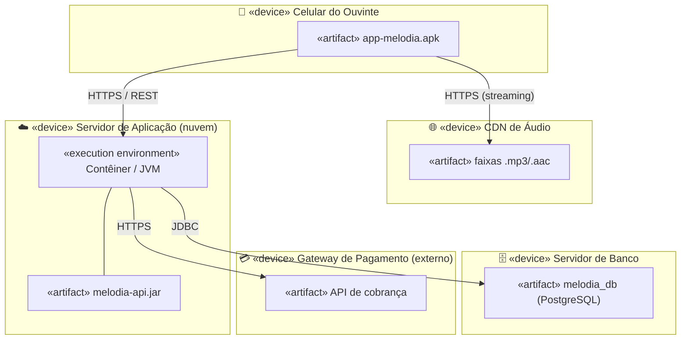

# 19 — Diagrama de Implantação (Deployment)

**📌 Família:** estrutural · **Responde:** *onde o software roda fisicamente?*

---

## 1. Conceito

O diagrama de **implantação** mostra a **infraestrutura física**: os **nós** (hardware ou
ambientes de execução — servidores, celulares, contêineres) e como os **artefatos** de
software (`.jar`, `.war`, imagens de contêiner, bancos) são **distribuídos** entre eles, além
das **conexões de rede** que os ligam. É a ponte entre o software e o mundo físico.

---

## 2. Notação

- **Nó (*node*):** cubo 3D. Pode ser um dispositivo (`«device»`) ou um ambiente de execução
  (`«execution environment»` — ex.: uma JVM, um contêiner Docker).
- **Artefato:** retângulo com o estereótipo `«artifact»` — o que está **instalado** no nó.
- **Caminho de comunicação:** linha entre nós, rotulada com o **protocolo** (`HTTPS`, `JDBC`).

---

## 3. Aplicação e exemplo (Melodia — produção)

> 🧠 Enquanto o [diagrama de componentes](../17-diagrama-de-componentes/) mostra as *peças
> lógicas* de software, o de implantação mostra **em qual máquina cada peça roda** e **como as
> máquinas conversam** (HTTPS, JDBC). Note que o áudio vem de uma **CDN** separada da API — uma
> decisão de infraestrutura típica de streaming (escala e latência).

---

## 4. Vantagens e desvantagens

| ✅ Vantagens | ❌ Desvantagens |
|-------------|-----------------|
| Comunica a **topologia de produção** com Ops/DevOps | Não diz nada sobre a lógica interna do software |
| Ajuda a **dimensionar** servidores e planejar escala | Desatualiza rápido em nuvens elásticas |
| Explicita protocolos, portas e limites de rede/segurança | Infra moderna (Kubernetes) é mais dinâmica que um desenho estático |

---

## 5. Na indústria (como sim, como não)

- ✅ **Muito útil para conversar com infraestrutura/DevOps**, planejar segurança (o que é
  público × privado) e documentar a arquitetura de implantação de um sistema.
- 🔄 **Concorrência moderna:** em ambientes **cloud-native/Kubernetes**, a "verdade" está em
  arquivos declarativos (Terraform, YAML do K8s, `docker-compose`) — que são, em essência, a
  implantação **como código**. O diagrama UML serve mais para a **visão de comunicação** de
  alto nível.
- 💡 **Onde ainda é ouro:** o diagrama de **um slide** que mostra "app → API → banco → gateway"
  para explicar o sistema a um novo membro ou a um cliente. Simples e eficaz.
- ⚠️ **Não** detalhe cada réplica/pod — mostre a **topologia conceitual**, não o estado
  instantâneo do cluster.

---

## ✅ O que levar desta pasta

- [ ] Implantação = **nós (hardware/ambiente)** + **artefatos** + **conexões de rede**.
- [ ] Diferencia `«device»` de `«execution environment»`; artefato é o que se **instala**.
- [ ] Comunica **topologia de produção** e decisões de rede/segurança.
- [ ] Hoje convive com **infra como código** (Terraform, K8s); use para a **visão macro**.

---

[⬅️ 18 - Pacotes](../18-diagrama-de-pacotes/) | [Índice](../README.md) | [20 - Diagrama de Temporização ➡️](../20-diagrama-de-temporizacao/)
