# Interfaces - Contratos e Múltipla Implementação

## 🎯 O que são Interfaces?

Uma **interface** em Java é um contrato que define:

- **Quais métodos** uma classe deve implementar (sem definir como)
- **Constantes** que podem ser compartilhadas
- **Comportamentos comuns** para classes não relacionadas hierarquicamente
- **Múltipla herança de comportamento** (uma classe pode implementar várias interfaces)

**Analogia**: Como um contrato de trabalho - define o que deve ser feito (responsabilidades), mas não como fazer. Diferentes pessoas podem cumprir o mesmo contrato de maneiras diferentes.

## Por que estudar interfaces? (motivação / importância)

**Contrato explícito:** interfaces definem o que um tipo faz sem impor como faz — ideal para desenhar APIs e separar implementação de uso.   
**Polimorfismo e desacoplamento:** clientes programam contra interfaces e não contra implementações concretas → facilita substituição, testes e evolução.   
**Composição de comportamentos:** permitem que uma classe implemente múltiplos papéis/capacidades (herança múltipla de tipo).   
**Compatibilidade e evolução de API:** com recursos modernos (default methods) é possível adicionar comportamento sem quebrar implementações antigas (com limitações).  
**Suporte a programação funcional:** interfaces SAM (Single Abstract Method) permitem uso de lambdas e referências de método.  

---

## 🎧 Aula prática: chegando à interface pelo problema (o Melodia)

> 🧭 **Siga esta seção na ordem.** Nas aulas anteriores modelamos o **Melodia** (nosso
> "Spotify"): [abstração](../06-abstracao/), [herança](../04-heranca/) e
> [polimorfismo](../05-polimorfismo/). Agora o produto pede **duas mudanças** que a herança
> **não resolve bem** — e é exatamente aí que a **interface** entra. Para cada mudança vamos ver
> **(1) como está hoje → (2) qual é o problema → (3) a solução com interface**, sempre com o
> **diagrama de classes** em Mermaid.

### 🏁 De onde partimos — o modelo atual do Melodia

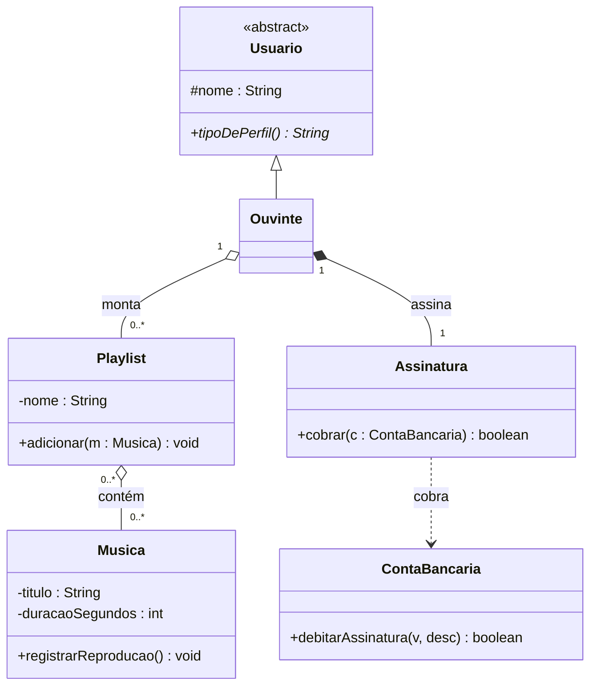

Até aqui **tudo é classe** (abstrata ou concreta). Repare em dois pontos que vão doer: a
`Playlist` conhece **`Musica`** (classe concreta), e a `Assinatura` cobra direto numa
**`ContaBancaria`** (classe concreta). Guarde essas duas setas — elas são o problema.

---

### 🟥 Problema 1 — "A playlist também precisa tocar podcast"

#### 1) Como está hoje

A `Playlist` guarda uma lista de `Musica`. Reproduzir é percorrer músicas:

```java
public class Playlist {
    private final List<Musica> musicas = new ArrayList<>();

    public void adicionar(Musica m) { musicas.add(m); }

    public void tocarTudo() {
        for (Musica m : musicas) {
            m.registrarReproducao();   // só sabe tocar Musica
        }
    }
}
```

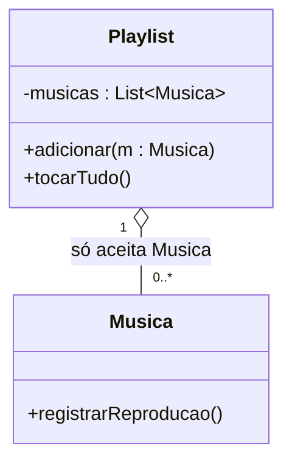

#### 2) Qual é o problema

Chega a *user story*: *"como ouvinte, quero colocar **episódios de podcast** na mesma playlist"*.
Criamos a classe `Podcast`… e a `Playlist` **não aceita**, porque só conhece `Musica`.

As duas saídas "óbvias" **são ruins**:

- **❌ Fazer `Podcast extends Musica`** só para caber na lista. Mas podcast **não é** uma música
  (relação "É-UM" **falsa**) — herdaria `artista`, `álbum` etc. que não fazem sentido. A
  [aula de abstração](../06-abstracao/) já avisou: herança é para identidade, não para "encaixar".
- **❌ Duplicar tudo**: criar `listaDeMusicas` + `listaDePodcasts` e sair checando tipo com
  `if (x instanceof Musica) ... else if (x instanceof Podcast) ...`. Código que **cresce a cada
  novo tipo** (amanhã vem `AudioLivro`, `AoVivo`…).

O que `Musica` e `Podcast` têm em comum **não é o que elas são**, e sim o que elas **sabem
fazer**: ambas **podem ser reproduzidas**, têm título e duração. Isso é uma **capacidade** —
o território da **interface** ("PODE-FAZER"), não da herança ("É-UM").

#### 3) A solução — a interface `FonteDeAudio`

Criamos um **contrato**: tudo que é reproduzível expõe título, duração e sabe reproduzir.
`Musica` e `Podcast` **implementam** o contrato; a `Playlist` passa a depender do **contrato**,
não da classe concreta.

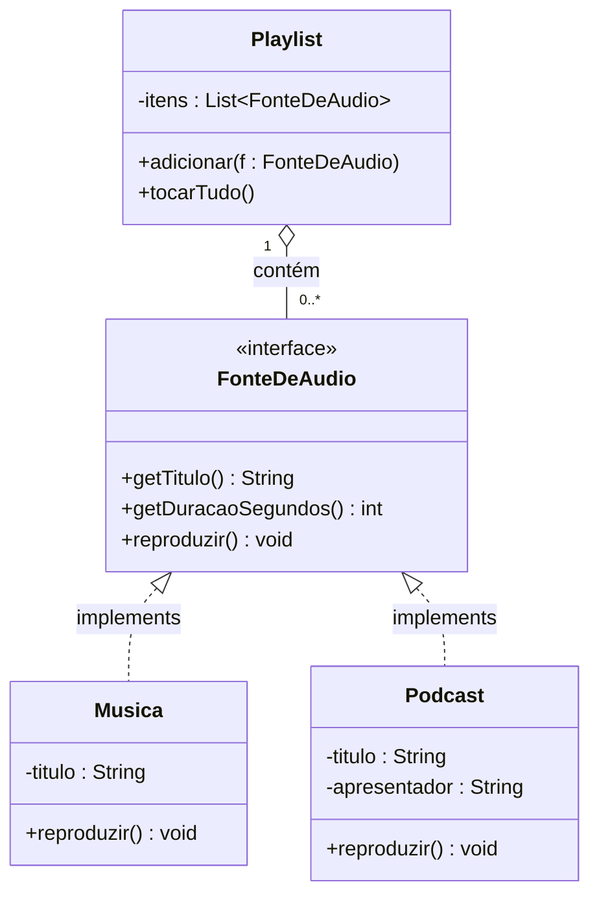

> 🔑 **Leia o diagrama:** a seta **tracejada com triângulo** (`<|..`) é a **implementação** de
> interface (*realization*) — diferente da herança, que é linha **cheia** (`<|--`). A `Playlist`
> agora aponta para **`FonteDeAudio`** (o contrato), e não mais para `Musica`.

```java
// O CONTRATO: o que todo áudio reproduzível promete expor
public interface FonteDeAudio {
    String getTitulo();
    int getDuracaoSegundos();
    void reproduzir();
}

public class Musica implements FonteDeAudio {
    private String titulo;
    private int duracaoSegundos;
    @Override public String getTitulo()        { return titulo; }
    @Override public int getDuracaoSegundos()  { return duracaoSegundos; }
    @Override public void reproduzir()         { /* registra reprodução, paga royalty… */ }
}

public class Podcast implements FonteDeAudio {
    private String titulo;
    private String apresentador;
    @Override public String getTitulo()        { return titulo; }
    @Override public int getDuracaoSegundos()  { return /* soma dos episódios */ 0; }
    @Override public void reproduzir()         { /* toca o episódio atual… */ }
}

public class Playlist {
    private final List<FonteDeAudio> itens = new ArrayList<>();  // o contrato, não a classe

    public void adicionar(FonteDeAudio f) { itens.add(f); }      // aceita QUALQUER fonte

    public void tocarTudo() {
        for (FonteDeAudio f : itens) {
            f.reproduzir();   // polimorfismo: cada um reproduz do seu jeito
        }
    }
}
```

**Por que isso resolve?**

- A `Playlist` mistura `Musica` e `Podcast` **sem saber a diferença** — ela só confia no
  contrato `reproduzir()`. Isso é **polimorfismo** ([aula 05](../05-polimorfismo/)) via interface.
- Amanhã, `AudioLivro implements FonteDeAudio` entra na playlist **sem tocar uma linha** da
  `Playlist`. O código fica **aberto a extensão, fechado a modificação**.
- Some o `instanceof`/`if` encadeado: cada tipo **leva sua própria** implementação de `reproduzir`.

> ☕ **Ligação com o projeto:** este é exatamente o
> [Desafio 3 — A FonteDeAudio](../01-modelagem/analise-projeto-uml/projeto-base-java/DESAFIOS.md)
> do `projeto-base-java`. O modelo da aula vira código.

---

### 🟥 Problema 2 — "Quero pagar a assinatura com cartão e Pix, não só pela carteira"

#### 1) Como está hoje

A `Assinatura` cobra **diretamente** numa `ContaBancaria` (a carteira interna do Melodia):

```java
public class Assinatura {
    public boolean cobrar(ContaBancaria conta) {          // amarrada à ContaBancaria
        return conta.debitarAssinatura(plano.getPrecoMensal(), "Assinatura " + plano);
    }
}
```

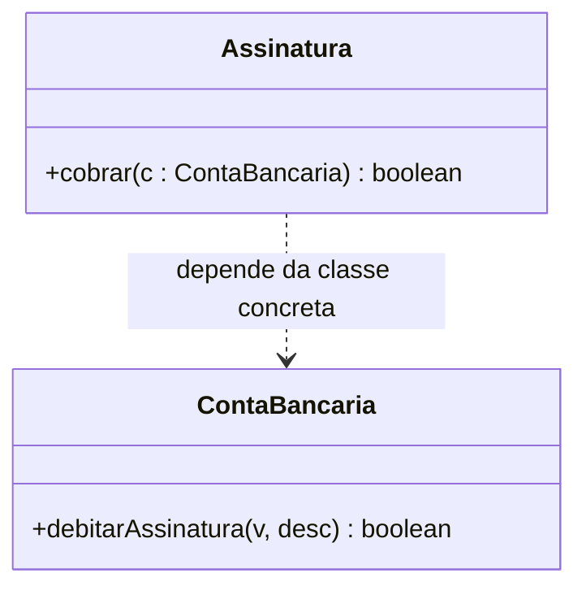

#### 2) Qual é o problema

O produto quer aceitar **cartão de crédito** e **Pix** (via um gateway externo). Mas a
`Assinatura` só sabe falar com `ContaBancaria`. Para adicionar cartão, teríamos que **mexer na
`Assinatura`** — e de novo a cada novo meio (`if (cartao) … else if (pix) …`). É o acoplamento a
uma **classe concreta** que trava a evolução. (É a dor da *"troca de gateway"* contada na
[aula de abstração](../06-abstracao/).)

#### 3) A solução — a interface `MeioDePagamento`

A `Assinatura` passa a depender de um **contrato de cobrança**; cada forma de pagar o implementa.

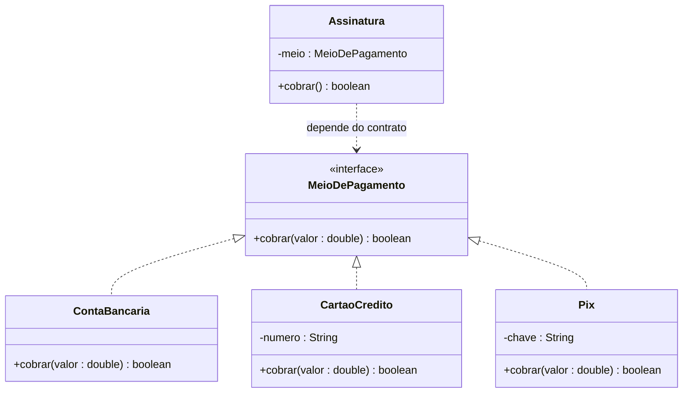

```java
public interface MeioDePagamento {
    boolean cobrar(double valor);          // o QUE: cobrar. O COMO fica em cada classe.
}

public class CartaoCredito implements MeioDePagamento {
    @Override public boolean cobrar(double valor) { /* chama a operadora */ return true; }
}

public class Pix implements MeioDePagamento {
    @Override public boolean cobrar(double valor) { /* gera cobrança no gateway */ return true; }
}

public class Assinatura {
    private final MeioDePagamento meio;    // guarda o CONTRATO

    public Assinatura(MeioDePagamento meio) { this.meio = meio; }

    public boolean cobrar() {
        return meio.cobrar(plano.getPrecoMensal());   // não sabe (nem precisa) qual é o meio
    }
}
```

**Por que isso resolve?**

- Adicionar **PayPal**? Basta `class PayPal implements MeioDePagamento` — **zero** mudança na
  `Assinatura`. Programamos **contra o contrato, não contra a implementação** (desacoplamento).
- Nos **testes**, injeta-se um `MeioDePagamentoFalso` que sempre aprova — sem chamar banco de
  verdade. Interface é o que torna o código **testável**.
- Isto é a base do princípio **D** de [SOLID](../08-solid/) (*Dependa de abstrações*), a próxima
  aula.

---

### 🟩 Fechando: uma classe, vários contratos (múltipla implementação)

Herança em Java é **simples** (uma classe-pai só). Já **interfaces** uma classe pode cumprir
**várias** — é como assinar vários contratos ao mesmo tempo. No Melodia, um `CartaoCredito`
**cobra** e também **pode reembolsar**:

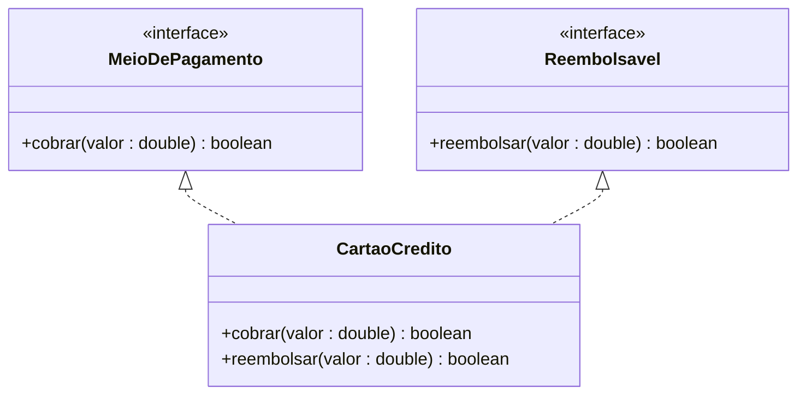

```java
public class CartaoCredito implements MeioDePagamento, Reembolsavel {
    @Override public boolean cobrar(double valor)    { /* ... */ return true; }
    @Override public boolean reembolsar(double valor) { /* ... */ return true; }
}
```

Assim, `Pix` pode ser só `MeioDePagamento`, enquanto `CartaoCredito` acumula as duas
capacidades — cada classe assina **só os contratos que cumpre**. Isso é impossível com herança
de classes, e natural com interfaces.

> 🧠 **O fio da meada:** partimos de um problema real → vimos por que **herança não serve** →
> chegamos à **interface** (contrato / "PODE-FAZER") → ganhamos **polimorfismo, extensão sem
> modificação, desacoplamento e testabilidade**. Guarde essa sequência; ela se repete em todo
> bom uso de interface.

---

## 💳 Aprofundando: o Módulo de Pagamento do Melodia (completo)

> Esta parte **continua a história** do Problema 2. Vamos construir, passo a passo, um **módulo de
> pagamento de verdade** para a assinatura do Melodia — e, em cada passo, responder **por que** e
> **o que acontece se não fizermos assim**. Tudo isto está **implementado e rodando** em
> [`exemplo/iaula-interface/`](exemplo/iaula-interface/).

### 🟥 Problema 3 — "Nem todo meio de pagamento faz as mesmas coisas"

#### 1) Como está indo
Já temos o contrato `MeioDePagamento` com `cobrar(double)`. Agora o produto pede mais:
- o **cartão** precisa **autenticar** antes de cobrar (3-D Secure) e sabe **reembolsar**;
- o **Pix** **não autentica**, mas sabe **reembolsar**;
- o **boleto** **só cobra** — não autentica nem reembolsa sozinho.

#### 2) Qual é o problema
A tentação é **inchar o contrato**: colocar `autenticar()` e `reembolsar()` dentro de
`MeioDePagamento`. Aí **todo mundo é obrigado a implementar tudo** — e o `Boleto` fica com métodos
que não fazem sentido:

```java
// ❌ contrato "gordo": obriga o Boleto a ter o que ele não faz
public class Boleto implements MeioDePagamento {
    public boolean cobrar(double v) { /* ok */ return true; }
    public boolean autenticar(String t) { return true; }            // mentira: boleto não autentica
    public boolean reembolsar(double v) {
        throw new UnsupportedOperationException("boleto não reembolsa"); // bomba-relógio
    }
}
```
Isso gera **métodos vazios ou que estouram em runtime** — o código "compila mas mente". Quem chama
não tem como saber se o método **realmente** funciona.

#### 3) A solução — **capacidades opcionais** em interfaces separadas
Quebramos em contratos pequenos (isto é o **I** de SOLID — *Interface Segregation*): o essencial
fica em `MeioDePagamento`; o que é **opcional** vira `Autenticavel` e `Reembolsavel`. Cada forma
**assina só os contratos que cumpre**.

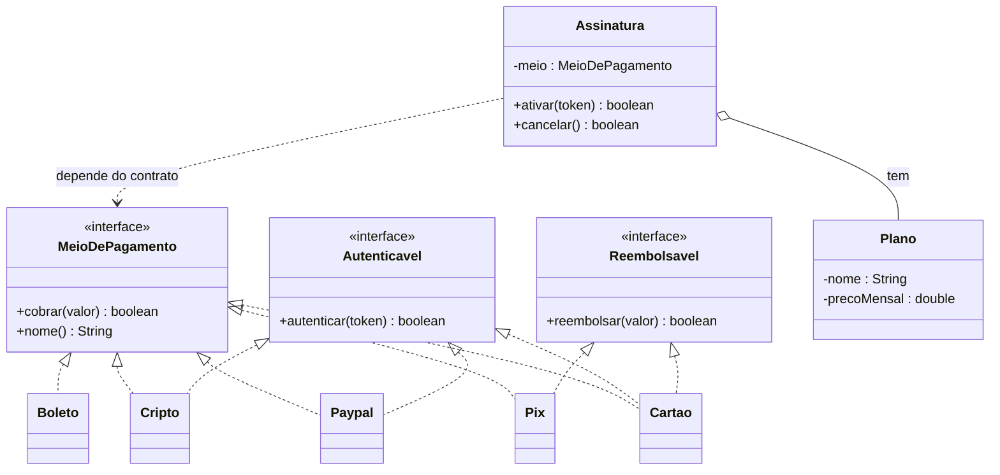

> 🔎 **Leia o diagrama:** `Boleto` liga **só** a `MeioDePagamento`. `Pix` liga a `MeioDePagamento`
> **e** `Reembolsavel`. `Cartao` liga aos **três**. Cada classe assina **só o que cumpre** — e a
> `Assinatura` continua dependendo apenas do contrato `MeioDePagamento`.

A `Assinatura` descobre a capacidade **na hora**, com `instanceof` — pedindo a mais **só se o meio
assinou aquele contrato**:

```java
public boolean ativar(String token) {
    if (meio instanceof Autenticavel) {                 // só autentica quem PODE
        if (!((Autenticavel) meio).autenticar(token)) return false;
    }
    return meio.cobrar(plano.getPrecoMensal());         // todos sabem cobrar
}

public boolean cancelar() {
    ativa = false;
    if (meio instanceof Reembolsavel) {                 // só reembolsa quem PODE
        ((Reembolsavel) meio).reembolsar(plano.getPrecoMensal());
    } else {
        System.out.println("[" + meio.nome() + "] não reembolsa automático — tratar manual.");
    }
    return true;
}
```

**Por que isso resolve?**
- O `Boleto` **não é forçado** a ter `autenticar/reembolsar` → acabam os métodos vazios e os
  `UnsupportedOperationException`.
- Adicionar **PayPal** ou **Cripto** é **criar a classe** e usar — a `Assinatura` **não muda** uma
  linha (aberto para extensão, fechado para modificação).
- Dá para **testar** injetando um `MeioDePagamento` falso que sempre aprova — sem banco de verdade.

### ⚠️ O que acontece se NÃO usarmos interface no pagamento
Sem contrato, a `Assinatura` conheceria cada classe concreta e viraria um **festival de `if`**:

```java
// ❌ o pesadelo que a interface evita
if (meio instanceof Cartao)      { ((Cartao) meio).cobrarNoCartao(preco); }
else if (meio instanceof Pix)    { ((Pix) meio).enviarPix(preco); }
else if (meio instanceof Boleto) { ((Boleto) meio).emitirBoleto(preco); }
// ... e a cada novo meio, mais um 'else if' AQUI dentro (e em todo lugar que cobra)
```
Resultado: **cada novo meio obriga a mexer na `Assinatura`** (e nos testes, e no checkout…),
cresce o acoplamento, e um `else` esquecido vira bug silencioso. A interface troca esse `if` por
**polimorfismo**: cada meio leva o seu próprio `cobrar`.

### ▶️ Rode o módulo completo
O exemplo executável está em [`exemplo/iaula-interface/src`](exemplo/iaula-interface/src) (Java 17):

```bash
cd exemplo/iaula-interface/src
javac -d out $(find . -name "*.java")
java -cp out App
```

Trechos da saída (a `Assinatura` trata todos os meios do mesmo jeito):
```
-- Ativando via Cartão de crédito --
[Cartão] autenticando... ok
[Cartão ****3456] cobrando R$ 19,90
✓ Assinatura 'Premium' ativada via Cartão de crédito
...
[Boleto] não suporta reembolso automático — tratar manual.
```

---

## 📋 Sintaxe e Características

### Definindo uma Interface

```java
public interface Voavel {
    // Constantes (implicitamente public static final)
    int VELOCIDADE_MAXIMA = 1000;
    String TIPO_MOVIMENTO = "Aéreo";
    
    // Métodos abstratos (implicitamente public abstract)
    void decolar();
    void voar();
    void aterrissar();
    double calcularTempoVoo(double distancia);
    
    // Método default (Java 8+) - implementação padrão
    default void planar() {
        System.out.println("Planando suavemente...");
    }
    
    // Método estático (Java 8+)
    static void informacoesVoo() {
        System.out.println("Informações sobre voo disponíveis.");
    }
}
```

### Implementando uma Interface

```java
public class Aviao implements Voavel {
    private String modelo;
    private boolean voando;
    
    @Override
    public void decolar() {
        System.out.println("Avião " + modelo + " decolando da pista...");
        voando = true;
    }
    
    @Override
    public void voar() {
        if (voando) {
            System.out.println("Avião voando a " + VELOCIDADE_MAXIMA + " km/h");
        }
    }
    
    @Override
    public void aterrissar() {
        System.out.println("Avião " + modelo + " aterrissando...");
        voando = false;
    }
    
    @Override
    public double calcularTempoVoo(double distancia) {
        return distancia / VELOCIDADE_MAXIMA;
    }
    
    // Pode usar método default da interface ou sobrescrever
    // planar() já está disponível sem implementar
}
```

### Múltipla Implementação

```java
// Uma classe pode implementar várias interfaces
public class Passaro implements Voavel, Animal {
    private String especie;
    
    // Implementa métodos de Voavel
    @Override
    public void decolar() {
        System.out.println("Pássaro " + especie + " batendo as asas...");
    }
    
    @Override
    public void voar() {
        System.out.println("Pássaro voando graciosamente");
    }
    
    @Override
    public void aterrissar() {
        System.out.println("Pássaro pousando no galho");
    }
    
    @Override
    public double calcularTempoVoo(double distancia) {
        return distancia / 50; // Velocidade menor que avião
    }
    
    // Implementa métodos de Animal
    @Override
    public void comer() {
        System.out.println("Pássaro se alimentando");
    }
    
    @Override
    public void dormir() {
        System.out.println("Pássaro dormindo no ninho");
    }
}
```

## 🔧 Tipos de Métodos em Interfaces

### 1. **Métodos Abstratos** (Padrão)
```java
public interface Exemplo {
    void metodoObrigatorio();  // Deve ser implementado
}
```

### 2. **Métodos Default** (Java 8+)
```java
public interface Exemplo {
    default void metodoComImplementacao() {
        System.out.println("Implementação padrão");
    }
}
```

### 3. **Métodos Estáticos** (Java 8+)
```java
public interface Exemplo {
    static void metodoUtilitario() {
        System.out.println("Método estático da interface");
    }
}
```

### 4. **Métodos Privados** (Java 9+)
```java
public interface Exemplo {
    default void metodoPublico() {
        metodoPrivado(); // Reutilização interna
    }
    
    private void metodoPrivado() {
        System.out.println("Usado apenas internamente");
    }
}
```

## 🏗️ Exemplo Prático: Sistema de Pagamentos

```java
// Interface principal
public interface ProcessadorPagamento {
    double TAXA_MAXIMA = 0.10; // 10%
    
    boolean processar(double valor);
    double calcularTaxa(double valor);
    String obterTipoPagamento();
    
    // Método default para validação comum
    default boolean validarValor(double valor) {
        return valor > 0 && valor <= 10000;
    }
    
    // Método estático utilitário
    static void exibirInformacoesSistema() {
        System.out.println("Sistema de Pagamentos v2.0");
        System.out.println("Taxa máxima permitida: " + TAXA_MAXIMA);
    }
}

// Interface adicional para operações online
public interface PagamentoOnline {
    void autenticar(String token);
    boolean verificarConexao();
}

// Implementação: Cartão de Crédito
public class CartaoCredito implements ProcessadorPagamento, PagamentoOnline {
    private String numero;
    private boolean autenticado;
    
    @Override
    public boolean processar(double valor) {
        if (!validarValor(valor)) {
            System.out.println("Valor inválido para cartão");
            return false;
        }
        
        if (!autenticado) {
            System.out.println("Cartão não autenticado");
            return false;
        }
        
        System.out.println("Processando R$ " + valor + " no cartão " + numero);
        return true;
    }
    
    @Override
    public double calcularTaxa(double valor) {
        return valor * 0.03; // 3% para cartão
    }
    
    @Override
    public String obterTipoPagamento() {
        return "Cartão de Crédito";
    }
    
    @Override
    public void autenticar(String token) {
        // Simula autenticação
        this.autenticado = token.length() > 10;
        System.out.println("Cartão " + (autenticado ? "autenticado" : "não autenticado"));
    }
    
    @Override
    public boolean verificarConexao() {
        // Simula verificação de conexão
        return true;
    }
}

// Implementação: PIX
public class PIX implements ProcessadorPagamento, PagamentoOnline {
    private String chave;
    
    @Override
    public boolean processar(double valor) {
        if (!validarValor(valor)) return false;
        
        System.out.println("Transferindo R$ " + valor + " via PIX");
        return true;
    }
    
    @Override
    public double calcularTaxa(double valor) {
        return 0; // PIX sem taxa
    }
    
    @Override
    public String obterTipoPagamento() {
        return "PIX";
    }
    
    @Override
    public void autenticar(String token) {
        System.out.println("PIX autenticado via token bancário");
    }
    
    @Override
    public boolean verificarConexao() {
        return true;
    }
}

// Implementação: Boleto (apenas ProcessadorPagamento)
public class Boleto implements ProcessadorPagamento {
    private String codigoBarras;
    
    @Override
    public boolean processar(double valor) {
        if (!validarValor(valor)) return false;
        
        System.out.println("Gerando boleto de R$ " + valor);
        return true;
    }
    
    @Override
    public double calcularTaxa(double valor) {
        return 2.50; // Taxa fixa
    }
    
    @Override
    public String obterTipoPagamento() {
        return "Boleto Bancário";
    }
}
```

### Sistema de Uso Polimórfico

```java
public class SistemaPagamento {
    public static void main(String[] args) {
        // Array polimórfico de interfaces
        ProcessadorPagamento[] processadores = {
            new CartaoCredito(),
            new PIX(),
            new Boleto()
        };
        
        double valorCompra = 150.00;
        
        System.out.println("=== PROCESSAMENTO DE PAGAMENTOS ===");
        ProcessadorPagamento.exibirInformacoesSistema();
        
        for (ProcessadorPagamento proc : processadores) {
            System.out.println("\n--- " + proc.obterTipoPagamento() + " ---");
            
            // Autenticação para pagamentos online
            if (proc instanceof PagamentoOnline) {
                PagamentoOnline online = (PagamentoOnline) proc;
                online.autenticar("token_seguro_123456");
            }
            
            // Processamento
            boolean sucesso = proc.processar(valorCompra);
            if (sucesso) {
                double taxa = proc.calcularTaxa(valorCompra);
                double total = valorCompra + taxa;
                System.out.println("Taxa: R$ " + taxa);
                System.out.println("Total: R$ " + total);
            }
        }
    }
}
```

## 💡 Vantagens das Interfaces

### 1. **Múltipla Herança de Comportamento**
- Java não permite herança múltipla de classes
- Mas permite implementar múltiplas interfaces

### 2. **Desacoplamento**
- Código depende de interfaces, não implementações
- Facilita testes e manutenção

### 3. **Flexibilidade**
- Diferentes classes podem implementar a mesma interface
- Permite polimorfismo sem herança

### 4. **Contratos Claros**
- Define exatamente o que uma classe deve fazer
- Documentação viva do comportamento esperado

## 🔄 Interface vs Classe Abstrata

| Aspecto | Interface | Classe Abstrata |
|---------|-----------|-----------------|
| **Herança** | Múltipla implementação | Herança simples |
| **Métodos** | Abstratos, default, static | Abstratos + concretos |
| **Atributos** | Apenas constantes | Qualquer tipo |
| **Construtor** | Não tem | Pode ter |
| **Quando usar** | Contratos, múltipla herança | Código comum + abstração |

## ⚠️ Boas Práticas

### ✅ Nomeação Clara
```java
interface Corrivel {    // Comportamento
interface Comparavel {  // Capacidade
interface Processador { // Função
```

### ✅ Interfaces Pequenas e Focadas
```java
// ✅ Interface focada
interface Desenhavel {
    void desenhar();
}

// ❌ Interface muito grande
interface SuperInterface {
    void desenhar();
    void calcular();
    void processar();
    void validar();
    // ... muitos métodos não relacionados
}
```

### ✅ Use Composição de Interfaces
```java
interface Leitor {
    String ler();
}

interface Escritor {
    void escrever(String dados);
}

interface ProcessadorArquivo extends Leitor, Escritor {
    // Combina comportamentos
}
```

## 📚 Exemplos

A seguir, apresentamos **5 exemplos práticos com diagramas de classes** que demonstram o uso de interfaces em diferentes contextos do mundo real. Cada exemplo ilustra como interfaces permitem criar código flexível, extensível e desacoplado.

---

### **Exemplo 1: Sistema de Autenticação Multi-Fator**

**Contexto:** Uma aplicação precisa suportar diferentes métodos de autenticação (senha, biometria, token) onde cada método tem sua própria implementação, mas todos seguem o mesmo contrato de autenticação.

- **Problema:** o login precisa aceitar senha hoje, biometria amanhã e token depois — se o código
  conhecer cada classe concreta, cada novo método obriga a mexer no fluxo de login.
- **Solução:** uma interface `Autenticavel` define o contrato; o login depende só dela e aceita
  qualquer método novo sem mudar.

**Diagrama de Classes:**

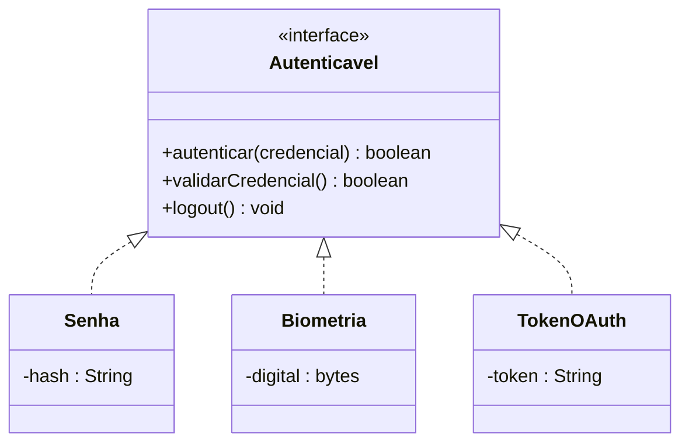

**Aplicação:** Sistemas bancários, aplicativos corporativos, e-commerce com login social.

---

### **Exemplo 2: Sistema de Armazenamento em Nuvem**

**Contexto:** Uma aplicação de backup precisa suportar múltiplos provedores de armazenamento (AWS, Google Drive, Dropbox) de forma intercambiável, permitindo que o usuário escolha onde seus dados serão armazenados sem alterar a lógica da aplicação.

- **Problema:** chamar a API da AWS diretamente espalha dependência do fornecedor pelo sistema;
  trocar de provedor (ou deixar o usuário escolher) vira uma reescrita.
- **Solução:** a interface `ArmazenamentoNuvem` padroniza `upload`/`download`/`deletar`; cada
  provedor é uma implementação **intercambiável** — mesma ideia da *troca de gateway* da
  [aula de abstração](../06-abstracao/).

**Diagrama de Classes:**

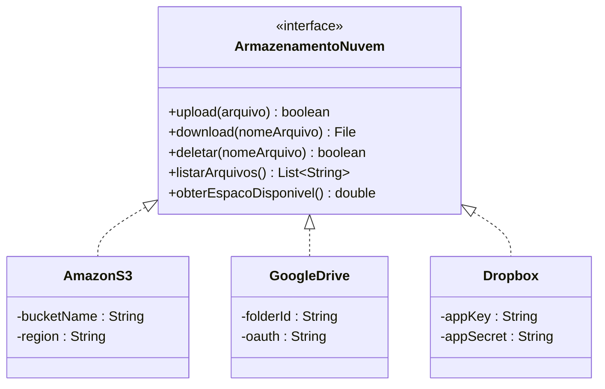

**Aplicação:** Sistemas de backup corporativo, aplicações de sincronização de arquivos, gerenciadores de documentos.

---

### **Exemplo 3: Sistema de Transporte Urbano**

**Contexto:** Um aplicativo de mobilidade urbana integra diferentes tipos de transporte (bicicleta, patinete, carro compartilhado) onde cada veículo tem suas particularidades, mas todos precisam ser rastreados, alugados e devolvidos seguindo um padrão comum.

- **Problema:** bicicleta, patinete e carro são bem diferentes (não há hierarquia "É-UM" natural),
  mas o app precisa tratar todos de forma uniforme para alugar — e alguns também são rastreáveis.
- **Solução:** duas interfaces de **capacidade** (`Alugavel`, `Rastreavel`). Cada veículo
  implementa as que fizerem sentido — o `CarroCompartilhado` implementa **as duas**.

**Diagrama de Classes:**

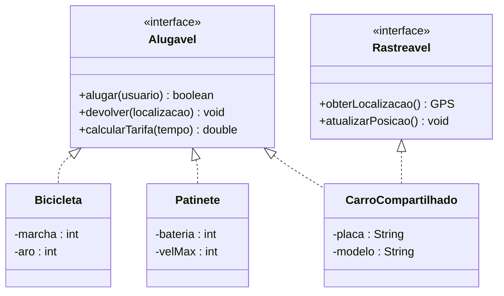

**Aplicação:** Apps de mobilidade urbana (tipo Uber, Lime, Tembici), sistemas de gestão de frotas compartilhadas.

---

### **Exemplo 4: Sistema de Reprodução Multimídia**

**Contexto:** Um player de mídia universal precisa reproduzir diferentes formatos (áudio, vídeo, streaming) onde cada formato tem seu codec e processamento específico, mas todos devem responder aos mesmos comandos de controle (play, pause, stop).

> 🎧 Este é o **mesmo princípio** da `FonteDeAudio` do Melodia (seção prática acima),
> generalizado para **vídeo e streaming**: o player fala com o contrato `Reproduzivel`, e o que
> vem de rede ganha, **além** disso, o contrato `Streamable`.

- **Problema:** o player não pode ter um `if` gigante por formato (MP3, MP4, streaming…); e os
  que vêm da internet precisam de buffer/qualidade, mas os arquivos locais não.
- **Solução:** `Reproduzivel` (todos) + `Streamable` (só os de rede). O controle do player
  depende de `Reproduzivel`; só quem faz streaming assina também `Streamable`.

**Diagrama de Classes:**

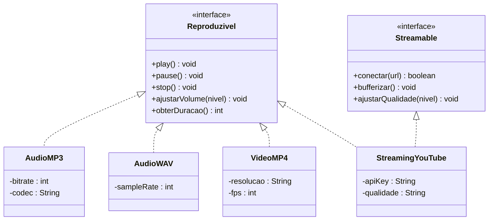

**Aplicação:** Media players, apps de streaming (Spotify, Netflix), editores de vídeo/áudio.

---

### **Exemplo 5: Sistema de Notificações Multi-Canal Empresarial**

**Contexto:** Uma empresa precisa enviar notificações críticas por diferentes canais (email, SMS, push notification, Slack, Teams) com suporte a priorização, agendamento e confirmação de entrega. O sistema deve permitir adicionar novos canais sem modificar o código existente.

- **Problema:** cada canal tem uma tecnologia diferente (SMTP, gateway SMS, token push,
  webhook), e alguns ainda precisam ser **agendados**. Um `switch` por canal não escala.
- **Solução:** `Notificador` (todos os canais) + `Agendavel` (só quem suporta agendamento). O
  `NotifSMS` assina **as duas**, demonstrando **múltipla implementação**.

**Diagrama de Classes:**

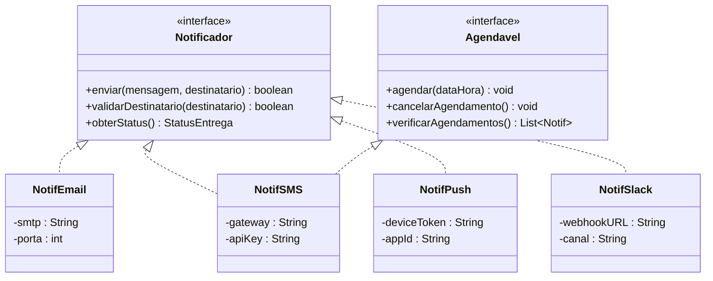

**Aplicação:** Sistemas empresariais de alertas críticos, plataformas de comunicação interna, sistemas de monitoramento e alertas operacionais.

**Destaque:** Este exemplo mostra como uma classe pode implementar múltiplas interfaces (`NotifSMS` implementa tanto `Notificador` quanto `Agendavel`), permitindo composição de comportamentos — exatamente como o `CartaoCredito` do Melodia é `MeioDePagamento` **e** `Reembolsavel`.

---

## 🚀 Exercícios Práticos

1. **Sistema de Dispositivos Eletrônicos**
   - Interface: `DispositivoEletronico` (ligar, desligar, status)
   - Implementações: `Smartphone`, `Tablet`, `Laptop`

2. **Sistema de Formas Geométricas**
   - Interface: `CalculavelArea` (calcularArea)
   - Interface: `Desenhavel` (desenhar)
   - Classes que implementam ambas

3. **Sistema de Notificações**
   - Interface: `Notificador` (enviarNotificacao)
   - Implementações: `Email`, `SMS`, `PushNotification`

## 🎯 Exercício guiado — evolua o Módulo de Pagamento (faça com o diagrama)

> Use como base o módulo que roda em [`exemplo/iaula-interface/`](exemplo/iaula-interface/). A ideia
> é **praticar interface como contrato e capacidade opcional**, no domínio do Melodia. Faça **o
> código e o diagrama** juntos.

**Ponto de partida (o que você vai estender):**

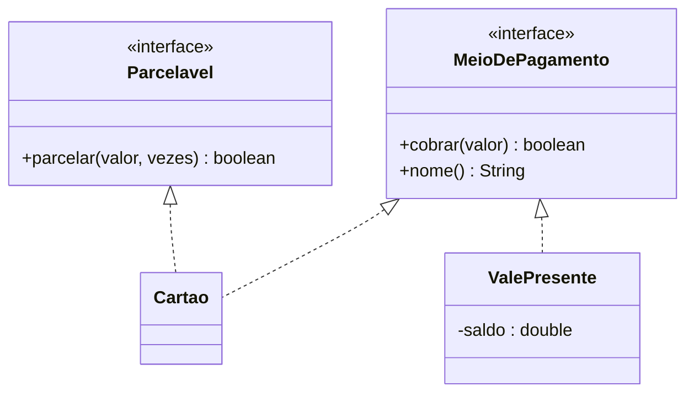

**Tarefas (em ordem):**

1. **Extensão sem modificação.** No `App`, ative uma `Assinatura` também com `Paypal` e `Cripto`
   (já existem no exemplo). Rode e **comprove** que a classe `Assinatura` **não mudou** para aceitá-los.
2. **Nova capacidade `Parcelavel`.** Crie a interface `Parcelavel` com `boolean parcelar(double valor, int vezes)`.
   Faça **apenas** o `Cartao` implementá-la. Na `Assinatura`, adicione `ativarParcelado(String token, int vezes)`
   que **só parcela se o meio for `Parcelavel`** (use `instanceof`); senão, cai no `cobrar` normal.
3. **Novo meio `ValePresente`.** Crie `ValePresente implements MeioDePagamento` com um `saldo`: cada
   `cobrar(valor)` **desconta do saldo** e devolve `false` quando não há saldo suficiente
   (invariante: saldo nunca negativo). **Não pode** alterar a `Assinatura`.
4. **Atualize o diagrama de classes** (no draw.io) com `Parcelavel` e `ValePresente` ligados aos
   contratos certos — lembrando: seta **tracejada** `..|>` para implementação de interface.
5. **(Desafio) Método default.** Em `MeioDePagamento`, crie um método **default** `recibo(double valor)`
   que devolve um texto padrão (ex.: `"Recibo Melodia — R$ ..."`). Sobrescreva **só** no `Pix`.

**✅ Critério de "pronto":**
- [ ] Adicionar `ValePresente` **não exigiu** mudar a `Assinatura`.
- [ ] `parcelar` existe **só** onde faz sentido (não poluiu `Boleto`/`Pix`).
- [ ] O `instanceof` é usado para **capacidade opcional**, não para escolher "qual meio é".
- [ ] O diagrama bate com o código (interfaces com `<<interface>>` e setas tracejadas).

> 💡 **Dica:** se você sentir vontade de escrever `if (meio instanceof Cartao)` para decidir
> **como cobrar**, pare — isso é sinal de que o comportamento deveria estar **dentro** da classe do
> meio (polimorfismo), não num `if` na `Assinatura`. O `instanceof` aqui é só para perguntar
> "**você tem** a capacidade X?", nunca "**quem** você é?".

---

## 🔗 Navegação

[← 06 - Abstração](../06-abstracao/) | [08 - SOLID →](../08-solid/)

---

**💡 Lembre-se**: Interfaces definem O QUE fazer, não COMO fazer. São contratos que garantem que certas funcionalidades estarão disponíveis!
