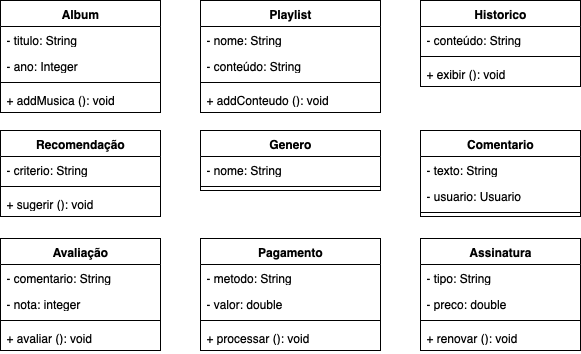
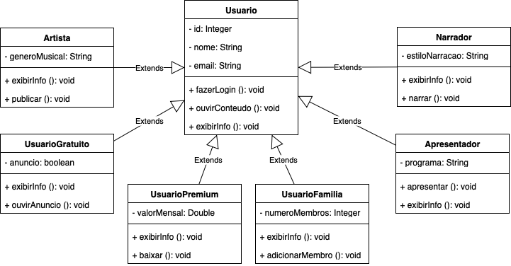
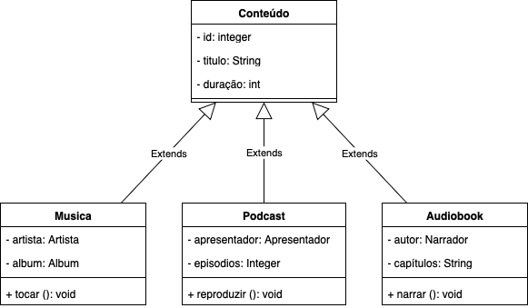

# Introdução à Atividade de Desenvolvimento em Java a partir de Diagramas

Nesta atividade, recebemos como ponto de partida um **conjunto de diagramas UML** que detalham a arquitetura de um **sistema de streaming de música**. Os diagramas fornecem a **estrutura de classes, relações de herança, composição e agregação**, bem como a definição de serviços auxiliares como pagamentos, histórico e recomendações.

O papel do desenvolvedor é **transformar este modelo conceitual em código funcional**, aplicando os princípios de **Programação Orientada a Objetos (POO)** em Java. Cada classe do diagrama deve ser representada no código com **atributos, métodos e relações de herança**, garantindo que o comportamento esperado no modelo seja mantido no software.

Durante o desenvolvimento, devem ser observados aspectos como:

1. **Herança e Polimorfismo:** Classes abstratas e métodos que permitem comportamento genérico e especializado.
2. **Composição e Agregação:** Estruturas como `Playlist` contendo `Midia` e `Album` contendo `Musica` devem refletir as relações de dependência do modelo.
3. **Encapsulamento:** Todos os atributos devem ser protegidos e acessados via métodos `get` e `set` quando necessário.
4. **Modularidade e Reuso:** Componentes como pagamentos (`Cartão`, `PIX`, `Boleto`) e histórico de transações devem ser projetados para facilitar manutenção e expansão futura.

O objetivo final é criar um sistema funcional que siga **fielmente o projeto do arquiteto**, permitindo:

* Cadastro e gerenciamento de usuários (`Gratuito`, `Premium`, `Familia`, `Artista`)
* Criação e manipulação de conteúdos (`Musica`, `Podcast`, `Audiobook`, `VideoMusical`)
* Processamento de pagamentos com múltiplos métodos e registro de histórico
* Geração de recomendações, notificações e relatórios de uso

Essa atividade integra **análise de requisitos, design de software e implementação prática**, consolidando o aprendizado de **POO em Java** e preparando o desenvolvedor para trabalhar em sistemas complexos baseados em diagramas UML fornecidos por arquitetos de software.

## Abaixo o diagrama dado pelo arquiteto

### Classes inicias



### Classes sobre os usuários



### Classes sobre conteudo



## Arquivo main para testar o fluxo das tabelas acima

Cada aluno deve personalizar todos os textos de entreda. Por exemplo, trocar os nomes, e-mails e outros.

```Java
public static void main(String[] args) throws Exception {
        System.out.println("Iniciando aplicativo de streaming de áudio");

        // Criando usuários
        UsuarioGratuito usuarioGratuito = new UsuarioGratuito(1, "João", "joao@email.com", true);
        UsuarioPremium usuarioPremium = new UsuarioPremium(2, "Maria", "maria@email.com", 19.90);
        UsuarioFamilia usuarioFamilia = new UsuarioFamilia(3, "Família Silva", "familia@email.com", 4);

        // Criando artistas, narradores e apresentadores
        Artista artista = new Artista(4, "Roberto Carlos", "roberto@email.com", "MPB");
        Narrador narrador = new Narrador(5, "Carlos Alberto", "carlos@email.com", "Dramático");
        Apresentador apresentador = new Apresentador(6, "Ana Paula", "ana@email.com", "Tech Talk");

        // Exibindo informações dos usuários
        System.out.println("\n--- Informações dos Usuários ---");
        usuarioGratuito.exibirInfo();
        usuarioPremium.exibirInfo();
        usuarioFamilia.exibirInfo();
        artista.exibirInfo();
        narrador.exibirInfo();
        apresentador.exibirInfo();

        // Criando álbuns
        Album album1 = new Album("Grandes Sucessos", 2022);
        Album album2 = new Album("Novidades", 2023);

        // Criando conteúdos
        Musica musica = new Musica(1, "Emoções", 4.5, artista, album1);
        Podcast podcast = new Podcast(2, "Tecnologia Hoje", 45.0, apresentador, 10);
        Audiobook audiobook = new Audiobook(3, "O Poder do Hábito", 360.0, narrador, 12);

        // Adicionando músicas ao álbum2
        album2.addMusica("Lançamento 1");
        album2.addMusica("Lançamento 2");

        // Manipulando conteúdos
        System.out.println("\n--- Manipulação de Conteúdos ---");
        musica.tocar();
        podcast.ouvir();
        audiobook.ouvir();

        // Criando e manipulando playlists
        System.out.println("\n--- Playlists e Histórico ---");
        Playlist playlist = new Playlist(apresentador, 5);
        playlist.reproduzir();

        Historico historico = new Historico("Músicas ouvidas recentemente");
        historico.exibir();

        // Adicionando músicas ao álbum
        album1.addMusica("Detalhes");
        album1.addMusica("Como é grande o meu amor por você");

        // Exibindo informações dos álbuns
        System.out.println("\n--- Informações dos Álbuns ---");
        album1.exibirInfo();
        album2.exibirInfo();

        // Processando pagamentos e assinaturas
        System.out.println("\n--- Pagamentos e Assinaturas ---");
        Pagamento pagamento = new Pagamento("Cartão de Crédito", 19.90);
        pagamento.processar();

        Assinatura assinatura = new Assinatura();
        assinatura.setTipo("Premium");
        assinatura.setPreco(19.90);
        assinatura.exibir();

        // Avaliações e comentários
        System.out.println("\n--- Avaliações e Comentários ---");
        Avaliacao avaliacao = new Avaliacao("Ótima música!", 5);
        avaliacao.avaliar();

        Comentario comentario = new Comentario("Adorei esse podcast!", usuarioPremium);
        System.out.println("Comentário de " + comentario.getUsuario().getNome() + ": " + comentario.getTexto());

        // Gêneros e recomendações
        Genero genero = new Genero("Rock");
        System.out.println("Gênero criado: " + genero.getNome());
        Recomendacao recomendacao = new Recomendacao("Baseado nos seus gostos musicais");
        recomendacao.sugerir();

        // Demonstração de funcionalidades específicas
        System.out.println("\n--- Funcionalidades Específicas ---");
        usuarioPremium.baixar("Música: Emoções");
        usuarioGratuito.ouvirAnuncio();
        usuarioFamilia.adicionarMembro();
        artista.publicarConteudo();
        narrador.narrar();
        apresentador.apresentar();

        System.out.println("\nAplicativo encerrado com sucesso!");
    }
```

## Instrucoes de entrega

Implemente todas as classes acima do diagrama em Java. 
Compartilhe o código fonte pelo google forms que deverá ser enviado.


