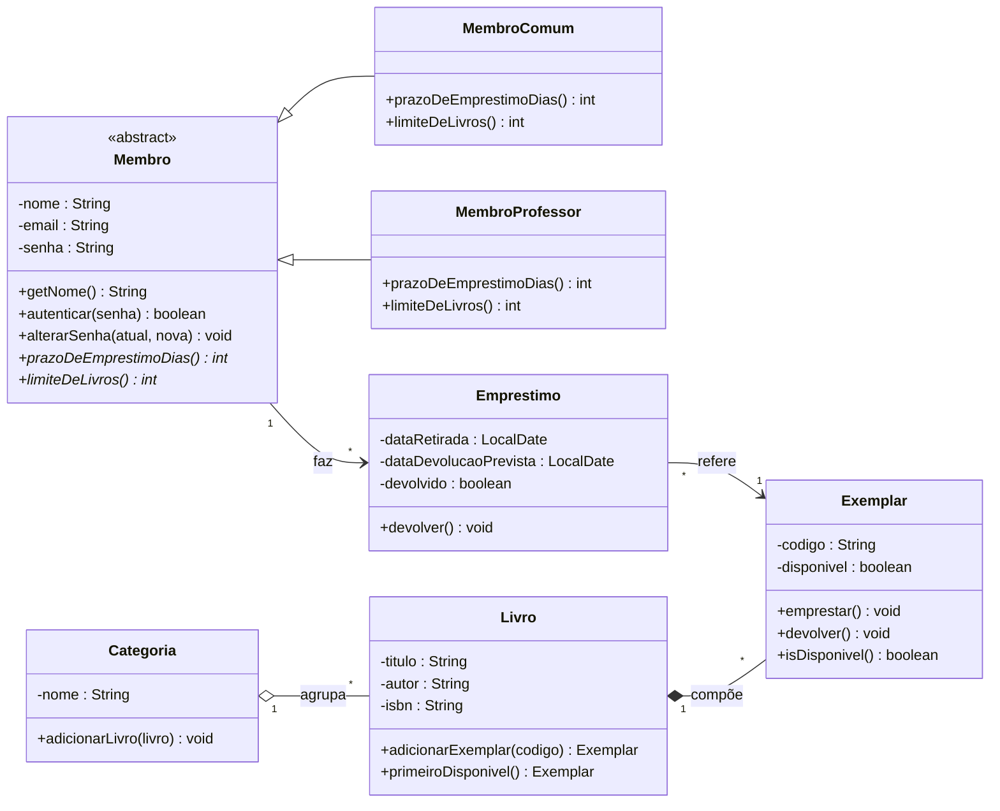
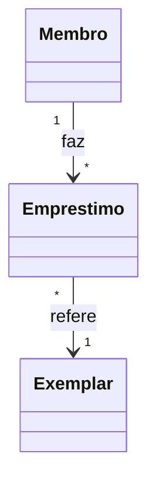
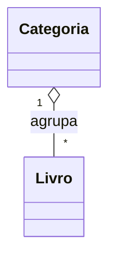
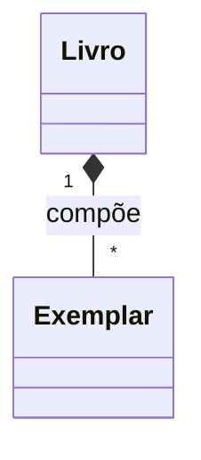

# EXEMPLO RESOLVIDO — Biblioteca Comunitária "Leitura Livre"

> **O que é este arquivo.** É um **exemplo 100% resolvido** — do começo ao fim — para você usar
> como **modelo** do seu próprio projeto. Ele mostra as etapas na ordem: **entrevista → achar as
> classes → modelagem (diagrama completo) → código Java completo**, e no meio explica, em
> linguagem simples, **cada conceito**: associação, agregação, composição, mensagens,
> pré-condição, pós-condição e invariante.
>
> ⚠️ **Este NÃO é um dos projetos da turma** (é uma biblioteca, de propósito). Use para **aprender
> o caminho**, não para copiar — o seu domínio é outro.

---

## 1. A entrevista

**Gerente:** Vamos montar o sistema da biblioteca comunitária **Leitura Livre**. Trouxe a
bibliotecária pra contar como funciona; anotem tudo.

**Cliente (bibliotecária):** A gente empresta **livros** para os **membros**. Todo membro tem
**nome**, **e-mail** e uma **senha** pra acessar o sistema. Mas tem dois tipos: o **membro comum**
e o **membro professor** — o professor pode ficar mais tempo com o livro e pegar mais livros de uma vez.

**Dev sênior:** Então tem uma parte igual pra todo membro e uma parte que muda por tipo. Guardem isso.

**Cliente:** Isso. Se eu perguntar *"qual o prazo de empréstimo desse membro?"*, a resposta muda:
comum são **14 dias** (até **3** livros); professor são **30 dias** (até **10**). A pergunta é a
mesma, a resposta depende do tipo.

**Analista de qualidade:** Dois cuidados sérios. Primeiro, a **senha**: ninguém pode ler ou trocar
a senha "por fora"; só de um jeito controlado. Segundo, a regra que **não pode falhar**: **um
exemplar que já está emprestado não pode ser emprestado de novo**. Isso não pode escapar de jeito nenhum.

**Cliente:** Importante: um **livro** (o título) tem vários **exemplares** (as cópias físicas).
Cada exemplar **só existe como cópia daquele livro** — se a gente tira o livro do acervo, as cópias
dele saem junto. E a gente organiza os livros em **categorias** (Clássicos, Infantil…), mas o mesmo
livro pode ser tirado de uma categoria e continua existindo no acervo.

**Cliente:** O **empréstimo** liga um **membro** a um **exemplar**, com a data de retirada e a data
prevista de devolução. Quando o membro devolve, o exemplar volta a ficar disponível.

**Gerente:** Fechou. Com isso dá pra desenhar e programar.

---

## 2. Passo 1 — Da entrevista às classes

O truque: **substantivos** importantes viram **classes**; **dados** viram **atributos**; **verbos**
viram **operações** ou **ligações**.

| Na fala apareceu… | Vira no modelo |
|-------------------|----------------|
| "membros" (comum / professor) | classe **`Membro`** (abstrata) → `MembroComum`, `MembroProfessor` |
| "nome, e-mail, senha" | **atributos** de `Membro` |
| "prazo/limite muda por tipo" | operações **polimórficas** `prazoDeEmprestimoDias()`, `limiteDeLivros()` |
| "livro (título)" e "exemplares (cópias)" | `Livro` e `Exemplar` |
| "cada exemplar só existe dentro do livro" | **composição** `Livro ◆ Exemplar` |
| "categorias agrupam livros que existem sozinhos" | **agregação** `Categoria ◇ Livro` |
| "empréstimo liga membro e exemplar" | `Emprestimo` com **associações** |
| "exemplar emprestado não pode ser emprestado de novo" | **invariante** protegido por operação |

---

## 3. Modelagem completa (diagrama de classes)



**Como ler:** nome em *itálico* + `«abstract»` = classe abstrata; `*` na operação = método
abstrato; `-` privado, `+` público; `──▷` herança; `◆` composição; `◇` agregação; `-->`
associação; `"1"`/`"*"` são as **multiplicidades**.

---

## 4. 🧠 Cada conceito de modelagem, explicado

### 4.1 Abstração
**O que é:** mostrar só o essencial e criar um tipo "genérico". Aqui, `Membro` é a ideia geral —
não existe "um membro qualquer", sempre é comum ou professor. Por isso é **`abstract`**.

```java
public abstract class Membro { /* ... */ }
```

### 4.2 Herança (`extends`)
**O que é:** um tipo específico **é um** tipo geral e aproveita o que ele já tem.

```java
public class MembroComum extends Membro { /* ... */ }      // "é um" Membro
public class MembroProfessor extends Membro { /* ... */ }
```

### 4.3 Polimorfismo
**O que é:** a **mesma** operação com **respostas diferentes** por tipo. `prazoDeEmprestimoDias()`
é abstrata na base e cada subtipo responde o seu:

```java
// em Membro:      public abstract int prazoDeEmprestimoDias();
// em MembroComum:      @Override public int prazoDeEmprestimoDias() { return 14; }
// em MembroProfessor:  @Override public int prazoDeEmprestimoDias() { return 30; }
```

### 4.4 Encapsulamento
**O que é:** esconder o dado (`private`) e só deixar mudá-lo por operações que **validam**. A senha
nunca é exposta; muda só com a senha atual:

```java
private String senha;                          // ninguém lê/escreve direto
public boolean autenticar(String s) { return this.senha.equals(s); }
public void alterarSenha(String atual, String nova) {
    if (!autenticar(atual)) throw new IllegalArgumentException("Senha atual incorreta.");
    this.senha = nova;
}
// repare: NÃO existe getSenha() nem setSenha()
```

### 4.5 Associação (`-->`)
**O que é:** uma classe **conhece/usa** outra, e as duas existem por conta própria. Aqui o
`Emprestimo` conhece **um** `Membro` e **um** `Exemplar`; um membro faz **vários** empréstimos.



```java
public class Emprestimo {
    private final Membro membro;      // associação: guarda uma referência
    private final Exemplar exemplar;  // associação
    public Emprestimo(Membro membro, Exemplar exemplar) { /* recebe prontos */ }
}
```
> No código, **associação = um atributo que referencia** outro objeto (ou uma **lista**, quando o
> lado é `*`).

### 4.6 Agregação (◇) — "tem, mas não é dono"
**O que é:** um todo **agrupa** partes que **existem sozinhas** e **sobrevivem** sem ele. A
`Categoria` agrupa `Livro`s que já existem no acervo.



```java
public class Categoria {
    private final List<Livro> livros = new ArrayList<>();
    public void adicionarLivro(Livro livro) { livros.add(livro); }  // RECEBE pronto (não faz new)
}
```

### 4.7 Composição (◆) — "é dono; nasce e morre junto"
**O que é:** a parte **só existe dentro** do todo. O `Livro` é dono dos seus `Exemplar`es — eles
**nascem** dentro dele e somem se o livro sair do acervo.



```java
public class Livro {
    private final List<Exemplar> exemplares = new ArrayList<>();
    public Exemplar adicionarExemplar(String codigo) {
        Exemplar e = new Exemplar(codigo);   // o `new` é AQUI: a parte nasce no todo
        exemplares.add(e);
        return e;
    }
}
```
> 🔑 **A diferença entre ◇ e ◆ no código é quem faz o `new`.** Agregação **recebe** o objeto
> pronto; composição **cria** a parte lá dentro.

### 4.8 Mensagens entre objetos
**O que é:** objetos colaboram **chamando métodos uns dos outros** (isso é "trocar mensagens"). No
empréstimo, o `Emprestimo` **manda mensagens** para o `Exemplar` e para o `Membro`:

```java
exemplar.emprestar();                                   // MENSAGEM ao exemplar
int prazo = membro.prazoDeEmprestimoDias();             // MENSAGEM (polimórfica) ao membro
this.dataDevolucaoPrevista = dataRetirada.plusDays(prazo);
```
> Cada objeto é **responsável por si**: o `Emprestimo` não mexe no estado do `Exemplar` na marra —
> ele **pede** (`emprestar()`), e o próprio exemplar decide se pode (é lá que mora a regra).

### 4.9 Pré-condição, Pós-condição e Invariante
- **Invariante:** algo que é **sempre verdade** para o objeto. No `Exemplar`: *um exemplar
  emprestado nunca está disponível*.
- **Pré-condição:** o que precisa ser verdade **para a operação rodar**.
- **Pós-condição:** o que fica garantido **depois** da operação.

```java
public void emprestar() {
    // PRÉ-CONDIÇÃO: só empresta se estiver disponível
    if (!disponivel) throw new IllegalStateException("Exemplar já emprestado: " + codigo);
    disponivel = false;   // PÓS-CONDIÇÃO: agora está indisponível (mantém o INVARIANTE)
}
```
> É essa pré-condição que **torna impossível** a regra do cliente falhar ("não emprestar o mesmo
> exemplar duas vezes"): a segunda tentativa é **recusada na entrada**.

---

## 5. 💻 O código completo (Java 17)

> Os arquivos abaixo estão prontos e testados em [`java/`](java/). Cada um tem uma
> responsabilidade só.

### `Membro.java` (abstrata)
```java
public abstract class Membro {
    private final String nome;
    private final String email;
    private String senha;                 // dado sensível: nunca exposto

    protected Membro(String nome, String email, String senha) {
        if (nome == null || nome.isBlank())
            throw new IllegalArgumentException("Nome é obrigatório.");
        if (email == null || !email.contains("@"))
            throw new IllegalArgumentException("E-mail inválido: " + email);
        if (senha == null || senha.length() < 4)
            throw new IllegalArgumentException("Senha deve ter ao menos 4 caracteres.");
        this.nome = nome;
        this.email = email;
        this.senha = senha;
    }

    public String getNome()  { return nome; }
    public String getEmail() { return email; }

    public boolean autenticar(String senha) { return this.senha.equals(senha); }

    public void alterarSenha(String atual, String nova) {
        if (!autenticar(atual)) throw new IllegalArgumentException("Senha atual incorreta.");
        if (nova == null || nova.length() < 4) throw new IllegalArgumentException("Nova senha muito curta.");
        this.senha = nova;
    }

    public abstract int prazoDeEmprestimoDias();   // polimórfico
    public abstract int limiteDeLivros();          // polimórfico
}
```

### `MembroComum.java` e `MembroProfessor.java`
```java
public class MembroComum extends Membro {
    public MembroComum(String nome, String email, String senha) { super(nome, email, senha); }
    @Override public int prazoDeEmprestimoDias() { return 14; }
    @Override public int limiteDeLivros()        { return 3; }
}
```
```java
public class MembroProfessor extends Membro {
    public MembroProfessor(String nome, String email, String senha) { super(nome, email, senha); }
    @Override public int prazoDeEmprestimoDias() { return 30; }
    @Override public int limiteDeLivros()        { return 10; }
}
```

### `Exemplar.java` (encapsulamento + invariante + pré/pós)
```java
public class Exemplar {
    private final String codigo;
    private boolean disponivel;

    public Exemplar(String codigo) {
        if (codigo == null || codigo.isBlank())
            throw new IllegalArgumentException("Código do exemplar é obrigatório.");
        this.codigo = codigo;
        this.disponivel = true;
    }

    public String getCodigo() { return codigo; }
    public boolean isDisponivel() { return disponivel; }

    public void emprestar() {   // PRÉ: disponível; PÓS: indisponível
        if (!disponivel) throw new IllegalStateException("Exemplar já emprestado: " + codigo);
        disponivel = false;
    }
    public void devolver() {    // PRÉ: emprestado; PÓS: disponível
        if (disponivel) throw new IllegalStateException("Exemplar não está emprestado: " + codigo);
        disponivel = true;
    }
}
```

### `Livro.java` (composição ◆ de Exemplar)
```java
import java.util.ArrayList;
import java.util.List;

public class Livro {
    private final String titulo;
    private final String autor;
    private final String isbn;
    private final List<Exemplar> exemplares = new ArrayList<>();   // COMPOSIÇÃO

    public Livro(String titulo, String autor, String isbn) {
        if (titulo == null || titulo.isBlank()) throw new IllegalArgumentException("Título é obrigatório.");
        this.titulo = titulo; this.autor = autor; this.isbn = isbn;
    }

    public Exemplar adicionarExemplar(String codigo) {   // a parte nasce dentro do todo
        Exemplar e = new Exemplar(codigo);
        exemplares.add(e);
        return e;
    }
    public Exemplar primeiroDisponivel() {
        for (Exemplar e : exemplares) if (e.isDisponivel()) return e;
        return null;
    }
    public String getTitulo() { return titulo; }
    public String getAutor()  { return autor; }
    public List<Exemplar> getExemplares() { return List.copyOf(exemplares); }
}
```

### `Categoria.java` (agregação ◇ de Livro)
```java
import java.util.ArrayList;
import java.util.List;

public class Categoria {
    private final String nome;
    private final List<Livro> livros = new ArrayList<>();          // AGREGAÇÃO

    public Categoria(String nome) {
        if (nome == null || nome.isBlank()) throw new IllegalArgumentException("Nome da categoria é obrigatório.");
        this.nome = nome;
    }
    public void adicionarLivro(Livro livro) {   // recebe pronto (não cria)
        if (livro != null && !livros.contains(livro)) livros.add(livro);
    }
    public String getNome() { return nome; }
    public List<Livro> getLivros() { return List.copyOf(livros); }
}
```

### `Emprestimo.java` (associação + mensagens + estado)
```java
import java.time.LocalDate;

public class Emprestimo {
    private final Membro membro;              // associação
    private final Exemplar exemplar;          // associação
    private final LocalDate dataRetirada;
    private final LocalDate dataDevolucaoPrevista;
    private boolean devolvido;

    public Emprestimo(Membro membro, Exemplar exemplar) {
        if (membro == null || exemplar == null)
            throw new IllegalArgumentException("Empréstimo precisa de membro e exemplar.");
        this.membro = membro;
        this.exemplar = exemplar;
        exemplar.emprestar();                 // MENSAGEM (valida a regra lá dentro)
        this.dataRetirada = LocalDate.now();
        this.dataDevolucaoPrevista = dataRetirada.plusDays(membro.prazoDeEmprestimoDias()); // MENSAGEM polimórfica
        this.devolvido = false;
    }

    public void devolver() {
        if (devolvido) throw new IllegalStateException("Empréstimo já foi devolvido.");
        exemplar.devolver();                  // MENSAGEM
        devolvido = true;
    }

    public boolean isDevolvido() { return devolvido; }
    public Membro getMembro() { return membro; }
    public Exemplar getExemplar() { return exemplar; }
    public LocalDate getDataDevolucaoPrevista() { return dataDevolucaoPrevista; }
}
```

---

## 6. ▶️ O `Main` e a saída

### `AppBiblioteca.java`
```java
public class AppBiblioteca {
    public static void main(String[] args) {
        // 1) HERANÇA + POLIMORFISMO
        Membro ana  = new MembroComum("Ana Souza", "ana@bib.com", "1234");
        Membro prof = new MembroProfessor("Prof. Silva", "silva@bib.com", "abcd");
        System.out.println(ana.getNome()  + ": prazo " + ana.prazoDeEmprestimoDias()
                + " dias, limite " + ana.limiteDeLivros() + " livros");
        System.out.println(prof.getNome() + ": prazo " + prof.prazoDeEmprestimoDias()
                + " dias, limite " + prof.limiteDeLivros() + " livros");

        // 2) COMPOSIÇÃO — o Livro cria seus exemplares
        Livro dom = new Livro("Dom Casmurro", "Machado de Assis", "978-85-0001");
        dom.adicionarExemplar("EX-001");
        dom.adicionarExemplar("EX-002");

        // 3) AGREGAÇÃO — a Categoria agrupa livros que já existem
        Categoria classicos = new Categoria("Clássicos");
        classicos.adicionarLivro(dom);
        System.out.println("\nCategoria '" + classicos.getNome() + "' tem "
                + classicos.getLivros().size() + " livro(s).");

        // 4) ASSOCIAÇÃO + MENSAGENS
        Exemplar disponivel = dom.primeiroDisponivel();
        Emprestimo emp = new Emprestimo(ana, disponivel);
        System.out.println("\nEmprestado " + disponivel.getCodigo() + " para "
                + emp.getMembro().getNome() + " (devolver até " + emp.getDataDevolucaoPrevista() + ")");
        System.out.println(disponivel.getCodigo() + " disponível? " + disponivel.isDisponivel());

        // 5) INVARIANTE — emprestar o mesmo exemplar de novo deve ser recusado
        try {
            new Emprestimo(prof, disponivel);
        } catch (IllegalStateException e) {
            System.out.println("\nRecusado (invariante): " + e.getMessage());
        }

        // 6) DEVOLUÇÃO (mensagem)
        emp.devolver();
        System.out.println("\nApós devolver, " + disponivel.getCodigo()
                + " disponível? " + disponivel.isDisponivel());
    }
}
```

### Saída (testada)
```
Ana Souza: prazo 14 dias, limite 3 livros
Prof. Silva: prazo 30 dias, limite 10 livros

Categoria 'Clássicos' tem 1 livro(s).

Emprestado EX-001 para Ana Souza (devolver até 2026-10-09)
EX-001 disponível? false

Recusado (invariante): Exemplar já emprestado: EX-001

Após devolver, EX-001 disponível? true
```

---

## 7. 🚀 Como compilar e rodar

```bash
cd java
javac *.java
java AppBiblioteca
```

---

## 8. ✅ O que levar deste exemplo

- [ ] Sei achar **classes** (substantivos), **atributos** (dados) e **operações/ligações** (verbos) na entrevista.
- [ ] Sei desenhar os **4 pilares** e os **3 relacionamentos** e traduzir cada um para Java.
- [ ] Entendo a diferença de **agregação (recebe pronto)** × **composição (faz o `new` dentro)**.
- [ ] Sei o que são **mensagens** (objetos chamando métodos uns dos outros).
- [ ] Sei proteger uma regra com **pré-condição** + **invariante** (e recusar na entrada).

---

[⬅️ Banco de projetos](../README.md)
