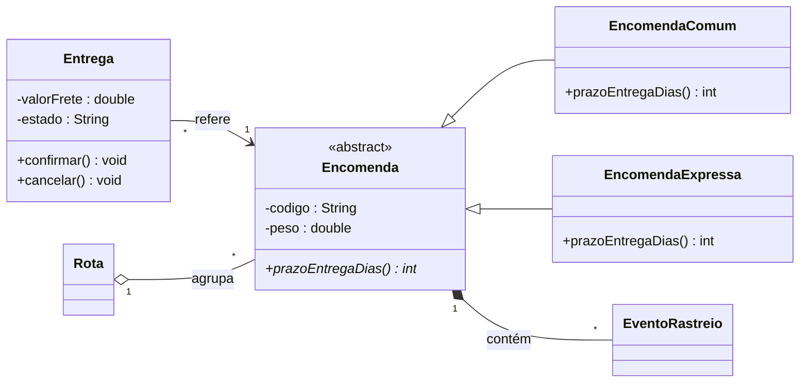

# 🎤 Entrevista Técnica — Transportadora EntregaCerta (desenhe no draw.io)

> **Como funciona este exercício.** Abaixo está uma **conversa** entre a equipe e o cliente do
> sistema **Transportadora EntregaCerta** (dono de uma transportadora). **Leia com atenção** e, a partir do que as pessoas dizem,
> **desenhe um diagrama de classes** no [draw.io](https://app.diagrams.net) (ou app.diagrams.net).
> Não é para programar — é para **modelar**.
>
> 🎯 **Seu diagrama precisa mostrar os quatro pilares da OO e os três tipos de relacionamento**
> (associação, agregação e composição). No fim há a **lista do que entregar**, um **lembrete da
> notação**, dicas de tradução para **Java**, o **Main** e um **gabarito** (para o professor).

---

## 🗣️ A entrevista

**Gerente:** Pessoal, vamos organizar o sistema da **Transportadora EntregaCerta**. Vou trazer o cliente pra ele
explicar, do jeito dele, o que o sistema precisa ter. Anotem tudo e depois a gente transforma em
diagrama.

**Cliente:** No sistema **Transportadora EntregaCerta**, a peça central é **Encomenda**. Tem dois tipos: o
**EncomendaComum** (o comum) e o **EncomendaExpressa**, que **tem prazo menor e prioridade no transporte**. No fundo, os dois são um tipo de
**Encomenda** — todos têm código e peso e compartilham a mesma base.

**Dev sênior:** Entendi. Então tem uma parte **igual pra todos** e uma parte **específica** de cada
tipo. Guardem isso — cheira a uma base comum com dois tipos que herdam dela.

**Cliente:** Isso. E o comportamento muda por tipo: olhando o `prazoEntregaDias()` de cada um, pro
**EncomendaComum** prazo normal; já pro **EncomendaExpressa** prazo menor (prioridade). A **mesma** operação, **resposta
diferente conforme o tipo**.

**Analista de qualidade:** Um ponto sério: o estado só muda por operações e na ordem certa; o frete nunca é negativo. Ninguém pode mexer nesses dados **por fora** —
tem que ser por **operações controladas**. E tem uma regra que **NÃO pode falhar**: **não pode marcar como 'entregue' uma encomenda que nem saiu para entrega**.
Por isso o estado de **Entrega** só anda por operações (postada → em trânsito → saiu para entrega → entregue; ou devolvida), nunca "na mão".

**Cliente:** Agora as ligações. Uma encomenda tem MUITOS eventos de rastreio; cada entrega é de UMA encomenda para UM destinatário.

**Cliente:** Tem uma ligação de **parte-todo que nasce e morre junto**: **Encomenda ◆ EventoRastreio**.
Cada evento de rastreio pertence à encomenda e some junto se ela for removida. (pense em **composição** — losango cheio ◆)

**Dev sênior:** Não confunda com o outro caso: **Rota ◇ Encomenda** é só um **agrupamento**.
As encomendas existem por conta própria; a rota só as agrupa para o transporte. Se **Rota** sumir, **Encomenda** continua existindo — isso é **agregação**
(losango vazio ◇), bem diferente da composição.

**Gerente:** Fechou. Com isso dá pra desenhar o modelo. Mãos à obra.

---

## 🧭 Dicas de leitura (pistas escondidas na conversa)

| O que apareceu na conversa | Onde isso te leva |
|----------------------------|-------------------|
| "os dois são um tipo de **Encomenda** (mesma base)" | um tipo **geral** (base) e tipos **específicos** → **herança** |
| "a **mesma** operação `prazoEntregaDias()`, resposta muda por tipo" | operação **redefinida** em cada tipo → **polimorfismo** |
| "O estado só muda por operações e na ordem certa; o frete nunca é negativo" | dado **privado** + operações → **encapsulamento** |
| "não pode marcar como 'entregue' uma encomenda que nem saiu para entrega" | **invariante**: o estado muda só por operação que valida |
| "**Encomenda ◆ EventoRastreio** (nascem e somem juntos)" | **composição** (losango cheio ◆) |
| "**Rota ◇ Encomenda** (Encomenda existe sozinho)" | **agregação** (losango vazio ◇) |
| "uma encomenda tem MUITOS eventos de rastreio; cada entrega é de UMA encomenda para UM destinatário" | **associação** com **multiplicidade** |

---

## 📋 O que você deve entregar (no draw.io)

Um **diagrama de classes** que contenha, de forma clara:

1. **Abstração** — uma classe **base** que não é criada diretamente (ex.: `Encomenda`).
2. **Herança** — `EncomendaComum` e `EncomendaExpressa` ligados à base pelo triângulo vazio `──▷`.
3. **Encapsulamento** — atributos sensíveis como **privados** (`-`) e **operações públicas** (`+`)
   que os controlam (proteger o valor e o estado da `Entrega`).
4. **Polimorfismo** — a operação `prazoEntregaDias()` declarada na base e **redefinida** em cada tipo.
5. **Os três relacionamentos**, cada um com sua **multiplicidade**:
   - **Associação** (linha/seta): uma encomenda tem MUITOS eventos de rastreio; cada entrega é de UMA encomenda para UM destinatário.
   - **Agregação** (losango **vazio** `◇`): `Rota` junta `Encomendas` que existem sozinhos.
   - **Composição** (losango **cheio** `◆`): `Encomenda` é feita de `EventoRastreios` que nascem e morrem com ela.

## 🖊️ Lembrete de notação (UML)

| Elemento | Como desenhar |
|----------|---------------|
| Classe abstrata | nome em *itálico* + `«abstract»` (não se cria direto) |
| Operação abstrata | em *itálico* (cada subtipo redefine) |
| Visibilidade | `-` privado · `+` público · `#` protegido |
| Herança | linha com **triângulo vazio** `──▷` apontando para a base |
| Associação | linha (com seta), com **multiplicidade** nas pontas |
| Agregação | losango **vazio** `◇` no lado do "todo" |
| Composição | losango **cheio** `◆` no lado do "todo" |

Multiplicidades: `1` (exatamente um), `0..1` (zero ou um), `*` (muitos), `1..*` (um ou mais).

## ✅ Critério de "pronto"

- [ ] Há uma **classe base abstrata** e os dois tipos herdando dela.
- [ ] Nenhum atributo sensível está público; o valor e o estado da `Entrega` são protegidos.
- [ ] A operação `prazoEntregaDias()` aparece na base e é **redefinida** em cada tipo.
- [ ] Aparecem os **três** relacionamentos: **associação**, **agregação** (`◇`) e **composição** (`◆`).
- [ ] Você consegue **explicar** por que `Encomenda`→`EventoRastreio` é composição e `Rota`→`Encomenda` é agregação.
- [ ] Todas as ligações têm **multiplicidade**.

---

## 🔧 Como traduzir o modelo para Java (dicas)

> São **dicas de tradução**, não a solução pronta — os `// TODO` são seus. O foco é você saber
> **como declarar** cada coisa; o preenchimento vem da sua modelagem.

**1) Classe abstrata + herança (abstração e polimorfismo).** A base **não** se instancia e declara a
operação que muda por tipo; cada subtipo usa `extends` e `@Override`:

```java
public abstract class Encomenda {
    private String nome;                    // encapsulado: getter público, SEM setter cego
    protected Encomenda(String nome) { this.nome = nome; }
    public String getNome() { return nome; }
    public abstract int prazoEntregaDias();           // contrato: cada tipo responde do seu jeito
}

public class EncomendaComum extends Encomenda {
    public EncomendaComum(String nome) { super(nome); }
    @Override public int prazoEntregaDias() { return /* TODO: resposta do tipo comum */; }
}
// EncomendaExpressa segue o mesmo molde, com o comportamento diferente.
```

**2) Encapsulamento + invariante + pré/pós-condição.** Atributo `private`, mudado só por operação que
**valida na entrada (pré-condição)** e **garante o estado no fim (pós-condição)**:

```java
public class Entrega {
    private double valorFrete;                  // INVARIANTE: nunca pode ficar negativo
    private String estado = "postada";

    public Entrega(double valorFrete) {
        // PRÉ-CONDIÇÃO: rejeita valor inválido logo na entrada
        if (valorFrete < 0) throw new IllegalArgumentException("valorFrete não pode ser negativo");
        this.valorFrete = valorFrete;              // PÓS-CONDIÇÃO: nasce com o invariante válido
    }
    public void confirmar() {
        // PRÉ: não pode avançar se já foi cancelada
        if (estado.equals("cancelada")) throw new IllegalStateException("já cancelada");
        estado = "confirmada";              // PÓS: estado mudou de forma controlada
    }
    public String getEstado() { return estado; }
}
```

**3) Composição (◆) — a parte NASCE dentro do todo.** O todo guarda a lista e **cria** a parte lá
dentro (ela não chega pronta de fora):

```java
public class Encomenda {
    private final List<EventoRastreio> itens = new ArrayList<>();   // as partes vivem aqui
    public void adicionarEventoRastreio(String descricao, double valor) {
        itens.add(new EventoRastreio(descricao, valor));            // <-- o `new` é AQUI (nasce no todo)
    }
}
```

**4) Agregação (◇) — o grupo RECEBE algo que já existe.** Guarda **referências** a objetos criados
fora (que continuam existindo se o grupo sumir):

```java
public class Rota {
    private final List<Encomenda> itens = new ArrayList<>();
    public void adicionarEncomenda(Encomenda item) { itens.add(item); }   // recebe pronto (NÃO faz new)
}
```

> 🔑 A diferença entre ◆ e ◇ no código é **quem faz o `new`**: na **composição**, o todo cria a
> parte; na **agregação**, o objeto já existe e é só **referenciado**.


## ▶️ O `Main` para você seguir (o fluxo completo)

> Este `Main` é o **roteiro** do sistema: ele **usa** as classes e operações que você precisa criar.
> Copie-o e implemente as classes com **estas assinaturas** até ele **compilar e rodar**.
> ⚠️ Ele **não compila** enquanto as classes não existirem — *esse é o exercício*. Não mude o `Main`
> para fugir do modelo; ajuste as **suas classes** para atender a este fluxo.

```java
import java.util.*;

public class AppTransportadoraEntregaCerta {
    public static void main(String[] args) {
        // 1) HERANÇA + POLIMORFISMO — mesmo tipo base, respostas diferentes
        Encomenda comum    = new EncomendaComum("BR123456789");
        Encomenda especial = new EncomendaExpressa("BR987654321");
        System.out.println("EncomendaComum -> " + comum.prazoEntregaDias());
        System.out.println("EncomendaExpressa -> " + especial.prazoEntregaDias());

        // 2) ENCAPSULAMENTO + ESTADO — a Entrega valida e só muda por operação
        Entrega t = new Entrega(150.00);
        System.out.println("estado inicial: " + t.getEstado());
        t.confirmar();
        System.out.println("apos confirmar: " + t.getEstado());

        // 3) COMPOSIÇÃO (◆) — a parte nasce DENTRO do todo
        comum.adicionarEventoRastreio("exemplo", 50.00);

        // 4) AGREGAÇÃO (◇) — agrupa itens que JÁ existem
        Encomenda item = new EncomendaComum("Exemplo");
        Rota grupo = new Rota("Exemplo");
        grupo.adicionarEncomenda(item);

        // 5) INVARIANTE / REGRA INEGOCIÁVEL — a tentativa inválida deve ser recusada
        try {
            Entrega invalida = new Entrega(-10.00);      // fere o invariante: valorFrete < 0
            System.out.println("NAO deveria criar: " + invalida.getEstado());
        } catch (IllegalArgumentException e) {
            System.out.println("Recusado (invariante): " + e.getMessage());
        }
        // Regra do cliente que o seu código precisa garantir:
        // não pode marcar como 'entregue' uma encomenda que nem saiu para entrega
    }
}
```


---

<details>
<summary>👩‍🏫 <b>Gabarito (para o professor — não abra antes de tentar!)</b></summary>

Um modelo possível que atende a todos os critérios:



**Onde está cada coisa:**
- **Abstração/Herança:** `Encomenda` «abstract» → `EncomendaComum` / `EncomendaExpressa`.
- **Encapsulamento:** `Entrega` tem `-valorFrete` e `-estado` privados; mudam só por `confirmar()`/`cancelar()`.
- **Polimorfismo:** `prazoEntregaDias()` é abstrata na base e redefinida em cada tipo.
- **Associação `-->`:** uma encomenda tem MUITOS eventos de rastreio; cada entrega é de UMA encomenda para UM destinatário.
- **Agregação `◇`:** `Rota` o-- `Encomenda` (existem sozinhos).
- **Composição `◆`:** `Encomenda` *-- `EventoRastreio` (nascem e morrem juntos).

> Variações são aceitáveis — o essencial é **os quatro pilares + os três relacionamentos com
> multiplicidade**, e **nenhum setter que fure um invariante**.

</details>

---

[⬅️ Briefing do projeto](README.md) · [🗓️ Plano de evolução](PLANO-DE-EVOLUCAO.md)
