# 1 - Hotel hospedes

👩‍🏫 <b>Gabarito (para o professor — não abra antes de tentar!)</b>

Um modelo possível que atende a todos os critérios:

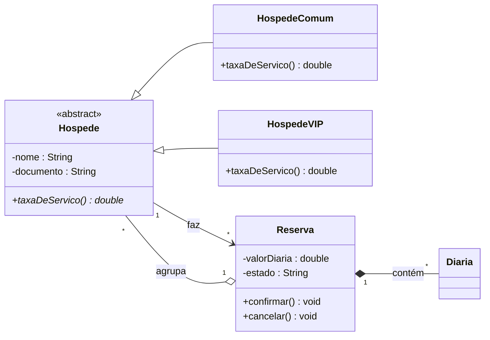
```mermaid
classDiagram
    direction LR
    class Hospede {
        <<abstract>>
        -nome : String
        -documento : String
        +taxaDeServico() double*
    }
    class HospedeComum {
        +taxaDeServico() double
    }
    class HospedeVIP {
        +taxaDeServico() double
    }
    class Reserva {
        -valorDiaria : double
        -estado : String
        +confirmar() void
        +cancelar() void
    }
    Hospede <|-- HospedeComum
    Hospede <|-- HospedeVIP
    Hospede "1" --> "*" Reserva : faz
    Reserva "1" *-- "*" Diaria : contém
    Reserva "1" o-- "*" Hospede : agrupa
```

**Onde está cada coisa:**
- **Abstração/Herança:** `Hospede` «abstract» → `HospedeComum` / `HospedeVIP`.
- **Encapsulamento:** `Reserva` tem `-valorDiaria` e `-estado` privados; mudam só por `confirmar()`/`cancelar()`.
- **Polimorfismo:** `taxaDeServico()` é abstrata na base e redefinida em cada tipo.
- **Associação `-->`:** um hóspede faz VÁRIAS reservas; cada reserva é de UM quarto.
- **Agregação `◇`:** `Reserva` o-- `Hospede` (existem sozinhos).
- **Composição `◆`:** `Reserva` *-- `Diaria` (nascem e morrem juntos).

> Variações são aceitáveis — o essencial é **os quatro pilares + os três relacionamentos com
> multiplicidade**, e **nenhum setter que fure um invariante**.

# 2 locadora veiculos

---

👩‍🏫 <b>Gabarito (para o professor — não abra antes de tentar!)</b>

Um modelo possível que atende a todos os critérios:

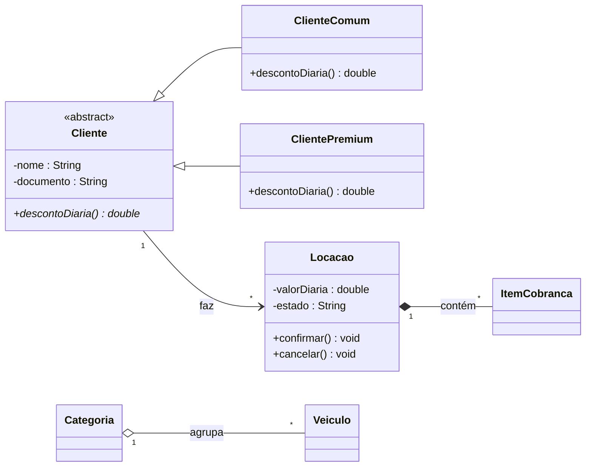
```mermaid
classDiagram
    direction LR
    class Cliente {
        <<abstract>>
        -nome : String
        -documento : String
        +descontoDiaria() double*
    }
    class ClienteComum {
        +descontoDiaria() double
    }
    class ClientePremium {
        +descontoDiaria() double
    }
    class Locacao {
        -valorDiaria : double
        -estado : String
        +confirmar() void
        +cancelar() void
    }
    Cliente <|-- ClienteComum
    Cliente <|-- ClientePremium
    Cliente "1" --> "*" Locacao : faz
    Locacao "1" *-- "*" ItemCobranca : contém
    Categoria "1" o-- "*" Veiculo : agrupa
```

**Onde está cada coisa:**
- **Abstração/Herança:** `Cliente` «abstract» → `ClienteComum` / `ClientePremium`.
- **Encapsulamento:** `Locacao` tem `-valorDiaria` e `-estado` privados; mudam só por `confirmar()`/`cancelar()`.
- **Polimorfismo:** `descontoDiaria()` é abstrata na base e redefinida em cada tipo.
- **Associação `-->`:** um cliente faz VÁRIAS locações; cada locação é de UM veículo.
- **Agregação `◇`:** `Categoria` o-- `Veiculo` (existem sozinhos).
- **Composição `◆`:** `Locacao` *-- `ItemCobranca` (nascem e morrem juntos).

> Variações são aceitáveis — o essencial é **os quatro pilares + os três relacionamentos com
> multiplicidade**, e **nenhum setter que fure um invariante**.

---

# 03 clinica agendamento

---

👩‍🏫 <b>Gabarito (para o professor — não abra antes de tentar!)</b>

Um modelo possível que atende a todos os critérios:

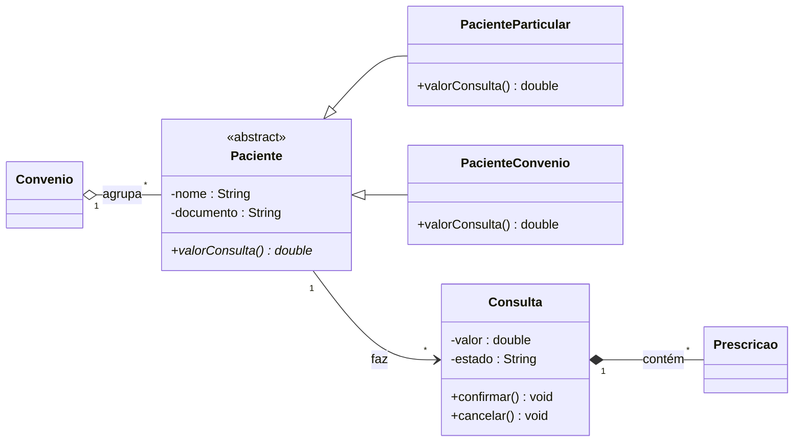
```mermaid
classDiagram
    direction LR
    class Paciente {
        <<abstract>>
        -nome : String
        -documento : String
        +valorConsulta() double*
    }
    class PacienteParticular {
        +valorConsulta() double
    }
    class PacienteConvenio {
        +valorConsulta() double
    }
    class Consulta {
        -valor : double
        -estado : String
        +confirmar() void
        +cancelar() void
    }
    Paciente <|-- PacienteParticular
    Paciente <|-- PacienteConvenio
    Paciente "1" --> "*" Consulta : faz
    Consulta "1" *-- "*" Prescricao : contém
    Convenio "1" o-- "*" Paciente : agrupa
```

**Onde está cada coisa:**
- **Abstração/Herança:** `Paciente` «abstract» → `PacienteParticular` / `PacienteConvenio`.
- **Encapsulamento:** `Consulta` tem `-valor` e `-estado` privados; mudam só por `confirmar()`/`cancelar()`.
- **Polimorfismo:** `valorConsulta()` é abstrata na base e redefinida em cada tipo.
- **Associação `-->`:** um médico tem MUITAS consultas; cada consulta é de UM paciente com UM médico.
- **Agregação `◇`:** `Convenio` o-- `Paciente` (existem sozinhos).
- **Composição `◆`:** `Consulta` *-- `Prescricao` (nascem e morrem juntos).

> Variações são aceitáveis — o essencial é **os quatro pilares + os três relacionamentos com
> multiplicidade**, e **nenhum setter que fure um invariante**.

---

# 4 escola matriculas

---

👩‍🏫 <b>Gabarito (para o professor — não abra antes de tentar!)</b>

Um modelo possível que atende a todos os critérios:

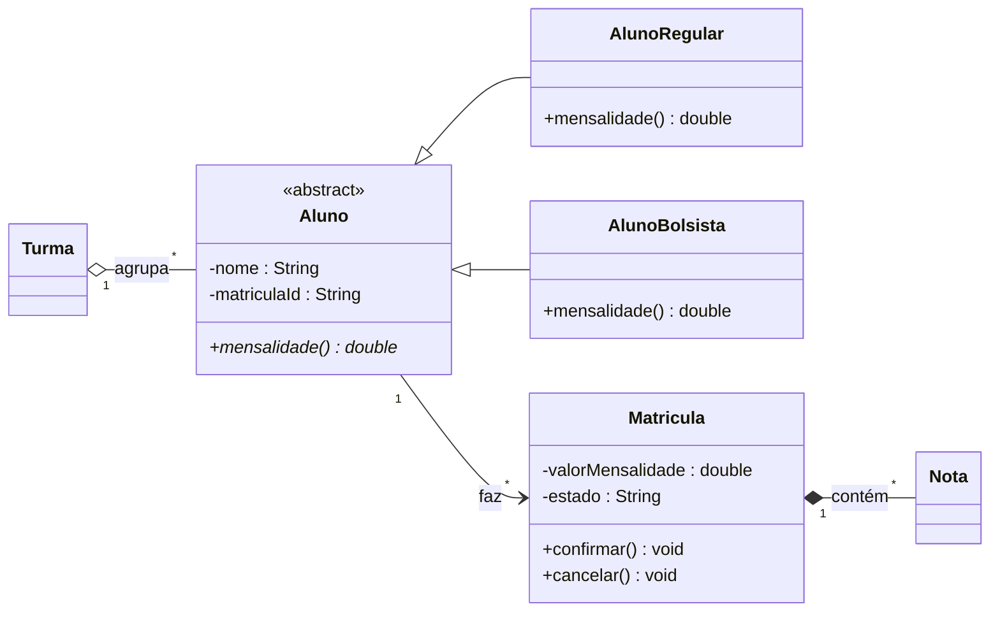
```mermaid
classDiagram
    direction LR
    class Aluno {
        <<abstract>>
        -nome : String
        -matriculaId : String
        +mensalidade() double*
    }
    class AlunoRegular {
        +mensalidade() double
    }
    class AlunoBolsista {
        +mensalidade() double
    }
    class Matricula {
        -valorMensalidade : double
        -estado : String
        +confirmar() void
        +cancelar() void
    }
    Aluno <|-- AlunoRegular
    Aluno <|-- AlunoBolsista
    Aluno "1" --> "*" Matricula : faz
    Matricula "1" *-- "*" Nota : contém
    Turma "1" o-- "*" Aluno : agrupa
```

**Onde está cada coisa:**
- **Abstração/Herança:** `Aluno` «abstract» → `AlunoRegular` / `AlunoBolsista`.
- **Encapsulamento:** `Matricula` tem `-valorMensalidade` e `-estado` privados; mudam só por `confirmar()`/`cancelar()`.
- **Polimorfismo:** `mensalidade()` é abstrata na base e redefinida em cada tipo.
- **Associação `-->`:** uma turma tem MUITOS alunos; um aluno pode estar em VÁRIAS turmas (a matrícula liga os dois).
- **Agregação `◇`:** `Turma` o-- `Aluno` (existem sozinhos).
- **Composição `◆`:** `Matricula` *-- `Nota` (nascem e morrem juntos).

> Variações são aceitáveis — o essencial é **os quatro pilares + os três relacionamentos com
> multiplicidade**, e **nenhum setter que fure um invariante**.

---

# 05 - farmacia estoque venda

---

👩‍🏫 <b>Gabarito (para o professor — não abra antes de tentar!)</b>

Um modelo possível que atende a todos os critérios:

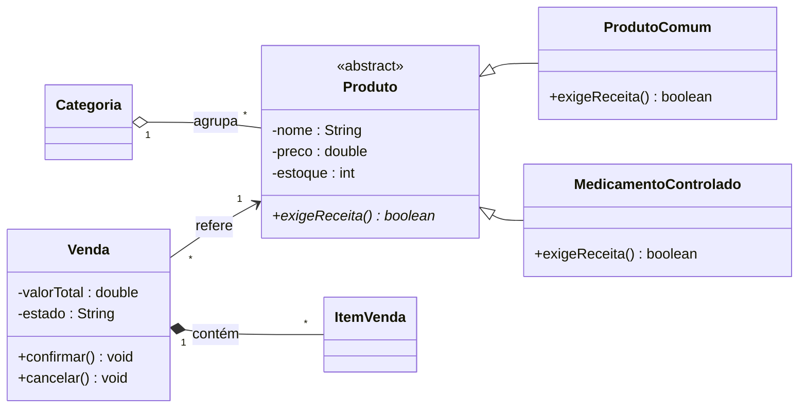
```mermaid
classDiagram
    direction LR
    class Produto {
        <<abstract>>
        -nome : String
        -preco : double
        -estoque : int
        +exigeReceita() boolean*
    }
    class ProdutoComum {
        +exigeReceita() boolean
    }
    class MedicamentoControlado {
        +exigeReceita() boolean
    }
    class Venda {
        -valorTotal : double
        -estado : String
        +confirmar() void
        +cancelar() void
    }
    Produto <|-- ProdutoComum
    Produto <|-- MedicamentoControlado
    Venda "*" --> "1" Produto : refere
    Venda "1" *-- "*" ItemVenda : contém
    Categoria "1" o-- "*" Produto : agrupa
```

**Onde está cada coisa:**
- **Abstração/Herança:** `Produto` «abstract» → `ProdutoComum` / `MedicamentoControlado`.
- **Encapsulamento:** `Venda` tem `-valorTotal` e `-estado` privados; mudam só por `confirmar()`/`cancelar()`.
- **Polimorfismo:** `exigeReceita()` é abstrata na base e redefinida em cada tipo.
- **Associação `-->`:** uma venda é feita de VÁRIOS itens; cada item aponta para UM produto.
- **Agregação `◇`:** `Categoria` o-- `Produto` (existem sozinhos).
- **Composição `◆`:** `Venda` *-- `ItemVenda` (nascem e morrem juntos).

> Variações são aceitáveis — o essencial é **os quatro pilares + os três relacionamentos com
> multiplicidade**, e **nenhum setter que fure um invariante**.

---

# 06 - restaurante comandas
---

👩‍🏫 <b>Gabarito (para o professor — não abra antes de tentar!)</b>

Um modelo possível que atende a todos os critérios:

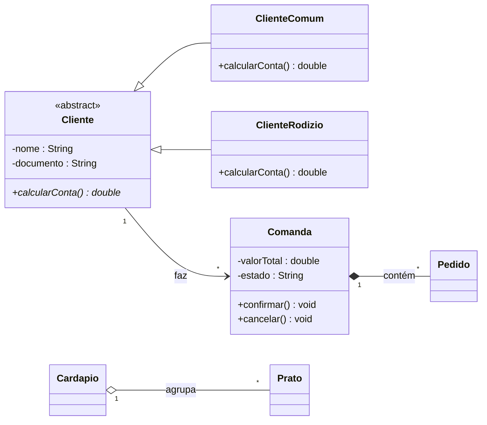
```mermaid
classDiagram
    direction LR
    class Cliente {
        <<abstract>>
        -nome : String
        -documento : String
        +calcularConta() double*
    }
    class ClienteComum {
        +calcularConta() double
    }
    class ClienteRodizio {
        +calcularConta() double
    }
    class Comanda {
        -valorTotal : double
        -estado : String
        +confirmar() void
        +cancelar() void
    }
    Cliente <|-- ClienteComum
    Cliente <|-- ClienteRodizio
    Cliente "1" --> "*" Comanda : faz
    Comanda "1" *-- "*" Pedido : contém
    Cardapio "1" o-- "*" Prato : agrupa
```

**Onde está cada coisa:**
- **Abstração/Herança:** `Cliente` «abstract» → `ClienteComum` / `ClienteRodizio`.
- **Encapsulamento:** `Comanda` tem `-valorTotal` e `-estado` privados; mudam só por `confirmar()`/`cancelar()`.
- **Polimorfismo:** `calcularConta()` é abstrata na base e redefinida em cada tipo.
- **Associação `-->`:** uma mesa tem UMA comanda por vez; a comanda é feita de VÁRIOS pedidos.
- **Agregação `◇`:** `Cardapio` o-- `Prato` (existem sozinhos).
- **Composição `◆`:** `Comanda` *-- `Pedido` (nascem e morrem juntos).

> Variações são aceitáveis — o essencial é **os quatro pilares + os três relacionamentos com
> multiplicidade**, e **nenhum setter que fure um invariante**.

---

# 7 - oficina ordens servico
---

👩‍🏫 <b>Gabarito (para o professor — não abra antes de tentar!)</b>

Um modelo possível que atende a todos os critérios:

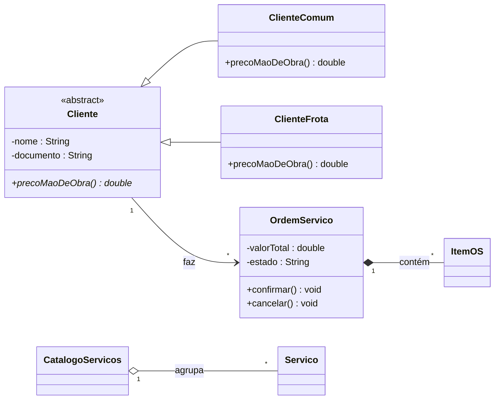
```mermaid
classDiagram
    direction LR
    class Cliente {
        <<abstract>>
        -nome : String
        -documento : String
        +precoMaoDeObra() double*
    }
    class ClienteComum {
        +precoMaoDeObra() double
    }
    class ClienteFrota {
        +precoMaoDeObra() double
    }
    class OrdemServico {
        -valorTotal : double
        -estado : String
        +confirmar() void
        +cancelar() void
    }
    Cliente <|-- ClienteComum
    Cliente <|-- ClienteFrota
    Cliente "1" --> "*" OrdemServico : faz
    OrdemServico "1" *-- "*" ItemOS : contém
    CatalogoServicos "1" o-- "*" Servico : agrupa
```

**Onde está cada coisa:**
- **Abstração/Herança:** `Cliente` «abstract» → `ClienteComum` / `ClienteFrota`.
- **Encapsulamento:** `OrdemServico` tem `-valorTotal` e `-estado` privados; mudam só por `confirmar()`/`cancelar()`.
- **Polimorfismo:** `precoMaoDeObra()` é abstrata na base e redefinida em cada tipo.
- **Associação `-->`:** um cliente tem VÁRIAS ordens de serviço; cada OS é de UM veículo.
- **Agregação `◇`:** `CatalogoServicos` o-- `Servico` (existem sozinhos).
- **Composição `◆`:** `OrdemServico` *-- `ItemOS` (nascem e morrem juntos).

> Variações são aceitáveis — o essencial é **os quatro pilares + os três relacionamentos com
> multiplicidade**, e **nenhum setter que fure um invariante**.

---

# 08 - petshop servicos
---

👩‍🏫 <b>Gabarito (para o professor — não abra antes de tentar!)</b>

Um modelo possível que atende a todos os critérios:

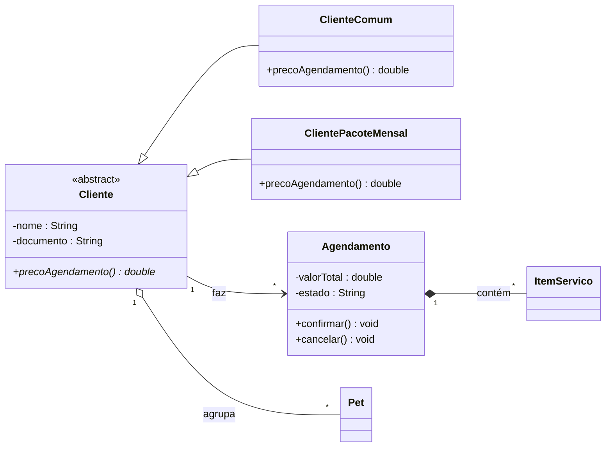
```mermaid
classDiagram
    direction LR
    class Cliente {
        <<abstract>>
        -nome : String
        -documento : String
        +precoAgendamento() double*
    }
    class ClienteComum {
        +precoAgendamento() double
    }
    class ClientePacoteMensal {
        +precoAgendamento() double
    }
    class Agendamento {
        -valorTotal : double
        -estado : String
        +confirmar() void
        +cancelar() void
    }
    Cliente <|-- ClienteComum
    Cliente <|-- ClientePacoteMensal
    Cliente "1" --> "*" Agendamento : faz
    Agendamento "1" *-- "*" ItemServico : contém
    Cliente "1" o-- "*" Pet : agrupa
```

**Onde está cada coisa:**
- **Abstração/Herança:** `Cliente` «abstract» → `ClienteComum` / `ClientePacoteMensal`.
- **Encapsulamento:** `Agendamento` tem `-valorTotal` e `-estado` privados; mudam só por `confirmar()`/`cancelar()`.
- **Polimorfismo:** `precoAgendamento()` é abstrata na base e redefinida em cada tipo.
- **Associação `-->`:** um dono tem VÁRIOS pets; cada agendamento é de UM pet.
- **Agregação `◇`:** `Cliente` o-- `Pet` (existem sozinhos).
- **Composição `◆`:** `Agendamento` *-- `ItemServico` (nascem e morrem juntos).

> Variações são aceitáveis — o essencial é **os quatro pilares + os três relacionamentos com
> multiplicidade**, e **nenhum setter que fure um invariante**.

---

# 09 - academia frequencia

---

👩‍🏫 <b>Gabarito (para o professor — não abra antes de tentar!)</b>

Um modelo possível que atende a todos os critérios:

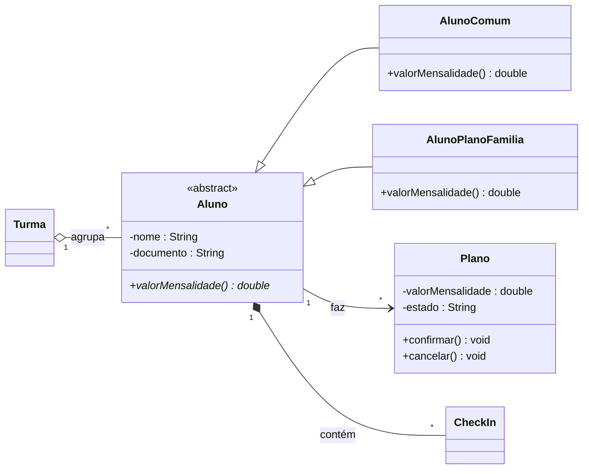
```mermaid
classDiagram
    direction LR
    class Aluno {
        <<abstract>>
        -nome : String
        -documento : String
        +valorMensalidade() double*
    }
    class AlunoComum {
        +valorMensalidade() double
    }
    class AlunoPlanoFamilia {
        +valorMensalidade() double
    }
    class Plano {
        -valorMensalidade : double
        -estado : String
        +confirmar() void
        +cancelar() void
    }
    Aluno <|-- AlunoComum
    Aluno <|-- AlunoPlanoFamilia
    Aluno "1" --> "*" Plano : faz
    Aluno "1" *-- "*" CheckIn : contém
    Turma "1" o-- "*" Aluno : agrupa
```

**Onde está cada coisa:**
- **Abstração/Herança:** `Aluno` «abstract» → `AlunoComum` / `AlunoPlanoFamilia`.
- **Encapsulamento:** `Plano` tem `-valorMensalidade` e `-estado` privados; mudam só por `confirmar()`/`cancelar()`.
- **Polimorfismo:** `valorMensalidade()` é abstrata na base e redefinida em cada tipo.
- **Associação `-->`:** um aluno tem UM plano ativo e MUITOS check-ins.
- **Agregação `◇`:** `Turma` o-- `Aluno` (existem sozinhos).
- **Composição `◆`:** `Aluno` *-- `CheckIn` (nascem e morrem juntos).

> Variações são aceitáveis — o essencial é **os quatro pilares + os três relacionamentos com
> multiplicidade**, e **nenhum setter que fure um invariante**.

---

# 10 - estacionamento tickets

---

👩‍🏫 <b>Gabarito (para o professor — não abra antes de tentar!)</b>

Um modelo possível que atende a todos os critérios:

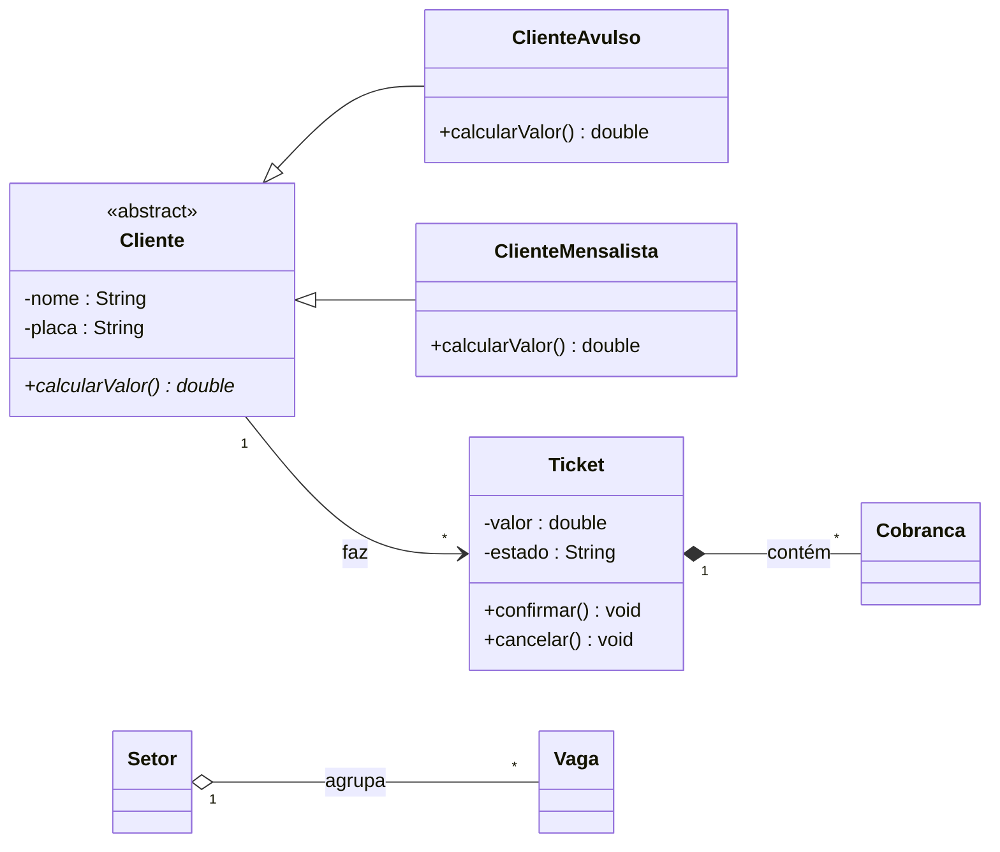
```mermaid
classDiagram
    direction LR
    class Cliente {
        <<abstract>>
        -nome : String
        -placa : String
        +calcularValor() double*
    }
    class ClienteAvulso {
        +calcularValor() double
    }
    class ClienteMensalista {
        +calcularValor() double
    }
    class Ticket {
        -valor : double
        -estado : String
        +confirmar() void
        +cancelar() void
    }
    Cliente <|-- ClienteAvulso
    Cliente <|-- ClienteMensalista
    Cliente "1" --> "*" Ticket : faz
    Ticket "1" *-- "*" Cobranca : contém
    Setor "1" o-- "*" Vaga : agrupa
```

**Onde está cada coisa:**
- **Abstração/Herança:** `Cliente` «abstract» → `ClienteAvulso` / `ClienteMensalista`.
- **Encapsulamento:** `Ticket` tem `-valor` e `-estado` privados; mudam só por `confirmar()`/`cancelar()`.
- **Polimorfismo:** `calcularValor()` é abstrata na base e redefinida em cada tipo.
- **Associação `-->`:** um cliente gera VÁRIOS tickets; cada ticket ocupa UMA vaga.
- **Agregação `◇`:** `Setor` o-- `Vaga` (existem sozinhos).
- **Composição `◆`:** `Ticket` *-- `Cobranca` (nascem e morrem juntos).

> Variações são aceitáveis — o essencial é **os quatro pilares + os três relacionamentos com
> multiplicidade**, e **nenhum setter que fure um invariante**.

---

# 11 - loja virtual pedidos
---

👩‍🏫 <b>Gabarito (para o professor — não abra antes de tentar!)</b>

Um modelo possível que atende a todos os critérios:

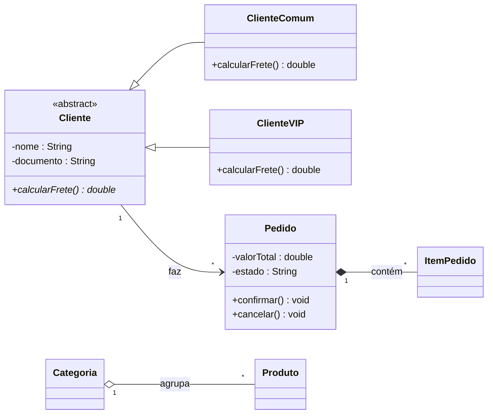
```mermaid
classDiagram
    direction LR
    class Cliente {
        <<abstract>>
        -nome : String
        -documento : String
        +calcularFrete() double*
    }
    class ClienteComum {
        +calcularFrete() double
    }
    class ClienteVIP {
        +calcularFrete() double
    }
    class Pedido {
        -valorTotal : double
        -estado : String
        +confirmar() void
        +cancelar() void
    }
    Cliente <|-- ClienteComum
    Cliente <|-- ClienteVIP
    Cliente "1" --> "*" Pedido : faz
    Pedido "1" *-- "*" ItemPedido : contém
    Categoria "1" o-- "*" Produto : agrupa
```

**Onde está cada coisa:**
- **Abstração/Herança:** `Cliente` «abstract» → `ClienteComum` / `ClienteVIP`.
- **Encapsulamento:** `Pedido` tem `-valorTotal` e `-estado` privados; mudam só por `confirmar()`/`cancelar()`.
- **Polimorfismo:** `calcularFrete()` é abstrata na base e redefinida em cada tipo.
- **Associação `-->`:** um cliente faz MUITOS pedidos; um pedido é feito de VÁRIOS itens.
- **Agregação `◇`:** `Categoria` o-- `Produto` (existem sozinhos).
- **Composição `◆`:** `Pedido` *-- `ItemPedido` (nascem e morrem juntos).

> Variações são aceitáveis — o essencial é **os quatro pilares + os três relacionamentos com
> multiplicidade**, e **nenhum setter que fure um invariante**.

---

# 12 - delivery comida
---

👩‍🏫 <b>Gabarito (para o professor — não abra antes de tentar!)</b>

Um modelo possível que atende a todos os critérios:

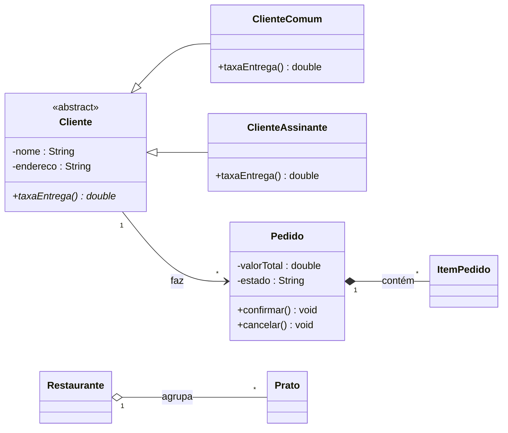
```mermaid
classDiagram
    direction LR
    class Cliente {
        <<abstract>>
        -nome : String
        -endereco : String
        +taxaEntrega() double*
    }
    class ClienteComum {
        +taxaEntrega() double
    }
    class ClienteAssinante {
        +taxaEntrega() double
    }
    class Pedido {
        -valorTotal : double
        -estado : String
        +confirmar() void
        +cancelar() void
    }
    Cliente <|-- ClienteComum
    Cliente <|-- ClienteAssinante
    Cliente "1" --> "*" Pedido : faz
    Pedido "1" *-- "*" ItemPedido : contém
    Restaurante "1" o-- "*" Prato : agrupa
```

**Onde está cada coisa:**
- **Abstração/Herança:** `Cliente` «abstract» → `ClienteComum` / `ClienteAssinante`.
- **Encapsulamento:** `Pedido` tem `-valorTotal` e `-estado` privados; mudam só por `confirmar()`/`cancelar()`.
- **Polimorfismo:** `taxaEntrega()` é abstrata na base e redefinida em cada tipo.
- **Associação `-->`:** um pedido é de UM cliente e UM restaurante, e é levado por UM entregador.
- **Agregação `◇`:** `Restaurante` o-- `Prato` (existem sozinhos).
- **Composição `◆`:** `Pedido` *-- `ItemPedido` (nascem e morrem juntos).

> Variações são aceitáveis — o essencial é **os quatro pilares + os três relacionamentos com
> multiplicidade**, e **nenhum setter que fure um invariante**.

---

# 13 - Imobiliaria locacao
---

👩‍🏫 <b>Gabarito (para o professor — não abra antes de tentar!)</b>

Um modelo possível que atende a todos os critérios:

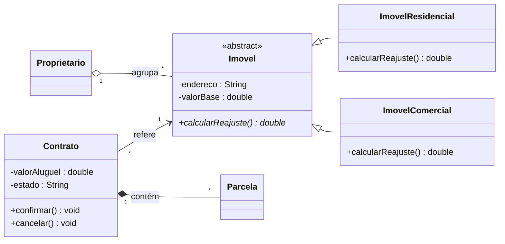
```mermaid
classDiagram
    direction LR
    class Imovel {
        <<abstract>>
        -endereco : String
        -valorBase : double
        +calcularReajuste() double*
    }
    class ImovelResidencial {
        +calcularReajuste() double
    }
    class ImovelComercial {
        +calcularReajuste() double
    }
    class Contrato {
        -valorAluguel : double
        -estado : String
        +confirmar() void
        +cancelar() void
    }
    Imovel <|-- ImovelResidencial
    Imovel <|-- ImovelComercial
    Contrato "*" --> "1" Imovel : refere
    Contrato "1" *-- "*" Parcela : contém
    Proprietario "1" o-- "*" Imovel : agrupa
```

**Onde está cada coisa:**
- **Abstração/Herança:** `Imovel` «abstract» → `ImovelResidencial` / `ImovelComercial`.
- **Encapsulamento:** `Contrato` tem `-valorAluguel` e `-estado` privados; mudam só por `confirmar()`/`cancelar()`.
- **Polimorfismo:** `calcularReajuste()` é abstrata na base e redefinida em cada tipo.
- **Associação `-->`:** um proprietário tem VÁRIOS imóveis; cada contrato liga UM imóvel a UM inquilino.
- **Agregação `◇`:** `Proprietario` o-- `Imovel` (existem sozinhos).
- **Composição `◆`:** `Contrato` *-- `Parcela` (nascem e morrem juntos).

> Variações são aceitáveis — o essencial é **os quatro pilares + os três relacionamentos com
> multiplicidade**, e **nenhum setter que fure um invariante**.

---

# 14 - Agencia viagens reservas
---

👩‍🏫 <b>Gabarito (para o professor — não abra antes de tentar!)</b>

Um modelo possível que atende a todos os critérios:

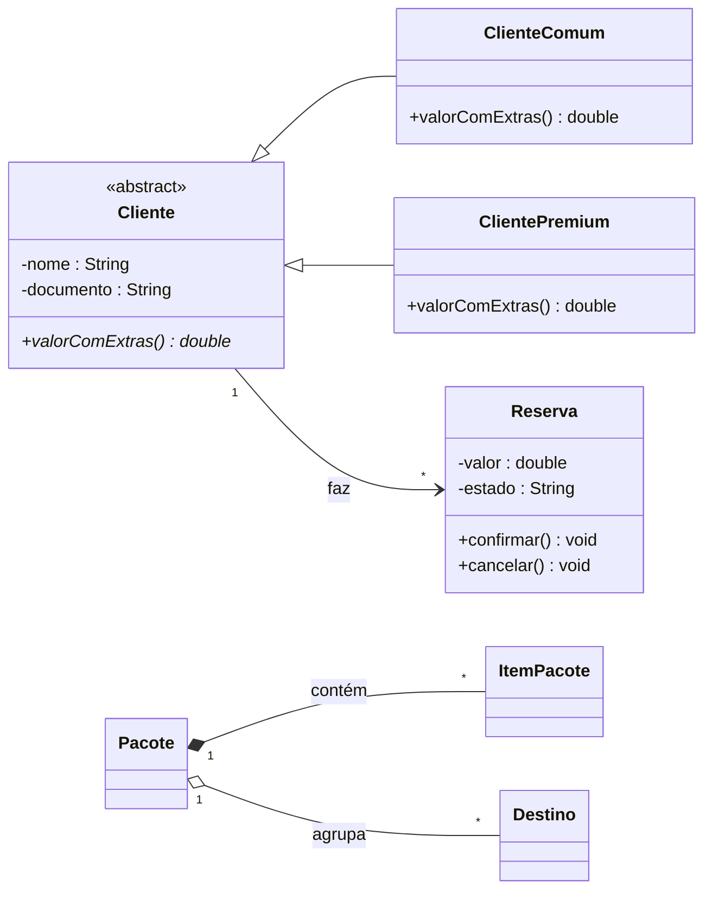
```mermaid
classDiagram
    direction LR
    class Cliente {
        <<abstract>>
        -nome : String
        -documento : String
        +valorComExtras() double*
    }
    class ClienteComum {
        +valorComExtras() double
    }
    class ClientePremium {
        +valorComExtras() double
    }
    class Reserva {
        -valor : double
        -estado : String
        +confirmar() void
        +cancelar() void
    }
    Cliente <|-- ClienteComum
    Cliente <|-- ClientePremium
    Cliente "1" --> "*" Reserva : faz
    Pacote "1" *-- "*" ItemPacote : contém
    Pacote "1" o-- "*" Destino : agrupa
```

**Onde está cada coisa:**
- **Abstração/Herança:** `Cliente` «abstract» → `ClienteComum` / `ClientePremium`.
- **Encapsulamento:** `Reserva` tem `-valor` e `-estado` privados; mudam só por `confirmar()`/`cancelar()`.
- **Polimorfismo:** `valorComExtras()` é abstrata na base e redefinida em cada tipo.
- **Associação `-->`:** um pacote tem MUITAS reservas; cada reserva é de UM cliente para UM pacote.
- **Agregação `◇`:** `Pacote` o-- `Destino` (existem sozinhos).
- **Composição `◆`:** `Pacote` *-- `ItemPacote` (nascem e morrem juntos).

> Variações são aceitáveis — o essencial é **os quatro pilares + os três relacionamentos com
> multiplicidade**, e **nenhum setter que fure um invariante**.

---

# 15 - cinema ingressos

---

👩‍🏫 <b>Gabarito (para o professor — não abra antes de tentar!)</b>

Um modelo possível que atende a todos os critérios:

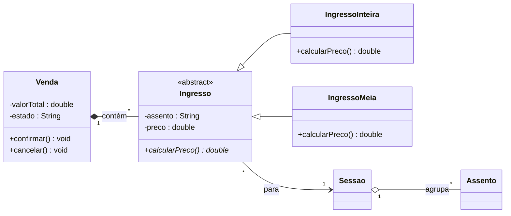
```mermaid
classDiagram
    direction LR
    class Ingresso {
        <<abstract>>
        -assento : String
        -preco : double
        +calcularPreco() double*
    }
    class IngressoInteira {
        +calcularPreco() double
    }
    class IngressoMeia {
        +calcularPreco() double
    }
    class Venda {
        -valorTotal : double
        -estado : String
        +confirmar() void
        +cancelar() void
    }
    Ingresso <|-- IngressoInteira
    Ingresso <|-- IngressoMeia
    Ingresso "*" --> "1" Sessao : para
    Venda "1" *-- "*" Ingresso : contém
    Sessao "1" o-- "*" Assento : agrupa
```

**Onde está cada coisa:**
- **Abstração/Herança:** `Ingresso` «abstract» → `IngressoInteira` / `IngressoMeia`.
- **Encapsulamento:** `Venda` tem `-valorTotal` e `-estado` privados; mudam só por `confirmar()`/`cancelar()`.
- **Polimorfismo:** `calcularPreco()` é abstrata na base e redefinida em cada tipo.
- **Associação `-->`:** uma sessão tem MUITOS assentos; cada ingresso reserva UM assento de UMA sessão.
- **Agregação `◇`:** `Sessao` o-- `Assento` (existem sozinhos).
- **Composição `◆`:** `Venda` *-- `Ingresso` (nascem e morrem juntos).

> Variações são aceitáveis — o essencial é **os quatro pilares + os três relacionamentos com
> multiplicidade**, e **nenhum setter que fure um invariante**.

---

# 16 - transportadora entregas

---

👩‍🏫 <b>Gabarito (para o professor — não abra antes de tentar!)</b>

Um modelo possível que atende a todos os critérios:

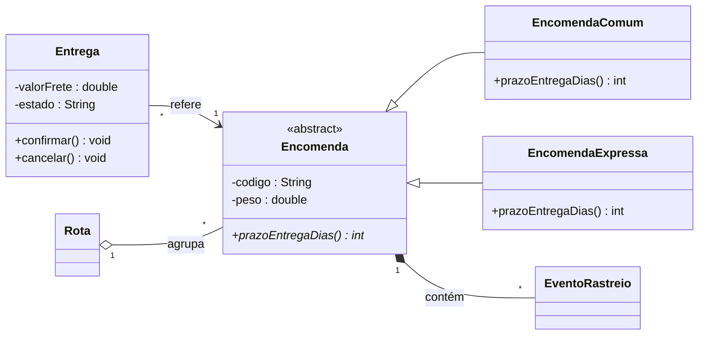
```mermaid
classDiagram
    direction LR
    class Encomenda {
        <<abstract>>
        -codigo : String
        -peso : double
        +prazoEntregaDias() int*
    }
    class EncomendaComum {
        +prazoEntregaDias() int
    }
    class EncomendaExpressa {
        +prazoEntregaDias() int
    }
    class Entrega {
        -valorFrete : double
        -estado : String
        +confirmar() void
        +cancelar() void
    }
    Encomenda <|-- EncomendaComum
    Encomenda <|-- EncomendaExpressa
    Entrega "*" --> "1" Encomenda : refere
    Encomenda "1" *-- "*" EventoRastreio : contém
    Rota "1" o-- "*" Encomenda : agrupa
```

**Onde está cada coisa:**
- **Abstração/Herança:** `Encomenda` «abstract» → `EncomendaComum` / `EncomendaExpressa`.
- **Encapsulamento:** `Entrega` tem `-valorFrete` e `-estado` privados; mudam só por `confirmar()`/`cancelar()`.
- **Polimorfismo:** `prazoEntregaDias()` é abstrata na base e redefinida em cada tipo.
- **Associação `-->`:** uma encomenda tem MUITOS eventos de rastreio; cada entrega é de UMA encomenda para UM destinatário.
- **Agregação `◇`:** `Rota` o-- `Encomenda` (existem sozinhos).
- **Composição `◆`:** `Encomenda` *-- `EventoRastreio` (nascem e morrem juntos).

> Variações são aceitáveis — o essencial é **os quatro pilares + os três relacionamentos com
> multiplicidade**, e **nenhum setter que fure um invariante**.

---

# 17 - seguradora apolices

---

👩‍🏫 <b>Gabarito (para o professor — não abra antes de tentar!)</b>

Um modelo possível que atende a todos os critérios:

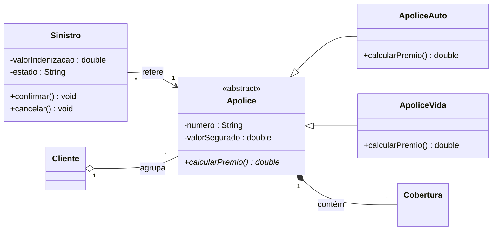
```mermaid
classDiagram
    direction LR
    class Apolice {
        <<abstract>>
        -numero : String
        -valorSegurado : double
        +calcularPremio() double*
    }
    class ApoliceAuto {
        +calcularPremio() double
    }
    class ApoliceVida {
        +calcularPremio() double
    }
    class Sinistro {
        -valorIndenizacao : double
        -estado : String
        +confirmar() void
        +cancelar() void
    }
    Apolice <|-- ApoliceAuto
    Apolice <|-- ApoliceVida
    Sinistro "*" --> "1" Apolice : refere
    Apolice "1" *-- "*" Cobertura : contém
    Cliente "1" o-- "*" Apolice : agrupa
```

**Onde está cada coisa:**
- **Abstração/Herança:** `Apolice` «abstract» → `ApoliceAuto` / `ApoliceVida`.
- **Encapsulamento:** `Sinistro` tem `-valorIndenizacao` e `-estado` privados; mudam só por `confirmar()`/`cancelar()`.
- **Polimorfismo:** `calcularPremio()` é abstrata na base e redefinida em cada tipo.
- **Associação `-->`:** um cliente tem VÁRIAS apólices; cada apólice pode gerar VÁRIOS sinistros.
- **Agregação `◇`:** `Cliente` o-- `Apolice` (existem sozinhos).
- **Composição `◆`:** `Apolice` *-- `Cobertura` (nascem e morrem juntos).

> Variações são aceitáveis — o essencial é **os quatro pilares + os três relacionamentos com
> multiplicidade**, e **nenhum setter que fure um invariante**.

---

# 18 rh ponto colaboradores

---

👩‍🏫 <b>Gabarito (para o professor — não abra antes de tentar!)</b>

Um modelo possível que atende a todos os critérios:

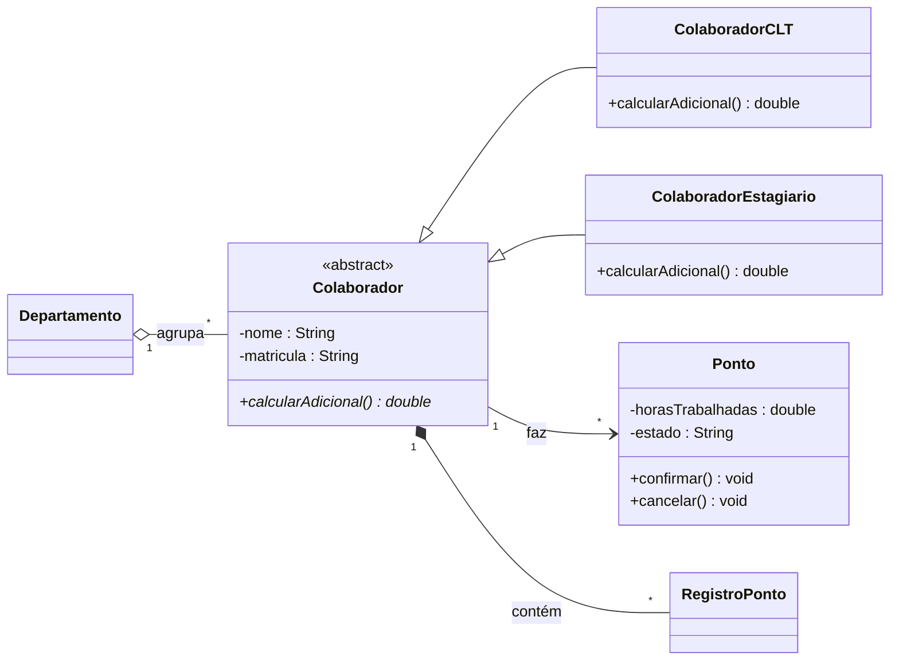
```mermaid
classDiagram
    direction LR
    class Colaborador {
        <<abstract>>
        -nome : String
        -matricula : String
        +calcularAdicional() double*
    }
    class ColaboradorCLT {
        +calcularAdicional() double
    }
    class ColaboradorEstagiario {
        +calcularAdicional() double
    }
    class Ponto {
        -horasTrabalhadas : double
        -estado : String
        +confirmar() void
        +cancelar() void
    }
    Colaborador <|-- ColaboradorCLT
    Colaborador <|-- ColaboradorEstagiario
    Colaborador "1" --> "*" Ponto : faz
    Colaborador "1" *-- "*" RegistroPonto : contém
    Departamento "1" o-- "*" Colaborador : agrupa
```

**Onde está cada coisa:**
- **Abstração/Herança:** `Colaborador` «abstract» → `ColaboradorCLT` / `ColaboradorEstagiario`.
- **Encapsulamento:** `Ponto` tem `-horasTrabalhadas` e `-estado` privados; mudam só por `confirmar()`/`cancelar()`.
- **Polimorfismo:** `calcularAdicional()` é abstrata na base e redefinida em cada tipo.
- **Associação `-->`:** um colaborador tem MUITOS registros de ponto e pertence a UM departamento.
- **Agregação `◇`:** `Departamento` o-- `Colaborador` (existem sozinhos).
- **Composição `◆`:** `Colaborador` *-- `RegistroPonto` (nascem e morrem juntos).

> Variações são aceitáveis — o essencial é **os quatro pilares + os três relacionamentos com
> multiplicidade**, e **nenhum setter que fure um invariante**.

---

# 19 salao beleza agendamento

---

👩‍🏫 <b>Gabarito (para o professor — não abra antes de tentar!)</b>

Um modelo possível que atende a todos os critérios:

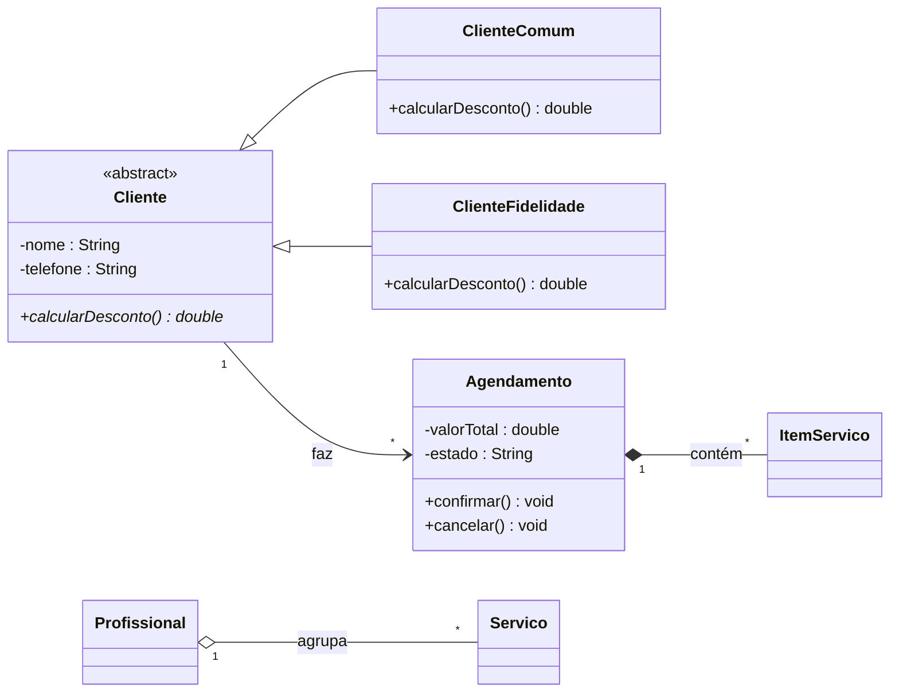
```mermaid
classDiagram
    direction LR
    class Cliente {
        <<abstract>>
        -nome : String
        -telefone : String
        +calcularDesconto() double*
    }
    class ClienteComum {
        +calcularDesconto() double
    }
    class ClienteFidelidade {
        +calcularDesconto() double
    }
    class Agendamento {
        -valorTotal : double
        -estado : String
        +confirmar() void
        +cancelar() void
    }
    Cliente <|-- ClienteComum
    Cliente <|-- ClienteFidelidade
    Cliente "1" --> "*" Agendamento : faz
    Agendamento "1" *-- "*" ItemServico : contém
    Profissional "1" o-- "*" Servico : agrupa
```

**Onde está cada coisa:**
- **Abstração/Herança:** `Cliente` «abstract» → `ClienteComum` / `ClienteFidelidade`.
- **Encapsulamento:** `Agendamento` tem `-valorTotal` e `-estado` privados; mudam só por `confirmar()`/`cancelar()`.
- **Polimorfismo:** `calcularDesconto()` é abstrata na base e redefinida em cada tipo.
- **Associação `-->`:** um profissional tem MUITOS agendamentos; cada agendamento é de UMA cliente para UM serviço.
- **Agregação `◇`:** `Profissional` o-- `Servico` (existem sozinhos).
- **Composição `◆`:** `Agendamento` *-- `ItemServico` (nascem e morrem juntos).

> Variações são aceitáveis — o essencial é **os quatro pilares + os três relacionamentos com
> multiplicidade**, e **nenhum setter que fure um invariante**.

---

# 20 - condominios reservas

---

👩‍🏫 <b>Gabarito (para o professor — não abra antes de tentar!)</b>

Um modelo possível que atende a todos os critérios:

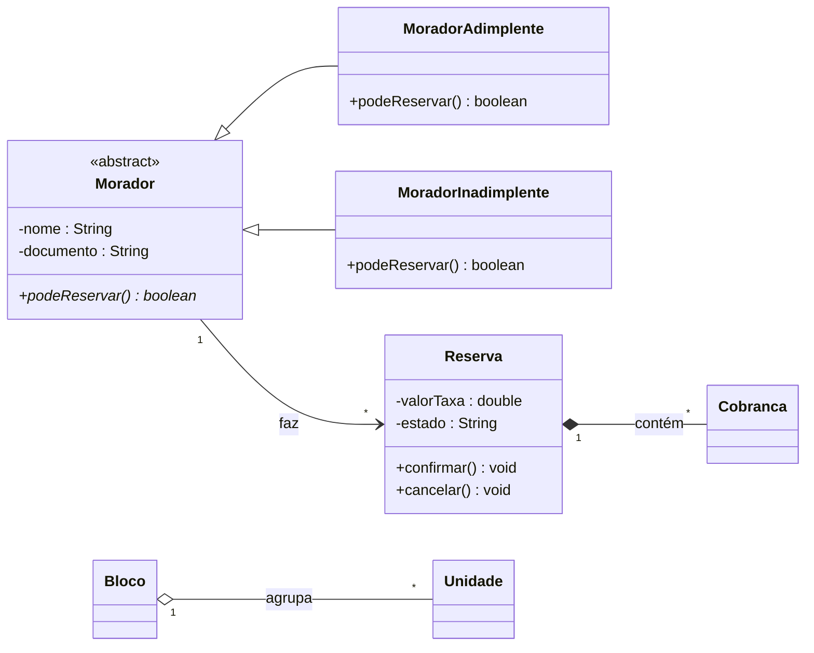
```mermaid
classDiagram
    direction LR
    class Morador {
        <<abstract>>
        -nome : String
        -documento : String
        +podeReservar() boolean*
    }
    class MoradorAdimplente {
        +podeReservar() boolean
    }
    class MoradorInadimplente {
        +podeReservar() boolean
    }
    class Reserva {
        -valorTaxa : double
        -estado : String
        +confirmar() void
        +cancelar() void
    }
    Morador <|-- MoradorAdimplente
    Morador <|-- MoradorInadimplente
    Morador "1" --> "*" Reserva : faz
    Reserva "1" *-- "*" Cobranca : contém
    Bloco "1" o-- "*" Unidade : agrupa
```

**Onde está cada coisa:**
- **Abstração/Herança:** `Morador` «abstract» → `MoradorAdimplente` / `MoradorInadimplente`.
- **Encapsulamento:** `Reserva` tem `-valorTaxa` e `-estado` privados; mudam só por `confirmar()`/`cancelar()`.
- **Polimorfismo:** `podeReservar()` é abstrata na base e redefinida em cada tipo.
- **Associação `-->`:** um morador pertence a UMA unidade e faz VÁRIAS reservas de áreas comuns.
- **Agregação `◇`:** `Bloco` o-- `Unidade` (existem sozinhos).
- **Composição `◆`:** `Reserva` *-- `Cobranca` (nascem e morrem juntos).

> Variações são aceitáveis — o essencial é **os quatro pilares + os três relacionamentos com
> multiplicidade**, e **nenhum setter que fure um invariante**.

---