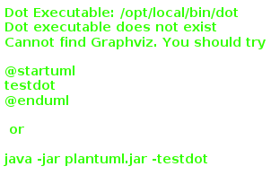

# Classes Abstratas - Base Incompleta para Especialização

## 🎯 O que são Classes Abstratas?

Uma **classe abstrata** é uma classe que:

- **Não pode ser instanciada** diretamente (não pode criar objetos dela)
- **Serve como base** para outras classes através de herança
- **Pode ter métodos abstratos** (sem implementação) que devem ser implementados pelas subclasses
- **Pode ter métodos concretos** (com implementação) compartilhados pelas subclasses
- **Combina abstração com implementação** concreta

**Analogia**: Como um projeto arquitetônico de uma casa - define a estrutura geral (quartos, banheiros, cozinha), mas deixa detalhes específicos (acabamentos, cores, móveis) para serem definidos na construção real.

## 🏗️ Sintaxe e Características

### Definindo uma Classe Abstrata

```java
public abstract class Veiculo {
    // Atributos comuns (podem ser de qualquer visibilidade)
    protected String marca;
    protected String modelo;
    protected int ano;
    private boolean ligado;
    
    // Construtor (pode existir, mesmo sendo abstrata)
    public Veiculo(String marca, String modelo, int ano) {
        this.marca = marca;
        this.modelo = modelo;
        this.ano = ano;
        this.ligado = false;
    }
    
    // Métodos concretos (implementação compartilhada)
    public void ligar() {
        ligado = true;
        System.out.println(marca + " " + modelo + " ligado!");
    }
    
    public void desligar() {
        ligado = false;
        System.out.println(marca + " " + modelo + " desligado!");
    }
    
    public boolean isLigado() {
        return ligado;
    }
    
    // Métodos abstratos (devem ser implementados pelas subclasses)
    public abstract void acelerar();
    public abstract void frear();
    public abstract double calcularConsumo(double distancia);
    public abstract String getTipoVeiculo();
    
    // Método concreto que usa métodos abstratos
    public void exibirInfo() {
        System.out.println("=== " + getTipoVeiculo() + " ===");
        System.out.println("Marca: " + marca);
        System.out.println("Modelo: " + modelo);
        System.out.println("Ano: " + ano);
        System.out.println("Status: " + (ligado ? "Ligado" : "Desligado"));
    }
}
```

### Implementando Classes Filhas

```java
// Classe filha 1: Carro
public class Carro extends Veiculo {
    private int numeroPortas;
    private String tipoCombustivel;
    
    public Carro(String marca, String modelo, int ano, int portas, String combustivel) {
        super(marca, modelo, ano);  // Chama construtor da classe abstrata
        this.numeroPortas = portas;
        this.tipoCombustivel = combustivel;
    }
    
    // Implementação obrigatória dos métodos abstratos
    @Override
    public void acelerar() {
        if (isLigado()) {
            System.out.println("Carro acelerando suavemente...");
        } else {
            System.out.println("Ligue o carro primeiro!");
        }
    }
    
    @Override
    public void frear() {
        System.out.println("Carro freando com segurança");
    }
    
    @Override
    public double calcularConsumo(double distancia) {
        // Carro consome mais na cidade
        return distancia / 12.0; // 12 km/l
    }
    
    @Override
    public String getTipoVeiculo() {
        return "Carro";
    }
    
    // Métodos específicos da classe
    public void abrirPorta() {
        System.out.println("Abrindo uma das " + numeroPortas + " portas");
    }
}

// Classe filha 2: Motocicleta
public class Motocicleta extends Veiculo {
    private int cilindradas;
    private boolean temBau;
    
    public Motocicleta(String marca, String modelo, int ano, int cilindradas) {
        super(marca, modelo, ano);
        this.cilindradas = cilindradas;
        this.temBau = false;
    }
    
    @Override
    public void acelerar() {
        if (isLigado()) {
            System.out.println("Moto acelerando rapidamente!");
        } else {
            System.out.println("Ligue a moto primeiro!");
        }
    }
    
    @Override
    public void frear() {
        System.out.println("Moto freando com cuidado");
    }
    
    @Override
    public double calcularConsumo(double distancia) {
        // Moto é mais econômica
        return distancia / 25.0; // 25 km/l
    }
    
    @Override
    public String getTipoVeiculo() {
        return "Motocicleta";
    }
    
    // Métodos específicos
    public void empinar() {
        if (isLigado()) {
            System.out.println("Moto empinando! (" + cilindradas + " cilindradas)");
        }
    }
}
```

## 🎨 Exemplo Prático: Sistema de Formas Geométricas

```java
// Classe abstrata base
public abstract class Forma {
    protected String cor;
    protected double x, y; // Posição
    
    public Forma(String cor, double x, double y) {
        this.cor = cor;
        this.x = x;
        this.y = y;
    }
    
    // Métodos concretos compartilhados
    public void mover(double novoX, double novoY) {
        this.x = novoX;
        this.y = novoY;
        System.out.println("Forma movida para (" + x + ", " + y + ")");
    }
    
    public void pintar(String novaCor) {
        this.cor = novaCor;
        System.out.println("Forma pintada de " + cor);
    }
    
    public String getCor() {
        return cor;
    }
    
    // Métodos abstratos (cada forma calcula diferente)
    public abstract double calcularArea();
    public abstract double calcularPerimetro();
    public abstract void desenhar();
    
    // Método template (usa métodos abstratos)
    public void exibirInformacoes() {
        System.out.println("=== " + getClass().getSimpleName() + " ===");
        System.out.println("Cor: " + cor);
        System.out.println("Posição: (" + x + ", " + y + ")");
        System.out.println("Área: " + calcularArea());
        System.out.println("Perímetro: " + calcularPerimetro());
        desenhar();
    }
}

// Implementações específicas
public class Retangulo extends Forma {
    private double largura, altura;
    
    public Retangulo(String cor, double x, double y, double largura, double altura) {
        super(cor, x, y);
        this.largura = largura;
        this.altura = altura;
    }
    
    @Override
    public double calcularArea() {
        return largura * altura;
    }
    
    @Override
    public double calcularPerimetro() {
        return 2 * (largura + altura);
    }
    
    @Override
    public void desenhar() {
        System.out.println("Desenhando retângulo " + largura + "x" + altura);
    }
}

public class Circulo extends Forma {
    private double raio;
    
    public Circulo(String cor, double x, double y, double raio) {
        super(cor, x, y);
        this.raio = raio;
    }
    
    @Override
    public double calcularArea() {
        return Math.PI * raio * raio;
    }
    
    @Override
    public double calcularPerimetro() {
        return 2 * Math.PI * raio;
    }
    
    @Override
    public void desenhar() {
        System.out.println("Desenhando círculo com raio " + raio);
    }
}

public class Triangulo extends Forma {
    private double lado1, lado2, lado3;
    
    public Triangulo(String cor, double x, double y, double l1, double l2, double l3) {
        super(cor, x, y);
        this.lado1 = l1;
        this.lado2 = l2;
        this.lado3 = l3;
    }
    
    @Override
    public double calcularArea() {
        // Fórmula de Heron
        double s = calcularPerimetro() / 2;
        return Math.sqrt(s * (s - lado1) * (s - lado2) * (s - lado3));
    }
    
    @Override
    public double calcularPerimetro() {
        return lado1 + lado2 + lado3;
    }
    
    @Override
    public void desenhar() {
        System.out.println("Desenhando triângulo com lados " + lado1 + ", " + lado2 + ", " + lado3);
    }
}
```

### Sistema de Uso

```java
public class TesteFormas {
    public static void main(String[] args) {
        // Array polimórfico de formas
        Forma[] formas = {
            new Retangulo("Azul", 0, 0, 5, 3),
            new Circulo("Vermelho", 10, 10, 2.5),
            new Triangulo("Verde", 5, 5, 3, 4, 5)
        };
        
        System.out.println("=== SISTEMA DE FORMAS GEOMÉTRICAS ===\n");
        
        double areaTotal = 0;
        for (Forma forma : formas) {
            forma.exibirInformacoes();
            areaTotal += forma.calcularArea();
            
            // Operações específicas baseadas no tipo
            if (forma instanceof Circulo) {
                System.out.println("Círculo detectado!");
            }
            
            System.out.println();
        }
        
        System.out.println("Área total de todas as formas: " + areaTotal);
        
        // Testando movimentação
        System.out.println("\n=== MOVENDO FORMAS ===");
        for (Forma forma : formas) {
            forma.mover(forma.x + 1, forma.y + 1);
        }
    }
}
```

## 🔄 Classe Abstrata vs Interface

| Aspecto | Classe Abstrata | Interface |
|---------|-----------------|-----------|
| **Instanciação** | Não pode ser instanciada | Não pode ser instanciada |
| **Herança** | Herança simples (extends) | Múltipla implementação |
| **Métodos** | Abstratos + concretos | Abstratos + default + static |
| **Atributos** | Qualquer tipo e visibilidade | Apenas constantes (public static final) |
| **Construtor** | Pode ter construtor | Não tem construtor |
| **Quando usar** | Base comum + código compartilhado | Contratos, múltipla herança |

## 💡 Quando Usar Classes Abstratas?

### ✅ Use Classes Abstratas Quando:

1. **Código compartilhado**: Várias classes precisam dos mesmos métodos/atributos
2. **Herança natural**: Existe uma relação hierárquica clara
3. **Controle de acesso**: Precisa de diferentes níveis de visibilidade
4. **Estado compartilhado**: Precisa de atributos comuns entre subclasses

### ✅ Exemplo de Bom Uso:
```java
abstract class Animal {
    protected String nome;
    protected int idade;
    
    // Código comum
    public void dormir() { /* implementação comum */ }
    
    // Comportamento específico
    abstract void emitirSom();
}
```

### ❌ Evite Quando:
- Não há código comum para compartilhar (use interface)
- Precisa de múltipla herança (use interfaces)
- Classes não têm relação hierárquica natural

## 🎯 Template Method Pattern

Classes abstratas são ideais para o padrão Template Method:

```java
public abstract class AlgoritmoOrdenacao {
    // Template method (algoritmo geral)
    public final void ordenar(int[] array) {
        System.out.println("Iniciando ordenação...");
        
        long inicio = System.currentTimeMillis();
        algoritmoEspecifico(array);
        long fim = System.currentTimeMillis();
        
        System.out.println("Ordenação concluída em " + (fim - inicio) + "ms");
        exibirResultado(array);
    }
    
    // Método abstrato - cada subclasse implementa seu algoritmo
    protected abstract void algoritmoEspecifico(int[] array);
    
    // Método concreto compartilhado
    private void exibirResultado(int[] array) {
        System.out.print("Resultado: ");
        for (int num : array) {
            System.out.print(num + " ");
        }
        System.out.println();
    }
}

public class BubbleSort extends AlgoritmoOrdenacao {
    @Override
    protected void algoritmoEspecifico(int[] array) {
        // Implementação do Bubble Sort
        for (int i = 0; i < array.length - 1; i++) {
            for (int j = 0; j < array.length - i - 1; j++) {
                if (array[j] > array[j + 1]) {
                    int temp = array[j];
                    array[j] = array[j + 1];
                    array[j + 1] = temp;
                }
            }
        }
    }
}
```

## ⚠️ Cuidados e Boas Práticas

### ✅ Design Thoughtful
```java
// ✅ Abstração bem definida
abstract class ProcessadorDados {
    public final void processar() {
        carregar();
        validar();
        executar();
        salvar();
    }
    
    protected abstract void executar(); // Parte variável
    private void carregar() { /* comum */ }
    private void salvar() { /* comum */ }
}
```

### ⚠️ Evite Hierarquias Profundas
```java
// ❌ Muito profundo
abstract class A { }
abstract class B extends A { }
abstract class C extends B { }
class D extends C { } // Difícil de entender

// ✅ Mais simples
abstract class Base { }
class Implementacao extends Base { }
```

## 🚀 Exercícios Práticos

1. **Sistema de Funcionários**
   - Classe abstrata: `Funcionario` (nome, salário base, calcularSalario())
   - Subclasses: `Gerente`, `Vendedor`, `Desenvolvedor`

2. **Jogos**
   - Classe abstrata: `Jogo` (nome, iniciar(), jogar(), terminar())
   - Subclasses: `JogoCartas`, `JogoTabuleiro`, `JogoEletronico`

3. **Processamento de Arquivos**
   - Classe abstrata: `ProcessadorArquivo` (abrir(), processar(), fechar())
   - Subclasses: `ProcessadorTexto`, `ProcessadorImagem`, `ProcessadorVideo`

---

## 📂 Exemplos Completos com Diagramas de Classes

Esta seção contém implementações completas de sistemas usando classes abstratas, acompanhadas de diagramas UML para melhor compreensão da arquitetura.

### 🎯 Exemplo 1: Sistema de Funcionários

Um sistema completo de gerenciamento de funcionários demonstrando diferentes tipos de cálculo salarial.

#### Diagrama de Classes:



#### Estrutura:
- **Classe Abstrata**: `Funcionario` - Define estrutura base com atributos e comportamentos comuns
- **Subclasses**: 
  - `Gerente` - Recebe bônus fixo e adicional por nível
  - `Vendedor` - Ganha comissão sobre vendas
  - `Desenvolvedor` - Recebe bônus por projeto concluído

#### Conceitos Demonstrados:
- ✅ Template Method Pattern
- ✅ Polimorfismo através de abstração
- ✅ Encapsulamento de lógicas específicas
- ✅ Reutilização de código comum

**[📁 Ver código completo](exemplos/)**

Para executar:
```bash
cd exemplos/
javac *.java
java TesteSistemaFuncionarios
```

---

### 🎮 Exemplo 2: Sistema de Jogos

Um sistema de gerenciamento de diferentes tipos de jogos, implementando o Template Method Pattern para garantir fluxo consistente.

#### Diagrama de Classes:


#### Estrutura:
- **Classe Abstrata**: `Jogo` - Define o fluxo de execução (iniciar → jogar → terminar)
- **Subclasses**:
  - `JogoCartas` - Baralho, rodadas e embaralhamento
  - `JogoTabuleiro` - Dados, tabuleiro e turnos
  - `JogoEletronico` - Níveis, pontuação e plataforma

#### Conceitos Demonstrados:
- ✅ Template Method Pattern (método final)
- ✅ Fluxo de execução consistente
- ✅ Implementações específicas por tipo
- ✅ Array polimórfico para gerenciar diferentes tipos

**[📁 Ver código completo](exemplos/)**

Para executar:
```bash
cd exemplos/
javac *.java
java TesteSistemaJogos
```

---

## 📝 Exercícios para Prática

Acesse o diretório [exercicios/](exercicios/) para encontrar:

1. **Exercício 1**: Sistema de Veículos de Transporte
   - Implementar `Onibus`, `Taxi`, `VanEscolar`
   - Cálculo de tarifas específicas por tipo

2. **Exercício 2**: Sistema de Produtos E-commerce
   - Categorias: Eletrônico, Alimentício, Vestuário
   - Diferentes formas de cálculo de preço e desconto

3. **Exercício 3**: Sistema de Investimentos Financeiros
   - Tipos: Poupança, CDB, Ações
   - Cálculo de rendimento específico

4. **Exercício 4**: Sistema de Notificações
   - Canais: Email, SMS, Push
   - Template Method para fluxo de envio

5. **Exercício 5**: Sistema de Relatórios (Avançado)
   - Formatos: HTML, PDF, CSV, JSON
   - Geração padronizada com formatações específicas

**[📋 Ver detalhes dos exercícios](exercicios/README.md)**

---

## 🔗 Navegação

[← 05 - Interfaces](../05-interfaces/) | [📚 Voltar ao Índice](../README.md)

---

## 📚 Material de Apoio

### Arquivos Disponíveis:
- `exemplos/` - Implementações completas com código executável
- `exercicios/` - Desafios práticos com diferentes níveis de dificuldade
- `img/` - Diagramas UML dos sistemas
  - `sistema-funcionarios.png` - Diagrama do sistema de funcionários
  - `sistema-jogos.png` - Diagrama do sistema de jogos

### Recursos dos Exemplos:
- ✨ Código totalmente comentado e documentado
- ✨ Diagramas UML para visualização da arquitetura
- ✨ Classes de teste demonstrando uso completo
- ✨ Output formatado para melhor compreensão

---

**💡 Lembre-se**: Classes abstratas são para compartilhar código comum e estabelecer uma base sólida para especialização. Use quando há uma hierarquia natural e código que pode ser reutilizado!