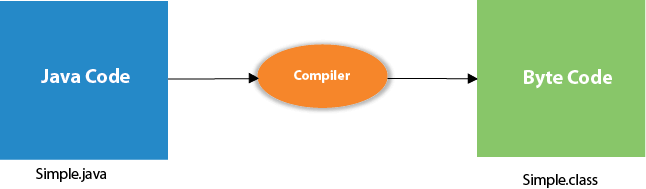

# História Java

Fonte: [Java Point](https://www.javatpoint.com/pt/hist%C3%B3ria-do-java)

Java foi originalmente designada para interagir com televisão, mas também foi avançada para a indústria de TV a cabo digital no momento. A história do java começa com o time Green. Os membros da equipe java (também conhecido como Time Green), iniciaram este projeto para desenvolver uma linguagem para dispositivos digitais tais como receptor de televisão, TVs, etc. Entretanto, foi adaptada para programação no âmbito da internet. Mais tarde, a tecnologia java foi incorporada pelo Netscape.

Os princípios para criação de programas java eram:

> **Simplicidade, robustez, portabilidade, Independência de plataforma, segurança, alta performance, multithread, arquitetura neutra, orientação a objeto, interpretada e dinâmica**. 

Java foi desenvolvida por **James Gosling**, conhecido como o pai do java, em 1995. James Gosling e os membros do seu time começaram o projeto no início dos anos 90.

### **James Gosling - founder of java**

Atualmente, a programação java é usada na internet, dispositivos móveis, jogos, soluções de e-commerce, etc. Abaixo temos alguns tópicos importantes que descrevem a história do java.

1) James Gosling, Mike Sheridan, and Patrick Naughton iniciaram o projeto da linguagem java em junho de 1991. O pequeno time de engenheiros da sun chamado Time Green.

2) Inicialmente projetado para sistemas pequenos e incorporados em aparelhos eletrônicos, como receptores de televisão.

3) Antigamente, era chamado "Greentalk" por James Gosling, e o arquivo de extensão era .gt.

4) Depois que foi chamado Oak (carvalho) e foi desenvolvido como parte do projeto Green.

### Por que java tinha como nome "Oak"?

1) Por que Oak? Oak é um símbolo de estratégia e escolhida como uma árvore nacional de muitos países como EUA, França, Alemanha, Romania, etc.

2) Em 1995, Oak teve seu nome modificado para "Java" porque já era uma marca comercial da Oak Tecnologias.

### Por que a linguagem de programação java recebeu como nome "Java"?

1) Por que que eles escolheram o nome java para a linguagem java? O time se reuniram para escolher um novo nome. As palavras sugestivas eram "dinâmica", "revolucionária", Silk, "alavancar", "DNA", etc. Eles procuraram algo que refletisse a essência da tecnologia: revolucionária, dinâmica, animado, legal, único, de fácil escrita e pronuncia divertida.

Segundo James Gosling, "Java foi das principais opções junto com Silk". Como java era tão único, muitos dos membros preferiram Java do que outros nomes.

2) Java é uma ilha da Indonésia onde o primeiro café foi produzido (conhecido como café java). É tipo um café expresso. O nome java foi escolhido por James Gosling enquanto estava tomando café perto do seu escritório.

3) Observe que java é apenas um nome, não um acrônimo.

4) Inicialmente desenvolvida por James Gosling na Sun Microsystems (que é agora uma subsidiária da Corporação Oracle) e release (lançamento) em 1995.

5) Em 1995, a revista Time chamou Java um dos dez melhores produtos de 1995.

6) JDK 1.0 release em (23 de Janeiro de 1996). Depois da primeira release do java, muitos recursos adicionais foram adicionado a linguagem. Agora java está sendo usado em aplicativos Windows, aplicações web, aplicações empresariais, aplicações móveis, cards (cartões), etc. A cada nova versão são adicionados novos recursos ao java.

### Histórico de Versões em Java

Muitas versões do java já foram lançadas até agora. A atual release estável do java é a Java SE 10.

- JDK Alpha e Beta (1995)
- JDK 1.0 (23 de janeiro de 1996)
- JDK 1.1 (19 de fevereiro de 1997)
- J2SE 1.2 (8 de dezembro de 1998)
- J2SE 1.3 (8 de maio de 2000)
- J2SE 1.4 (6 de fevereiro de 2002)
- J2SE 5.0 (30 de setembro de 2004)
- Java SE 6 (11 dezembro de 2006)
- Java SE 7 (28 de julho de 2011)
- Java SE 8 (18 de março de 2014)
- Java SE 9 (21 de setembro de 2017)
- Java SE 10 (20 de março de 2018)

## Detalhes internos do programa Hello Java

Na página anterior, aprendemos sobre o primeiro programa, como compilar e executar o primeiro programa java. Aqui, vamos aprender o que acontece enquanto compilamos e executam o programa java. Além disso, veremos algumas perguntas baseadas no primeiro programa.

### O que acontece na hora do compilado?

No momento do compilado, o arquivo java é compilado pelo Java Compiler (Ele não interage com o SISTEMA OPERACIONAL) e converte o código java em bytecode.

## O que acontece na hora da compilação?

Durante a compilação são executadas alguns passos antes de executar o algoritmo de fato. Segue abaixo uma imagem explicando o passo a passo

**Classloader**: é o subsistema do JVM que é usado para carregar arquivos de classe.

**Verificador de bytecode**: verifica os fragmentos de código para código ilegal que podem violar o direito de acesso a objetos.

**Intérprete**: leia o fluxo de bytecode e execute as instruções.

---

# Ambiente de Desenvolvimento

Como a maioria das linguagens atualmente, há diversas maneiras de preparar um ambiente de desenvolvimento. No momento, as ferramentas que mais se destacam são Netbeans, eclipse e Visual Code Studio, no entando existem muitas outras.

O objetivo dessa apostila é o foco didâtivo da linguagem. Para isso, a maneira mais simples é realizar o download do eclipse nesse link: 

[Eclipse](https://www.eclipse.org/downloads/download.php?file=/oomph/epp/2021-03/R/eclipse-inst-jre-win64.exe)

Aqui será demostrada uma forma simples e direta. Após realiar o download do eclipse, irá a seguinte opção. 
 
Clique na opção -> **Eclipse IDE for Java Developers**

Após isso, selecione a opção **instalar**, caso prefira, ppodemos modificar as pastas padrão para a JDK do java e onde o eclipse irá ficar. Não é aconselhavel alterar o caminho o JDK irá ficar
>**Obs:** a descrição da imagem descrita como "Java 11+ VM" depende da versão atual, não se preocupe. O importante é instalar qualquer "Java XX+ VM".

Após isso, espere até o final da instalação. Pode demorar um pouco, pois irá ser feito o download dos arquivos.

Segue um link de referência, caso tente de outra maneira.

[Opção 2 de instalação Java](https://www.guru99.com/install-java.html)
